# 生产环境优化

<cite>
**本文引用的文件**   
- [main.go](file://main.go)
- [performance_config.go](file://common/performance_config.go)
- [gopool.go](file://common/gopool.go)
- [system_monitor.go](file://common/system_monitor.go)
- [system_monitor_unix.go](file://common/system_monitor_unix.go)
- [system_monitor_windows.go](file://common/system_monitor_windows.go)
- [redis.go](file://common/redis.go)
- [database.go](file://common/database.go)
- [disk_cache.go](file://common/disk_cache.go)
- [disk_cache_config.go](file://common/disk_cache_config.go)
- [limiter.go](file://common/limiter/limiter.go)
- [rate-limit.go](file://common/rate-limit.go)
- [request_body_limit.go](file://common/request_body_limit.go)
- [gin.go](file://common/gin.go)
- [perf_metrics_setting/config.go](file://setting/perf_metrics_setting/config.go)
- [performance_setting/config.go](file://setting/performance_setting/config.go)
- [monitor_setting.go](file://setting/operation_setting/monitor_setting.go)
- [logger.go](file://middleware/logger.go)
- [recover.go](file://middleware/recover.go)
- [gzip.go](file://middleware/gzip.go)
- [cache.go](file://middleware/cache.go)
- [disable-cache.go](file://middleware/disable-cache.go)
- [stats.go](file://middleware/stats.go)
- [http_client.go](file://service/http_client.go)
- [relay/router/main.go](file://router/main.go)
- [router/api-router.go](file://router/api-router.go)
- [router/relay-router.go](file://router/relay-router.go)
- [Dockerfile](file://Dockerfile)
- [docker-compose.yml](file://docker-compose.yml)
</cite>

## 目录
1. [简介](#简介)
2. [项目结构](#项目结构)
3. [核心组件](#核心组件)
4. [架构总览](#架构总览)
5. [详细组件分析](#详细组件分析)
6. [依赖关系分析](#依赖关系分析)
7. [性能考量](#性能考量)
8. [故障排查指南](#故障排查指南)
9. [结论](#结论)
10. [附录](#附录)

## 简介
本文件面向生产环境的性能调优与稳定性保障，围绕以下主题展开：
- 性能参数与配置：Goroutine 池、连接池、请求体限制、缓存策略、HTTP 服务器调优
- 并发处理：任务调度、限流、背压与资源隔离
- 监控告警与日志：系统指标采集、结构化日志、错误恢复
- 容量规划与基准测试：关键路径压测方法、容量评估模型与扩容建议

本指南以仓库中的实际实现为依据，提供可落地的配置项与操作建议，帮助在生产环境中获得稳定、高吞吐、低延迟的服务。

## 项目结构
后端服务采用分层与模块化组织，与性能相关的关键模块分布如下：
- 入口与路由：main.go、router/*
- 通用能力：common/*（数据库、Redis、磁盘缓存、限流、Goroutine 池、系统监控）
- 设置与配置：setting/*（性能、监控、业务开关）
- 中间件：middleware/*（日志、压缩、缓存控制、统计、恢复）
- 服务层：service/*（HTTP 客户端、计费、任务等）
- 部署：Dockerfile、docker-compose.yml

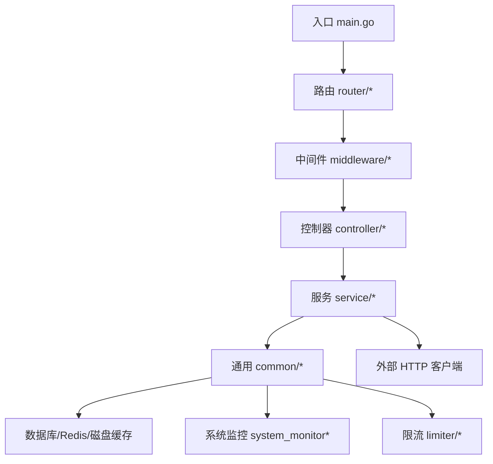

图表来源
- [main.go:1-200](file://main.go#L1-L200)
- [router/main.go:1-200](file://router/main.go#L1-L200)
- [middleware/logger.go:1-200](file://middleware/logger.go#L1-L200)
- [common/database.go:1-200](file://common/database.go#L1-L200)
- [common/redis.go:1-200](file://common/redis.go#L1-L200)

章节来源
- [main.go:1-200](file://main.go#L1-L200)
- [router/main.go:1-200](file://router/main.go#L1-L200)

## 核心组件
- Goroutine 池：用于限制并发任务数量，避免突发流量导致内存暴涨与 GC 压力。参见 gopool.go。
- 连接池：数据库与 Redis 连接池配置，影响并发读写与延迟。参见 database.go、redis.go。
- 请求体限制：防止超大请求体占用内存。参见 request_body_limit.go。
- 缓存策略：本地/磁盘混合缓存与中间件级缓存控制。参见 disk_cache.go、disk_cache_config.go、middleware/cache.go、middleware/disable-cache.go。
- 限流与配额：令牌桶/滑动窗口限流，保护下游与系统资源。参见 limiter.go、rate-limit.go。
- 系统监控：CPU、内存、GC、goroutine 数等指标采集。参见 system_monitor*.go。
- HTTP 客户端与服务端：连接复用、超时、重试、压缩等。参见 http_client.go、gin.go、middleware/gzip.go。
- 性能与监控配置：集中式配置项。参见 perf_metrics_setting/config.go、performance_setting/config.go、monitor_setting.go。

章节来源
- [gopool.go:1-200](file://common/gopool.go#L1-L200)
- [database.go:1-200](file://common/database.go#L1-L200)
- [redis.go:1-200](file://common/redis.go#L1-L200)
- [request_body_limit.go:1-200](file://common/request_body_limit.go#L1-L200)
- [disk_cache.go:1-200](file://common/disk_cache.go#L1-L200)
- [disk_cache_config.go:1-200](file://common/disk_cache_config.go#L1-L200)
- [limiter.go:1-200](file://common/limiter/limiter.go#L1-L200)
- [rate-limit.go:1-200](file://common/rate-limit.go#L1-L200)
- [system_monitor.go:1-200](file://common/system_monitor.go#L1-L200)
- [system_monitor_unix.go:1-200](file://common/system_monitor_unix.go#L1-L200)
- [system_monitor_windows.go:1-200](file://common/system_monitor_windows.go#L1-L200)
- [http_client.go:1-200](file://service/http_client.go#L1-L200)
- [gin.go:1-200](file://common/gin.go#L1-L200)
- [middleware/gzip.go:1-200](file://middleware/gzip.go#L1-L200)
- [perf_metrics_setting/config.go:1-200](file://setting/perf_metrics_setting/config.go#L1-L200)
- [performance_setting/config.go:1-200](file://setting/performance_setting/config.go#L1-L200)
- [monitor_setting.go:1-200](file://setting/operation_setting/monitor_setting.go#L1-L200)

## 架构总览
下图展示从请求进入、中间件处理、业务逻辑到数据访问与外部调用的整体流程，并标注了关键的性能控制点。

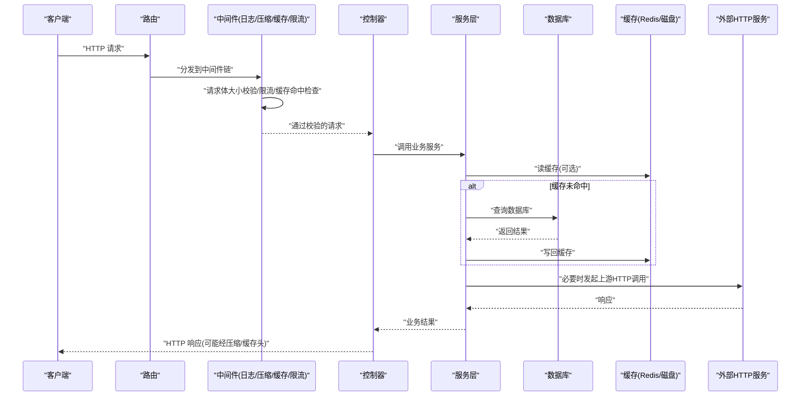

图表来源
- [router/main.go:1-200](file://router/main.go#L1-L200)
- [middleware/logger.go:1-200](file://middleware/logger.go#L1-L200)
- [middleware/gzip.go:1-200](file://middleware/gzip.go#L1-L200)
- [middleware/cache.go:1-200](file://middleware/cache.go#L1-L200)
- [common/limiter/limiter.go:1-200](file://common/limiter/limiter.go#L1-L200)
- [common/database.go:1-200](file://common/database.go#L1-L200)
- [common/redis.go:1-200](file://common/redis.go#L1-L200)
- [service/http_client.go:1-200](file://service/http_client.go#L1-L200)

## 详细组件分析

### Goroutine 池与并发控制
- 目标：限制并发任务数，降低内存峰值与 GC 抖动；在突发流量下提供背压。
- 关键点：
  - 池大小：根据 CPU 核数与 IO 密集程度设定，IO 密集型可适当放大，CPU 密集型需保守。
  - 队列长度：缓冲等待任务数，避免无界增长导致 OOM。
  - 拒绝策略：当池满时快速失败或降级，配合限流与熔断。
- 参考实现位置：
  - Goroutine 池封装：[gopool.go](file://common/gopool.go)
  - 性能配置入口：[performance_config.go](file://common/performance_config.go)

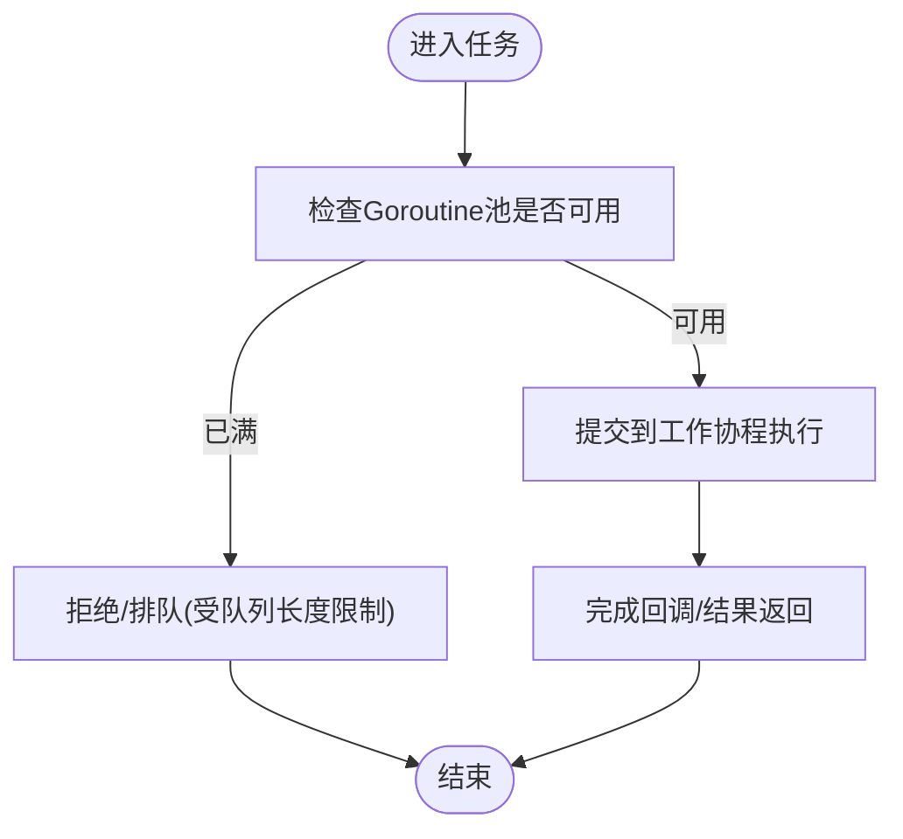

图表来源
- [gopool.go:1-200](file://common/gopool.go#L1-L200)
- [performance_config.go:1-200](file://common/performance_config.go#L1-L200)

章节来源
- [gopool.go:1-200](file://common/gopool.go#L1-L200)
- [performance_config.go:1-200](file://common/performance_config.go#L1-L200)

### 数据库连接池优化
- 目标：提升并发读写吞吐，减少连接建立开销，避免连接泄漏。
- 关键点：
  - MaxOpenConns：最大打开连接数，通常不超过数据库实例上限。
  - MaxIdleConns：空闲连接数，保持一定预热连接。
  - ConnMaxLifetime/ConnMaxIdleTime：连接生命周期与空闲回收，避免长事务与僵尸连接。
  - 上下文与超时：所有查询必须带超时，避免阻塞。
- 参考实现位置：
  - 数据库初始化与连接池：[database.go](file://common/database.go)

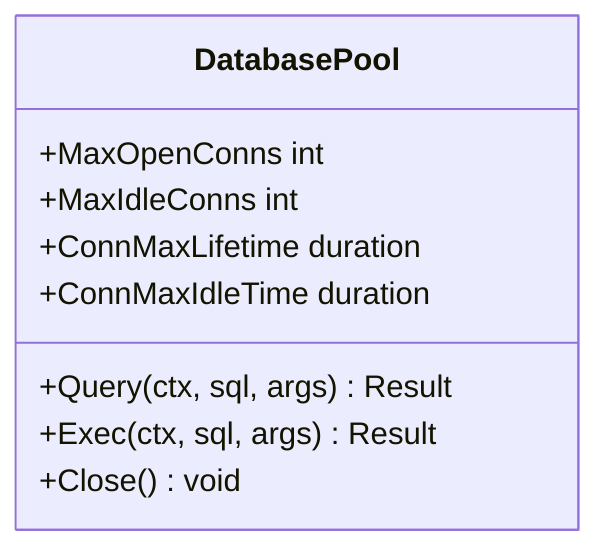

图表来源
- [database.go:1-200](file://common/database.go#L1-L200)

章节来源
- [database.go:1-200](file://common/database.go#L1-L200)

### Redis 连接池与缓存策略
- 目标：降低热点数据读取延迟，缓解数据库压力。
- 关键点：
  - 连接池大小与超时：根据 QPS 与 RT 调整，避免连接耗尽。
  - 缓存一致性：TTL、版本号、失效策略（写穿/旁路）。
  - 序列化与压缩：大对象压缩存储，节省带宽与内存。
- 参考实现位置：
  - Redis 客户端与连接池：[redis.go](file://common/redis.go)
  - 磁盘缓存与配置：[disk_cache.go](file://common/disk_cache.go)、[disk_cache_config.go](file://common/disk_cache_config.go)
  - 中间件缓存控制：[cache.go](file://middleware/cache.go)、[disable-cache.go](file://middleware/disable-cache.go)

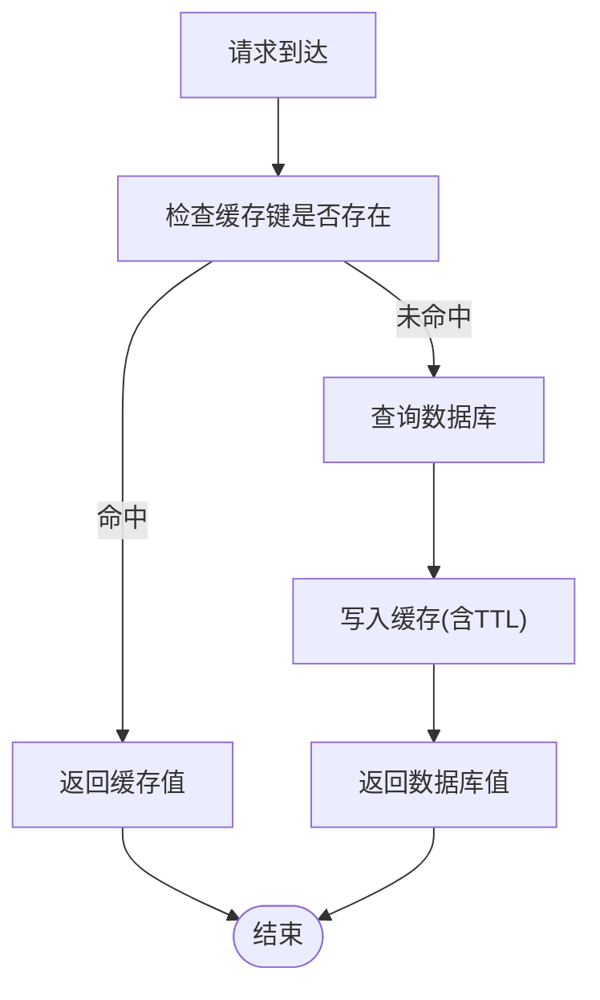

图表来源
- [redis.go:1-200](file://common/redis.go#L1-L200)
- [disk_cache.go:1-200](file://common/disk_cache.go#L1-L200)
- [disk_cache_config.go:1-200](file://common/disk_cache_config.go#L1-L200)
- [middleware/cache.go:1-200](file://middleware/cache.go#L1-L200)
- [middleware/disable-cache.go:1-200](file://middleware/disable-cache.go#L1-L200)

章节来源
- [redis.go:1-200](file://common/redis.go#L1-L200)
- [disk_cache.go:1-200](file://common/disk_cache.go#L1-L200)
- [disk_cache_config.go:1-200](file://common/disk_cache_config.go#L1-L200)
- [middleware/cache.go:1-200](file://middleware/cache.go#L1-L200)
- [middleware/disable-cache.go:1-200](file://middleware/disable-cache.go#L1-L200)

### HTTP 服务器与网络栈调优
- 目标：提高并发处理能力，降低延迟与带宽占用。
- 关键点：
  - 监听与线程模型：合理设置 Worker/Goroutine 数量。
  - 请求体限制：防止恶意或异常大请求体导致 OOM。
  - 压缩：对文本类响应启用 gzip，注意 CPU 与带宽权衡。
  - 超时与保活：合理设置 Read/Write/IdleTimeout，避免连接堆积。
- 参考实现位置：
  - Gin 服务器配置：[gin.go](file://common/gin.go)
  - 请求体限制：[request_body_limit.go](file://common/request_body_limit.go)
  - 压缩中间件：[gzip.go](file://middleware/gzip.go)
  - 路由与启动：[router/main.go](file://router/main.go)

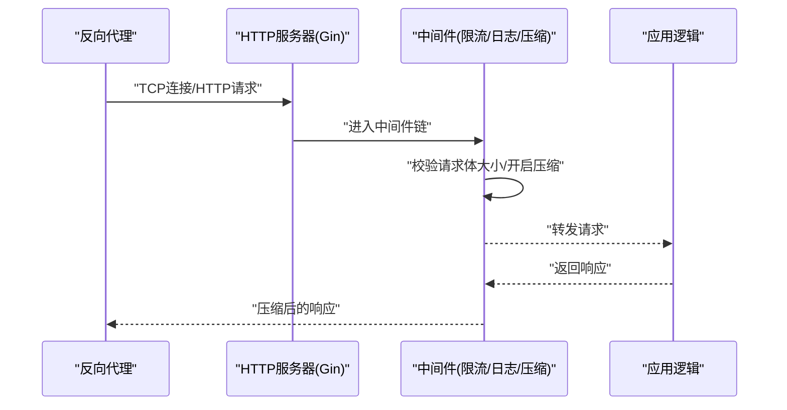

图表来源
- [gin.go:1-200](file://common/gin.go#L1-L200)
- [request_body_limit.go:1-200](file://common/request_body_limit.go#L1-L200)
- [middleware/gzip.go:1-200](file://middleware/gzip.go#L1-L200)
- [router/main.go:1-200](file://router/main.go#L1-L200)

章节来源
- [gin.go:1-200](file://common/gin.go#L1-L200)
- [request_body_limit.go:1-200](file://common/request_body_limit.go#L1-L200)
- [middleware/gzip.go:1-200](file://middleware/gzip.go#L1-L200)
- [router/main.go:1-200](file://router/main.go#L1-L200)

### 限流与配额
- 目标：保护系统不被突发流量打垮，确保公平性与稳定性。
- 关键点：
  - 算法选择：令牌桶/漏桶/滑动窗口，按用户/IP/接口维度限流。
  - 全局与局部配额：结合业务配额，避免单租户独占资源。
  - 快速失败与降级：超限直接返回错误码，配合前端重试退避。
- 参考实现位置：
  - 通用限流器：[limiter.go](file://common/limiter/limiter.go)
  - 速率限制中间件：[rate-limit.go](file://common/rate-limit.go)

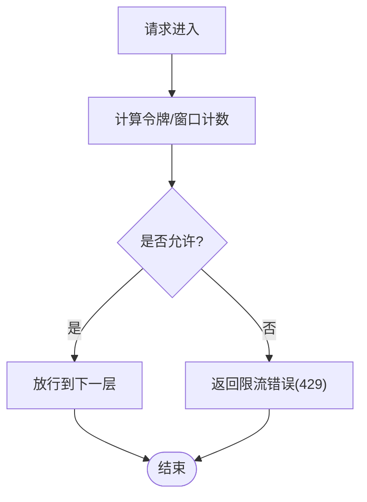

图表来源
- [limiter.go:1-200](file://common/limiter/limiter.go#L1-L200)
- [rate-limit.go:1-200](file://common/rate-limit.go#L1-L200)

章节来源
- [limiter.go:1-200](file://common/limiter/limiter.go#L1-L200)
- [rate-limit.go:1-200](file://common/rate-limit.go#L1-L200)

### 系统监控与指标采集
- 目标：实时掌握 CPU、内存、GC、goroutine、连接池使用率等关键指标，支撑告警与容量规划。
- 关键点：
  - 指标粒度：进程级与请求级指标，区分不同路由与接口。
  - 采样频率：平衡精度与开销，避免高频采样造成抖动。
  - 告警阈值：基于历史基线与分位数设置动态阈值。
- 参考实现位置：
  - 系统监控：[system_monitor.go](file://common/system_monitor.go)、[system_monitor_unix.go](file://common/system_monitor_unix.go)、[system_monitor_windows.go](file://common/system_monitor_windows.go)
  - 性能指标配置：[perf_metrics_setting/config.go](file://setting/perf_metrics_setting/config.go)
  - 监控设置：[monitor_setting.go](file://setting/operation_setting/monitor_setting.go)

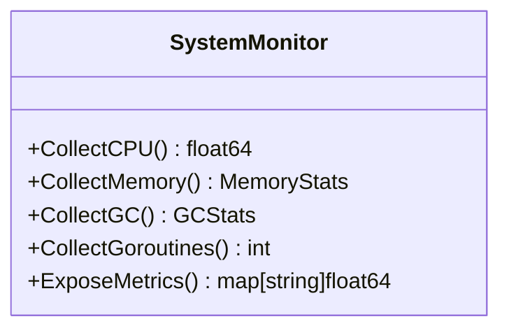

图表来源
- [system_monitor.go:1-200](file://common/system_monitor.go#L1-L200)
- [system_monitor_unix.go:1-200](file://common/system_monitor_unix.go#L1-L200)
- [system_monitor_windows.go:1-200](file://common/system_monitor_windows.go#L1-L200)
- [perf_metrics_setting/config.go:1-200](file://setting/perf_metrics_setting/config.go#L1-L200)
- [monitor_setting.go:1-200](file://setting/operation_setting/monitor_setting.go#L1-L200)

章节来源
- [system_monitor.go:1-200](file://common/system_monitor.go#L1-L200)
- [system_monitor_unix.go:1-200](file://common/system_monitor_unix.go#L1-L200)
- [system_monitor_windows.go:1-200](file://common/system_monitor_windows.go#L1-L200)
- [perf_metrics_setting/config.go:1-200](file://setting/perf_metrics_setting/config.go#L1-L200)
- [monitor_setting.go:1-200](file://setting/operation_setting/monitor_setting.go#L1-L200)

### 日志收集与错误恢复
- 目标：统一结构化日志，便于检索与分析；捕获 panic 并优雅恢复，保证服务可用性。
- 关键点：
  - 日志级别与采样：生产环境默认 INFO/WARN，DEBUG 按需开启。
  - 字段规范：trace_id、user_id、endpoint、latency、status_code 等。
  - 恢复中间件：捕获 panic，记录堆栈，返回友好错误码。
- 参考实现位置：
  - 日志中间件：[logger.go](file://middleware/logger.go)
  - 恢复中间件：[recover.go](file://middleware/recover.go)

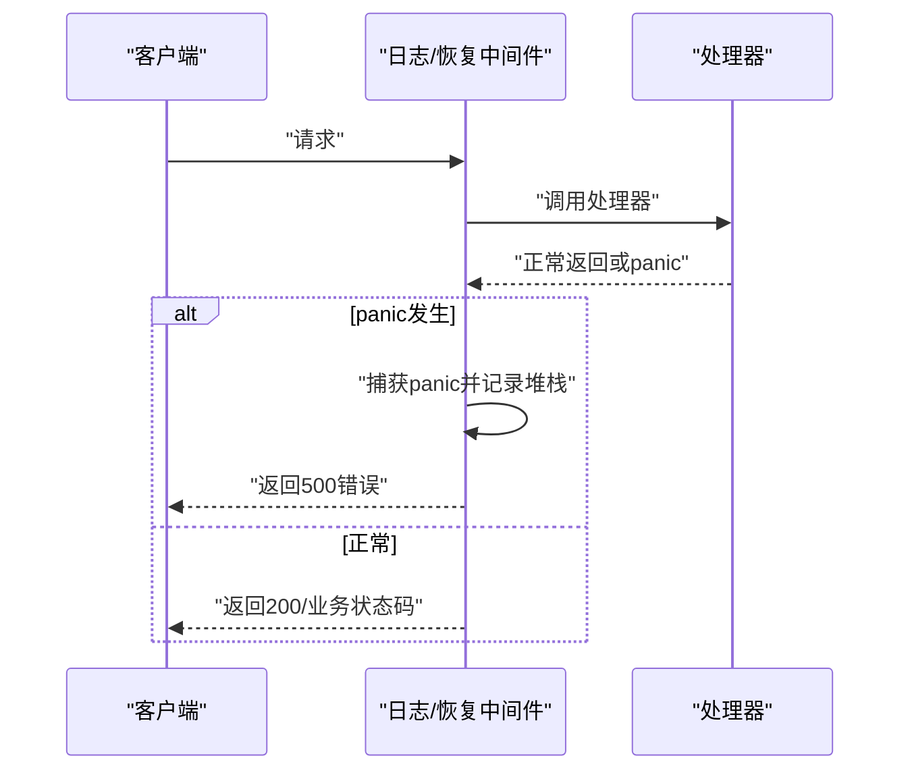

图表来源
- [middleware/logger.go:1-200](file://middleware/logger.go#L1-L200)
- [middleware/recover.go:1-200](file://middleware/recover.go#L1-L200)

章节来源
- [middleware/logger.go:1-200](file://middleware/logger.go#L1-L200)
- [middleware/recover.go:1-200](file://middleware/recover.go#L1-L200)

### 外部 HTTP 客户端优化
- 目标：对外部服务的调用具备高可用与高性能，避免雪崩。
- 关键点：
  - 连接复用与超时：合理设置 Dial/Read/Write/IdleTimeout。
  - 重试与退避：幂等接口可重试，指数退避+抖动。
  - 熔断与舱壁：失败率与慢调用触发熔断，隔离故障域。
- 参考实现位置：
  - HTTP 客户端封装：[http_client.go](file://service/http_client.go)

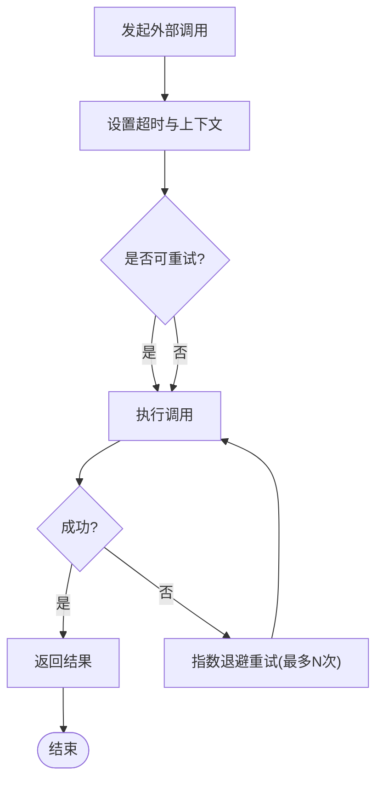

图表来源
- [http_client.go:1-200](file://service/http_client.go#L1-L200)

章节来源
- [http_client.go:1-200](file://service/http_client.go#L1-L200)

## 依赖关系分析
- 入口与路由依赖中间件链，中间件依赖通用能力（限流、缓存、日志、恢复）。
- 服务层依赖数据库、Redis、磁盘缓存与外部 HTTP 客户端。
- 系统监控与性能配置贯穿各层，为调优与告警提供依据。

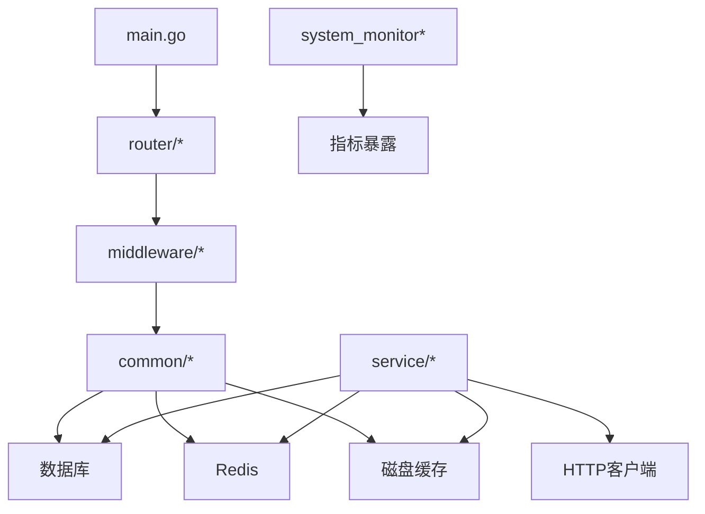

图表来源
- [main.go:1-200](file://main.go#L1-L200)
- [router/main.go:1-200](file://router/main.go#L1-L200)
- [middleware/logger.go:1-200](file://middleware/logger.go#L1-L200)
- [common/database.go:1-200](file://common/database.go#L1-L200)
- [common/redis.go:1-200](file://common/redis.go#L1-L200)
- [common/disk_cache.go:1-200](file://common/disk_cache.go#L1-L200)
- [service/http_client.go:1-200](file://service/http_client.go#L1-L200)
- [common/system_monitor.go:1-200](file://common/system_monitor.go#L1-L200)

章节来源
- [main.go:1-200](file://main.go#L1-L200)
- [router/main.go:1-200](file://router/main.go#L1-L200)
- [middleware/logger.go:1-200](file://middleware/logger.go#L1-L200)
- [common/database.go:1-200](file://common/database.go#L1-L200)
- [common/redis.go:1-200](file://common/redis.go#L1-L200)
- [common/disk_cache.go:1-200](file://common/disk_cache.go#L1-L200)
- [service/http_client.go:1-200](file://service/http_client.go#L1-L200)
- [common/system_monitor.go:1-200](file://common/system_monitor.go#L1-L200)

## 性能考量
- 并发与内存：
  - Goroutine 池大小应与 CPU 核数和 IO 特性匹配，避免过多 goroutine 导致上下文切换与内存膨胀。
  - 合理设置请求体大小限制，防止恶意或异常请求导致 OOM。
- 连接池与超时：
  - 数据库与 Redis 连接池需根据 QPS 与 RT 调优，避免连接耗尽或闲置浪费。
  - 所有 I/O 操作必须设置超时，避免阻塞累积。
- 缓存与压缩：
  - 热点数据优先走缓存，减少数据库与外部调用压力。
  - 文本响应启用 gzip，注意 CPU 与带宽的平衡。
- 限流与降级：
  - 针对接口与用户维度设置限流，超限快速失败，保护系统。
  - 结合熔断与舱壁隔离故障域，避免雪崩。
- 监控与告警：
  - 采集 CPU、内存、GC、goroutine、连接池使用率、QPS、RT、错误率等指标。
  - 基于分位数与历史基线设置动态阈值，及时告警。

## 故障排查指南
- 常见症状与定位：
  - 高 CPU：检查热点接口与循环逻辑，查看 goroutine 数与锁竞争。
  - 内存飙升：检查请求体大小、缓存未设置 TTL、未释放的大对象。
  - 连接耗尽：检查数据库/Redis 连接池配置与泄漏，确认超时与关闭逻辑。
  - 高延迟：检查缓存命中率、外部调用 RT、压缩与序列化开销。
- 工具与手段：
  - 使用 pprof 进行 CPU/内存/阻塞分析。
  - 查看结构化日志中的 trace_id、status_code、latency。
  - 利用系统监控指标与告警规则定位瓶颈。
- 参考实现位置：
  - 恢复中间件：[recover.go](file://middleware/recover.go)
  - 日志中间件：[logger.go](file://middleware/logger.go)
  - 系统监控：[system_monitor.go](file://common/system_monitor.go)

章节来源
- [middleware/recover.go:1-200](file://middleware/recover.go#L1-L200)
- [middleware/logger.go:1-200](file://middleware/logger.go#L1-L200)
- [common/system_monitor.go:1-200](file://common/system_monitor.go#L1-L200)

## 结论
生产环境优化需要系统性思维：从并发与内存、连接池与超时、缓存与压缩、限流与降级，到监控与告警，每个环节都直接影响系统的稳定性与性能。通过本指南中提供的配置要点与实现参考，可在实际项目中落地有效的优化措施，并结合持续压测与容量规划，确保服务在高负载下的稳健运行。

## 附录
- 部署与环境：
  - Dockerfile 与 docker-compose 可用于容器化部署与编排，便于横向扩展与弹性伸缩。
- 基准测试与容量规划：
  - 关键路径压测：模拟真实请求模式，逐步加压至目标 QPS，观察 CPU、内存、RT、错误率。
  - 容量评估：根据压测结果确定单机/集群规模，预留 30%-50% 冗余应对峰值。
  - 滚动升级与灰度：分批发布，结合监控与告警快速回滚。

章节来源
- [Dockerfile:1-200](file://Dockerfile#L1-L200)
- [docker-compose.yml:1-200](file://docker-compose.yml#L1-L200)