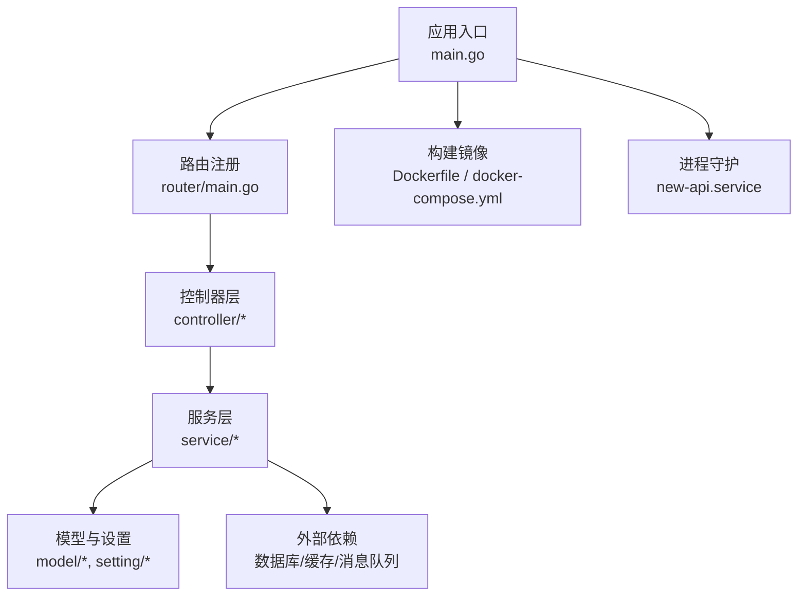
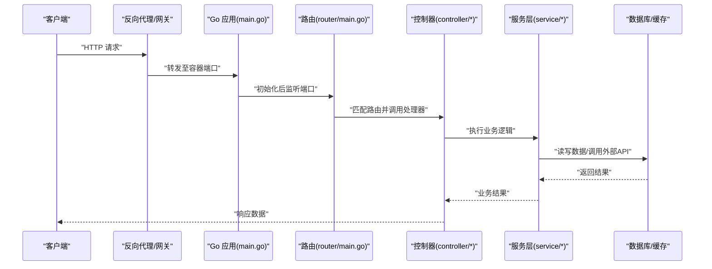
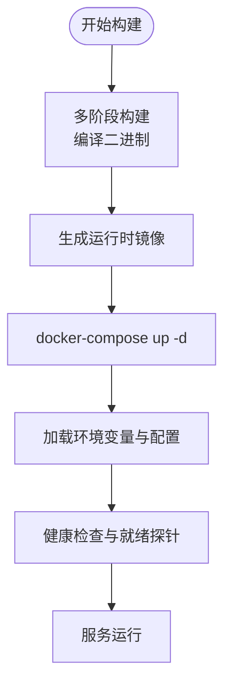
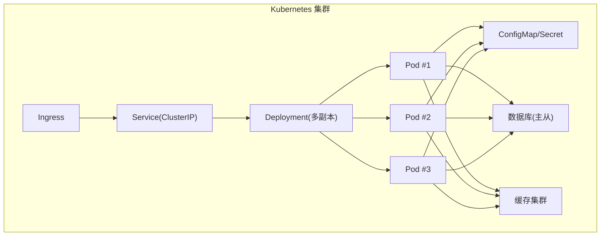
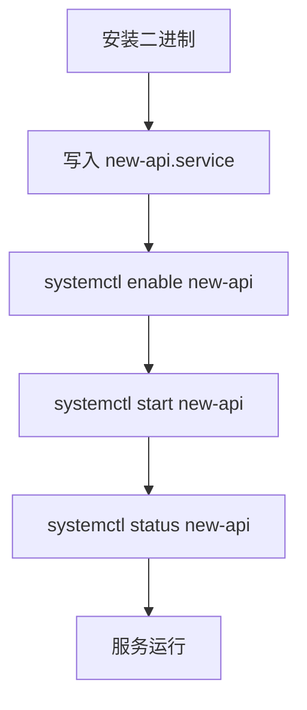
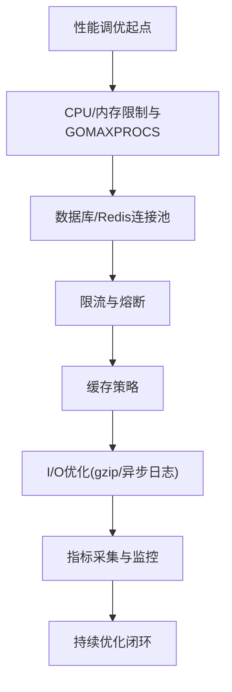
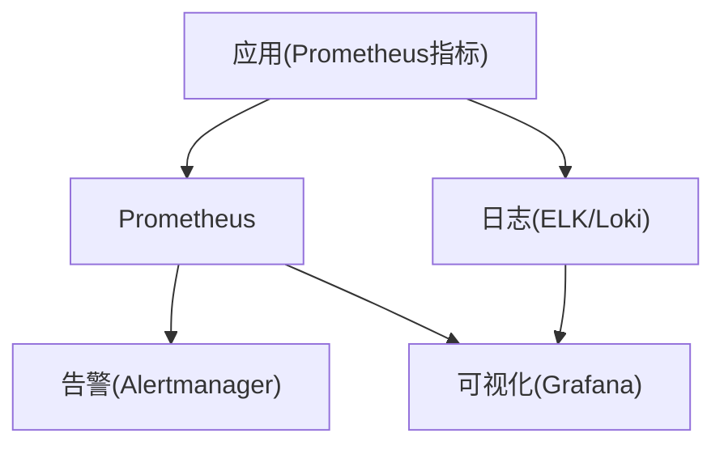
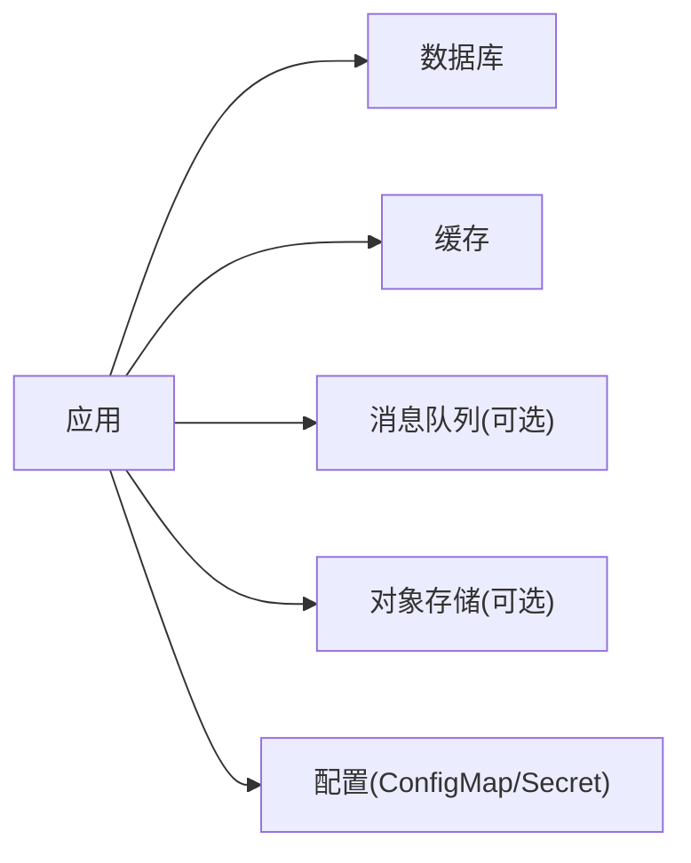

# 部署指南

<cite>
**本文引用的文件**   
- [Dockerfile](file://Dockerfile)
- [Dockerfile.dev](file://Dockerfile.dev)
- [docker-compose.yml](file://docker-compose.yml)
- [docker-compose.dev.yml](file://docker-compose.dev.yml)
- [.dockerignore](file://.dockerignore)
- [main.go](file://main.go)
- [go.mod](file://go.mod)
- [makefile](file://makefile)
- [new-api.service](file://new-api.service)
- [start-backend.bat](file://start-backend.bat)
- [start-frontend.bat](file://start-frontend.bat)
- [common/env.go](file://common/env.go)
- [setting/config/config.go](file://setting/config/config.go)
- [router/main.go](file://router/main.go)
- [pkg/ionet/deployment.go](file://pkg/ionet/deployment.go)
- [controller/deployment.go](file://controller/deployment.go)
- [common/performance_config.go](file://common/performance_config.go)
- [setting/performance_setting/config.go](file://setting/performance_setting/config.go)
- [setting/operation_setting/monitor_setting.go](file://setting/operation_setting/monitor_setting.go)
- [pkg/perf_metrics/metrics.go](file://pkg/perf_metrics/metrics.go)
- [common/system_monitor.go](file://common/system_monitor.go)
- [common/system_monitor_unix.go](file://common/system_monitor_unix.go)
- [common/system_monitor_windows.go](file://common/system_monitor_windows.go)
</cite>

## 目录
1. [简介](#简介)
2. [项目结构](#项目结构)
3. [核心组件](#核心组件)
4. [架构总览](#架构总览)
5. [详细组件分析](#详细组件分析)
6. [依赖分析](#依赖分析)
7. [性能考虑](#性能考虑)
8. [故障排查指南](#故障排查指南)
9. [结论](#结论)
10. [附录](#附录)

## 简介
本部署指南面向生产环境，覆盖 Docker 容器化、Kubernetes 编排、单机与集群部署、高可用配置、性能调优与监控集成。文档基于代码库中的构建脚本、运行时入口、配置与环境变量解析、以及监控与性能模块进行说明，并提供可操作的部署步骤与常见问题解决方案。

## 项目结构
本项目采用前后端分离的 Go + React 工程组织方式：
- 后端以 main.go 为入口，使用路由注册器统一挂载 API；配置与环境变量通过 setting/config 与 common/env 加载；性能与监控由 common 与 pkg/perf_metrics 提供。
- 前端位于 web 目录，构建产物由后端静态资源服务或独立反向代理提供。
- 容器化相关：根目录提供 Dockerfile、Dockerfile.dev、docker-compose*.yml、.dockerignore 等。
- 系统服务：new-api.service 用于 systemd 管理；bat 脚本用于 Windows 快速启动。

图表来源 
- [main.go:1-200](file://main.go#L1-L200)
- [router/main.go:1-200](file://router/main.go#L1-L200)
- [Dockerfile:1-200](file://Dockerfile#L1-L200)
- [docker-compose.yml:1-200](file://docker-compose.yml#L1-L200)
- [new-api.service:1-200](file://new-api.service#L1-L200)

章节来源
- [main.go:1-200](file://main.go#L1-L200)
- [router/main.go:1-200](file://router/main.go#L1-L200)
- [Dockerfile:1-200](file://Dockerfile#L1-L200)
- [docker-compose.yml:1-200](file://docker-compose.yml#L1-L200)
- [new-api.service:1-200](file://new-api.service#L1-L200)

## 核心组件
- 应用入口与生命周期：main.go 负责初始化配置、日志、中间件、路由、健康检查与优雅关闭。
- 配置与环境变量：setting/config/config.go 与 common/env.go 提供统一的配置读取与默认值处理。
- 路由与控制器：router/main.go 聚合各功能路由；controller/* 实现具体业务接口。
- 构建与运行：Dockerfile/Dockerfile.dev 定义多阶段构建；docker-compose*.yml 提供本地与开发编排；new-api.service 提供 systemd 守护。
- 性能与监控：common/performance_config.go、setting/performance_setting/config.go、pkg/perf_metrics/metrics.go、common/system_monitor* 提供指标采集与系统监控。

章节来源
- [main.go:1-200](file://main.go#L1-L200)
- [setting/config/config.go:1-200](file://setting/config/config.go#L1-L200)
- [common/env.go:1-200](file://common/env.go#L1-L200)
- [router/main.go:1-200](file://router/main.go#L1-L200)
- [common/performance_config.go:1-200](file://common/performance_config.go#L1-L200)
- [setting/performance_setting/config.go:1-200](file://setting/performance_setting/config.go#L1-L200)
- [pkg/perf_metrics/metrics.go:1-200](file://pkg/perf_metrics/metrics.go#L1-L200)
- [common/system_monitor.go:1-200](file://common/system_monitor.go#L1-L200)
- [common/system_monitor_unix.go:1-200](file://common/system_monitor_unix.go#L1-L200)
- [common/system_monitor_windows.go:1-200](file://common/system_monitor_windows.go#L1-L200)

## 架构总览
下图展示从请求进入、路由分发、控制器处理到外部依赖交互的整体流程，并标注关键配置文件与镜像构建产物。

图表来源 
- [main.go:1-200](file://main.go#L1-L200)
- [router/main.go:1-200](file://router/main.go#L1-L200)
- [controller/deployment.go:1-200](file://controller/deployment.go#L1-L200)

## 详细组件分析

### Docker 容器化部署
- 镜像构建：Dockerfile 定义多阶段构建（编译 Go 二进制、最小化运行时镜像）；Dockerfile.dev 用于开发热重载。
- 环境变量：通过 common/env.go 与 setting/config/config.go 加载，如数据库连接、Redis、日志级别、限流参数等。
- 卷与持久化：在 docker-compose.yml 中映射数据目录与配置文件，确保重启不丢失。
- 网络与服务编排：docker-compose.yml 编排应用、数据库、缓存等依赖服务，支持开发环境与生产环境切换。

图表来源 
- [Dockerfile:1-200](file://Dockerfile#L1-L200)
- [Dockerfile.dev:1-200](file://Dockerfile.dev#L1-L200)
- [docker-compose.yml:1-200](file://docker-compose.yml#L1-L200)
- [common/env.go:1-200](file://common/env.go#L1-L200)
- [setting/config/config.go:1-200](file://setting/config/config.go#L1-L200)

章节来源
- [Dockerfile:1-200](file://Dockerfile#L1-L200)
- [Dockerfile.dev:1-200](file://Dockerfile.dev#L1-L200)
- [docker-compose.yml:1-200](file://docker-compose.yml#L1-L200)
- [common/env.go:1-200](file://common/env.go#L1-L200)
- [setting/config/config.go:1-200](file://setting/config/config.go#L1-L200)

### Kubernetes 编排与高可用
- Deployment：定义副本数、资源限制、滚动更新策略；结合 ConfigMap/Secret 注入环境变量与敏感信息。
- Service：暴露内部/外部访问，支持负载均衡与健康检查。
- Ingress：对外暴露 HTTP/HTTPS，配置 TLS 与路径规则。
- 高可用：多副本+Pod 反亲和、节点拓扑分布、PDB 保护；数据库主从与缓存集群。
- 就绪/存活探针：基于健康检查端点确保流量只进入就绪实例。

图表来源 
- [pkg/ionet/deployment.go:1-200](file://pkg/ionet/deployment.go#L1-L200)
- [controller/deployment.go:1-200](file://controller/deployment.go#L1-L200)

章节来源
- [pkg/ionet/deployment.go:1-200](file://pkg/ionet/deployment.go#L1-L200)
- [controller/deployment.go:1-200](file://controller/deployment.go#L1-L200)

### 单机部署（systemd）
- 使用 new-api.service 将应用注册为系统服务，便于开机自启与进程守护。
- 通过环境变量或配置文件注入数据库、缓存、日志等参数。
- 配合 makefile 提供的构建目标，快速编译与安装。

图表来源 
- [new-api.service:1-200](file://new-api.service#L1-L200)
- [makefile:1-200](file://makefile#L1-L200)

章节来源
- [new-api.service:1-200](file://new-api.service#L1-L200)
- [makefile:1-200](file://makefile#L1-L200)

### 集群部署与高可用配置
- 多副本部署：通过 Deployment 指定 replicas，结合 PDB 保障滚动更新期间可用性。
- 外部依赖：数据库主从、读写分离；缓存集群模式；消息队列高可用。
- 配置中心：使用 ConfigMap/Secret 集中管理配置，支持热更新。
- 网络与安全：Ingress 配置 TLS、限流、白名单；Service Mesh（可选）增强安全与可观测性。

章节来源
- [pkg/ionet/deployment.go:1-200](file://pkg/ionet/deployment.go#L1-L200)
- [controller/deployment.go:1-200](file://controller/deployment.go#L1-L200)

### 性能调优
- 进程与线程：调整 GOMAXPROCS、GOGC、内存分配策略；合理设置 CPU 与内存限制。
- 连接池：数据库连接池大小、超时与重试策略；Redis 连接池与超时。
- 限流与熔断：common/performance_config.go 与 setting/performance_setting/config.go 提供限流与性能参数。
- 缓存策略：本地缓存与分布式缓存结合，减少热点查询压力。
- I/O 优化：启用 gzip、异步日志、批量写入。

图表来源 
- [common/performance_config.go:1-200](file://common/performance_config.go#L1-L200)
- [setting/performance_setting/config.go:1-200](file://setting/performance_setting/config.go#L1-L200)
- [pkg/perf_metrics/metrics.go:1-200](file://pkg/perf_metrics/metrics.go#L1-L200)

章节来源
- [common/performance_config.go:1-200](file://common/performance_config.go#L1-L200)
- [setting/performance_setting/config.go:1-200](file://setting/performance_setting/config.go#L1-L200)
- [pkg/perf_metrics/metrics.go:1-200](file://pkg/perf_metrics/metrics.go#L1-L200)

### 监控集成
- 指标采集：pkg/perf_metrics/metrics.go 提供 Prometheus 兼容指标；common/system_monitor* 采集系统级指标。
- 日志收集：结构化日志输出，便于 ELK/Loki 收集与分析。
- 健康检查：HTTP 健康端点供 K8s 探针与外部监控使用。
- 告警：基于指标阈值配置告警规则，及时发现问题。

图表来源 
- [pkg/perf_metrics/metrics.go:1-200](file://pkg/perf_metrics/metrics.go#L1-L200)
- [common/system_monitor.go:1-200](file://common/system_monitor.go#L1-L200)
- [common/system_monitor_unix.go:1-200](file://common/system_monitor_unix.go#L1-L200)
- [common/system_monitor_windows.go:1-200](file://common/system_monitor_windows.go#L1-L200)

章节来源
- [pkg/perf_metrics/metrics.go:1-200](file://pkg/perf_metrics/metrics.go#L1-L200)
- [common/system_monitor.go:1-200](file://common/system_monitor.go#L1-L200)
- [common/system_monitor_unix.go:1-200](file://common/system_monitor_unix.go#L1-L200)
- [common/system_monitor_windows.go:1-200](file://common/system_monitor_windows.go#L1-L200)

## 依赖分析
- 外部依赖：数据库（MySQL/PostgreSQL）、缓存（Redis）、对象存储（可选）、消息队列（可选）。
- 配置来源：环境变量优先，其次配置文件；敏感信息通过 Secret 管理。
- 版本管理：go.mod 锁定依赖版本，确保构建一致性。

图表来源 
- [go.mod:1-200](file://go.mod#L1-L200)
- [setting/config/config.go:1-200](file://setting/config/config.go#L1-L200)
- [common/env.go:1-200](file://common/env.go#L1-L200)

章节来源
- [go.mod:1-200](file://go.mod#L1-L200)
- [setting/config/config.go:1-200](file://setting/config/config.go#L1-L200)
- [common/env.go:1-200](file://common/env.go#L1-L200)

## 性能考虑
- 资源配额：根据压测结果设定 CPU/内存限制，避免过度分配导致抖动。
- 连接池调优：依据并发量与延迟目标调整连接池大小与超时。
- 缓存命中率：热点数据入缓存，降低数据库压力。
- 限流与降级：突发流量下保证核心功能可用。
- 监控与告警：建立关键指标看板与告警规则，持续优化。

章节来源
- [common/performance_config.go:1-200](file://common/performance_config.go#L1-L200)
- [setting/performance_setting/config.go:1-200](file://setting/performance_setting/config.go#L1-L200)
- [pkg/perf_metrics/metrics.go:1-200](file://pkg/perf_metrics/metrics.go#L1-L200)

## 故障排查指南
- 启动失败：检查环境变量与配置文件是否正确；查看应用日志与系统日志。
- 健康检查失败：确认健康端点可达；检查依赖服务连通性。
- 性能问题：观察指标（QPS、延迟、错误率、GC、内存），定位瓶颈。
- 连接池耗尽：调整连接池大小与超时；检查慢查询与锁竞争。
- 缓存异常：检查缓存集群状态与键空间；清理脏数据。
- 日志缺失：确认日志级别与输出路径；检查磁盘空间与权限。

章节来源
- [common/env.go:1-200](file://common/env.go#L1-L200)
- [setting/config/config.go:1-200](file://setting/config/config.go#L1-L200)
- [pkg/perf_metrics/metrics.go:1-200](file://pkg/perf_metrics/metrics.go#L1-L200)
- [common/system_monitor.go:1-200](file://common/system_monitor.go#L1-L200)

## 结论
通过 Docker 容器化与 Kubernetes 编排，结合完善的配置管理、性能调优与监控体系，可实现稳定、可扩展、易运维的生产部署。建议在生产环境中严格执行高可用设计、容量规划与持续优化闭环，确保系统长期稳定运行。

## 附录
- 快速启动：Windows 可使用 start-backend.bat 与 start-frontend.bat 快速启动前后端。
- 构建与发布：使用 makefile 提供的目标进行编译与打包。
- 参考文档：README.md 与 docs 目录下的安装与使用说明。

章节来源
- [start-backend.bat:1-200](file://start-backend.bat#L1-L200)
- [start-frontend.bat:1-200](file://start-frontend.bat#L1-L200)
- [makefile:1-200](file://makefile#L1-L200)