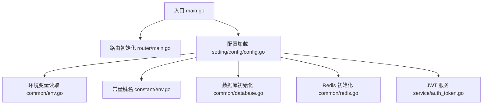
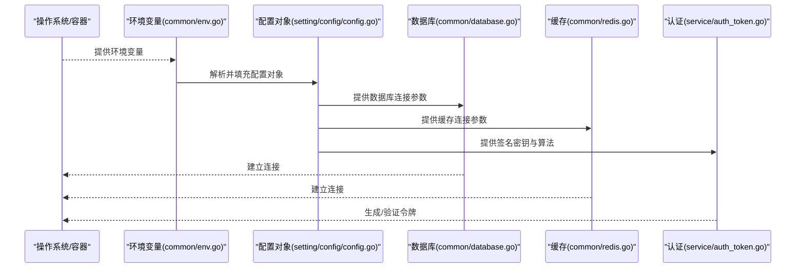
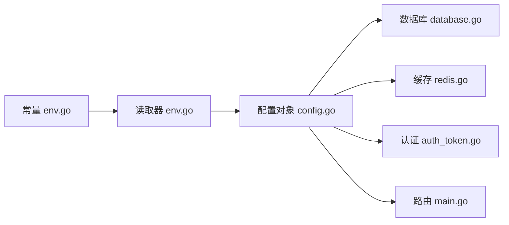

# 环境变量配置

<cite>
**本文档引用的文件**   
- [main.go](file://main.go)
- [common/env.go](file://common/env.go)
- [constant/env.go](file://constant/env.go)
- [setting/config/config.go](file://setting/config/config.go)
- [common/database.go](file://common/database.go)
- [common/redis.go](file://common/redis.go)
- [service/auth_token.go](file://service/auth_token.go)
- [router/main.go](file://router/main.go)
</cite>

## 目录
1. [简介](#简介)
2. [项目结构](#项目结构)
3. [核心组件](#核心组件)
4. [架构总览](#架构总览)
5. [详细组件分析](#详细组件分析)
6. [依赖关系分析](#依赖关系分析)
7. [性能考虑](#性能考虑)
8. [故障排除指南](#故障排除指南)
9. [结论](#结论)
10. [附录](#附录)

## 简介
本文件面向运维与开发者，系统化说明本项目的环境变量配置体系：包括环境变量的定义、加载机制、优先级规则、与配置文件的关系，以及关键场景（数据库连接、Redis、JWT 密钥等）的配置示例。文档同时提供常见最佳实践与排障建议，帮助快速定位和解决配置问题。

## 项目结构
与环境变量相关的代码主要分布在以下位置：
- 常量与键名定义：constant/env.go
- 环境变量读取与解析：common/env.go
- 配置对象与默认值：setting/config/config.go
- 子系统初始化与使用：common/database.go、common/redis.go、service/auth_token.go、router/main.go

图表来源
- [main.go:1-20](file://main.go#L1-L20)
- [router/main.go:1-30](file://router/main.go#L1-L30)
- [setting/config/config.go:1-40](file://setting/config/config.go#L1-L40)
- [common/env.go:1-40](file://common/env.go#L1-L40)
- [constant/env.go:1-40](file://constant/env.go#L1-L40)
- [common/database.go:1-40](file://common/database.go#L1-L40)
- [common/redis.go:1-40](file://common/redis.go#L1-L40)
- [service/auth_token.go:1-40](file://service/auth_token.go#L1-L40)

章节来源
- [main.go:1-50](file://main.go#L1-L50)
- [router/main.go:1-60](file://router/main.go#L1-L60)
- [setting/config/config.go:1-120](file://setting/config/config.go#L1-L120)
- [common/env.go:1-120](file://common/env.go#L1-L120)
- [constant/env.go:1-120](file://constant/env.go#L1-L120)

## 核心组件
- 环境变量键名集中管理：在常量文件中统一声明所有支持的环境变量名称，确保全仓一致。
- 环境变量读取封装：提供类型安全的读取方法，支持字符串、布尔、整数、浮点、JSON 等类型的解析与校验。
- 配置对象与默认值：将环境变量映射到结构化配置对象，并提供合理的默认值，保证系统可启动且行为可预期。
- 子系统消费配置：数据库、缓存、认证等模块从配置对象中获取所需参数进行初始化。

章节来源
- [constant/env.go:1-120](file://constant/env.go#L1-L120)
- [common/env.go:1-120](file://common/env.go#L1-L120)
- [setting/config/config.go:1-120](file://setting/config/config.go#L1-L120)

## 架构总览
下图展示了环境变量从定义到被各子系统使用的整体流程。

图表来源
- [common/env.go:1-120](file://common/env.go#L1-L120)
- [setting/config/config.go:1-120](file://setting/config/config.go#L1-L120)
- [common/database.go:1-120](file://common/database.go#L1-L120)
- [common/redis.go:1-120](file://common/redis.go#L1-L120)
- [service/auth_token.go:1-120](file://service/auth_token.go#L1-L120)

## 详细组件分析

### 环境变量定义与键名规范
- 所有环境变量名称在常量文件中集中定义，避免硬编码与拼写错误。
- 命名建议采用大写下划线风格，按模块前缀分组，便于管理与检索。
- 对敏感信息（如密码、密钥）应明确标注为“机密”类变量，并在部署时通过安全渠道注入。

章节来源
- [constant/env.go:1-120](file://constant/env.go#L1-L120)

### 环境变量读取与解析
- 提供统一的读取接口，支持多种数据类型转换与校验。
- 当环境变量缺失或格式不正确时，返回明确的错误信息或使用默认值（取决于变量重要性）。
- 对于 JSON 结构的配置项，提供反序列化与字段校验能力。

章节来源
- [common/env.go:1-120](file://common/env.go#L1-L120)

### 配置对象与默认值
- 将环境变量映射到结构化配置对象，便于跨模块共享。
- 为每个字段设置合理默认值，确保系统在最小化配置下仍可运行。
- 提供配置校验逻辑，在启动阶段尽早发现不合法或不完整的配置。

章节来源
- [setting/config/config.go:1-120](file://setting/config/config.go#L1-L120)

### 数据库连接配置
- 典型环境变量包括：主机、端口、数据库名、用户名、密码、SSL/TLS 开关、连接池大小等。
- 连接字符串可由多个片段拼接而成，需保证顺序与转义正确。
- 建议在测试与生产环境中分别维护不同的连接参数，并通过环境变量切换。

章节来源
- [common/database.go:1-120](file://common/database.go#L1-L120)

### Redis 缓存配置
- 典型环境变量包括：地址、端口、密码、数据库索引、TLS、超时、集群模式等。
- 高可用场景下可使用集群或多主节点地址列表。
- 建议开启连接池与重试策略，提升稳定性。

章节来源
- [common/redis.go:1-120](file://common/redis.go#L1-L120)

### JWT 密钥与认证配置
- 典型环境变量包括：密钥、算法、过期时间、签发者、受众等。
- 密钥长度与复杂度需满足安全要求，禁止使用弱口令或公开值。
- 建议定期轮换密钥，并确保客户端与服务端算法一致。

章节来源
- [service/auth_token.go:1-120](file://service/auth_token.go#L1-L120)

### 应用启动与路由初始化
- 入口程序负责加载配置、初始化路由与中间件，并启动监听。
- 路由初始化会依赖配置对象中的端口、域名、CORS、日志级别等参数。

章节来源
- [main.go:1-120](file://main.go#L1-L120)
- [router/main.go:1-120](file://router/main.go#L1-L120)

## 依赖关系分析
- 常量文件为环境变量键名的唯一来源，其他模块通过引用该常量避免不一致。
- 环境变量读取器为配置对象的构建提供数据源。
- 配置对象为各子系统（数据库、缓存、认证、路由）提供参数。
- 子系统之间无直接耦合，均通过配置对象解耦。

图表来源
- [constant/env.go:1-120](file://constant/env.go#L1-L120)
- [common/env.go:1-120](file://common/env.go#L1-L120)
- [setting/config/config.go:1-120](file://setting/config/config.go#L1-L120)
- [common/database.go:1-120](file://common/database.go#L1-L120)
- [common/redis.go:1-120](file://common/redis.go#L1-L120)
- [service/auth_token.go:1-120](file://service/auth_token.go#L1-L120)
- [router/main.go:1-120](file://router/main.go#L1-L120)

章节来源
- [constant/env.go:1-120](file://constant/env.go#L1-L120)
- [common/env.go:1-120](file://common/env.go#L1-L120)
- [setting/config/config.go:1-120](file://setting/config/config.go#L1-L120)

## 性能考虑
- 连接池：数据库与 Redis 的连接池大小应根据并发量与资源上限调优，避免过多连接导致资源耗尽。
- 超时与重试：为网络请求设置合理超时与重试次数，提高容错性。
- 缓存命中率：合理设置缓存过期时间与容量，降低后端压力。
- 日志级别：在生产环境降低日志级别，减少 I/O 开销。

[本节为通用指导，无需特定文件来源]

## 故障排除指南
- 启动失败
  - 检查必需环境变量是否缺失或为空。
  - 查看启动日志中的配置校验错误提示。
- 数据库连接失败
  - 核对主机、端口、用户名、密码是否正确。
  - 检查防火墙与安全组规则是否放行。
  - 确认 SSL/TLS 证书与开关配置一致。
- Redis 连接失败
  - 核对地址、端口、密码与数据库索引。
  - 检查网络连通性与 TLS 配置。
- JWT 认证失败
  - 确认密钥与算法在服务端与客户端一致。
  - 检查令牌过期时间与签发者、受众设置。
- 路由无法访问
  - 检查监听端口是否被占用。
  - 确认 CORS、域名与代理配置正确。

章节来源
- [common/env.go:1-120](file://common/env.go#L1-L120)
- [setting/config/config.go:1-120](file://setting/config/config.go#L1-L120)
- [common/database.go:1-120](file://common/database.go#L1-L120)
- [common/redis.go:1-120](file://common/redis.go#L1-L120)
- [service/auth_token.go:1-120](file://service/auth_token.go#L1-L120)
- [router/main.go:1-120](file://router/main.go#L1-L120)

## 结论
通过集中化的环境变量定义、统一的读取与解析机制、以及结构化的配置对象，本项目的配置体系具备良好的一致性与可维护性。遵循本文的最佳实践与排障建议，可显著提升部署效率与系统稳定性。

[本节为总结性内容，无需特定文件来源]

## 附录

### 环境变量清单与默认值
以下为常见环境变量类别与示例键名（以实际常量为准）：
- 数据库
  - 键名示例：数据库主机、端口、库名、用户、密码、SSL 开关、连接池大小
  - 默认值：根据开发/测试/生产环境预设
  - 类型：字符串、布尔、整数
  - 范围：全局
- Redis
  - 键名示例：地址、端口、密码、数据库索引、TLS、超时、集群模式
  - 默认值：本地回环地址与默认端口
  - 类型：字符串、布尔、整数
  - 范围：全局
- JWT
  - 键名示例：密钥、算法、过期时间、签发者、受众
  - 默认值：开发环境弱密钥与短过期时间（生产必须替换）
  - 类型：字符串、整数
  - 范围：全局
- 应用
  - 键名示例：监听端口、日志级别、CORS 允许域、调试开关
  - 默认值：常用开发值
  - 类型：字符串、布尔、整数
  - 范围：全局

章节来源
- [constant/env.go:1-120](file://constant/env.go#L1-L120)
- [setting/config/config.go:1-120](file://setting/config/config.go#L1-L120)

### 环境变量与配置文件的覆盖关系
- 优先级顺序（从高到低）
  - 运行时环境变量
  - 配置文件（如 YAML/JSON）
  - 内置默认值
- 覆盖规则
  - 若同一键在多个来源存在，较高优先级的值生效。
  - 未设置的键回退至较低优先级或默认值。
- 建议
  - 配置文件用于非机密、稳定的基础配置。
  - 环境变量用于机密信息与差异化部署参数。

章节来源
- [setting/config/config.go:1-120](file://setting/config/config.go#L1-L120)
- [common/env.go:1-120](file://common/env.go#L1-L120)

### 关键配置示例（路径指引）
- 数据库连接
  - 参考：[common/database.go:1-120](file://common/database.go#L1-L120)
- Redis 缓存
  - 参考：[common/redis.go:1-120](file://common/redis.go#L1-L120)
- JWT 密钥与算法
  - 参考：[service/auth_token.go:1-120](file://service/auth_token.go#L1-L120)
- 应用端口与路由
  - 参考：[router/main.go:1-120](file://router/main.go#L1-L120)

[本节为路径指引，不包含具体代码内容]