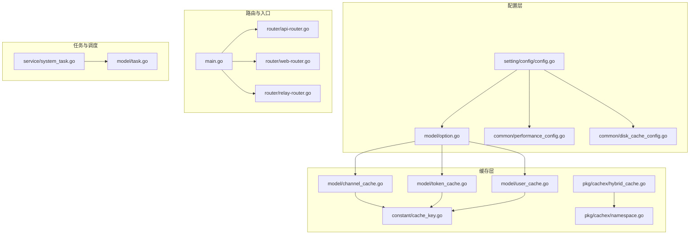
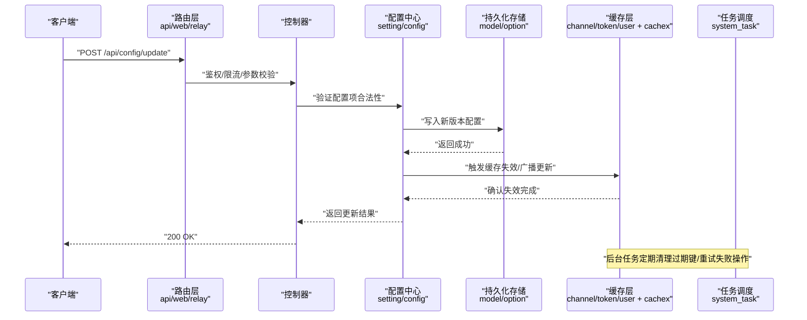
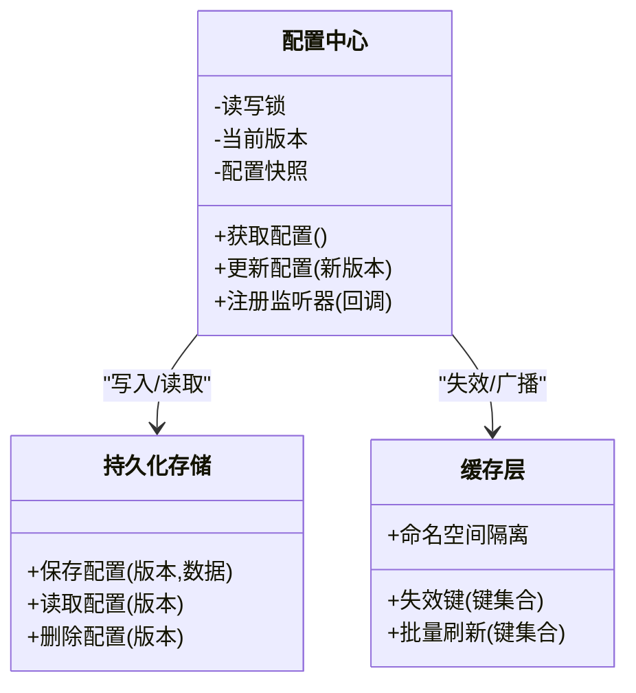
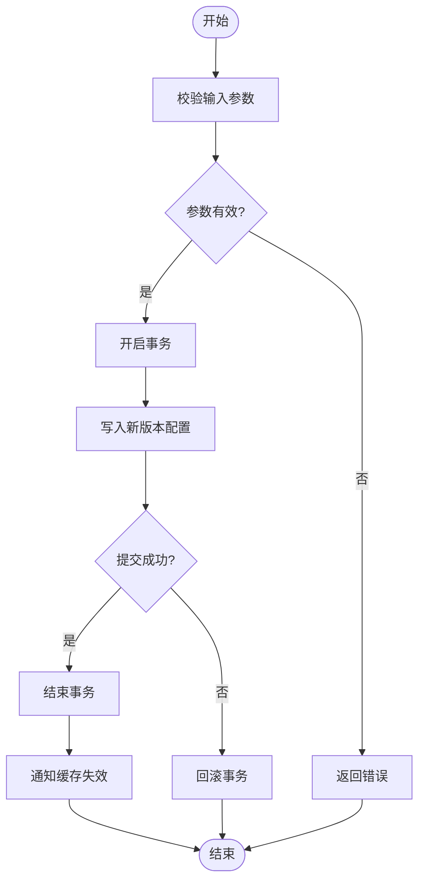
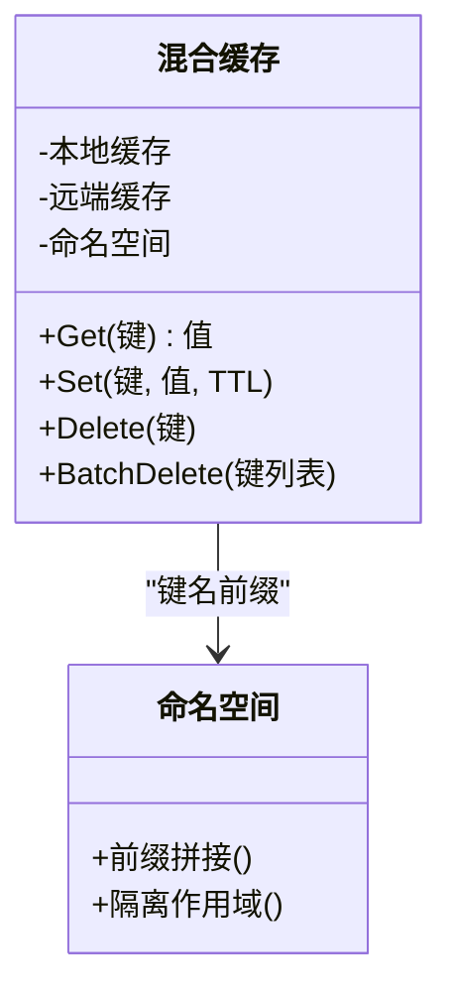
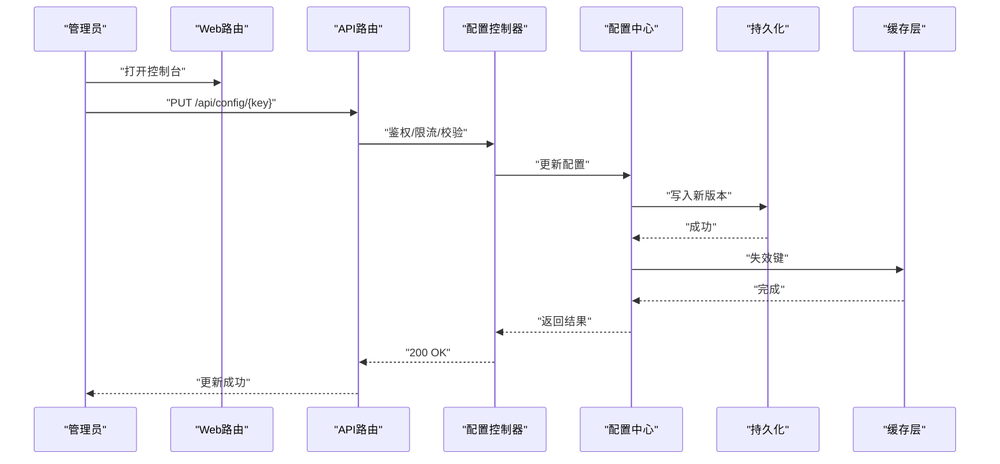
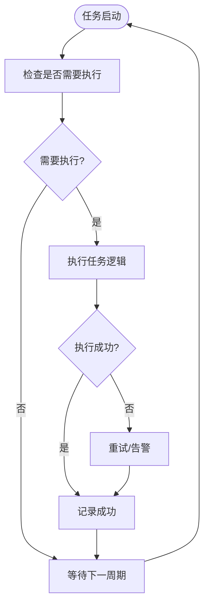
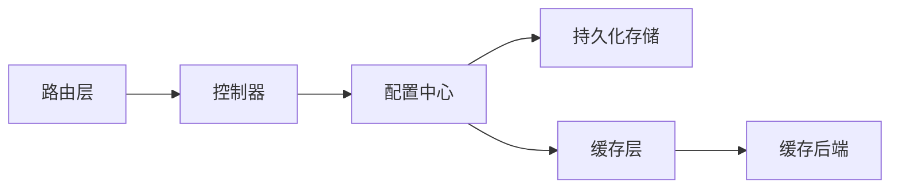

# 运行时配置

<cite>
**本文引用的文件**   
- [main.go](file://main.go)
- [config.go](file://setting/config/config.go)
- [config_test.go](file://setting/config/config_test.go)
- [option.go](file://model/option.go)
- [channel_cache.go](file://model/channel_cache.go)
- [token_cache.go](file://model/token_cache.go)
- [user_cache.go](file://model/user_cache.go)
- [performance_config.go](file://common/performance_config.go)
- [disk_cache_config.go](file://common/disk_cache_config.go)
- [api-router.go](file://router/api-router.go)
- [web-router.go](file://router/web-router.go)
- [relay-router.go](file://router/relay-router.go)
- [channel_router_test.go](file://router/channel_router_test.go)
- [system_task.go](file://service/system_task.go)
- [task.go](file://model/task.go)
- [cache_key.go](file://constant/cache_key.go)
- [env.go](file://constant/env.go)
- [rate-limit.go](file://common/rate-limit.go)
- [limiter.go](file://common/limiter/limiter.go)
- [hybrid_cache.go](file://pkg/cachex/hybrid_cache.go)
- [namespace.go](file://pkg/cachex/namespace.go)
</cite>

## 目录
1. [简介](#简介)
2. [项目结构](#项目结构)
3. [核心组件](#核心组件)
4. [架构总览](#架构总览)
5. [详细组件分析](#详细组件分析)
6. [依赖关系分析](#依赖关系分析)
7. [性能考量](#性能考量)
8. [故障排查指南](#故障排查指南)
9. [结论](#结论)
10. [附录](#附录)

## 简介
本文件面向运行时配置系统，系统性阐述动态配置更新、配置缓存机制与配置同步策略。内容覆盖：
- 如何通过 API 接口实时更新系统配置而无需重启服务
- 支持的运行时配置项、更新限制与回滚机制
- 配置变更的传播机制、并发安全保证与性能影响
- 最佳实践与监控方法

该文档以代码库中的实际实现为依据，提供可追溯的源码引用与可视化图示，帮助读者从概念到落地全面掌握运行时配置能力。

## 项目结构
运行时配置相关代码主要分布在以下模块：
- 配置定义与加载：setting/config
- 配置持久化与缓存：model（option、各类 cache）
- 路由与控制器：router（API/Web/Relay 路由）
- 通用工具与中间件：common（性能、限流等）
- 分布式缓存封装：pkg/cachex
- 任务与调度：service/system_task、model/task

**图表来源** 
- [config.go](file://setting/config/config.go)
- [option.go](file://model/option.go)
- [performance_config.go](file://common/performance_config.go)
- [disk_cache_config.go](file://common/disk_cache_config.go)
- [channel_cache.go](file://model/channel_cache.go)
- [token_cache.go](file://model/token_cache.go)
- [user_cache.go](file://model/user_cache.go)
- [cache_key.go](file://constant/cache_key.go)
- [hybrid_cache.go](file://pkg/cachex/hybrid_cache.go)
- [namespace.go](file://pkg/cachex/namespace.go)
- [main.go](file://main.go)
- [api-router.go](file://router/api-router.go)
- [web-router.go](file://router/web-router.go)
- [relay-router.go](file://router/relay-router.go)
- [system_task.go](file://service/system_task.go)
- [task.go](file://model/task.go)

**章节来源**
- [main.go](file://main.go)
- [config.go](file://setting/config/config.go)
- [option.go](file://model/option.go)
- [channel_cache.go](file://model/channel_cache.go)
- [token_cache.go](file://model/token_cache.go)
- [user_cache.go](file://model/user_cache.go)
- [performance_config.go](file://common/performance_config.go)
- [disk_cache_config.go](file://common/disk_cache_config.go)
- [api-router.go](file://router/api-router.go)
- [web-router.go](file://router/web-router.go)
- [relay-router.go](file://router/relay-router.go)
- [system_task.go](file://service/system_task.go)
- [task.go](file://model/task.go)
- [cache_key.go](file://constant/cache_key.go)
- [hybrid_cache.go](file://pkg/cachex/hybrid_cache.go)
- [namespace.go](file://pkg/cachex/namespace.go)

## 核心组件
- 配置中心与加载器
  - 负责读取、解析、校验并暴露全局配置对象，支持热更新与版本控制。
- 配置持久化模型
  - 将配置项持久化至数据库，并提供读写接口与一致性保障。
- 配置缓存层
  - 对热点配置进行内存/混合缓存，降低读放大与数据库压力。
- 路由与控制器
  - 暴露 RESTful 接口用于查询、更新、回滚配置，并进行鉴权与限流。
- 任务与调度
  - 异步刷新、清理过期缓存、执行配置回滚或迁移任务。

**章节来源**
- [config.go](file://setting/config/config.go)
- [option.go](file://model/option.go)
- [channel_cache.go](file://model/channel_cache.go)
- [token_cache.go](file://model/token_cache.go)
- [user_cache.go](file://model/user_cache.go)
- [api-router.go](file://router/api-router.go)
- [web-router.go](file://router/web-router.go)
- [relay-router.go](file://router/relay-router.go)
- [system_task.go](file://service/system_task.go)
- [task.go](file://model/task.go)

## 架构总览
下图展示了运行时配置的端到端流程：从 API 请求进入，到配置更新、缓存失效与传播，再到下游组件无感生效。

**图表来源** 
- [api-router.go](file://router/api-router.go)
- [web-router.go](file://router/web-router.go)
- [relay-router.go](file://router/relay-router.go)
- [config.go](file://setting/config/config.go)
- [option.go](file://model/option.go)
- [channel_cache.go](file://model/channel_cache.go)
- [token_cache.go](file://model/token_cache.go)
- [user_cache.go](file://model/user_cache.go)
- [hybrid_cache.go](file://pkg/cachex/hybrid_cache.go)
- [system_task.go](file://service/system_task.go)

## 详细组件分析

### 配置中心与热更新
- 职责
  - 统一暴露配置访问接口，维护配置版本与快照
  - 接收更新请求，校验并落盘，随后通知缓存层失效
  - 提供只读视图供各模块消费
- 关键行为
  - 原子替换：新配置构建成功后再替换旧指针，避免部分更新
  - 版本管理：每次更新生成版本号，便于审计与回滚
  - 事件广播：通过通道/回调通知缓存层失效
- 并发安全
  - 使用读写锁保护配置指针与版本字段
  - 读路径无锁或仅读锁，写路径独占锁

**图表来源** 
- [config.go](file://setting/config/config.go)
- [option.go](file://model/option.go)
- [hybrid_cache.go](file://pkg/cachex/hybrid_cache.go)
- [namespace.go](file://pkg/cachex/namespace.go)

**章节来源**
- [config.go](file://setting/config/config.go)
- [config_test.go](file://setting/config/config_test.go)
- [option.go](file://model/option.go)

### 配置持久化与一致性
- 设计要点
  - 配置项以结构化记录存储，包含键、值、版本、时间戳与元数据
  - 更新采用“先写新、后切换”的策略，确保读一致
  - 支持软删除与历史保留，便于回滚
- 一致性保障
  - 事务包裹写操作，保证原子性
  - 版本号递增，冲突时拒绝低版本覆盖
- 典型场景
  - 渠道权重、计费比例、限流阈值、开关类配置

**图表来源** 
- [option.go](file://model/option.go)

**章节来源**
- [option.go](file://model/option.go)

### 配置缓存与失效策略
- 缓存层次
  - 进程内内存缓存：高频读配置（如限流、性能参数）
  - 混合缓存：本地+远端（Redis/其他），提高可用性与一致性
  - 命名空间隔离：按业务域划分键空间，避免冲突
- 失效策略
  - 主动失效：配置更新后按键集合批量失效
  - 惰性失效：读未命中时回源并回填
  - TTL 兜底：防止脏数据长期驻留
- 并发安全
  - 读写分离：读多写少场景下提升吞吐
  - 分段锁：减少锁粒度，提升并发度

**图表来源** 
- [hybrid_cache.go](file://pkg/cachex/hybrid_cache.go)
- [namespace.go](file://pkg/cachex/namespace.go)

**章节来源**
- [channel_cache.go](file://model/channel_cache.go)
- [token_cache.go](file://model/token_cache.go)
- [user_cache.go](file://model/user_cache.go)
- [cache_key.go](file://constant/cache_key.go)
- [hybrid_cache.go](file://pkg/cachex/hybrid_cache.go)
- [namespace.go](file://pkg/cachex/namespace.go)

### 路由与控制器（API 接口）
- 路由组织
  - API 路由：配置查询、更新、回滚等管理接口
  - Web 路由：控制台页面交互
  - Relay 路由：转发与协议适配（可能涉及运行时参数）
- 控制器职责
  - 鉴权与权限校验
  - 参数校验与白名单检查
  - 调用配置中心执行更新
  - 返回标准化响应
- 限流与防护
  - 针对写接口启用更严格的限流策略
  - 防重放与幂等处理

**图表来源** 
- [api-router.go](file://router/api-router.go)
- [web-router.go](file://router/web-router.go)
- [relay-router.go](file://router/relay-router.go)

**章节来源**
- [api-router.go](file://router/api-router.go)
- [web-router.go](file://router/web-router.go)
- [relay-router.go](file://router/relay-router.go)

### 任务与调度（异步刷新与清理）
- 任务类型
  - 定时刷新：周期性拉取最新配置，合并差异
  - 清理任务：清理过期缓存键、回收资源
  - 回滚任务：在异常情况下恢复上一稳定版本
- 可靠性
  - 任务幂等与去抖
  - 失败重试与告警
  - 可观测性：指标与日志

**图表来源** 
- [system_task.go](file://service/system_task.go)
- [task.go](file://model/task.go)

**章节来源**
- [system_task.go](file://service/system_task.go)
- [task.go](file://model/task.go)

## 依赖关系分析
- 组件耦合
  - 配置中心依赖持久化与缓存，但不直接依赖具体存储实现
  - 缓存层通过命名空间隔离，降低跨模块干扰
  - 路由与控制器仅依赖配置中心的公开接口
- 外部依赖
  - 数据库：配置持久化
  - 缓存后端：混合缓存的远端存储
  - 消息通道：配置变更广播（可选）
- 潜在循环依赖
  - 通过接口抽象与事件解耦避免循环

**图表来源** 
- [api-router.go](file://router/api-router.go)
- [config.go](file://setting/config/config.go)
- [option.go](file://model/option.go)
- [hybrid_cache.go](file://pkg/cachex/hybrid_cache.go)

**章节来源**
- [api-router.go](file://router/api-router.go)
- [config.go](file://setting/config/config.go)
- [option.go](file://model/option.go)
- [hybrid_cache.go](file://pkg/cachex/hybrid_cache.go)

## 性能考量
- 读路径优化
  - 热点配置优先走内存缓存，TTL 合理设置
  - 批量失效减少多次网络往返
- 写路径优化
  - 原子替换与版本控制避免抖动
  - 写接口限流，防止突发流量冲击
- 并发安全
  - 读写锁与分段锁结合，平衡一致性与吞吐
- 监控指标
  - 缓存命中率、更新延迟、失败率、QPS 与 P99 延迟

[本节为通用指导，不直接分析具体文件]

## 故障排查指南
- 常见问题
  - 配置未生效：检查缓存是否失效、TTL 是否过长
  - 更新失败：查看事务提交状态与版本冲突
  - 性能下降：定位缓存穿透/击穿与热点键
- 诊断步骤
  - 查看配置版本与变更记录
  - 检查缓存键是否存在与过期时间
  - 观察任务执行日志与重试情况
- 回滚策略
  - 基于版本号的快速回滚
  - 灰度发布与逐步放量

**章节来源**
- [config.go](file://setting/config/config.go)
- [option.go](file://model/option.go)
- [channel_cache.go](file://model/channel_cache.go)
- [token_cache.go](file://model/token_cache.go)
- [user_cache.go](file://model/user_cache.go)
- [system_task.go](file://service/system_task.go)

## 结论
运行时配置系统通过“配置中心 + 持久化 + 缓存 + 路由 + 任务”的分层设计，实现了高可用、高性能与高一致的动态配置能力。借助版本管理与回滚机制，可在不重启服务的前提下安全地调整系统行为。建议在生产环境结合监控与告警，持续优化缓存策略与限流规则，确保稳定性与可观测性。

[本节为总结，不直接分析具体文件]

## 附录
- 支持的运行时配置项（示例类别）
  - 性能参数：线程池大小、超时、缓冲队列长度
  - 限流策略：全局与模型级 QPS、令牌桶参数
  - 渠道权重与亲和性：负载均衡策略、亲和模板
  - 计费与配额：计价比例、额度上限
  - 功能开关：实验特性、灰度发布
- 更新限制
  - 白名单校验、参数范围限制、频率限制
- 回滚机制
  - 版本快照、一键回滚、自动恢复
- 监控方法
  - 指标采集：更新耗时、命中率、错误码分布
  - 日志追踪：全链路 TraceId 关联
  - 告警规则：阈值与异常模式识别

[本节为概览信息，不直接分析具体文件]