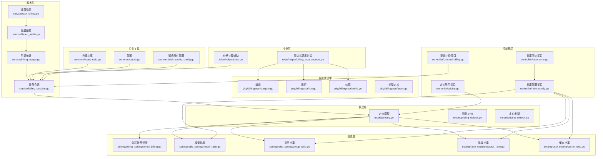
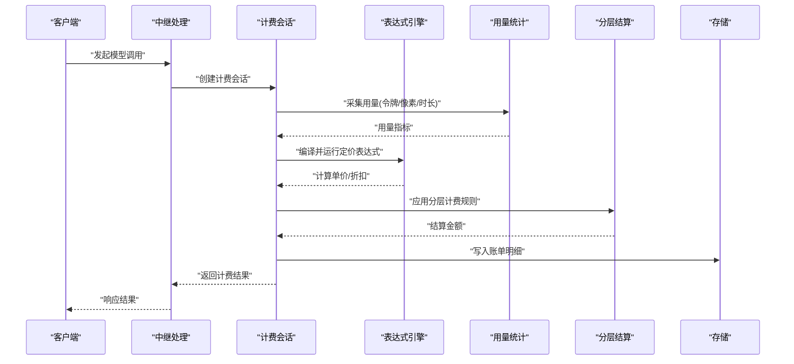
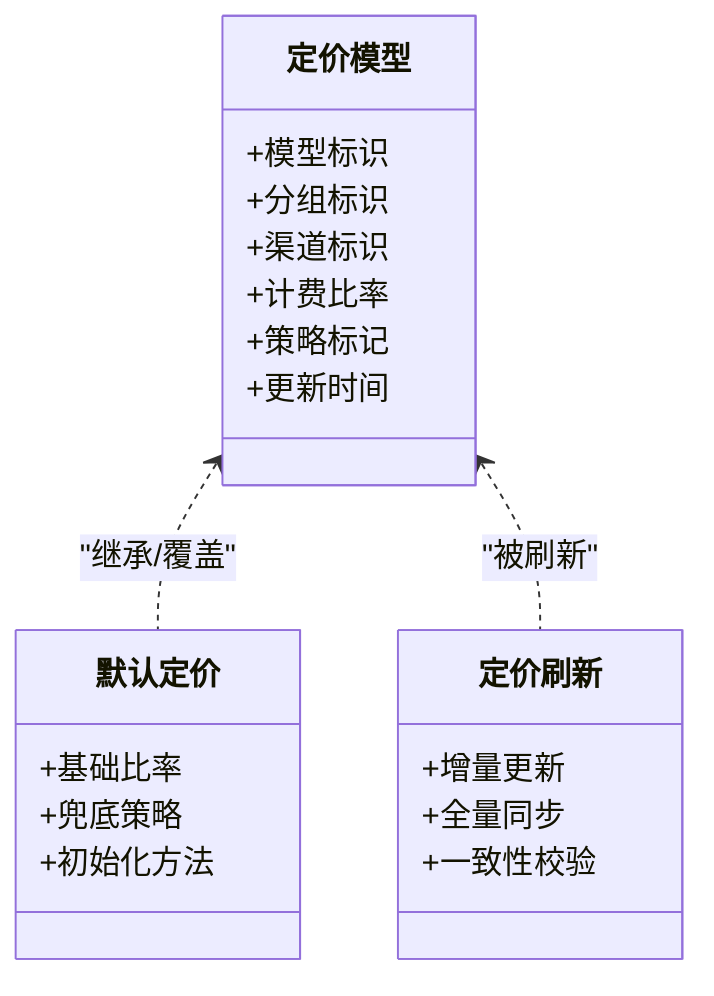
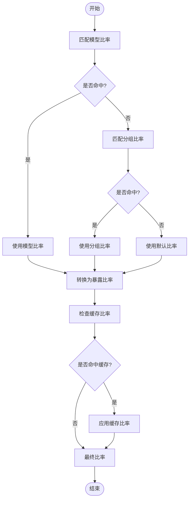
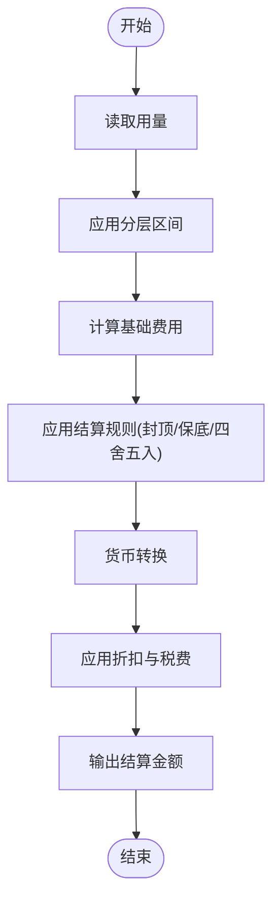
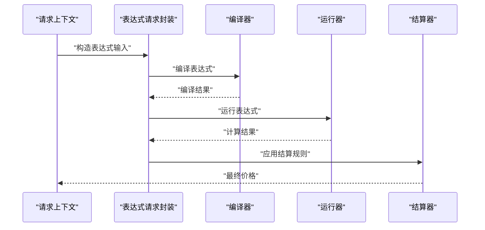
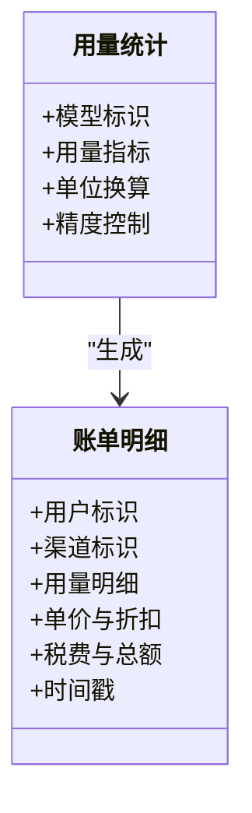
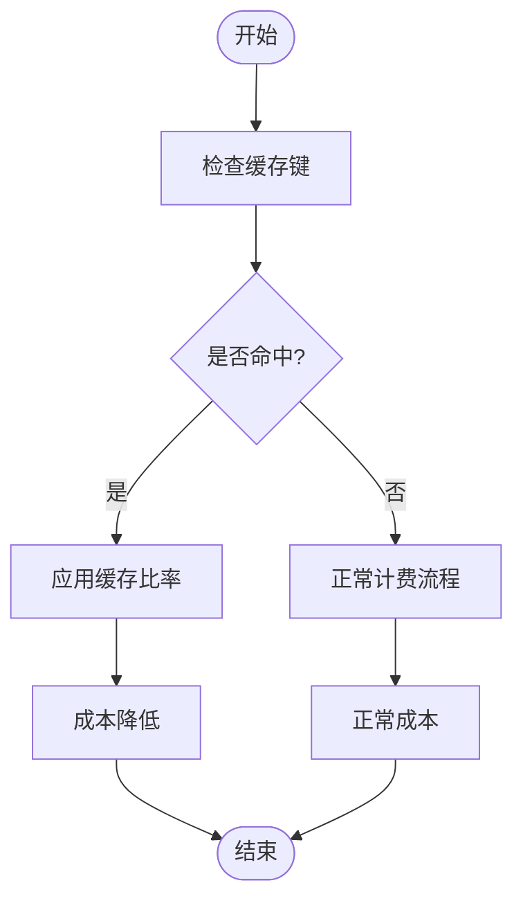
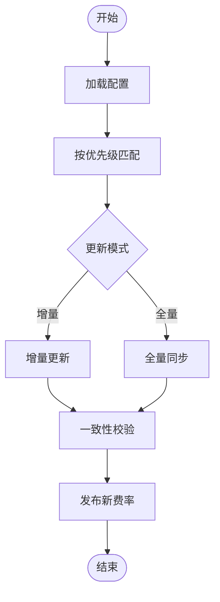
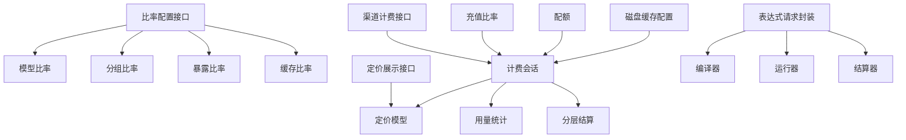

# 模型定价配置

<cite>
**本文引用的文件**   
- [pricing.go](file://model/pricing.go)
- [pricing_default.go](file://model/pricing_default.go)
- [pricing_refresh.go](file://model/pricing_refresh.go)
- [pricing_endpoint_test.go](file://model/pricing_endpoint_test.go)
- [billing_usage.go](file://dto/billing_usage.go)
- [pricing.go](file://dto/pricing.go)
- [tiered_billing.go](file://setting/billing_setting/tiered_billing.go)
- [cache_ratio.go](file://setting/ratio_setting/cache_ratio.go)
- [expose_ratio.go](file://setting/ratio_setting/expose_ratio.go)
- [group_ratio.go](file://setting/ratio_setting/group_ratio.go)
- [model_ratio.go](file://setting/ratio_setting/model_ratio.go)
- [billing.go](file://service/billing.go)
- [billing_session.go](file://service/billing_session.go)
- [billing_usage.go](file://service/billing_usage.go)
- [task_billing.go](file://service/task_billing.go)
- [tiered_settle.go](file://service/tiered_settle.go)
- [price.go](file://relay/helper/price.go)
- [billing_expr_request.go](file://relay/helper/billing_expr_request.go)
- [compile.go](file://pkg/billingexpr/compile.go)
- [run.go](file://pkg/billingexpr/run.go)
- [settle.go](file://pkg/billingexpr/settle.go)
- [types.go](file://pkg/billingexpr/types.go)
- [ratio_config.go](file://controller/ratio_config.go)
- [ratio_sync.go](file://controller/ratio_sync.go)
- [pricing.go](file://controller/pricing.go)
- [channel-billing.go](file://controller/channel-billing.go)
- [topup-ratio.go](file://common/topup-ratio.go)
- [quota.go](file://common/quota.go)
- [disk_cache_config.go](file://common/disk_cache_config.go)
</cite>

## 目录
1. [简介](#简介)
2. [项目结构](#项目结构)
3. [核心组件](#核心组件)
4. [架构总览](#架构总览)
5. [详细组件分析](#详细组件分析)
6. [依赖关系分析](#依赖关系分析)
7. [性能考量](#性能考量)
8. [故障排查指南](#故障排查指南)
9. [结论](#结论)
10. [附录](#附录)

## 简介
本文件面向“模型定价配置系统”，系统性阐述如何配置模型的计费比率、分层定价与缓存策略，覆盖动态定价、用量统计与成本计算。文档基于代码库中的定价相关模块进行梳理，包括：
- 定价数据模型与默认值
- 比率配置（模型级、分组级、暴露级、缓存级）
- 分层计费与结算
- 表达式驱动的动态定价引擎
- 用量采集与账单结算任务
- 缓存策略对计费的影响
- 费率更新机制与优先级规则

读者可据此完成从配置到落地的完整闭环，并获得优化建议与最佳实践。

## 项目结构
围绕定价的核心代码分布在以下层次：
- 模型层：定义定价实体、刷新逻辑与端点测试
- 设置层：分层计费、比率配置（模型/分组/暴露/缓存）
- 服务层：计费会话、用量统计、分层结算、定时任务
- 中继层：价格计算辅助、表达式请求封装
- 表达式引擎：编译、运行、结算
- 控制器层：比率配置接口、同步、定价展示、渠道计费
- 公共工具：充值比率、配额、磁盘缓存配置

图表来源
- [pricing.go](file://model/pricing.go)
- [pricing_default.go](file://model/pricing_default.go)
- [pricing_refresh.go](file://model/pricing_refresh.go)
- [tiered_billing.go](file://setting/billing_setting/tiered_billing.go)
- [model_ratio.go](file://setting/ratio_setting/model_ratio.go)
- [group_ratio.go](file://setting/ratio_setting/group_ratio.go)
- [expose_ratio.go](file://setting/ratio_setting/expose_ratio.go)
- [cache_ratio.go](file://setting/ratio_setting/cache_ratio.go)
- [billing_session.go](file://service/billing_session.go)
- [billing_usage.go](file://service/billing_usage.go)
- [tiered_settle.go](file://service/tiered_settle.go)
- [task_billing.go](file://service/task_billing.go)
- [price.go](file://relay/helper/price.go)
- [billing_expr_request.go](file://relay/helper/billing_expr_request.go)
- [compile.go](file://pkg/billingexpr/compile.go)
- [run.go](file://pkg/billingexpr/run.go)
- [settle.go](file://pkg/billingexpr/settle.go)
- [types.go](file://pkg/billingexpr/types.go)
- [ratio_config.go](file://controller/ratio_config.go)
- [ratio_sync.go](file://controller/ratio_sync.go)
- [pricing.go](file://controller/pricing.go)
- [channel-billing.go](file://controller/channel-billing.go)
- [topup-ratio.go](file://common/topup-ratio.go)
- [quota.go](file://common/quota.go)
- [disk_cache_config.go](file://common/disk_cache_config.go)

章节来源
- [pricing.go](file://model/pricing.go)
- [pricing_default.go](file://model/pricing_default.go)
- [pricing_refresh.go](file://model/pricing_refresh.go)
- [tiered_billing.go](file://setting/billing_setting/tiered_billing.go)
- [model_ratio.go](file://setting/ratio_setting/model_ratio.go)
- [group_ratio.go](file://setting/ratio_setting/group_ratio.go)
- [expose_ratio.go](file://setting/ratio_setting/expose_ratio.go)
- [cache_ratio.go](file://setting/ratio_setting/cache_ratio.go)
- [billing_session.go](file://service/billing_session.go)
- [billing_usage.go](file://service/billing_usage.go)
- [tiered_settle.go](file://service/tiered_settle.go)
- [task_billing.go](file://service/task_billing.go)
- [price.go](file://relay/helper/price.go)
- [billing_expr_request.go](file://relay/helper/billing_expr_request.go)
- [compile.go](file://pkg/billingexpr/compile.go)
- [run.go](file://pkg/billingexpr/run.go)
- [settle.go](file://pkg/billingexpr/settle.go)
- [types.go](file://pkg/billingexpr/types.go)
- [ratio_config.go](file://controller/ratio_config.go)
- [ratio_sync.go](file://controller/ratio_sync.go)
- [pricing.go](file://controller/pricing.go)
- [channel-billing.go](file://controller/channel-billing.go)
- [topup-ratio.go](file://common/topup-ratio.go)
- [quota.go](file://common/quota.go)
- [disk_cache_config.go](file://common/disk_cache_config.go)

## 核心组件
- 定价数据模型与默认值
  - 定价实体用于承载模型、分组、渠道等维度的计费比率与策略
  - 默认定价提供系统启动时的基础比率与兜底策略
- 比率配置
  - 模型比率：按模型名称精确匹配或前缀匹配
  - 分组比率：按模型分组统一配置
  - 暴露比率：对外暴露的计费比率，可与内部比率不同
  - 缓存比率：针对缓存命中场景的折扣或豁免策略
- 分层计费与结算
  - 支持阶梯式用量区间与对应单价
  - 支持封顶、保底、四舍五入等结算规则
- 表达式驱动的动态定价
  - 通过表达式语言在运行时根据上下文变量计算最终价格
  - 支持编译期校验与运行期执行
- 用量统计与账单
  - 采集请求用量（如 token、图像像素、时长等）
  - 生成账单明细并持久化
- 缓存策略对计费的影响
  - 命中缓存时可降低或免除计费
  - 缓存键与命中率影响成本与性能

章节来源
- [pricing.go](file://model/pricing.go)
- [pricing_default.go](file://model/pricing_default.go)
- [model_ratio.go](file://setting/ratio_setting/model_ratio.go)
- [group_ratio.go](file://setting/ratio_setting/group_ratio.go)
- [expose_ratio.go](file://setting/ratio_setting/expose_ratio.go)
- [cache_ratio.go](file://setting/ratio_setting/cache_ratio.go)
- [tiered_billing.go](file://setting/billing_setting/tiered_billing.go)
- [billing_usage.go](file://dto/billing_usage.go)
- [pricing.go](file://dto/pricing.go)

## 架构总览
下图展示了从请求进入、用量采集、动态定价计算、分层结算到账单落盘的端到端流程。

图表来源
- [billing_session.go](file://service/billing_session.go)
- [billing_usage.go](file://service/billing_usage.go)
- [billing_expr_request.go](file://relay/helper/billing_expr_request.go)
- [compile.go](file://pkg/billingexpr/compile.go)
- [run.go](file://pkg/billingexpr/run.go)
- [settle.go](file://pkg/billingexpr/settle.go)
- [tiered_settle.go](file://service/tiered_settle.go)

## 详细组件分析

### 定价数据模型与默认值
- 定价模型负责维护模型、分组、渠道等多维度的计费比率与策略
- 默认定价提供系统初始化时的基础比率，确保无配置时仍可计费
- 定价刷新机制支持热更新，避免重启影响

图表来源
- [pricing.go](file://model/pricing.go)
- [pricing_default.go](file://model/pricing_default.go)
- [pricing_refresh.go](file://model/pricing_refresh.go)

章节来源
- [pricing.go](file://model/pricing.go)
- [pricing_default.go](file://model/pricing_default.go)
- [pricing_refresh.go](file://model/pricing_refresh.go)

### 比率配置（模型/分组/暴露/缓存）
- 模型比率：精确或前缀匹配，优先级最高
- 分组比率：对一组模型生效，便于批量管理
- 暴露比率：对外展示的计费比率，可与内部比率分离
- 缓存比率：缓存命中时的折扣或豁免策略

图表来源
- [model_ratio.go](file://setting/ratio_setting/model_ratio.go)
- [group_ratio.go](file://setting/ratio_setting/group_ratio.go)
- [expose_ratio.go](file://setting/ratio_setting/expose_ratio.go)
- [cache_ratio.go](file://setting/ratio_setting/cache_ratio.go)

章节来源
- [model_ratio.go](file://setting/ratio_setting/model_ratio.go)
- [group_ratio.go](file://setting/ratio_setting/group_ratio.go)
- [expose_ratio.go](file://setting/ratio_setting/expose_ratio.go)
- [cache_ratio.go](file://setting/ratio_setting/cache_ratio.go)

### 分层计费与结算
- 分层计费按用量区间划分，每个区间对应不同单价
- 支持封顶、保底、四舍五入等结算规则
- 结算过程需考虑币种、汇率、折扣与税费

图表来源
- [tiered_billing.go](file://setting/billing_setting/tiered_billing.go)
- [tiered_settle.go](file://service/tiered_settle.go)

章节来源
- [tiered_billing.go](file://setting/billing_setting/tiered_billing.go)
- [tiered_settle.go](file://service/tiered_settle.go)

### 表达式驱动的动态定价
- 表达式在编译期校验语法与类型，运行期结合上下文变量计算价格
- 支持变量替换、函数调用与条件分支
- 适用于复杂定价策略与实时调整

图表来源
- [billing_expr_request.go](file://relay/helper/billing_expr_request.go)
- [compile.go](file://pkg/billingexpr/compile.go)
- [run.go](file://pkg/billingexpr/run.go)
- [settle.go](file://pkg/billingexpr/settle.go)
- [types.go](file://pkg/billingexpr/types.go)

章节来源
- [billing_expr_request.go](file://relay/helper/billing_expr_request.go)
- [compile.go](file://pkg/billingexpr/compile.go)
- [run.go](file://pkg/billingexpr/run.go)
- [settle.go](file://pkg/billingexpr/settle.go)
- [types.go](file://pkg/billingexpr/types.go)

### 用量统计与账单
- 用量统计采集请求的关键指标（如 token、图像像素、时长等）
- 账单明细包含模型、用量、单价、折扣、税费与总金额
- 支持按用户、渠道、时间维度聚合

图表来源
- [billing_usage.go](file://dto/billing_usage.go)
- [billing_usage.go](file://service/billing_usage.go)

章节来源
- [billing_usage.go](file://dto/billing_usage.go)
- [billing_usage.go](file://service/billing_usage.go)

### 缓存策略对计费的影响
- 缓存命中可降低或免除计费，提升性价比
- 缓存比率可独立于模型比率配置
- 缓存键设计影响命中率与成本

图表来源
- [cache_ratio.go](file://setting/ratio_setting/cache_ratio.go)
- [disk_cache_config.go](file://common/disk_cache_config.go)

章节来源
- [cache_ratio.go](file://setting/ratio_setting/cache_ratio.go)
- [disk_cache_config.go](file://common/disk_cache_config.go)

### 费率更新机制与优先级
- 优先级顺序：模型比率 > 分组比率 > 默认比率 > 暴露比率 > 缓存比率
- 支持增量更新与全量同步，确保一致性
- 暴露比率可与内部比率分离，便于对外定价

图表来源
- [pricing_refresh.go](file://model/pricing_refresh.go)
- [ratio_config.go](file://controller/ratio_config.go)
- [ratio_sync.go](file://controller/ratio_sync.go)

章节来源
- [pricing_refresh.go](file://model/pricing_refresh.go)
- [ratio_config.go](file://controller/ratio_config.go)
- [ratio_sync.go](file://controller/ratio_sync.go)

## 依赖关系分析
- 控制器层依赖设置层获取比率配置
- 服务层依赖模型层与服务层内部组件进行计费与结算
- 中继层依赖表达式引擎进行动态定价
- 公共工具为计费会话提供充值比率、配额与缓存配置支持

图表来源
- [ratio_config.go](file://controller/ratio_config.go)
- [pricing.go](file://controller/pricing.go)
- [channel-billing.go](file://controller/channel-billing.go)
- [model/pricing.go](file://model/pricing.go)
- [service/billing_session.go](file://service/billing_session.go)
- [service/billing_usage.go](file://service/billing_usage.go)
- [service/tiered_settle.go](file://service/tiered_settle.go)
- [relay/helper/billing_expr_request.go](file://relay/helper/billing_expr_request.go)
- [pkg/billingexpr/compile.go](file://pkg/billingexpr/compile.go)
- [pkg/billingexpr/run.go](file://pkg/billingexpr/run.go)
- [pkg/billingexpr/settle.go](file://pkg/billingexpr/settle.go)
- [common/topup-ratio.go](file://common/topup-ratio.go)
- [common/quota.go](file://common/quota.go)
- [common/disk_cache_config.go](file://common/disk_cache_config.go)

章节来源
- [ratio_config.go](file://controller/ratio_config.go)
- [pricing.go](file://controller/pricing.go)
- [channel-billing.go](file://controller/channel-billing.go)
- [model/pricing.go](file://model/pricing.go)
- [service/billing_session.go](file://service/billing_session.go)
- [service/billing_usage.go](file://service/billing_usage.go)
- [service/tiered_settle.go](file://service/tiered_settle.go)
- [relay/helper/billing_expr_request.go](file://relay/helper/billing_expr_request.go)
- [pkg/billingexpr/compile.go](file://pkg/billingexpr/compile.go)
- [pkg/billingexpr/run.go](file://pkg/billingexpr/run.go)
- [pkg/billingexpr/settle.go](file://pkg/billingexpr/settle.go)
- [common/topup-ratio.go](file://common/topup-ratio.go)
- [common/quota.go](file://common/quota.go)
- [common/disk_cache_config.go](file://common/disk_cache_config.go)

## 性能考量
- 表达式编译应缓存结果，避免重复编译开销
- 用量统计应异步批处理，减少同步阻塞
- 分层结算应避免频繁浮点运算，采用定点数或预计算表
- 缓存比率应结合热点模型与高频请求路径优化命中率
- 配额检查应在请求早期短路，减少无效计算

[本节为通用指导，无需特定文件引用]

## 故障排查指南
- 比率不生效
  - 检查模型/分组匹配规则是否正确
  - 确认优先级顺序与覆盖规则
- 表达式计算错误
  - 验证表达式语法与类型
  - 检查上下文变量是否完整
- 用量统计异常
  - 核对用量指标采集逻辑
  - 检查单位换算与精度控制
- 缓存策略失效
  - 检查缓存键设计与命中率
  - 确认缓存比率配置是否生效

章节来源
- [model_ratio.go](file://setting/ratio_setting/model_ratio.go)
- [group_ratio.go](file://setting/ratio_setting/group_ratio.go)
- [billing_expr_request.go](file://relay/helper/billing_expr_request.go)
- [billing_usage.go](file://service/billing_usage.go)
- [cache_ratio.go](file://setting/ratio_setting/cache_ratio.go)

## 结论
本定价配置系统通过多维比率配置、分层计费与表达式驱动的动态定价，实现了灵活、可扩展且高性能的计费能力。结合用量统计、缓存策略与费率更新机制，可满足复杂业务场景下的成本控制与收益优化需求。建议在生产环境中结合监控与审计，持续优化比率策略与缓存命中率，实现成本与体验的双赢。

[本节为总结性内容，无需特定文件引用]

## 附录
- 配置项速查
  - 模型比率：按模型名称精确或前缀匹配
  - 分组比率：按模型分组统一配置
  - 暴露比率：对外展示的计费比率
  - 缓存比率：缓存命中时的折扣或豁免
  - 分层计费：按用量区间划分单价
  - 表达式定价：运行时动态计算价格
- 计算公式参考
  - 基础费用 = 用量 × 单价
  - 分层费用 = Σ(各区间用量 × 区间单价)
  - 最终费用 = 基础费用 ± 折扣 ± 税费 ± 封顶/保底
- 最佳实践
  - 优先使用模型比率进行精准控制
  - 利用分组比率简化批量管理
  - 合理设计缓存键提升命中率
  - 表达式定价用于复杂场景，避免过度复杂化
  - 定期审计用量与账单，发现异常与优化点

[本节为补充信息，无需特定文件引用]