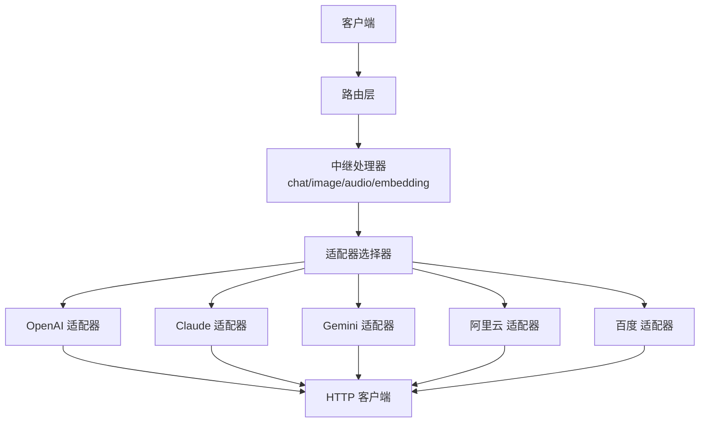
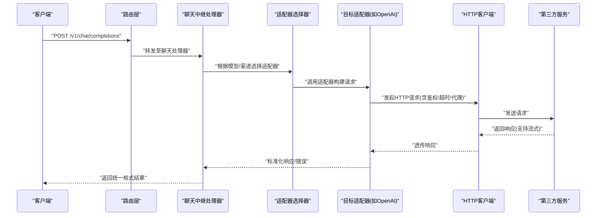
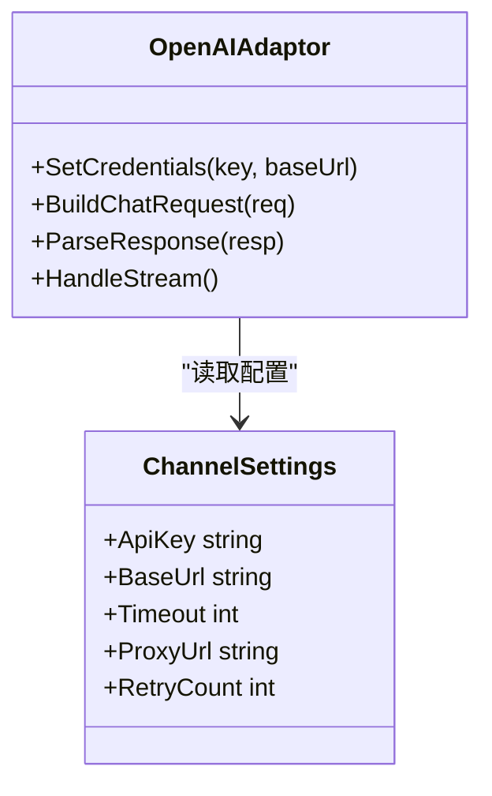
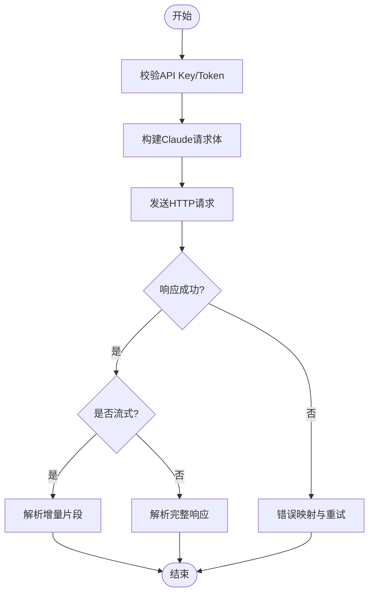
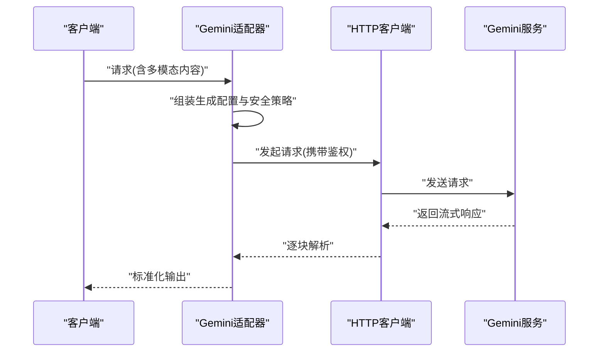
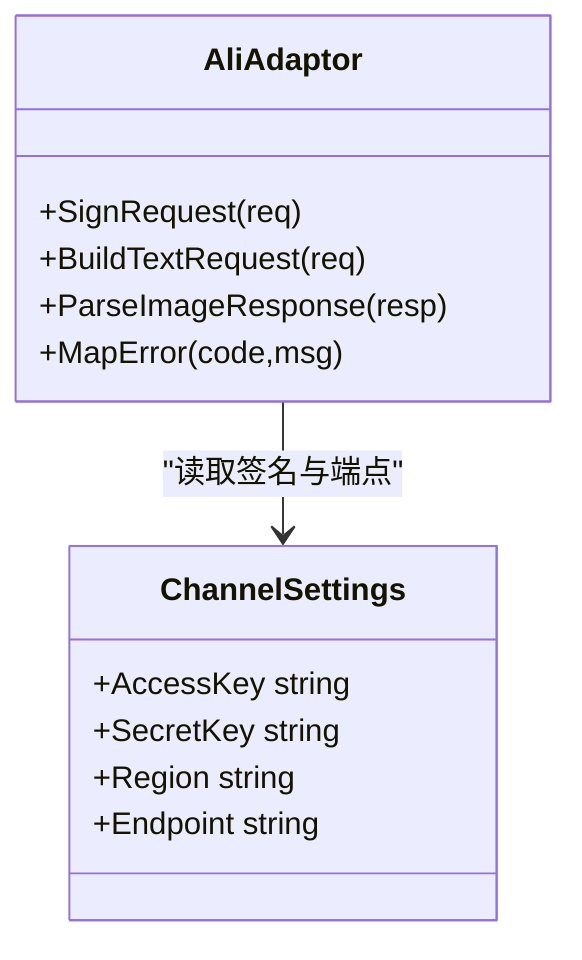
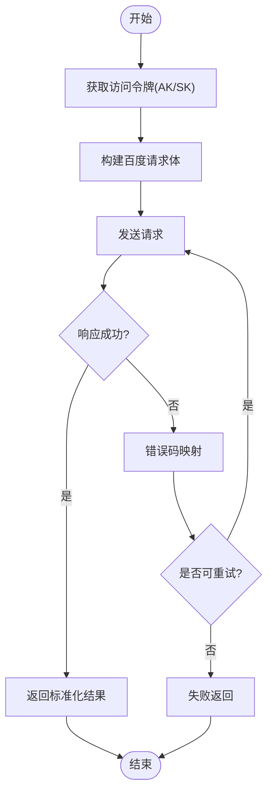
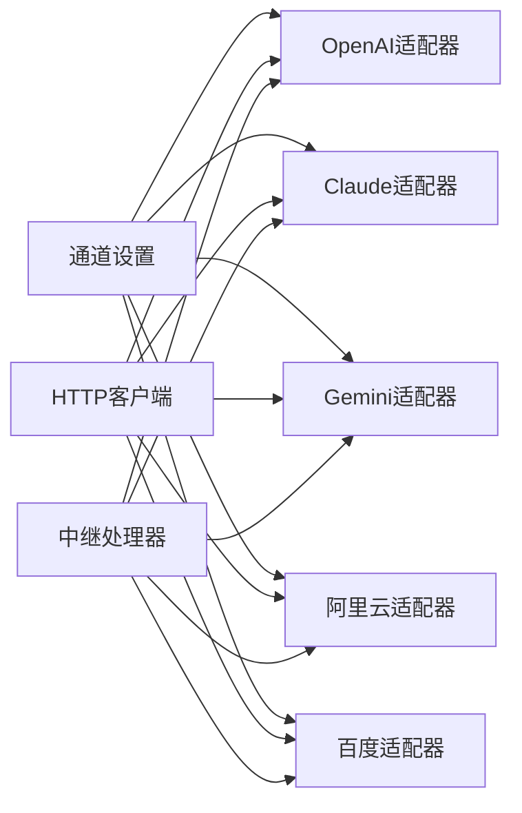

# 提供商配置

<cite>
**本文引用的文件**   
- [main.go](file://main.go)
- [relay_adaptor.go](file://relay/relay_adaptor.go)
- [api_request.go](file://relay/channel/api_request.go)
- [adaptor.go](file://relay/channel/openai/adaptor.go)
- [relay-openai.go](file://relay/channel/openai/relay-openai.go)
- [adaptor.go](file://relay/channel/claude/adaptor.go)
- [relay-claude.go](file://relay/channel/claude/relay-claude.go)
- [adaptor.go](file://relay/channel/gemini/adaptor.go)
- [relay-gemini-native.go](file://relay/channel/gemini/relay-gemini-native.go)
- [adaptor.go](file://relay/channel/ali/adaptor.go)
- [text.go](file://relay/channel/ali/text.go)
- [adaptor.go](file://relay/channel/baidu/adaptor.go)
- [relay-baidu.go](file://relay/channel/baidu/relay-baidu.go)
- [channel_settings.go](file://dto/channel_settings.go)
- [endpoint_defaults.go](file://common/endpoint_defaults.go)
- [env.go](file://common/env.go)
- [http_client.go](file://service/http_client.go)
- [channel.go](file://model/channel.go)
- [channel_test.go](file://controller/channel-test.go)
</cite>

## 目录
1. [简介](#简介)
2. [项目结构](#项目结构)
3. [核心组件](#核心组件)
4. [架构总览](#架构总览)
5. [详细组件分析](#详细组件分析)
6. [依赖关系分析](#依赖关系分析)
7. [性能考虑](#性能考虑)
8. [故障排查指南](#故障排查指南)
9. [结论](#结论)
10. [附录](#附录)

## 简介
本文件面向AI服务提供商的配置与集成，聚焦OpenAI、Claude、Gemini、阿里云、百度等主流厂商。内容涵盖：
- API密钥设置、基础URL配置、认证方式与连接参数
- 请求格式转换与响应处理机制
- 各提供商特定配置项、环境变量与连接参数
- 测试、调试与性能优化最佳实践

本仓库采用“适配器+中继”的架构，将不同提供商的API差异抽象为统一接口，便于扩展与维护。

## 项目结构
- 入口与路由：应用启动、路由注册与中间件挂载
- 适配层：每个提供商一个适配器（Adaptor），负责鉴权、请求构造、响应解析
- 中继层：按能力（聊天、图像、音频、嵌入等）分发到对应适配器
- 通用工具：HTTP客户端、限流、缓存、计费、错误处理等

**图表来源** 
- [main.go:1-200](file://main.go#L1-L200)
- [relay_adaptor.go:1-200](file://relay/relay_adaptor.go#L1-L200)
- [api_request.go:1-200](file://relay/channel/api_request.go#L1-L200)

**章节来源**
- [main.go:1-200](file://main.go#L1-L200)
- [relay_adaptor.go:1-200](file://relay/relay_adaptor.go#L1-L200)

## 核心组件
- 通道模型与设置：定义渠道元数据、密钥、基础URL、超时、代理、重试等
- 适配器接口：统一封装鉴权、请求构建、响应解析、流式处理
- 请求转换器：将内部请求转换为各提供商的原始请求体
- 响应转换器：将各提供商响应标准化为内部结构
- HTTP客户端：连接池、超时、重试、代理、SSRF防护等

关键要点：
- 所有提供商通过统一的Channel配置进行接入，避免硬编码
- 适配器实现各自鉴权头、签名、路径拼接与错误映射
- 请求/响应转换集中在公共模块，保证一致性

**章节来源**
- [channel_settings.go:1-200](file://dto/channel_settings.go#L1-L200)
- [relay_adaptor.go:1-200](file://relay/relay_adaptor.go#L1-L200)
- [api_request.go:1-200](file://relay/channel/api_request.go#L1-L200)
- [http_client.go:1-200](file://service/http_client.go#L1-L200)

## 架构总览
下图展示一次聊天请求从进入系统到调用具体提供商的完整流程。

**图表来源** 
- [relay_adaptor.go:1-200](file://relay/relay_adaptor.go#L1-L200)
- [api_request.go:1-200](file://relay/channel/api_request.go#L1-L200)
- [http_client.go:1-200](file://service/http_client.go#L1-L200)

## 详细组件分析

### OpenAI 适配器
- 鉴权：通常使用Bearer Token（API Key），可通过Header注入
- 基础URL：支持自定义Base URL，便于代理或私有部署
- 请求格式：遵循OpenAI Chat Completions规范，支持消息、工具、函数调用等
- 响应处理：标准JSON，支持流式事件解析
- 特有选项：压缩、Responses模式、图像/音频/视频能力

**图表来源** 
- [adaptor.go:1-200](file://relay/channel/openai/adaptor.go#L1-L200)
- [relay-openai.go:1-200](file://relay/channel/openai/relay-openai.go#L1-L200)
- [channel_settings.go:1-200](file://dto/channel_settings.go#L1-L200)

**章节来源**
- [adaptor.go:1-200](file://relay/channel/openai/adaptor.go#L1-L200)
- [relay-openai.go:1-200](file://relay/channel/openai/relay-openai.go#L1-L200)

### Claude 适配器
- 鉴权：使用API Key或会话Token，按Provider要求注入Header
- 基础URL：可自定义，支持企业版或代理
- 请求格式：Messages/Tools/系统提示词等
- 响应处理：支持增量输出（delta）与用量统计

**图表来源** 
- [adaptor.go:1-200](file://relay/channel/claude/adaptor.go#L1-L200)
- [relay-claude.go:1-200](file://relay/channel/claude/relay-claude.go#L1-L200)

**章节来源**
- [adaptor.go:1-200](file://relay/channel/claude/adaptor.go#L1-L200)
- [relay-claude.go:1-200](file://relay/channel/claude/relay-claude.go#L1-L200)

### Gemini 适配器
- 鉴权：API Key或OAuth（视版本与端点）
- 基础URL：支持Google Cloud Vertex或原生API
- 请求格式：生成配置、安全设置、多模态输入
- 响应处理：文本/图片/视频等多模态，支持流式

**图表来源** 
- [adaptor.go:1-200](file://relay/channel/gemini/adaptor.go#L1-L200)
- [relay-gemini-native.go:1-200](file://relay/channel/gemini/relay-gemini-native.go#L1-L200)

**章节来源**
- [adaptor.go:1-200](file://relay/channel/gemini/adaptor.go#L1-L200)
- [relay-gemini-native.go:1-200](file://relay/channel/gemini/relay-gemini-native.go#L1-L200)

### 阿里云 适配器
- 鉴权：AccessKey/SecretKey或STS临时凭证，支持签名算法
- 基础URL：按区域与服务划分
- 请求格式：文本、图像、重排序等任务
- 响应处理：结构化字段映射与错误码转换

**图表来源** 
- [adaptor.go:1-200](file://relay/channel/ali/adaptor.go#L1-L200)
- [text.go:1-200](file://relay/channel/ali/text.go#L1-L200)
- [channel_settings.go:1-200](file://dto/channel_settings.go#L1-L200)

**章节来源**
- [adaptor.go:1-200](file://relay/channel/ali/adaptor.go#L1-L200)
- [text.go:1-200](file://relay/channel/ali/text.go#L1-L200)

### 百度 适配器
- 鉴权：AK/SK获取访问令牌，或OAuth
- 基础URL：按产品线区分（文心一言、向量检索等）
- 请求格式：对话、Embedding、图像生成等
- 响应处理：错误码映射与重试策略

**图表来源** 
- [adaptor.go:1-200](file://relay/channel/baidu/adaptor.go#L1-L200)
- [relay-baidu.go:1-200](file://relay/channel/baidu/relay-baidu.go#L1-L200)

**章节来源**
- [adaptor.go:1-200](file://relay/channel/baidu/adaptor.go#L1-L200)
- [relay-baidu.go:1-200](file://relay/channel/baidu/relay-baidu.go#L1-L200)

### 通用配置与环境变量
- 通道设置：包含API Key、Base URL、超时、代理、重试次数、并发限制等
- 默认端点：提供常见提供商的基础URL默认值
- 环境变量：用于覆盖运行时配置（如密钥、代理、日志级别）

建议：
- 优先使用环境变量注入敏感信息
- 在控制台或配置中心管理渠道设置，避免代码硬编码
- 针对不同环境（开发/测试/生产）分离配置

**章节来源**
- [channel_settings.go:1-200](file://dto/channel_settings.go#L1-L200)
- [endpoint_defaults.go:1-200](file://common/endpoint_defaults.go#L1-L200)
- [env.go:1-200](file://common/env.go#L1-L200)

## 依赖关系分析
- 适配器依赖通道设置与HTTP客户端
- 中继处理器依赖适配器选择器与请求/响应转换器
- 错误处理与重试策略贯穿整个调用链

**图表来源** 
- [channel_settings.go:1-200](file://dto/channel_settings.go#L1-L200)
- [http_client.go:1-200](file://service/http_client.go#L1-L200)
- [relay_adaptor.go:1-200](file://relay/relay_adaptor.go#L1-L200)

**章节来源**
- [channel_settings.go:1-200](file://dto/channel_settings.go#L1-L200)
- [http_client.go:1-200](file://service/http_client.go#L1-L200)
- [relay_adaptor.go:1-200](file://relay/relay_adaptor.go#L1-L200)

## 性能考虑
- 连接池与复用：合理设置HTTP客户端连接数与超时
- 流式传输：优先使用流式接口降低延迟与内存占用
- 重试与退避：对瞬态错误实施指数退避重试
- 缓存与预取：对静态资源或频繁查询结果进行缓存
- 监控与指标：记录QPS、延迟、错误率与资源使用

[本节为通用指导，不直接分析具体文件]

## 故障排查指南
- 鉴权失败：检查API Key/Token是否正确、是否过期、权限是否足够
- 网络问题：验证Base URL、代理设置、防火墙与DNS解析
- 请求格式：核对必填字段、数据类型与枚举值
- 响应解析：查看错误码映射与日志上下文
- 性能瓶颈：分析慢请求、连接池饱和与GC压力

实用步骤：
- 使用内置渠道测试接口快速验证连通性
- 开启详细日志并捕获请求/响应体
- 逐步缩小问题范围（网络→鉴权→请求→响应）

**章节来源**
- [channel_test.go:1-200](file://controller/channel-test.go#L1-L200)
- [http_client.go:1-200](file://service/http_client.go#L1-L200)

## 结论
通过统一的适配器与中继架构，本项目实现了多AI提供商的灵活接入与统一管理。配置层面强调安全性与可维护性，建议结合环境变量与配置中心进行集中管理。在生产环境中，应重视监控、错误处理与性能调优，确保稳定高效的AI服务体验。

[本节为总结性内容，不直接分析具体文件]

## 附录
- 常见问题FAQ：鉴权、网络、格式、性能
- 最佳实践清单：配置、安全、监控、扩容
- 参考链接：各提供商官方文档与SDK

[本节为补充信息，不直接分析具体文件]