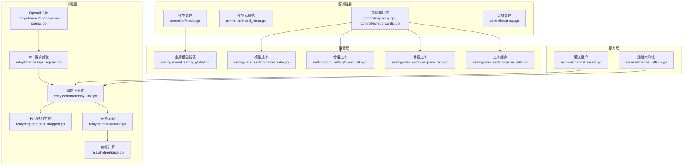
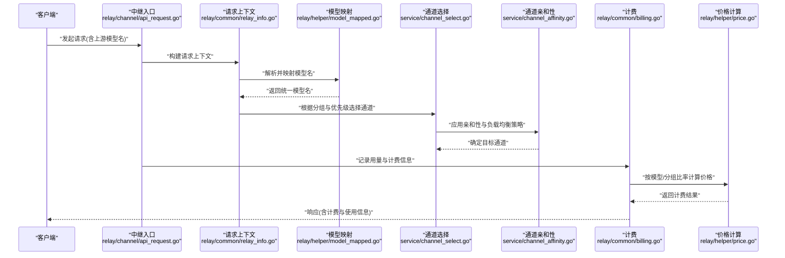
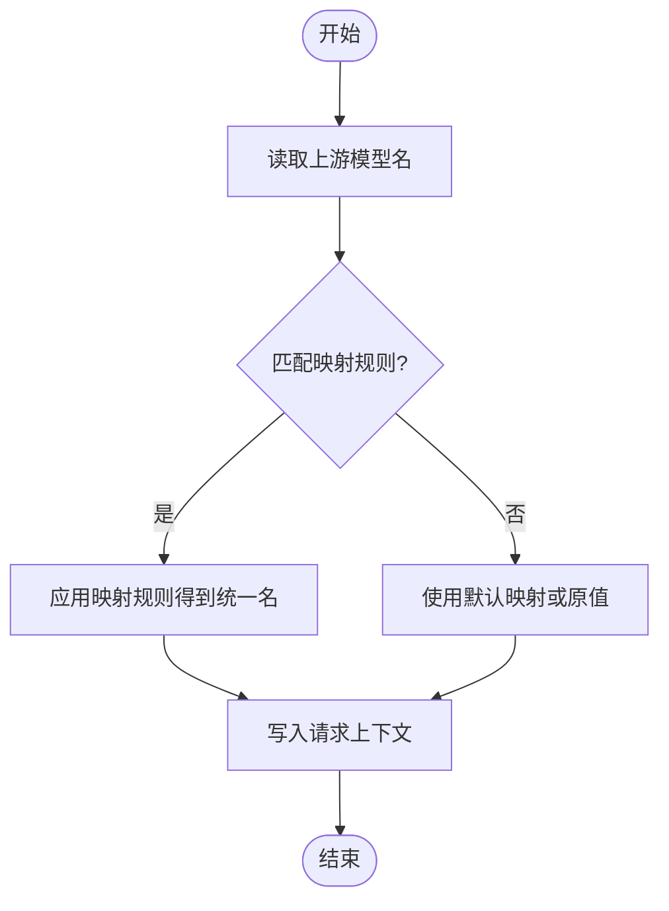
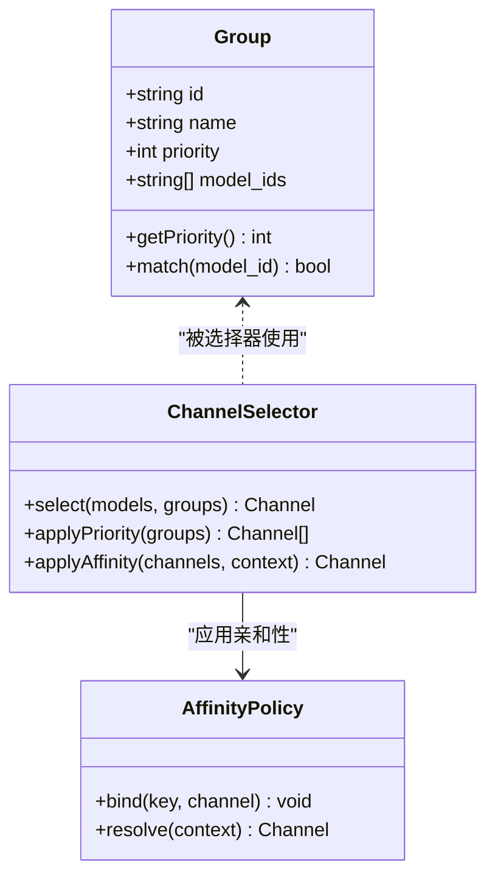
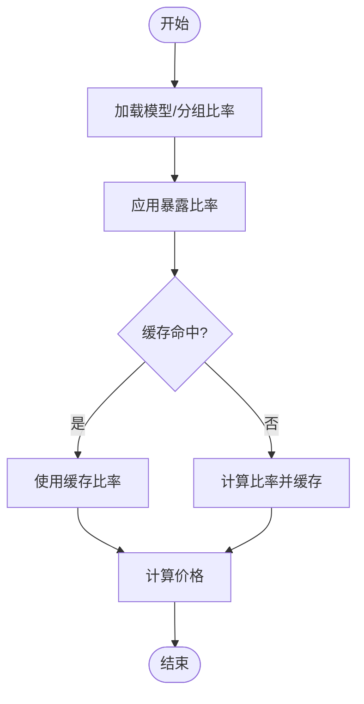
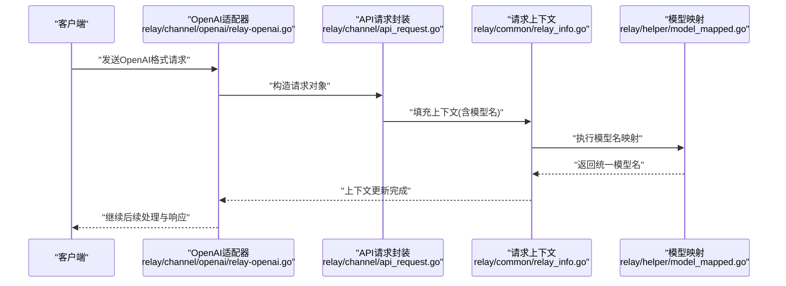
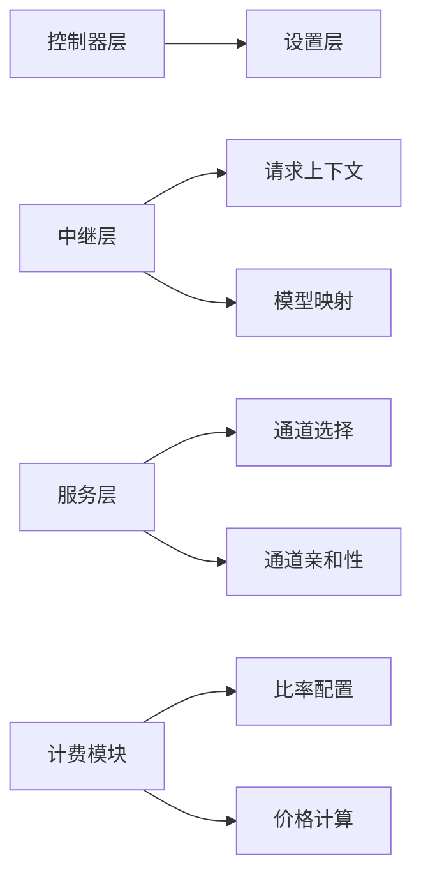

# 模型映射配置

<cite>
**本文引用的文件**   
- [model.go](file://controller/model.go)
- [model_meta.go](file://controller/model_meta.go)
- [pricing.go](file://controller/pricing.go)
- [ratio_config.go](file://controller/ratio_config.go)
- [group.go](file://controller/group.go)
- [model_setting_global.go](file://setting/model_setting/global.go)
- [model_ratio.go](file://setting/ratio_setting/model_ratio.go)
- [group_ratio.go](file://setting/ratio_setting/group_ratio.go)
- [expose_ratio.go](file://setting/ratio_setting/expose_ratio.go)
- [cache_ratio.go](file://setting/ratio_setting/cache_ratio.go)
- [relay_info.go](file://relay/common/relay_info.go)
- [model_mapped.go](file://relay/helper/model_mapped.go)
- [channel_select.go](file://service/channel_select.go)
- [channel_affinity.go](file://service/channel_affinity.go)
- [billing.go](file://relay/common/billing.go)
- [price.go](file://relay/helper/price.go)
- [api_request.go](file://relay/channel/api_request.go)
- [relay_openai.go](file://relay/channel/openai/relay-openai.go)
</cite>

## 目录
1. [简介](#简介)
2. [项目结构](#项目结构)
3. [核心组件](#核心组件)
4. [架构总览](#架构总览)
5. [详细组件分析](#详细组件分析)
6. [依赖关系分析](#依赖关系分析)
7. [性能考虑](#性能考虑)
8. [故障排除指南](#故障排除指南)
9. [结论](#结论)
10. [附录](#附录)

## 简介
本文件面向模型映射配置系统，系统性阐述如何配置：
- 模型名称映射：将上游各渠道的模型名统一为内部标准名，便于路由、计费与展示。
- 分组策略：按业务或渠道维度对模型进行分组，支持优先级与负载均衡。
- 定价比率：为不同模型或分组设置计费倍率，实现精细化计费。
文档同时给出测试、验证与排障方法，帮助快速定位问题并优化配置。

## 项目结构
围绕“模型映射”的关键代码分布在控制器（对外接口）、设置层（配置定义与缓存）、中继层（请求转换与计费）与服务层（通道选择与亲和性）。下图概览了主要模块与职责边界：

图表来源
- [model.go](file://controller/model.go)
- [model_meta.go](file://controller/model_meta.go)
- [pricing.go](file://controller/pricing.go)
- [ratio_config.go](file://controller/ratio_config.go)
- [group.go](file://controller/group.go)
- [model_setting_global.go](file://setting/model_setting/global.go)
- [model_ratio.go](file://setting/ratio_setting/model_ratio.go)
- [group_ratio.go](file://setting/ratio_setting/group_ratio.go)
- [expose_ratio.go](file://setting/ratio_setting/expose_ratio.go)
- [cache_ratio.go](file://setting/ratio_setting/cache_ratio.go)
- [relay_info.go](file://relay/common/relay_info.go)
- [model_mapped.go](file://relay/helper/model_mapped.go)
- [billing.go](file://relay/common/billing.go)
- [price.go](file://relay/helper/price.go)
- [api_request.go](file://relay/channel/api_request.go)
- [relay_openai.go](file://relay/channel/openai/relay-openai.go)
- [channel_select.go](file://service/channel_select.go)
- [channel_affinity.go](file://service/channel_affinity.go)

章节来源
- [model.go](file://controller/model.go)
- [model_meta.go](file://controller/model_meta.go)
- [pricing.go](file://controller/pricing.go)
- [ratio_config.go](file://controller/ratio_config.go)
- [group.go](file://controller/group.go)
- [model_setting_global.go](file://setting/model_setting/global.go)
- [model_ratio.go](file://setting/ratio_setting/model_ratio.go)
- [group_ratio.go](file://setting/ratio_setting/group_ratio.go)
- [expose_ratio.go](file://setting/ratio_setting/expose_ratio.go)
- [cache_ratio.go](file://setting/ratio_setting/cache_ratio.go)
- [relay_info.go](file://relay/common/relay_info.go)
- [model_mapped.go](file://relay/helper/model_mapped.go)
- [billing.go](file://relay/common/billing.go)
- [price.go](file://relay/helper/price.go)
- [api_request.go](file://relay/channel/api_request.go)
- [relay_openai.go](file://relay/channel/openai/relay-openai.go)
- [channel_select.go](file://service/channel_select.go)
- [channel_affinity.go](file://service/channel_affinity.go)

## 核心组件
- 模型名称映射
  - 负责将上游渠道的模型名转换为内部统一名称，确保路由、计费与展示的一致性。
  - 关键位置：中继层的模型映射工具与请求上下文。
- 分组策略
  - 通过分组标识组织模型集合，支持优先级与亲和性策略，影响通道选择与负载均衡。
  - 关键位置：分组管理与通道选择/亲和性服务。
- 定价比率
  - 为模型或分组设置计费倍率，结合用量统计完成最终计费。
  - 关键位置：比率配置、暴露比率、缓存与价格计算。

章节来源
- [model_mapped.go](file://relay/helper/model_mapped.go)
- [relay_info.go](file://relay/common/relay_info.go)
- [group.go](file://controller/group.go)
- [channel_select.go](file://service/channel_select.go)
- [channel_affinity.go](file://service/channel_affinity.go)
- [model_ratio.go](file://setting/ratio_setting/model_ratio.go)
- [group_ratio.go](file://setting/ratio_setting/group_ratio.go)
- [expose_ratio.go](file://setting/ratio_setting/expose_ratio.go)
- [cache_ratio.go](file://setting/ratio_setting/cache_ratio.go)
- [billing.go](file://relay/common/billing.go)
- [price.go](file://relay/helper/price.go)

## 架构总览
下图展示了从请求进入、模型映射、通道选择到计费的核心流程。

图表来源
- [api_request.go](file://relay/channel/api_request.go)
- [relay_info.go](file://relay/common/relay_info.go)
- [model_mapped.go](file://relay/helper/model_mapped.go)
- [channel_select.go](file://service/channel_select.go)
- [channel_affinity.go](file://service/channel_affinity.go)
- [billing.go](file://relay/common/billing.go)
- [price.go](file://relay/helper/price.go)

## 详细组件分析

### 模型名称映射
- 作用
  - 将上游渠道的原始模型名映射为内部统一名，避免多源命名差异导致的路由与计费错误。
- 关键点
  - 映射规则通常以配置形式维护，并在请求处理时生效。
  - 映射结果会写入请求上下文，供后续通道选择与计费使用。
- 典型流程
  - 请求进入后，读取上游模型名；
  - 调用映射工具进行匹配与转换；
  - 将统一模型名写回上下文，用于后续逻辑。

图表来源
- [model_mapped.go](file://relay/helper/model_mapped.go)
- [relay_info.go](file://relay/common/relay_info.go)

章节来源
- [model_mapped.go](file://relay/helper/model_mapped.go)
- [relay_info.go](file://relay/common/relay_info.go)

### 分组策略与优先级
- 作用
  - 将模型按业务或渠道维度分组，配合优先级与亲和性策略，决定通道选择与负载分配。
- 关键点
  - 分组标识在模型元数据中声明；
  - 通道选择器依据分组与优先级挑选候选通道；
  - 亲和性策略可绑定用户/租户/会话等维度，提升命中率与稳定性。
- 典型流程
  - 解析模型所属分组；
  - 基于优先级排序候选通道；
  - 应用亲和性策略筛选目标通道；
  - 返回最终通道实例。

图表来源
- [group.go](file://controller/group.go)
- [channel_select.go](file://service/channel_select.go)
- [channel_affinity.go](file://service/channel_affinity.go)

章节来源
- [group.go](file://controller/group.go)
- [channel_select.go](file://service/channel_select.go)
- [channel_affinity.go](file://service/channel_affinity.go)

### 定价比率配置
- 作用
  - 为模型或分组设置计费倍率，结合用量统计生成最终费用。
- 关键点
  - 模型比率与分组比率分别维护；
  - 暴露比率控制对外可见的计费比例；
  - 比率缓存提升查询性能。
- 典型流程
  - 读取模型/分组比率；
  - 应用暴露比率；
  - 计算价格并写入计费上下文。

图表来源
- [model_ratio.go](file://setting/ratio_setting/model_ratio.go)
- [group_ratio.go](file://setting/ratio_setting/group_ratio.go)
- [expose_ratio.go](file://setting/ratio_setting/expose_ratio.go)
- [cache_ratio.go](file://setting/ratio_setting/cache_ratio.go)
- [billing.go](file://relay/common/billing.go)
- [price.go](file://relay/helper/price.go)

章节来源
- [model_ratio.go](file://setting/ratio_setting/model_ratio.go)
- [group_ratio.go](file://setting/ratio_setting/group_ratio.go)
- [expose_ratio.go](file://setting/ratio_setting/expose_ratio.go)
- [cache_ratio.go](file://setting/ratio_setting/cache_ratio.go)
- [billing.go](file://relay/common/billing.go)
- [price.go](file://relay/helper/price.go)

### 与具体渠道的集成示例（OpenAI）
- 作用
  - 将上游OpenAI模型的名称映射到统一名，并参与通道选择与计费。
- 关键点
  - OpenAI适配器在请求处理时读取模型名；
  - 通过映射工具转换为统一名；
  - 交由选择器与亲和性策略决定实际通道。

图表来源
- [relay_openai.go](file://relay/channel/openai/relay-openai.go)
- [api_request.go](file://relay/channel/api_request.go)
- [relay_info.go](file://relay/common/relay_info.go)
- [model_mapped.go](file://relay/helper/model_mapped.go)

章节来源
- [relay_openai.go](file://relay/channel/openai/relay-openai.go)
- [api_request.go](file://relay/channel/api_request.go)
- [relay_info.go](file://relay/common/relay_info.go)
- [model_mapped.go](file://relay/helper/model_mapped.go)

## 依赖关系分析
- 控制器层依赖设置层提供比率与全局模型设置；
- 中继层依赖请求上下文与映射工具，保证模型名一致性；
- 服务层依赖通道选择与亲和性策略，实现智能路由；
- 计费模块依赖比率配置与价格计算，确保准确计费。

图表来源
- [model.go](file://controller/model.go)
- [model_meta.go](file://controller/model_meta.go)
- [pricing.go](file://controller/pricing.go)
- [ratio_config.go](file://controller/ratio_config.go)
- [group.go](file://controller/group.go)
- [model_setting_global.go](file://setting/model_setting/global.go)
- [model_ratio.go](file://setting/ratio_setting/model_ratio.go)
- [group_ratio.go](file://setting/ratio_setting/group_ratio.go)
- [expose_ratio.go](file://setting/ratio_setting/expose_ratio.go)
- [cache_ratio.go](file://setting/ratio_setting/cache_ratio.go)
- [relay_info.go](file://relay/common/relay_info.go)
- [model_mapped.go](file://relay/helper/model_mapped.go)
- [channel_select.go](file://service/channel_select.go)
- [channel_affinity.go](file://service/channel_affinity.go)
- [billing.go](file://relay/common/billing.go)
- [price.go](file://relay/helper/price.go)

章节来源
- [model.go](file://controller/model.go)
- [model_meta.go](file://controller/model_meta.go)
- [pricing.go](file://controller/pricing.go)
- [ratio_config.go](file://controller/ratio_config.go)
- [group.go](file://controller/group.go)
- [model_setting_global.go](file://setting/model_setting/global.go)
- [model_ratio.go](file://setting/ratio_setting/model_ratio.go)
- [group_ratio.go](file://setting/ratio_setting/group_ratio.go)
- [expose_ratio.go](file://setting/ratio_setting/expose_ratio.go)
- [cache_ratio.go](file://setting/ratio_setting/cache_ratio.go)
- [relay_info.go](file://relay/common/relay_info.go)
- [model_mapped.go](file://relay/helper/model_mapped.go)
- [channel_select.go](file://service/channel_select.go)
- [channel_affinity.go](file://service/channel_affinity.go)
- [billing.go](file://relay/common/billing.go)
- [price.go](file://relay/helper/price.go)

## 性能考虑
- 比率缓存
  - 使用比率缓存减少频繁计算与数据库访问，提高吞吐。
- 映射查找
  - 模型映射建议采用哈希表或前缀树结构，降低匹配复杂度。
- 通道选择
  - 优先使用预排序与缓存的候选集，减少每次选择的开销。
- 亲和性策略
  - 合理设计键空间与过期策略，避免热点键导致的锁竞争。

[本节为通用指导，不直接分析具体文件]

## 故障排除指南
- 模型名未映射
  - 检查映射规则是否覆盖上游模型名；
  - 确认请求上下文中是否正确写入统一模型名。
- 分组优先级异常
  - 核对分组优先级配置；
  - 检查通道选择器是否按优先级排序。
- 计费比率不正确
  - 校验模型/分组比率与暴露比率；
  - 查看比率缓存是否失效或脏数据。
- 通道选择失败
  - 检查通道可用性与亲和性绑定；
  - 确认请求上下文中的分组与模型名一致。

章节来源
- [model_mapped.go](file://relay/helper/model_mapped.go)
- [relay_info.go](file://relay/common/relay_info.go)
- [channel_select.go](file://service/channel_select.go)
- [channel_affinity.go](file://service/channel_affinity.go)
- [model_ratio.go](file://setting/ratio_setting/model_ratio.go)
- [group_ratio.go](file://setting/ratio_setting/group_ratio.go)
- [expose_ratio.go](file://setting/ratio_setting/expose_ratio.go)
- [cache_ratio.go](file://setting/ratio_setting/cache_ratio.go)

## 结论
模型映射配置系统通过统一的模型名映射、灵活的分组策略与精细化的定价比率，实现了跨渠道的稳定路由与准确计费。借助缓存与亲和性策略，系统在性能与可用性方面具备良好表现。建议在上线前充分测试映射规则与比率配置，并结合监控与日志持续优化。

[本节为总结，不直接分析具体文件]

## 附录
- 常用配置项说明
  - 模型名称映射：上游模型名到统一名的映射规则。
  - 分组策略：分组标识、优先级与亲和性键。
  - 定价比率：模型比率、分组比率与暴露比率。
- 测试建议
  - 单元测试：覆盖映射规则、优先级排序与比率计算。
  - 集成测试：模拟上游请求，验证端到端路由与计费。
  - 压测：评估高并发下的映射与选择性能。

[本节为补充信息，不直接分析具体文件]