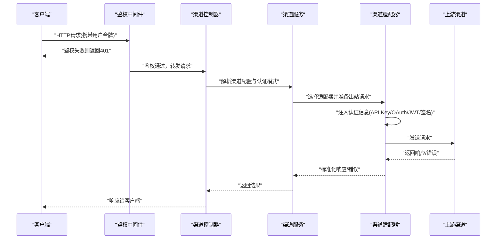
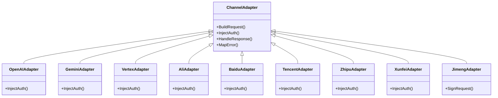

# 渠道认证配置

<cite>
**本文引用的文件**   
- [main.go](file://main.go)
- [router/main.go](file://router/main.go)
- [middleware/auth.go](file://middleware/auth.go)
- [controller/channel.go](file://controller/channel.go)
- [model/channel.go](file://model/channel.go)
- [dto/channel_settings.go](file://dto/channel_settings.go)
- [relay/channel/adapter.go](file://relay/channel/adapter.go)
- [relay/channel/api_request.go](file://relay/channel/api_request.go)
- [service/channel.go](file://service/channel.go)
- [setting/config/config.go](file://setting/config/config.go)
- [constant/channel.go](file://constant/channel.go)
- [oauth/provider.go](file://oauth/provider.go)
- [controller/oauth.go](file://controller/oauth.go)
- [controller/custom_oauth.go](file://controller/custom_oauth.go)
- [service/codex_oauth.go](file://service/codex_oauth.go)
- [service/codex_credential_refresh.go](file://service/codex_credential_refresh.go)
- [relay/channel/openai/relay-openai.go](file://relay/channel/openai/relay-openai.go)
- [relay/channel/gemini/relay-gemini.go](file://relay/channel/gemini/relay-gemini.go)
- [relay/channel/vertex/service_account.go](file://relay/channel/vertex/service_account.go)
- [relay/channel/ali/adaptor.go](file://relay/channel/ali/adaptor.go)
- [relay/channel/baidu/adaptor.go](file://relay/channel/baidu/adaptor.go)
- [relay/channel/tencent/dto.go](file://relay/channel/tencent/dto.go)
- [relay/channel/zhipu/relay-zhipu.go](file://relay/channel/zhipu/relay-zhipu.go)
- [relay/channel/xunfei/relay-xunfei.go](file://relay/channel/xunfei/relay-xunfei.go)
- [relay/channel/jimeng/sign.go](file://relay/channel/jimeng/sign.go)
- [relay/channel/midjourney.go](file://relay/channel/midjourney.go)
- [relay/common/outbound_body.go](file://relay/common/outbound_body.go)
- [relay/common/request_conversion.go](file://relay/common/request_conversion.go)
- [relay/helper/price.go](file://relay/helper/price.go)
- [setting/operation_setting/token_setting.go](file://setting/operation_setting/token_setting.go)
- [setting/system_setting/oidc.go](file://setting/system_setting/oidc.go)
- [common/crypto.go](file://common/crypto.go)
- [common/session_cookie.go](file://common/session_cookie.go)
- [controller/token.go](file://controller/token.go)
- [model/token.go](file://model/token.go)
- [service/auth_token.go](file://service/auth_token.go)
</cite>

## 目录
1. [简介](#简介)
2. [项目结构](#项目结构)
3. [核心组件](#核心组件)
4. [架构总览](#架构总览)
5. [详细组件分析](#详细组件分析)
6. [依赖关系分析](#依赖关系分析)
7. [性能与安全考虑](#性能与安全考虑)
8. [故障排查指南](#故障排查指南)
9. [结论](#结论)
10. [附录：各渠道认证要点速查](#附录各渠道认证要点速查)

## 简介
本文件面向“渠道认证配置”，系统性阐述不同上游渠道的认证方式与落地实现，覆盖API密钥、OAuth、JWT令牌、服务账号等模式。文档基于代码库的实际实现，给出配置方法、令牌管理、权限控制、流程时序、安全注意事项与最佳实践，并提供常见问题的调试方法与解决方案。

## 项目结构
围绕渠道认证的关键目录与职责如下：
- router：路由注册与鉴权中间件挂载
- middleware：请求级鉴权、限流、审计等横切能力
- controller：渠道相关接口（创建、测试、授权）与用户侧认证接口
- model/dto：渠道模型、设置项、请求响应DTO
- relay/channel：各渠道适配器与出站请求组装（含签名、头部注入、令牌注入）
- service：渠道选择、令牌刷新、计费、会话管理等业务逻辑
- setting：系统/操作层配置（如Token设置、OIDC等）
- oauth：第三方OAuth/OIDC提供者抽象与注册
- constant：常量定义（渠道类型、上下文键等）

```mermaid
graph TB
subgraph "入口与路由"
R["router/main.go"]
M["middleware/auth.go"]
end
subgraph "控制器"
CCh["controller/channel.go"]
COAuth["controller/oauth.go"]
CCust["controller/custom_oauth.go"]
CToken["controller/token.go"]
end
subgraph "领域模型与DTO"
MCh["model/channel.go"]
DCh["dto/channel_settings.go"]
end
subgraph "渠道适配层"
ABase["relay/channel/adapter.go"]
ARq["relay/channel/api_request.go"]
OAI["relay/channel/openai/relay-openai.go"]
GEM["relay/channel/gemini/relay-gemini.go"]
VER["relay/channel/vertex/service_account.go"]
ALI["relay/channel/ali/adaptor.go"]
BDU["relay/channel/baidu/adaptor.go"]
TENC["relay/channel/tencent/dto.go"]
ZHI["relay/channel/zhipu/relay-zhipu.go"]
XUN["relay/channel/xunfei/relay-xunfei.go"]
JME["relay/channel/jimeng/sign.go"]
MJ["relay/channel/midjourney.go"]
end
subgraph "服务与配置"
SCh["service/channel.go"]
SOAuth["service/codex_oauth.go"]
SCred["service/codex_credential_refresh.go"]
CFG["setting/config/config.go"]
TOKS["setting/operation_setting/token_setting.go"]
OIDC["setting/system_setting/oidc.go"]
end
subgraph "OAuth与令牌"
OP["oauth/provider.go"]
ST["model/token.go"]
SAT["service/auth_token.go"]
end
R --> M
R --> CCh
R --> COAuth
R --> CCust
R --> CToken
CCh --> MCh
CCh --> DCh
CCh --> SCh
SCh --> ABase
ABase --> ARq
ABase --> OAI
ABase --> GEM
ABase --> VER
ABase --> ALI
ABase --> BDU
ABase --> TENC
ABase --> ZHI
ABase --> XUN
ABase --> JME
ABase --> MJ
SCh --> CFG
SCh --> TOKS
SCh --> OIDC
COAuth --> OP
CCust --> OP
CToken --> ST
CToken --> SAT
```

图表来源
- [router/main.go](file://router/main.go)
- [middleware/auth.go](file://middleware/auth.go)
- [controller/channel.go](file://controller/channel.go)
- [model/channel.go](file://model/channel.go)
- [dto/channel_settings.go](file://dto/channel_settings.go)
- [relay/channel/adapter.go](file://relay/channel/adapter.go)
- [relay/channel/api_request.go](file://relay/channel/api_request.go)
- [service/channel.go](file://service/channel.go)
- [setting/config/config.go](file://setting/config/config.go)
- [setting/operation_setting/token_setting.go](file://setting/operation_setting/token_setting.go)
- [setting/system_setting/oidc.go](file://setting/system_setting/oidc.go)
- [oauth/provider.go](file://oauth/provider.go)
- [controller/oauth.go](file://controller/oauth.go)
- [controller/custom_oauth.go](file://controller/custom_oauth.go)
- [controller/token.go](file://controller/token.go)
- [model/token.go](file://model/token.go)
- [service/auth_token.go](file://service/auth_token.go)

章节来源
- [router/main.go](file://router/main.go)
- [middleware/auth.go](file://middleware/auth.go)
- [controller/channel.go](file://controller/channel.go)
- [model/channel.go](file://model/channel.go)
- [dto/channel_settings.go](file://dto/channel_settings.go)
- [relay/channel/adapter.go](file://relay/channel/adapter.go)
- [relay/channel/api_request.go](file://relay/channel/api_request.go)
- [service/channel.go](file://service/channel.go)
- [setting/config/config.go](file://setting/config/config.go)
- [setting/operation_setting/token_setting.go](file://setting/operation_setting/token_setting.go)
- [setting/system_setting/oidc.go](file://setting/system_setting/oidc.go)
- [oauth/provider.go](file://oauth/provider.go)
- [controller/oauth.go](file://controller/oauth.go)
- [controller/custom_oauth.go](file://controller/custom_oauth.go)
- [controller/token.go](file://controller/token.go)
- [model/token.go](file://model/token.go)
- [service/auth_token.go](file://service/auth_token.go)

## 核心组件
- 渠道模型与设置
  - 渠道实体与设置项用于描述上游渠道的连接参数、认证方式、密钥存储位置、多Key模式等。
  - 典型字段包括：渠道类型、基础URL、认证模式（API Key/OAuth/JWT/服务账号）、密钥或凭据、重试策略、超时、计费比率等。
- 渠道适配器与出站请求
  - 统一通过适配器将内部请求转换为上游要求的格式，并在请求前注入认证头、签名、令牌等。
  - 关键职责：构造请求体、填充认证信息、处理流式响应、错误映射与计费统计。
- 认证中间件与令牌服务
  - 中间件负责校验用户侧访问令牌（如JWT），解析上下文中的用户身份与权限。
  - 令牌服务提供生成、校验、刷新、撤销等操作；支持Cookie/Header传递。
- OAuth/OIDC集成
  - 统一的Provider抽象与注册表，支持多种第三方登录；自定义Provider扩展点。
  - 针对特定渠道（如Codex）提供专用OAuth流程与凭据刷新任务。
- 配置中心
  - 系统配置与操作配置分离，包含Token过期策略、OIDC客户端配置、渠道默认行为等。

章节来源
- [model/channel.go](file://model/channel.go)
- [dto/channel_settings.go](file://dto/channel_settings.go)
- [relay/channel/adapter.go](file://relay/channel/adapter.go)
- [relay/channel/api_request.go](file://relay/channel/api_request.go)
- [middleware/auth.go](file://middleware/auth.go)
- [service/auth_token.go](file://service/auth_token.go)
- [controller/token.go](file://controller/token.go)
- [model/token.go](file://model/token.go)
- [oauth/provider.go](file://oauth/provider.go)
- [controller/oauth.go](file://controller/oauth.go)
- [controller/custom_oauth.go](file://controller/custom_oauth.go)
- [service/codex_oauth.go](file://service/codex_oauth.go)
- [service/codex_credential_refresh.go](file://service/codex_credential_refresh.go)
- [setting/config/config.go](file://setting/config/config.go)
- [setting/operation_setting/token_setting.go](file://setting/operation_setting/token_setting.go)
- [setting/system_setting/oidc.go](file://setting/system_setting/oidc.go)

## 架构总览
下图展示从用户请求到渠道认证的端到端流程：用户携带令牌访问平台，中间件完成鉴权后进入渠道控制器，控制器根据渠道设置选择适配器并注入认证信息，最终调用上游API。

图表来源
- [middleware/auth.go](file://middleware/auth.go)
- [controller/channel.go](file://controller/channel.go)
- [service/channel.go](file://service/channel.go)
- [relay/channel/adapter.go](file://relay/channel/adapter.go)
- [relay/channel/api_request.go](file://relay/channel/api_request.go)

## 详细组件分析

### API密钥认证（Channel API Key）
- 适用场景：大多数OpenAI兼容、部分国内云厂商（如百度、阿里、讯飞、智谱等）使用Header或Body中注入Secret Key。
- 配置要点：
  - 在渠道设置中选择“API Key”模式，填写密钥字段（通常位于请求头Authorization或自定义Header）。
  - 可配置多Key轮询与权重，提升可用性。
- 实现要点：
  - 适配器在构建出站请求时，按渠道要求注入密钥（例如Authorization: Bearer <key>或X-API-Key）。
  - 对敏感字段进行加密存储与脱敏显示。
- 示例路径参考：
  - OpenAI兼容：[relay/channel/openai/relay-openai.go](file://relay/channel/openai/relay-openai.go)
  - 百度：[relay/channel/baidu/adaptor.go](file://relay/channel/baidu/adaptor.go)
  - 阿里：[relay/channel/ali/adaptor.go](file://relay/channel/ali/adaptor.go)
  - 智谱：[relay/channel/zhipu/relay-zhipu.go](file://relay/channel/zhipu/relay-zhipu.go)
  - 讯飞：[relay/channel/xunfei/relay-xunfei.go](file://relay/channel/xunfei/relay-xunfei.go)

章节来源
- [relay/channel/openai/relay-openai.go](file://relay/channel/openai/relay-openai.go)
- [relay/channel/baidu/adaptor.go](file://relay/channel/baidu/adaptor.go)
- [relay/channel/ali/adaptor.go](file://relay/channel/ali/adaptor.go)
- [relay/channel/zhipu/relay-zhipu.go](file://relay/channel/zhipu/relay-zhipu.go)
- [relay/channel/xunfei/relay-xunfei.go](file://relay/channel/xunfei/relay-xunfei.go)
- [dto/channel_settings.go](file://dto/channel_settings.go)
- [model/channel.go](file://model/channel.go)

### OAuth认证（通用与渠道专属）
- 通用OAuth/OIDC：
  - 通过Provider注册表统一管理，支持GitHub、Discord、LinuxDo、OIDC等。
  - 控制器提供回调、状态校验、绑定用户等流程。
- 渠道专属OAuth（以Codex为例）：
  - 专用服务封装授权码获取、刷新、存储与自动续期任务。
  - 结合定时任务定期刷新Access Token，避免过期导致请求失败。
- 配置要点：
  - 在系统设置中配置Client ID/Secret、重定向URI、Scope等。
  - 为渠道开启OAuth模式，并绑定用户账户或应用账户。
- 示例路径参考：
  - Provider抽象与注册：[oauth/provider.go](file://oauth/provider.go)
  - 通用OAuth控制器：[controller/oauth.go](file://controller/oauth.go)
  - 自定义OAuth控制器：[controller/custom_oauth.go](file://controller/custom_oauth.go)
  - Codex OAuth服务：[service/codex_oauth.go](file://service/codex_oauth.go)
  - 凭据刷新任务：[service/codex_credential_refresh.go](file://service/codex_credential_refresh.go)

章节来源
- [oauth/provider.go](file://oauth/provider.go)
- [controller/oauth.go](file://controller/oauth.go)
- [controller/custom_oauth.go](file://controller/custom_oauth.go)
- [service/codex_oauth.go](file://service/codex_oauth.go)
- [service/codex_credential_refresh.go](file://service/codex_credential_refresh.go)
- [setting/system_setting/oidc.go](file://setting/system_setting/oidc.go)

### JWT令牌认证（用户侧访问令牌）
- 作用：保护平台API，确保只有持有有效令牌的客户端才能访问。
- 生命周期：
  - 签发：登录成功后生成JWT，支持短期Access Token与长期Refresh Token。
  - 校验：中间件解析并验证签名、过期时间、权限声明。
  - 刷新：通过Refresh Token换取新Access Token。
  - 撤销：支持黑名单或版本控制使旧令牌失效。
- 配置要点：
  - 在操作配置中设置Token过期时间、刷新策略、签名算法与密钥轮换。
  - 支持Cookie与Header两种传递方式，注意跨域与安全性。
- 示例路径参考：
  - 令牌控制器：[controller/token.go](file://controller/token.go)
  - 令牌模型：[model/token.go](file://model/token.go)
  - 令牌服务：[service/auth_token.go](file://service/auth_token.go)
  - Cookie与会话：[common/session_cookie.go](file://common/session_cookie.go)
  - 加密工具：[common/crypto.go](file://common/crypto.go)

章节来源
- [controller/token.go](file://controller/token.go)
- [model/token.go](file://model/token.go)
- [service/auth_token.go](file://service/auth_token.go)
- [common/session_cookie.go](file://common/session_cookie.go)
- [common/crypto.go](file://common/crypto.go)
- [setting/operation_setting/token_setting.go](file://setting/operation_setting/token_setting.go)

### 服务账号认证（Service Account）
- 适用场景：Google Cloud Vertex等需要服务账号JSON凭据的场景。
- 实现要点：
  - 适配器读取服务账号文件内容或环境变量，生成短期访问令牌。
  - 缓存令牌以减少频繁签发开销，并在过期前自动刷新。
- 示例路径参考：
  - Vertex服务账号：[relay/channel/vertex/service_account.go](file://relay/channel/vertex/service_account.go)

章节来源
- [relay/channel/vertex/service_account.go](file://relay/channel/vertex/service_account.go)

### 签名认证（HMAC/自定义签名）
- 适用场景：部分渠道要求对请求参数进行签名（如字节跳动、即梦等）。
- 实现要点：
  - 适配器计算签名（通常包含时间戳、随机串、请求体哈希等），并将签名与密钥标识放入请求头。
  - 严格校验时间窗口，防止重放攻击。
- 示例路径参考：
  - 即梦签名：[relay/channel/jimeng/sign.go](file://relay/channel/jimeng/sign.go)

章节来源
- [relay/channel/jimeng/sign.go](file://relay/channel/jimeng/sign.go)

### 渠道适配器与出站请求组装
- 统一抽象：
  - 所有渠道通过适配器实现，保证一致的请求构造、错误处理、计费统计。
- 关键职责：
  - 根据渠道设置动态注入认证信息（Header、Body、Query、签名）。
  - 处理流式响应、断线重试、超时控制。
  - 将上游错误映射为平台统一错误码。
- 示例路径参考：
  - 适配器基类：[relay/channel/adapter.go](file://relay/channel/adapter.go)
  - 请求构造：[relay/channel/api_request.go](file://relay/channel/api_request.go)
  - 出站体封装：[relay/common/outbound_body.go](file://relay/common/outbound_body.go)
  - 请求转换：[relay/common/request_conversion.go](file://relay/common/request_conversion.go)

章节来源
- [relay/channel/adapter.go](file://relay/channel/adapter.go)
- [relay/channel/api_request.go](file://relay/channel/api_request.go)
- [relay/common/outbound_body.go](file://relay/common/outbound_body.go)
- [relay/common/request_conversion.go](file://relay/common/request_conversion.go)

### 计费与用量统计
- 计费表达式引擎：
  - 根据模型、输入输出Token数、功能类型计算费用，支持复杂表达式与四舍五入策略。
- 示例路径参考：
  - 价格计算：[relay/helper/price.go](file://relay/helper/price.go)

章节来源
- [relay/helper/price.go](file://relay/helper/price.go)

## 依赖关系分析
- 低耦合高内聚：
  - 渠道适配器独立于具体渠道实现，便于扩展新渠道。
  - 认证逻辑集中在适配器与中间件，避免散落在控制器。
- 外部依赖：
  - OAuth/OIDC依赖第三方服务。
  - 令牌服务依赖加密与存储（数据库/缓存）。
- 潜在循环依赖：
  - 适配器不反向依赖控制器，避免循环。
  - 服务层仅依赖适配器接口，降低耦合。

图表来源
- [relay/channel/adapter.go](file://relay/channel/adapter.go)
- [relay/channel/openai/relay-openai.go](file://relay/channel/openai/relay-openai.go)
- [relay/channel/gemini/relay-gemini.go](file://relay/channel/gemini/relay-gemini.go)
- [relay/channel/vertex/service_account.go](file://relay/channel/vertex/service_account.go)
- [relay/channel/ali/adaptor.go](file://relay/channel/ali/adaptor.go)
- [relay/channel/baidu/adaptor.go](file://relay/channel/baidu/adaptor.go)
- [relay/channel/tencent/dto.go](file://relay/channel/tencent/dto.go)
- [relay/channel/zhipu/relay-zhipu.go](file://relay/channel/zhipu/relay-zhipu.go)
- [relay/channel/xunfei/relay-xunfei.go](file://relay/channel/xunfei/relay-xunfei.go)
- [relay/channel/jimeng/sign.go](file://relay/channel/jimeng/sign.go)

## 性能与安全考虑
- 性能
  - 令牌缓存：OAuth/JWT/服务账号令牌应缓存并提前刷新，减少网络开销。
  - 连接池与超时：合理设置HTTP客户端连接池、读写超时与重试次数。
  - 流式响应：优先使用流式传输以降低内存占用。
- 安全
  - 密钥存储：敏感信息加密存储，最小化暴露面。
  - 传输安全：强制HTTPS，校验证书，启用HSTS。
  - 签名防重放：时间戳窗口校验、随机串、幂等键。
  - 权限控制：基于角色的访问控制（RBAC），最小权限原则。
  - 日志脱敏：禁止记录密钥、令牌、用户隐私数据。

[本节为通用指导，无需引用具体文件]

## 故障排查指南
- 常见问题与定位
  - 401未授权：检查用户令牌是否过期、渠道密钥是否正确、OAuth回调状态是否匹配。
  - 403权限不足：检查角色与资源权限规则、渠道配额限制。
  - 签名失败：核对时间戳、随机串、签名算法与密钥版本。
  - 令牌刷新失败：检查刷新令牌有效性、网络连通性、第三方服务状态。
- 调试步骤
  - 开启详细日志，捕获请求头与响应体（脱敏后）。
  - 使用渠道测试接口验证连通性与认证参数。
  - 检查令牌缓存与刷新任务执行记录。
  - 对比上游官方SDK示例，逐步缩小差异范围。
- 参考实现路径
  - 鉴权中间件：[middleware/auth.go](file://middleware/auth.go)
  - 渠道测试控制器：[controller/channel.go](file://controller/channel.go)
  - 令牌服务与模型：[service/auth_token.go](file://service/auth_token.go), [model/token.go](file://model/token.go)
  - 渠道适配器与请求构造：[relay/channel/adapter.go](file://relay/channel/adapter.go), [relay/channel/api_request.go](file://relay/channel/api_request.go)

章节来源
- [middleware/auth.go](file://middleware/auth.go)
- [controller/channel.go](file://controller/channel.go)
- [service/auth_token.go](file://service/auth_token.go)
- [model/token.go](file://model/token.go)
- [relay/channel/adapter.go](file://relay/channel/adapter.go)
- [relay/channel/api_request.go](file://relay/channel/api_request.go)

## 结论
本仓库通过统一的渠道适配器与中间件体系，实现了多认证模式的灵活配置与稳定运行。API密钥、OAuth、JWT与服务账号等模式均具备完善的配置、管理与安全机制。建议在生产环境遵循最小权限、密钥加密、令牌缓存与日志脱敏等最佳实践，并结合监控与告警保障稳定性。

[本节为总结，无需引用具体文件]

## 附录：各渠道认证要点速查
- OpenAI兼容：Authorization: Bearer <key>，支持流式与Responses模式
  - 参考：[relay/channel/openai/relay-openai.go](file://relay/channel/openai/relay-openai.go)
- Gemini：API Key或OAuth，支持流式与Responses
  - 参考：[relay/channel/gemini/relay-gemini.go](file://relay/channel/gemini/relay-gemini.go)
- Vertex：服务账号JSON，自动生成短期令牌
  - 参考：[relay/channel/vertex/service_account.go](file://relay/channel/vertex/service_account.go)
- 百度/阿里/讯飞/智谱：API Key注入Header或Body
  - 参考：[relay/channel/baidu/adaptor.go](file://relay/channel/baidu/adaptor.go), [relay/channel/ali/adaptor.go](file://relay/channel/ali/adaptor.go), [relay/channel/xunfei/relay-xunfei.go](file://relay/channel/xunfei/relay-xunfei.go), [relay/channel/zhipu/relay-zhipu.go](file://relay/channel/zhipu/relay-zhipu.go)
- 字节跳动/即梦：HMAC签名，时间戳+随机串+请求体哈希
  - 参考：[relay/channel/jimeng/sign.go](file://relay/channel/jimeng/sign.go)
- Midjourney：专用通道与认证参数
  - 参考：[relay/channel/midjourney.go](file://relay/channel/midjourney.go)

章节来源
- [relay/channel/openai/relay-openai.go](file://relay/channel/openai/relay-openai.go)
- [relay/channel/gemini/relay-gemini.go](file://relay/channel/gemini/relay-gemini.go)
- [relay/channel/vertex/service_account.go](file://relay/channel/vertex/service_account.go)
- [relay/channel/baidu/adaptor.go](file://relay/channel/baidu/adaptor.go)
- [relay/channel/ali/adaptor.go](file://relay/channel/ali/adaptor.go)
- [relay/channel/xunfei/relay-xunfei.go](file://relay/channel/xunfei/relay-xunfei.go)
- [relay/channel/zhipu/relay-zhipu.go](file://relay/channel/zhipu/relay-zhipu.go)
- [relay/channel/jimeng/sign.go](file://relay/channel/jimeng/sign.go)
- [relay/channel/midjourney.go](file://relay/channel/midjourney.go)