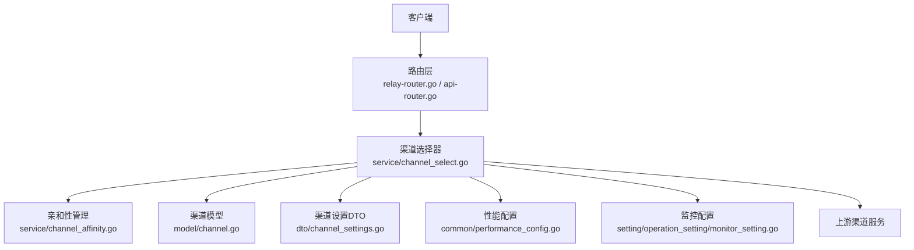
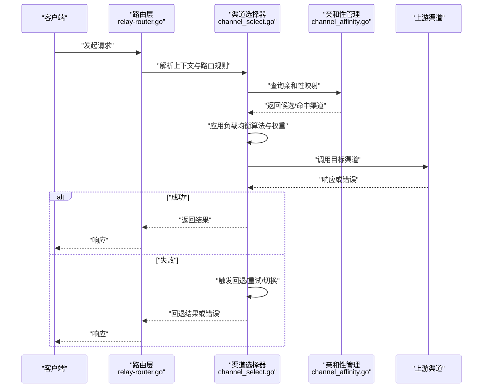
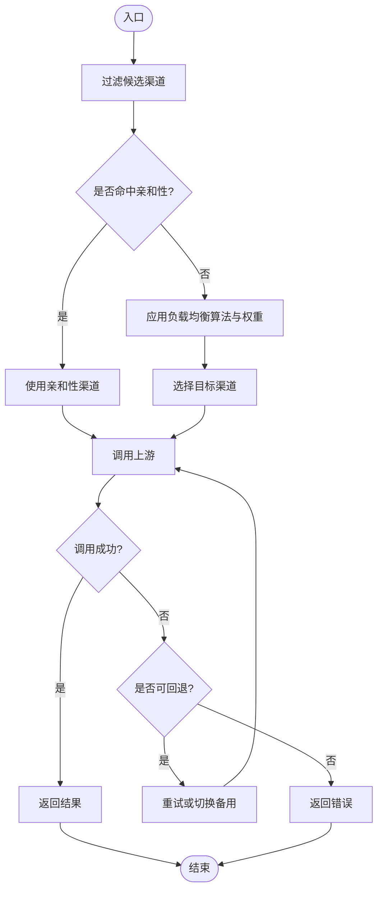
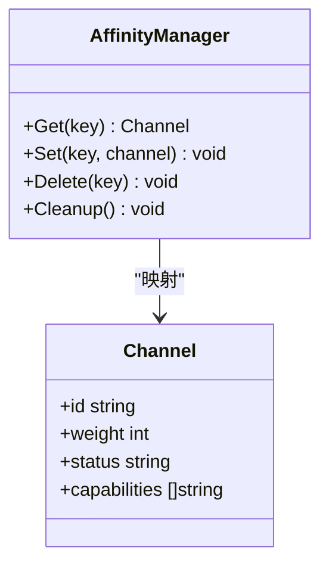
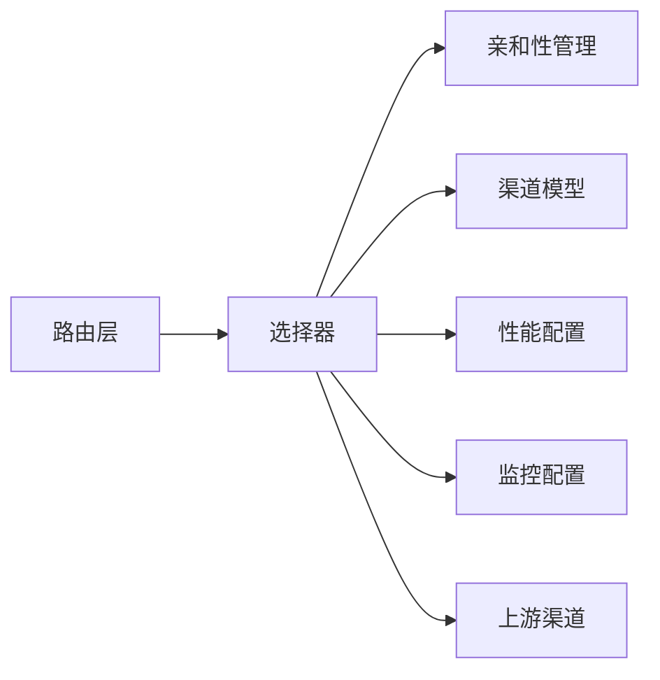

# 渠道路由配置

<cite>
**本文引用的文件**   
- [channel_select.go](file://service/channel_select.go)
- [channel_affinity.go](file://service/channel_affinity.go)
- [channel_affinity_setting.go](file://setting/operation_setting/channel_affinity_setting.go)
- [channel_router_test.go](file://router/channel_router_test.go)
- [relay-router.go](file://router/relay-router.go)
- [api-router.go](file://router/api-router.go)
- [channel.go](file://model/channel.go)
- [channel_settings.go](file://dto/channel_settings.go)
- [performance_config.go](file://common/performance_config.go)
- [monitor_setting.go](file://setting/operation_setting/monitor_setting.go)
</cite>

## 目录
1. [简介](#简介)
2. [项目结构](#项目结构)
3. [核心组件](#核心组件)
4. [架构总览](#架构总览)
5. [详细组件分析](#详细组件分析)
6. [依赖关系分析](#依赖关系分析)
7. [性能考量](#性能考量)
8. [故障排查指南](#故障排查指南)
9. [结论](#结论)
10. [附录](#附录)

## 简介
本文件面向“渠道路由配置”的完整说明，聚焦以下目标：
- 渠道选择策略：如何按模型、用户、租户等维度选择上游渠道。
- 负载均衡算法：支持权重、轮询、一致性哈希等策略的配置与执行。
- 故障转移机制：失败重试、回退策略、亲和性切换与降级路径。
- 路由规则语法与优先级：规则定义、匹配顺序、执行流程。
- 测试、监控与性能调优：如何验证路由行为、观测指标并优化延迟与吞吐。

## 项目结构
与渠道路由相关的代码主要分布在以下模块：
- service/channel_select.go：渠道选择与负载均衡的核心实现。
- service/channel_affinity.go：亲和性（粘性）路由与缓存。
- setting/operation_setting/channel_affinity_setting.go：亲和性相关配置项。
- router/relay-router.go 与 api-router.go：请求进入路由层，转发到渠道处理逻辑。
- model/channel.go：渠道模型定义（包含权重、状态、能力等）。
- dto/channel_settings.go：渠道设置的数据传输对象（用于前端/控制台配置）。
- common/performance_config.go：性能相关配置（超时、并发、连接池等）。
- setting/operation_setting/monitor_setting.go：监控与告警配置。

**图示来源** 
- [relay-router.go](file://router/relay-router.go)
- [api-router.go](file://router/api-router.go)
- [channel_select.go](file://service/channel_select.go)
- [channel_affinity.go](file://service/channel_affinity.go)
- [channel.go](file://model/channel.go)
- [channel_settings.go](file://dto/channel_settings.go)
- [performance_config.go](file://common/performance_config.go)
- [monitor_setting.go](file://setting/operation_setting/monitor_setting.go)

**章节来源**
- [relay-router.go](file://router/relay-router.go)
- [api-router.go](file://router/api-router.go)
- [channel_select.go](file://service/channel_select.go)
- [channel_affinity.go](file://service/channel_affinity.go)
- [channel.go](file://model/channel.go)
- [channel_settings.go](file://dto/channel_settings.go)
- [performance_config.go](file://common/performance_config.go)
- [monitor_setting.go](file://setting/operation_setting/monitor_setting.go)

## 核心组件
- 渠道选择器（Channel Selector）
  - 职责：根据请求上下文（模型、用户、租户、地域等）与渠道能力、权重、健康状态，计算候选集并选择具体渠道。
  - 关键能力：权重分配、亲和性优先、负载均衡算法选择、失败回退。
- 亲和性管理（Affinity Manager）
  - 职责：维护用户/会话到渠道的绑定关系，提升命中率与稳定性；支持失效与迁移。
- 渠道模型（Channel Model）
  - 职责：描述渠道元数据（名称、地址、密钥）、能力（支持的模型/协议）、权重、状态、配额与限制。
- 渠道设置（Channel Settings DTO）
  - 职责：承载控制台/配置文件中的渠道参数，供选择器读取与校验。
- 性能与监控配置
  - 职责：控制超时、并发、连接池大小、采样率、指标上报频率等。

**章节来源**
- [channel_select.go](file://service/channel_select.go)
- [channel_affinity.go](file://service/channel_affinity.go)
- [channel.go](file://model/channel.go)
- [channel_settings.go](file://dto/channel_settings.go)
- [performance_config.go](file://common/performance_config.go)
- [monitor_setting.go](file://setting/operation_setting/monitor_setting.go)

## 架构总览
请求从路由层进入后，经渠道选择器进行决策，结合亲和性与负载均衡策略选出目标渠道，再调用上游服务。失败时触发回退或切换至备用渠道。

**图示来源** 
- [relay-router.go](file://router/relay-router.go)
- [channel_select.go](file://service/channel_select.go)
- [channel_affinity.go](file://service/channel_affinity.go)

## 详细组件分析

### 渠道选择器（Channel Selector）
- 功能要点
  - 候选集构建：基于模型能力、渠道状态、配额与限制过滤。
  - 权重分配：为每个候选渠道分配权重，影响选择概率。
  - 负载均衡算法：支持轮询、加权随机、一致性哈希等。
  - 亲和性优先：若存在有效亲和性映射且渠道可用，则优先命中。
  - 回退策略：主选失败时，按预设顺序尝试备用渠道。
- 执行流程
  - 输入：请求上下文（模型、用户、租户、地域等）、路由规则、渠道集合。
  - 步骤：
    1) 过滤不可用/无能力的渠道。
    2) 检查亲和性映射，命中则直接选择。
    3) 若无命中，按算法与权重选择。
    4) 调用上游，失败则按回退策略重试或切换。
- 复杂度与性能
  - 候选过滤与排序通常为 O(n log n)，n 为候选渠道数。
  - 亲和性查找为 O(1) 或 O(log n)（取决于实现）。
  - 建议对热点模型/用户启用亲和性缓存以降低开销。

**图示来源** 
- [channel_select.go](file://service/channel_select.go)

**章节来源**
- [channel_select.go](file://service/channel_select.go)

### 亲和性管理（Affinity Manager）
- 功能要点
  - 维护用户/会话到渠道的映射，提高稳定性与命中率。
  - 支持过期、失效与迁移，避免单点过载。
  - 与选择器协作：优先命中亲和性，失败时回退到普通选择。
- 数据结构
  - 键：用户ID、会话ID、租户ID等。
  - 值：渠道ID、创建时间、过期时间、状态。
- 性能考虑
  - 使用内存缓存或分布式缓存（如 Redis）存储映射。
  - 定期清理过期条目，避免内存泄漏。

**图示来源** 
- [channel_affinity.go](file://service/channel_affinity.go)
- [channel.go](file://model/channel.go)

**章节来源**
- [channel_affinity.go](file://service/channel_affinity.go)
- [channel.go](file://model/channel.go)

### 亲和性配置（Affinity Setting）
- 配置项
  - 是否启用亲和性。
  - 亲和性键（用户ID、会话ID、租户ID等）。
  - 过期时间与清理策略。
  - 回退策略（亲和性失效时的行为）。
- 优先级
  - 路由规则 > 亲和性配置 > 默认策略。
- 示例场景
  - 同一用户多次请求命中同一渠道，降低握手成本。
  - 多租户隔离，确保租户内稳定路由。

**章节来源**
- [channel_affinity_setting.go](file://setting/operation_setting/channel_affinity_setting.go)

### 路由层与测试
- 路由层
  - relay-router.go 与 api-router.go 负责将请求分发到渠道处理逻辑。
  - 支持按路径、方法、头部等条件进行路由。
- 测试
  - channel_router_test.go 提供路由行为的单元测试与集成测试用例。
  - 建议覆盖：正常路由、失败回退、亲和性命中/失效、权重变化。

**章节来源**
- [relay-router.go](file://router/relay-router.go)
- [api-router.go](file://router/api-router.go)
- [channel_router_test.go](file://router/channel_router_test.go)

## 依赖关系分析
- 组件耦合
  - 路由层依赖选择器；选择器依赖亲和性管理与渠道模型。
  - 选择器依赖性能与监控配置以控制行为与观测。
- 外部依赖
  - 上游渠道服务（HTTP/gRPC等）。
  - 缓存系统（可选，用于亲和性映射）。
- 潜在循环依赖
  - 通过接口解耦，避免选择器与亲和性管理之间的直接循环。

**图示来源** 
- [relay-router.go](file://router/relay-router.go)
- [channel_select.go](file://service/channel_select.go)
- [channel_affinity.go](file://service/channel_affinity.go)
- [channel.go](file://model/channel.go)
- [performance_config.go](file://common/performance_config.go)
- [monitor_setting.go](file://setting/operation_setting/monitor_setting.go)

**章节来源**
- [relay-router.go](file://router/relay-router.go)
- [channel_select.go](file://service/channel_select.go)
- [channel_affinity.go](file://service/channel_affinity.go)
- [channel.go](file://model/channel.go)
- [performance_config.go](file://common/performance_config.go)
- [monitor_setting.go](file://setting/operation_setting/monitor_setting.go)

## 性能考量
- 超时与重试
  - 合理设置上游超时与重试次数，避免雪崩。
- 并发与连接池
  - 调整并发度与连接池大小，平衡资源占用与吞吐。
- 缓存与亲和性
  - 启用亲和性减少握手与鉴权开销。
- 指标与采样
  - 开启关键指标（延迟、错误率、QPS），合理采样避免开销过大。

[本节为通用指导，不直接分析具体文件]

## 故障排查指南
- 常见问题
  - 亲和性未命中：检查键生成与缓存有效性。
  - 权重不生效：确认渠道权重更新与选择器刷新。
  - 回退未触发：检查失败判定条件与回退策略配置。
- 诊断步骤
  - 查看日志与指标，定位失败环节。
  - 使用测试用例模拟异常，验证回退路径。
  - 逐步放宽限制，缩小问题范围。

**章节来源**
- [channel_router_test.go](file://router/channel_router_test.go)

## 结论
通过合理的渠道选择策略、负载均衡算法与故障转移机制，可实现高可用、低延迟的渠道路由。亲和性进一步提升稳定性与效率。配合完善的测试、监控与性能调优，可保障生产环境的可靠性与可扩展性。

[本节为总结，不直接分析具体文件]

## 附录
- 配置语法建议
  - 使用结构化配置（JSON/YAML），明确字段类型与默认值。
  - 版本化配置，支持热更新与回滚。
- 最佳实践
  - 小步快跑：逐步调整权重与策略，观察效果。
  - 灰度发布：新策略先在小流量验证。
  - 监控先行：上线前确保关键指标可见。

[本节为补充内容，不直接分析具体文件]