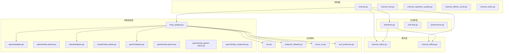
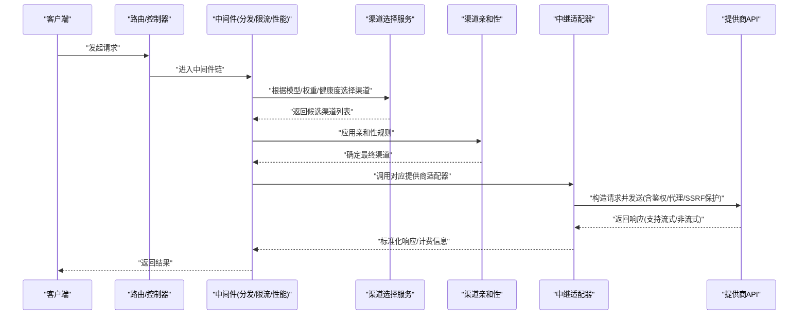
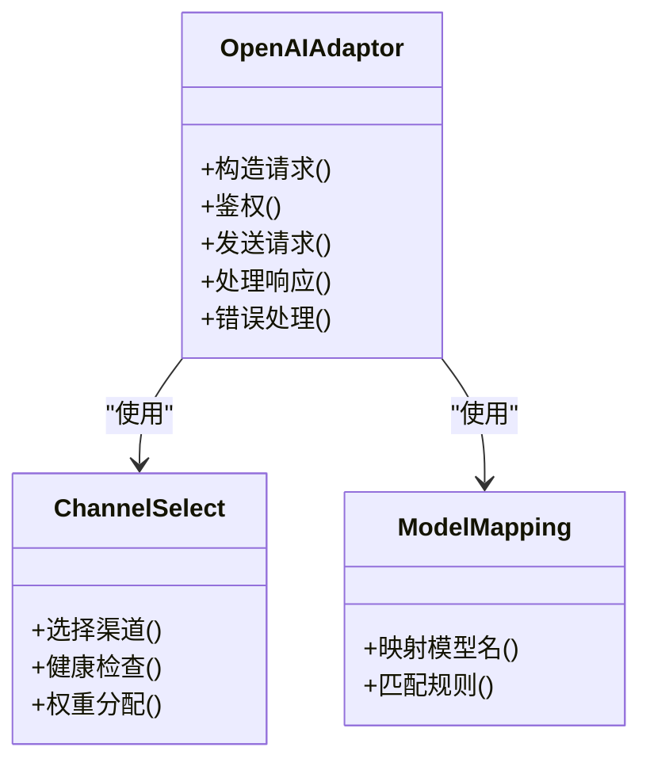
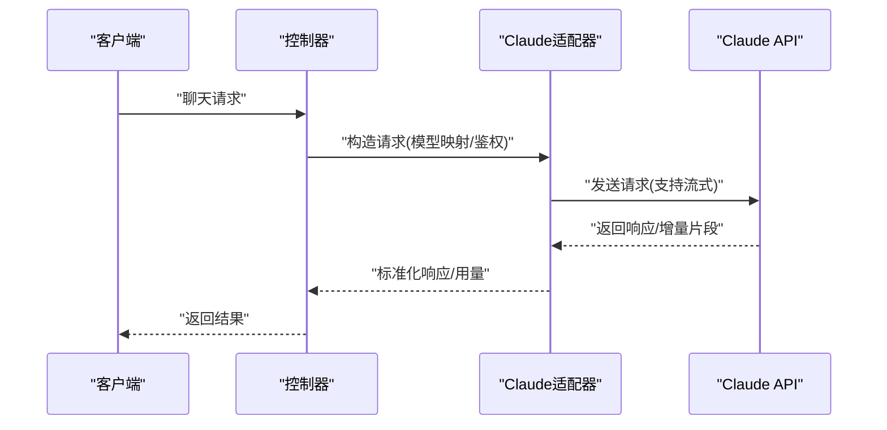
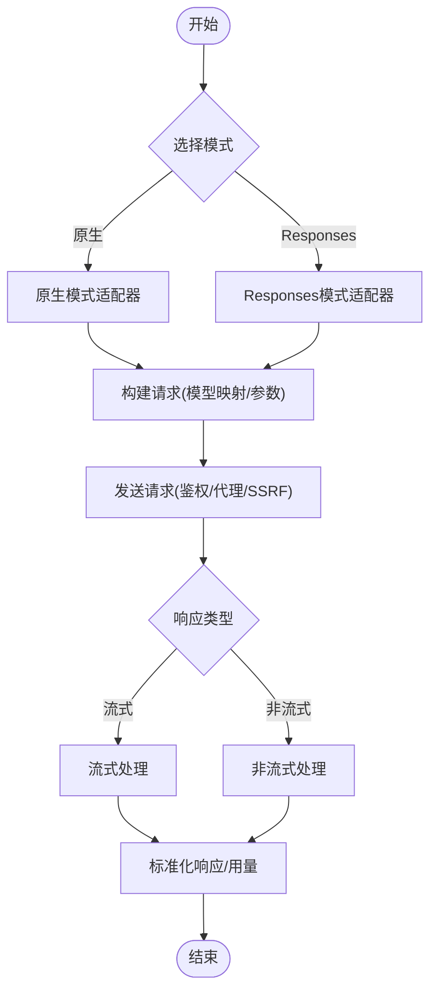
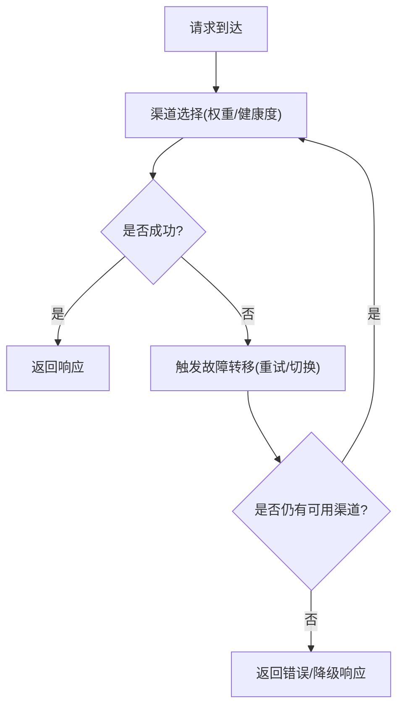
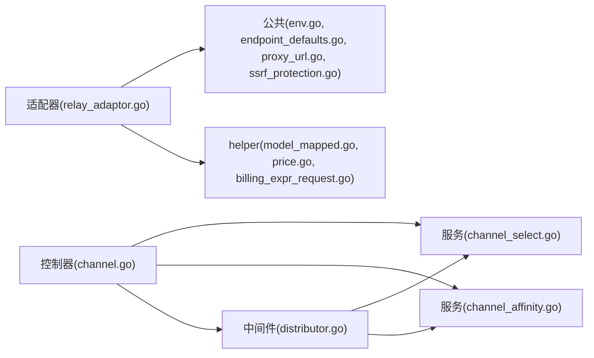

# 渠道配置

<cite>
**本文引用的文件**   
- [main.go](file://main.go)
- [channel.go](file://controller/channel.go)
- [channel_test.go](file://controller/channel-test.go)
- [channel_upstream_update.go](file://controller/channel_upstream_update.go)
- [channel_affinity_cache.go](file://controller/channel_affinity_cache.go)
- [channel_authz.go](file://controller/channel_authz.go)
- [relay_adaptor.go](file://relay/relay_adaptor.go)
- [api_request.go](file://relay/channel/api_request.go)
- [adaptor.go](file://relay/channel/openai/adaptor.go)
- [relay-openai.go](file://relay/channel/openai/relay-openai.go)
- [adaptor.go](file://relay/channel/claude/adaptor.go)
- [relay-claude.go](file://relay/channel/claude/relay-claude.go)
- [adaptor.go](file://relay/channel/gemini/adaptor.go)
- [relay-gemini.go](file://relay/channel/gemini/relay-gemini.go)
- [relay-gemini-native.go](file://relay/channel/gemini/relay-gemini-native.go)
- [relay_responses.go](file://relay/channel/gemini/relay_responses.go)
- [model_mapped.go](file://relay/helper/model_mapped.go)
- [price.go](file://relay/helper/price.go)
- [billing_expr_request.go](file://relay/helper/billing_expr_request.go)
- [channel_settings.go](file://dto/channel_settings.go)
- [channel.go](file://model/channel.go)
- [channel_satisfy.go](file://model/channel_satisfy.go)
- [channel_select.go](file://service/channel_select.go)
- [channel_affinity.go](file://service/channel_affinity.go)
- [distributor.go](file://middleware/distributor.go)
- [rate-limit.go](file://middleware/rate-limit.go)
- [performance.go](file://middleware/performance.go)
- [env.go](file://common/env.go)
- [endpoint_defaults.go](file://common/endpoint_defaults.go)
- [proxy_url.go](file://common/proxy_url.go)
- [ssrf_protection.go](file://common/ssrf_protection.go)
- [go.mod](file://go.mod)
</cite>

## 目录
1. [简介](#简介)
2. [项目结构](#项目结构)
3. [核心组件](#核心组件)
4. [架构总览](#架构总览)
5. [详细组件分析](#详细组件分析)
6. [依赖关系分析](#依赖关系分析)
7. [性能考量](#性能考量)
8. [故障排查指南](#故障排查指南)
9. [结论](#结论)
10. [附录](#附录)

## 简介
本文件面向“渠道配置系统”，系统性说明如何为不同AI服务提供商（OpenAI、Claude、Gemini等）完成渠道配置，包括API密钥设置、模型映射、请求参数与响应处理。文档同时覆盖认证、负载均衡、故障转移等高级能力，并给出渠道测试、调试与性能优化的最佳实践。所有示例均来自代码库中的实际实现位置，便于读者快速定位源码进行验证与扩展。

## 项目结构
本项目采用分层与按功能域组织相结合的结构：
- 控制器层：提供渠道管理、测试、鉴权、上游更新等HTTP接口
- 中继适配层：针对各提供商的适配器与转发逻辑
- 服务层：渠道选择、亲和性、计费、配额、任务调度等
- 中间件层：分发、限流、性能统计、安全校验等
- 公共模块：环境变量、端点默认值、代理URL、SSRF防护等
- DTO/Model：渠道设置、渠道实体、满足条件等数据模型

图表来源
- [channel.go](file://controller/channel.go)
- [relay_adaptor.go](file://relay/relay_adaptor.go)
- [adaptor.go](file://relay/channel/openai/adaptor.go)
- [relay-openai.go](file://relay/channel/openai/relay-openai.go)
- [adaptor.go](file://relay/channel/claude/adaptor.go)
- [relay-claude.go](file://relay/channel/claude/relay-claude.go)
- [adaptor.go](file://relay/channel/gemini/adaptor.go)
- [relay-gemini.go](file://relay/channel/gemini/relay-gemini.go)
- [relay-gemini-native.go](file://relay/channel/gemini/relay-gemini-native.go)
- [relay_responses.go](file://relay/channel/gemini/relay_responses.go)
- [channel_select.go](file://service/channel_select.go)
- [channel_affinity.go](file://service/channel_affinity.go)
- [distributor.go](file://middleware/distributor.go)
- [rate-limit.go](file://middleware/rate-limit.go)
- [performance.go](file://middleware/performance.go)
- [env.go](file://common/env.go)
- [endpoint_defaults.go](file://common/endpoint_defaults.go)
- [proxy_url.go](file://common/proxy_url.go)
- [ssrf_protection.go](file://common/ssrf_protection.go)

章节来源
- [main.go](file://main.go)
- [go.mod](file://go.mod)

## 核心组件
- 渠道管理与测试
  - 渠道CRUD、状态检查、连通性测试、批量更新与缓存刷新
  - 参考路径：[channel.go](file://controller/channel.go)、[channel_test.go](file://controller/channel-test.go)、[channel_upstream_update.go](file://controller/channel_upstream_update.go)、[channel_affinity_cache.go](file://controller/channel_affinity_cache.go)
- 渠道选择与亲和性
  - 基于权重、健康度、亲和规则的选择策略，支持多键模式与故障转移
  - 参考路径：[channel_select.go](file://service/channel_select.go)、[channel_affinity.go](file://service/channel_affinity.go)
- 中继适配器
  - 统一抽象与各提供商具体实现（OpenAI、Claude、Gemini等），负责请求转换、鉴权、流式与非流式响应处理
  - 参考路径：[relay_adaptor.go](file://relay/relay_adaptor.go)、[adaptor.go](file://relay/channel/openai/adaptor.go)、[relay-openai.go](file://relay/channel/openai/relay-openai.go)、[adaptor.go](file://relay/channel/claude/adaptor.go)、[relay-claude.go](file://relay/channel/claude/relay-claude.go)、[adaptor.go](file://relay/channel/gemini/adaptor.go)、[relay-gemini.go](file://relay/channel/gemini/relay-gemini.go)、[relay-gemini-native.go](file://relay/channel/gemini/relay-gemini-native.go)、[relay_responses.go](file://relay/channel/gemini/relay_responses.go)
- 计费与模型映射
  - 模型映射、价格计算、计费表达式解析
  - 参考路径：[model_mapped.go](file://relay/helper/model_mapped.go)、[price.go](file://relay/helper/price.go)、[billing_expr_request.go](file://relay/helper/billing_expr_request.go)
- 渠道设置与数据模型
  - 渠道设置项、渠道实体、满足条件
  - 参考路径：[channel_settings.go](file://dto/channel_settings.go)、[channel.go](file://model/channel.go)、[channel_satisfy.go](file://model/channel_satisfy.go)
- 中间件与安全
  - 分发器、限流、性能统计、代理URL、SSRF防护
  - 参考路径：[distributor.go](file://middleware/distributor.go)、[rate-limit.go](file://middleware/rate-limit.go)、[performance.go](file://middleware/performance.go)、[proxy_url.go](file://common/proxy_url.go)、[ssrf_protection.go](file://common/ssrf_protection.go)
- 环境变量与端点默认值
  - 全局环境变量、端点默认值配置
  - 参考路径：[env.go](file://common/env.go)、[endpoint_defaults.go](file://common/endpoint_defaults.go)

章节来源
- [channel.go](file://controller/channel.go)
- [channel_test.go](file://controller/channel-test.go)
- [channel_upstream_update.go](file://controller/channel_upstream_update.go)
- [channel_affinity_cache.go](file://controller/channel_affinity_cache.go)
- [channel_select.go](file://service/channel_select.go)
- [channel_affinity.go](file://service/channel_affinity.go)
- [relay_adaptor.go](file://relay/relay_adaptor.go)
- [adaptor.go](file://relay/channel/openai/adaptor.go)
- [relay-openai.go](file://relay/channel/openai/relay-openai.go)
- [adaptor.go](file://relay/channel/claude/adaptor.go)
- [relay-claude.go](file://relay/channel/claude/relay-claude.go)
- [adaptor.go](file://relay/channel/gemini/adaptor.go)
- [relay-gemini.go](file://relay/channel/gemini/relay-gemini.go)
- [relay-gemini-native.go](file://relay/channel/gemini/relay-gemini-native.go)
- [relay_responses.go](file://relay/channel/gemini/relay_responses.go)
- [model_mapped.go](file://relay/helper/model_mapped.go)
- [price.go](file://relay/helper/price.go)
- [billing_expr_request.go](file://relay/helper/billing_expr_request.go)
- [channel_settings.go](file://dto/channel_settings.go)
- [channel.go](file://model/channel.go)
- [channel_satisfy.go](file://model/channel_satisfy.go)
- [distributor.go](file://middleware/distributor.go)
- [rate-limit.go](file://middleware/rate-limit.go)
- [performance.go](file://middleware/performance.go)
- [proxy_url.go](file://common/proxy_url.go)
- [ssrf_protection.go](file://common/ssrf_protection.go)
- [env.go](file://common/env.go)
- [endpoint_defaults.go](file://common/endpoint_defaults.go)

## 架构总览
下图展示了从请求进入、渠道选择、适配器转发到响应返回的整体流程，以及关键中间件与服务组件的交互。

图表来源
- [channel.go](file://controller/channel.go)
- [distributor.go](file://middleware/distributor.go)
- [channel_select.go](file://service/channel_select.go)
- [channel_affinity.go](file://service/channel_affinity.go)
- [relay_adaptor.go](file://relay/relay_adaptor.go)
- [adaptor.go](file://relay/channel/openai/adaptor.go)
- [relay-openai.go](file://relay/channel/openai/relay-openai.go)
- [adaptor.go](file://relay/channel/claude/adaptor.go)
- [relay-claude.go](file://relay/channel/claude/relay-claude.go)
- [adaptor.go](file://relay/channel/gemini/adaptor.go)
- [relay-gemini.go](file://relay/channel/gemini/relay-gemini.go)
- [relay-gemini-native.go](file://relay/channel/gemini/relay-gemini-native.go)
- [relay_responses.go](file://relay/channel/gemini/relay_responses.go)

## 详细组件分析

### OpenAI 渠道配置
- API密钥设置
  - 通过渠道设置项配置密钥，支持多键模式；密钥在请求时注入到头部或查询参数中
  - 参考路径：[channel_settings.go](file://dto/channel_settings.go)、[adaptor.go](file://relay/channel/openai/adaptor.go)
- 模型映射
  - 将内部模型名映射到OpenAI模型名，支持通配与后缀匹配
  - 参考路径：[model_mapped.go](file://relay/helper/model_mapped.go)
- 请求参数与响应处理
  - 支持聊天补全、图像生成、音频、实时等场景；适配器负责参数转换与响应标准化
  - 参考路径：[relay-openai.go](file://relay/channel/openai/relay-openai.go)、[adaptor.go](file://relay/channel/openai/adaptor.go)
- 鉴权与连接
  - 鉴权头构造、代理URL、超时、重试、SSRF防护
  - 参考路径：[proxy_url.go](file://common/proxy_url.go)、[ssrf_protection.go](file://common/ssrf_protection.go)、[endpoint_defaults.go](file://common/endpoint_defaults.go)

图表来源
- [adaptor.go](file://relay/channel/openai/adaptor.go)
- [relay-openai.go](file://relay/channel/openai/relay-openai.go)
- [channel_select.go](file://service/channel_select.go)
- [model_mapped.go](file://relay/helper/model_mapped.go)

章节来源
- [adaptor.go](file://relay/channel/openai/adaptor.go)
- [relay-openai.go](file://relay/channel/openai/relay-openai.go)
- [model_mapped.go](file://relay/helper/model_mapped.go)
- [channel_settings.go](file://dto/channel_settings.go)
- [proxy_url.go](file://common/proxy_url.go)
- [ssrf_protection.go](file://common/ssrf_protection.go)
- [endpoint_defaults.go](file://common/endpoint_defaults.go)

### Claude 渠道配置
- API密钥设置
  - 通过渠道设置项配置密钥；适配器在请求头中注入鉴权信息
  - 参考路径：[channel_settings.go](file://dto/channel_settings.go)、[adaptor.go](file://relay/channel/claude/adaptor.go)
- 模型映射
  - 内部模型名到Claude模型的映射，支持版本后缀
  - 参考路径：[model_mapped.go](file://relay/helper/model_mapped.go)
- 请求参数与响应处理
  - 消息格式转换、流式输出、用量统计
  - 参考路径：[relay-claude.go](file://relay/channel/claude/relay-claude.go)、[adaptor.go](file://relay/channel/claude/adaptor.go)
- 鉴权与连接
  - 鉴权头、代理、超时、重试、SSRF防护
  - 参考路径：[proxy_url.go](file://common/proxy_url.go)、[ssrf_protection.go](file://common/ssrf_protection.go)、[endpoint_defaults.go](file://common/endpoint_defaults.go)

图表来源
- [relay-claude.go](file://relay/channel/claude/relay-claude.go)
- [adaptor.go](file://relay/channel/claude/adaptor.go)
- [model_mapped.go](file://relay/helper/model_mapped.go)

章节来源
- [adaptor.go](file://relay/channel/claude/adaptor.go)
- [relay-claude.go](file://relay/channel/claude/relay-claude.go)
- [model_mapped.go](file://relay/helper/model_mapped.go)
- [channel_settings.go](file://dto/channel_settings.go)
- [proxy_url.go](file://common/proxy_url.go)
- [ssrf_protection.go](file://common/ssrf_protection.go)
- [endpoint_defaults.go](file://common/endpoint_defaults.go)

### Gemini 渠道配置
- API密钥设置
  - 通过渠道设置项配置密钥；适配器支持多种鉴权方式（如查询参数或头部）
  - 参考路径：[channel_settings.go](file://dto/channel_settings.go)、[adaptor.go](file://relay/channel/gemini/adaptor.go)
- 模型映射
  - 内部模型名到Gemini模型的映射，支持不同版本与特性开关
  - 参考路径：[model_mapped.go](file://relay/helper/model_mapped.go)
- 请求参数与响应处理
  - 原生与Responses两种模式的适配；支持流式与非流式响应
  - 参考路径：[relay-gemini.go](file://relay/channel/gemini/relay-gemini.go)、[relay-gemini-native.go](file://relay/channel/gemini/relay-gemini-native.go)、[relay_responses.go](file://relay/channel/gemini/relay_responses.go)
- 鉴权与连接
  - 鉴权头/查询参数、代理、超时、重试、SSRF防护
  - 参考路径：[proxy_url.go](file://common/proxy_url.go)、[ssrf_protection.go](file://common/ssrf_protection.go)、[endpoint_defaults.go](file://common/endpoint_defaults.go)

图表来源
- [adaptor.go](file://relay/channel/gemini/adaptor.go)
- [relay-gemini.go](file://relay/channel/gemini/relay-gemini.go)
- [relay-gemini-native.go](file://relay/channel/gemini/relay-gemini-native.go)
- [relay_responses.go](file://relay/channel/gemini/relay_responses.go)
- [model_mapped.go](file://relay/helper/model_mapped.go)

章节来源
- [adaptor.go](file://relay/channel/gemini/adaptor.go)
- [relay-gemini.go](file://relay/channel/gemini/relay-gemini.go)
- [relay-gemini-native.go](file://relay/channel/gemini/relay-gemini-native.go)
- [relay_responses.go](file://relay/channel/gemini/relay_responses.go)
- [model_mapped.go](file://relay/helper/model_mapped.go)
- [channel_settings.go](file://dto/channel_settings.go)
- [proxy_url.go](file://common/proxy_url.go)
- [ssrf_protection.go](file://common/ssrf_protection.go)
- [endpoint_defaults.go](file://common/endpoint_defaults.go)

### 渠道认证、负载均衡与故障转移
- 认证
  - 渠道设置项包含密钥、令牌、OAuth等；适配器在请求前注入鉴权信息
  - 参考路径：[channel_settings.go](file://dto/channel_settings.go)、各渠道adaptor
- 负载均衡
  - 基于权重、健康度、亲和性的选择策略；支持多键模式与轮询/随机/加权算法
  - 参考路径：[channel_select.go](file://service/channel_select.go)、[channel_affinity.go](file://service/channel_affinity.go)、[distributor.go](file://middleware/distributor.go)
- 故障转移
  - 健康检查失败自动切换；重试机制与降级策略
  - 参考路径：[channel_select.go](file://service/channel_select.go)、[distributor.go](file://middleware/distributor.go)

图表来源
- [channel_select.go](file://service/channel_select.go)
- [channel_affinity.go](file://service/channel_affinity.go)
- [distributor.go](file://middleware/distributor.go)

章节来源
- [channel_settings.go](file://dto/channel_settings.go)
- [channel_select.go](file://service/channel_select.go)
- [channel_affinity.go](file://service/channel_affinity.go)
- [distributor.go](file://middleware/distributor.go)

### 渠道测试、调试与性能优化
- 渠道测试
  - 提供连通性测试、延迟测量、错误码收集；支持批量测试与结果缓存
  - 参考路径：[channel_test.go](file://controller/channel-test.go)、[channel_affinity_cache.go](file://controller/channel_affinity_cache.go)
- 调试
  - 启用性能统计、日志记录、请求追踪；查看渠道健康度与选择原因
  - 参考路径：[performance.go](file://middleware/performance.go)、[channel.go](file://controller/channel.go)
- 性能优化
  - 合理设置超时与重试；使用代理与连接池；开启SSRF防护避免内网泄露
  - 参考路径：[endpoint_defaults.go](file://common/endpoint_defaults.go)、[proxy_url.go](file://common/proxy_url.go)、[ssrf_protection.go](file://common/ssrf_protection.go)

章节来源
- [channel_test.go](file://controller/channel-test.go)
- [channel_affinity_cache.go](file://controller/channel_affinity_cache.go)
- [performance.go](file://middleware/performance.go)
- [channel.go](file://controller/channel.go)
- [endpoint_defaults.go](file://common/endpoint_defaults.go)
- [proxy_url.go](file://common/proxy_url.go)
- [ssrf_protection.go](file://common/ssrf_protection.go)

## 依赖关系分析
- 控制器依赖服务层进行渠道选择与亲和性计算
- 中继适配器依赖公共模块进行鉴权、代理、SSRF防护
- 计费与模型映射依赖helper模块进行价格计算与模型名映射
- 中间件负责分发、限流、性能统计，贯穿整个请求链路

图表来源
- [channel.go](file://controller/channel.go)
- [channel_select.go](file://service/channel_select.go)
- [channel_affinity.go](file://service/channel_affinity.go)
- [distributor.go](file://middleware/distributor.go)
- [relay_adaptor.go](file://relay/relay_adaptor.go)
- [env.go](file://common/env.go)
- [endpoint_defaults.go](file://common/endpoint_defaults.go)
- [proxy_url.go](file://common/proxy_url.go)
- [ssrf_protection.go](file://common/ssrf_protection.go)
- [model_mapped.go](file://relay/helper/model_mapped.go)
- [price.go](file://relay/helper/price.go)
- [billing_expr_request.go](file://relay/helper/billing_expr_request.go)

章节来源
- [channel.go](file://controller/channel.go)
- [channel_select.go](file://service/channel_select.go)
- [channel_affinity.go](file://service/channel_affinity.go)
- [distributor.go](file://middleware/distributor.go)
- [relay_adaptor.go](file://relay/relay_adaptor.go)
- [env.go](file://common/env.go)
- [endpoint_defaults.go](file://common/endpoint_defaults.go)
- [proxy_url.go](file://common/proxy_url.go)
- [ssrf_protection.go](file://common/ssrf_protection.go)
- [model_mapped.go](file://relay/helper/model_mapped.go)
- [price.go](file://relay/helper/price.go)
- [billing_expr_request.go](file://relay/helper/billing_expr_request.go)

## 性能考量
- 连接与超时
  - 合理设置连接超时、请求超时与重试次数，避免雪崩效应
  - 参考路径：[endpoint_defaults.go](file://common/endpoint_defaults.go)
- 限流与配额
  - 使用中间件限流与配额控制，防止过载
  - 参考路径：[rate-limit.go](file://middleware/rate-limit.go)
- 缓存与亲和性
  - 利用亲和性缓存减少热点渠道压力
  - 参考路径：[channel_affinity_cache.go](file://controller/channel_affinity_cache.go)、[channel_affinity.go](file://service/channel_affinity.go)
- 监控与统计
  - 启用性能统计与日志，观察延迟与错误率
  - 参考路径：[performance.go](file://middleware/performance.go)

章节来源
- [endpoint_defaults.go](file://common/endpoint_defaults.go)
- [rate-limit.go](file://middleware/rate-limit.go)
- [channel_affinity_cache.go](file://controller/channel_affinity_cache.go)
- [channel_affinity.go](file://service/channel_affinity.go)
- [performance.go](file://middleware/performance.go)

## 故障排查指南
- 常见问题
  - 鉴权失败：检查渠道设置项中的密钥是否正确，适配器是否正确注入
  - 连接超时：检查代理URL、超时设置、网络连通性
  - SSRF防护：确认目标URL白名单与SSRF规则
  - 参考路径：[channel_settings.go](file://dto/channel_settings.go)、[proxy_url.go](file://common/proxy_url.go)、[ssrf_protection.go](file://common/ssrf_protection.go)
- 调试步骤
  - 启用性能统计与日志，查看渠道健康度与选择原因
  - 使用渠道测试接口进行连通性与延迟测试
  - 参考路径：[performance.go](file://middleware/performance.go)、[channel_test.go](file://controller/channel-test.go)
- 恢复策略
  - 自动故障转移与重试；必要时手动切换渠道或下线问题节点
  - 参考路径：[channel_select.go](file://service/channel_select.go)、[distributor.go](file://middleware/distributor.go)

章节来源
- [channel_settings.go](file://dto/channel_settings.go)
- [proxy_url.go](file://common/proxy_url.go)
- [ssrf_protection.go](file://common/ssrf_protection.go)
- [performance.go](file://middleware/performance.go)
- [channel_test.go](file://controller/channel-test.go)
- [channel_select.go](file://service/channel_select.go)
- [distributor.go](file://middleware/distributor.go)

## 结论
本渠道配置系统通过统一的适配器抽象与灵活的服务层策略，实现了对多家AI服务提供商的统一接入与管理。借助环境变量、端点默认值、代理与SSRF防护等公共能力，系统在保证安全与稳定的前提下，提供了高效的负载均衡与故障转移机制。通过完善的测试、调试与性能优化手段，可确保生产环境的稳定运行。

## 附录
- 环境变量与端点默认值
  - 参考路径：[env.go](file://common/env.go)、[endpoint_defaults.go](file://common/endpoint_defaults.go)
- 渠道设置与数据模型
  - 参考路径：[channel_settings.go](file://dto/channel_settings.go)、[channel.go](file://model/channel.go)、[channel_satisfy.go](file://model/channel_satisfy.go)
- 计费与模型映射
  - 参考路径：[price.go](file://relay/helper/price.go)、[model_mapped.go](file://relay/helper/model_mapped.go)、[billing_expr_request.go](file://relay/helper/billing_expr_request.go)