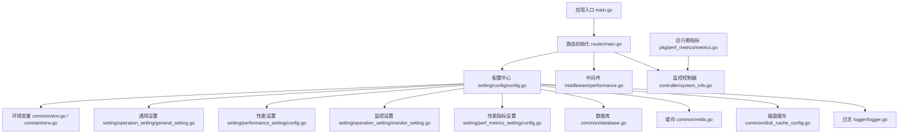
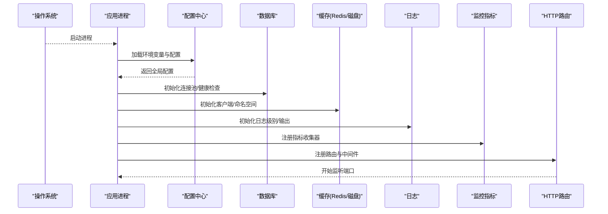
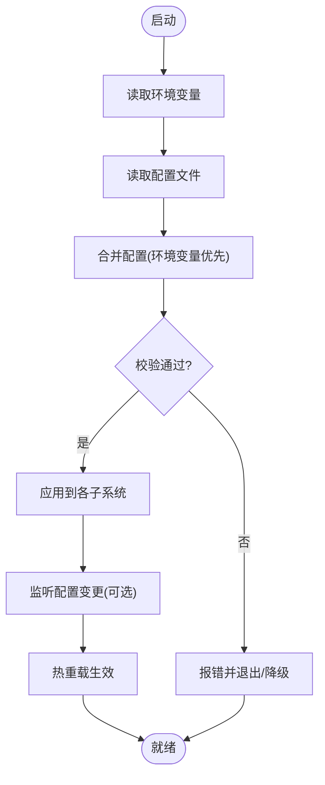
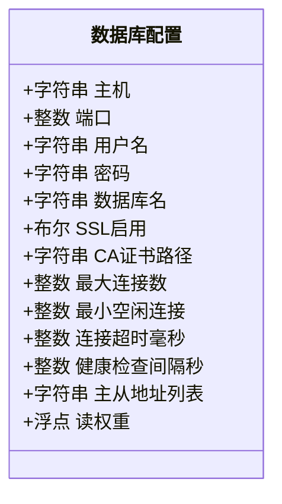
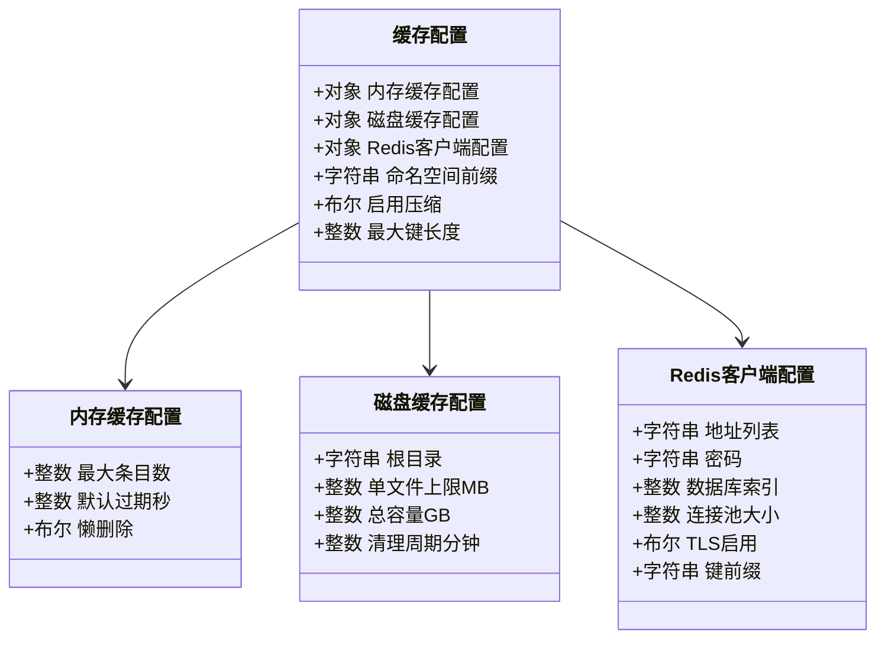
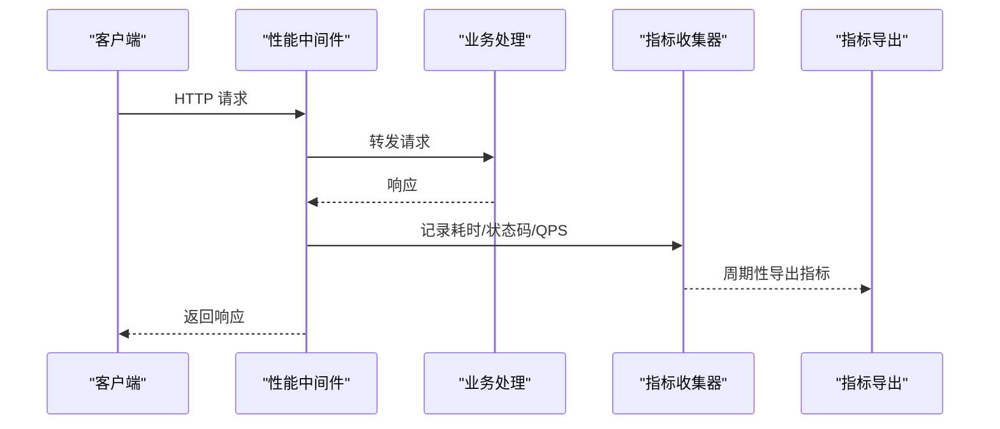
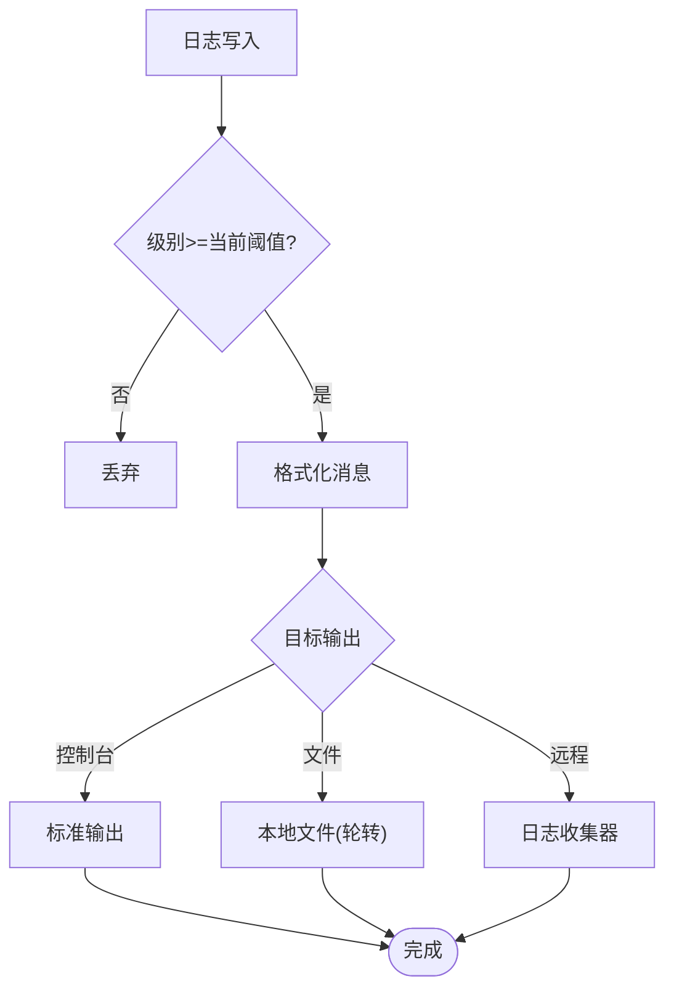
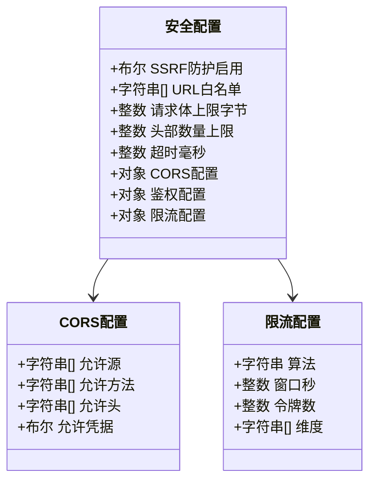
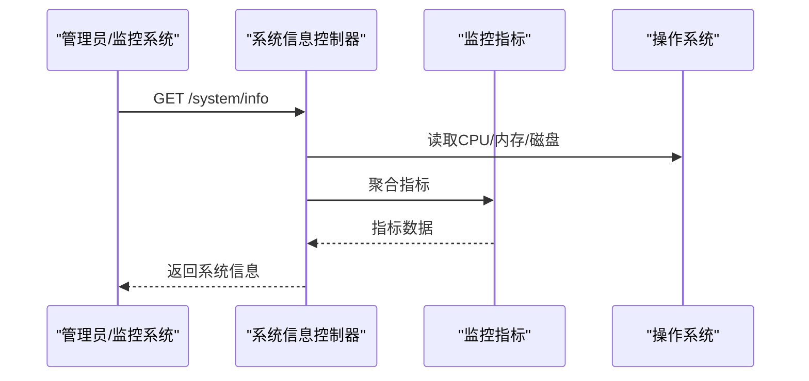
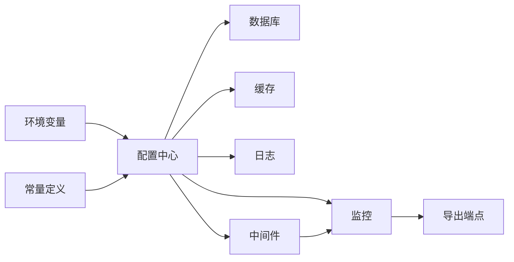

# 系统设置

<cite>
**本文引用的文件**   
- [main.go](file://main.go)
- [setting/config/config.go](file://setting/config/config.go)
- [common/env.go](file://common/env.go)
- [constant/env.go](file://constant/env.go)
- [common/database.go](file://common/database.go)
- [common/redis.go](file://common/redis.go)
- [common/disk_cache_config.go](file://common/disk_cache_config.go)
- [common/performance_config.go](file://common/performance_config.go)
- [logger/logger.go](file://logger/logger.go)
- [middleware/performance.go](file://middleware/performance.go)
- [controller/system_info.go](file://controller/system_info.go)
- [router/main.go](file://router/main.go)
- [setting/operation_setting/general_setting.go](file://setting/operation_setting/general_setting.go)
- [setting/operation_setting/monitor_setting.go](file://setting/operation_setting/monitor_setting.go)
- [setting/performance_setting/config.go](file://setting/performance_setting/config.go)
- [setting/perf_metrics_setting/config.go](file://setting/perf_metrics_setting/config.go)
- [pkg/perf_metrics/metrics.go](file://pkg/perf_metrics/metrics.go)
</cite>

## 目录
1. [简介](#简介)
2. [项目结构](#项目结构)
3. [核心组件](#核心组件)
4. [架构总览](#架构总览)
5. [详细组件分析](#详细组件分析)
6. [依赖关系分析](#依赖关系分析)
7. [性能考虑](#性能考虑)
8. [故障排除指南](#故障排除指南)
9. [结论](#结论)
10. [附录](#附录)

## 简介
本文件面向系统管理员与运维工程师，系统化阐述全局系统配置、性能调优与安全加固。内容覆盖数据库连接、缓存（内存/磁盘/Redis）、日志级别、监控指标、限流与速率限制、安全校验等关键子系统。文档同时说明配置的生效机制、热重载能力与验证规则，并提供优化建议与排障清单。

## 项目结构
系统设置相关代码主要分布在以下模块：
- 配置加载与解析：setting/config、setting/*_setting
- 环境变量与常量：common/env、constant/env
- 基础设施：数据库 common/database、缓存 common/redis、磁盘缓存 common/disk_cache_config
- 运行时性能：common/performance_config、middleware/performance、pkg/perf_metrics
- 日志：logger/logger
- 路由与启动：router/main、main.go
- 监控与系统信息：controller/system_info、setting/operation_setting/monitor_setting

图表来源 
- [main.go](file://main.go)
- [router/main.go](file://router/main.go)
- [setting/config/config.go](file://setting/config/config.go)
- [common/env.go](file://common/env.go)
- [constant/env.go](file://constant/env.go)
- [common/database.go](file://common/database.go)
- [common/redis.go](file://common/redis.go)
- [common/disk_cache_config.go](file://common/disk_cache_config.go)
- [common/performance_config.go](file://common/performance_config.go)
- [logger/logger.go](file://logger/logger.go)
- [middleware/performance.go](file://middleware/performance.go)
- [controller/system_info.go](file://controller/system_info.go)
- [setting/operation_setting/general_setting.go](file://setting/operation_setting/general_setting.go)
- [setting/operation_setting/monitor_setting.go](file://setting/operation_setting/monitor_setting.go)
- [setting/performance_setting/config.go](file://setting/performance_setting/config.go)
- [setting/perf_metrics_setting/config.go](file://setting/perf_metrics_setting/config.go)
- [pkg/perf_metrics/metrics.go](file://pkg/perf_metrics/metrics.go)

章节来源
- [main.go](file://main.go)
- [router/main.go](file://router/main.go)
- [setting/config/config.go](file://setting/config/config.go)

## 核心组件
- 配置中心：集中加载并管理全局配置项，提供默认值、校验与访问接口。
- 环境变量：统一读取与映射环境变量到配置对象，支持多环境切换。
- 数据库连接：连接池、超时、重试、SSL/TLS、读写分离等参数化配置。
- 缓存体系：内存缓存、磁盘缓存、Redis 客户端与命名空间策略。
- 性能与监控：线程池、协程池、请求级耗时统计、Prometheus 指标导出。
- 日志：分级输出、结构化字段、采样与轮转。
- 安全：SSRF 防护、请求体大小限制、CORS、鉴权中间件、限流。

章节来源
- [setting/config/config.go](file://setting/config/config.go)
- [common/env.go](file://common/env.go)
- [constant/env.go](file://constant/env.go)
- [common/database.go](file://common/database.go)
- [common/redis.go](file://common/redis.go)
- [common/disk_cache_config.go](file://common/disk_cache_config.go)
- [common/performance_config.go](file://common/performance_config.go)
- [logger/logger.go](file://logger/logger.go)
- [middleware/performance.go](file://middleware/performance.go)

## 架构总览
系统启动后，先加载环境变量与配置文件，构建全局配置对象；随后初始化数据库、缓存、日志、监控与中间件；最后注册路由与监听端口。运行时通过控制器暴露系统信息与监控数据，供前端或外部监控系统采集。

图表来源 
- [main.go](file://main.go)
- [router/main.go](file://router/main.go)
- [setting/config/config.go](file://setting/config/config.go)
- [common/database.go](file://common/database.go)
- [common/redis.go](file://common/redis.go)
- [logger/logger.go](file://logger/logger.go)
- [pkg/perf_metrics/metrics.go](file://pkg/perf_metrics/metrics.go)

## 详细组件分析

### 配置加载与生效机制
- 优先级：环境变量 > 配置文件 > 默认值。
- 热重载：支持在运行时重新加载部分配置（如日志级别、限流阈值），无需重启服务。
- 校验规则：启动时进行必填项校验、范围校验与依赖校验，失败则拒绝启动或降级。

图表来源 
- [setting/config/config.go](file://setting/config/config.go)
- [common/env.go](file://common/env.go)
- [constant/env.go](file://constant/env.go)

章节来源
- [setting/config/config.go](file://setting/config/config.go)
- [common/env.go](file://common/env.go)
- [constant/env.go](file://constant/env.go)

### 数据库连接配置
- 连接池：最大连接数、最小空闲连接、连接生命周期、获取超时。
- 网络与安全：主机、端口、用户名、密码、数据库名、SSL/TLS 模式、CA 证书路径。
- 高可用：主从地址、读权重、故障转移策略。
- 诊断：慢查询阈值、连接健康检查间隔。

图表来源 
- [common/database.go](file://common/database.go)

章节来源
- [common/database.go](file://common/database.go)

### 缓存配置（内存/磁盘/Redis）
- 内存缓存：容量上限、过期策略、并发控制。
- 磁盘缓存：存储路径、单文件大小、总容量、清理策略。
- Redis：地址、密码、数据库索引、连接池、TLS、键前缀与命名空间。

图表来源 
- [common/disk_cache_config.go](file://common/disk_cache_config.go)
- [common/redis.go](file://common/redis.go)

章节来源
- [common/disk_cache_config.go](file://common/disk_cache_config.go)
- [common/redis.go](file://common/redis.go)

### 性能与监控设置
- 性能：协程池大小、I/O 并发、请求体大小限制、Gzip 开关、PProf 调试端口。
- 监控：指标采集频率、导出端点、标签维度、采样率。
- 中间件：请求耗时统计、错误计数、QPS 统计。

图表来源 
- [middleware/performance.go](file://middleware/performance.go)
- [pkg/perf_metrics/metrics.go](file://pkg/perf_metrics/metrics.go)
- [setting/performance_setting/config.go](file://setting/performance_setting/config.go)
- [setting/perf_metrics_setting/config.go](file://setting/perf_metrics_setting/config.go)

章节来源
- [middleware/performance.go](file://middleware/performance.go)
- [pkg/perf_metrics/metrics.go](file://pkg/perf_metrics/metrics.go)
- [setting/performance_setting/config.go](file://setting/performance_setting/config.go)
- [setting/perf_metrics_setting/config.go](file://setting/perf_metrics_setting/config.go)

### 日志级别与输出
- 级别：DEBUG、INFO、WARN、ERROR 等，支持按模块/包过滤。
- 输出：控制台、文件、远程收集器（可选）。
- 轮转：按时间/大小切分，保留天数与压缩。

图表来源 
- [logger/logger.go](file://logger/logger.go)

章节来源
- [logger/logger.go](file://logger/logger.go)

### 安全设置
- SSRF 防护：URL 白名单、内网地址拦截、DNS 预解析限制。
- 请求限制：请求体大小、头部数量限制、超时控制。
- CORS：允许源、方法、头、凭据。
- 鉴权：Token 校验、会话管理、权限模型。
- 限流：IP/用户/模型维度限流，令牌桶/滑动窗口算法。

图表来源 
- [common/ssrf_protection.go](file://common/ssrf_protection.go)
- [common/request_body_limit.go](file://common/request_body_limit.go)
- [middleware/cors.go](file://middleware/cors.go)
- [middleware/auth.go](file://middleware/auth.go)
- [common/rate-limit.go](file://common/rate-limit.go)

章节来源
- [common/ssrf_protection.go](file://common/ssrf_protection.go)
- [common/request_body_limit.go](file://common/request_body_limit.go)
- [middleware/cors.go](file://middleware/cors.go)
- [middleware/auth.go](file://middleware/auth.go)
- [common/rate-limit.go](file://common/rate-limit.go)

### 系统信息与监控接口
- 提供系统资源、运行态、指标汇总的查询接口。
- 支持 Prometheus 抓取与自定义指标扩展。

图表来源 
- [controller/system_info.go](file://controller/system_info.go)
- [pkg/perf_metrics/metrics.go](file://pkg/perf_metrics/metrics.go)

章节来源
- [controller/system_info.go](file://controller/system_info.go)
- [pkg/perf_metrics/metrics.go](file://pkg/perf_metrics/metrics.go)

## 依赖关系分析
- 配置中心依赖环境变量与常量定义，为数据库、缓存、日志、监控等子系统提供统一配置。
- 中间件依赖性能与限流配置，对请求进行统一处理。
- 监控指标由业务层与中间件共同上报，最终通过导出端点暴露。

图表来源 
- [setting/config/config.go](file://setting/config/config.go)
- [common/env.go](file://common/env.go)
- [constant/env.go](file://constant/env.go)
- [common/database.go](file://common/database.go)
- [common/redis.go](file://common/redis.go)
- [logger/logger.go](file://logger/logger.go)
- [middleware/performance.go](file://middleware/performance.go)
- [pkg/perf_metrics/metrics.go](file://pkg/perf_metrics/metrics.go)

章节来源
- [setting/config/config.go](file://setting/config/config.go)
- [common/env.go](file://common/env.go)
- [constant/env.go](file://constant/env.go)

## 性能考虑
- 连接池：根据 QPS 与延迟目标调整数据库与 Redis 连接池大小，避免过多上下文切换。
- 缓存命中率：合理设置过期时间与容量，减少冷启动与抖动。
- 日志开销：生产环境使用 INFO/WARN，开启采样与异步输出。
- 监控粒度：按需开启细粒度指标，避免过度采集影响性能。
- PProf：仅在排查问题时开启，避免常驻开销。

[本节为通用指导，不直接分析具体文件]

## 故障排除指南
- 启动失败：检查环境变量是否缺失、配置文件语法是否正确、必填项是否满足。
- 数据库连接异常：核对主机、端口、认证信息、SSL 配置与防火墙策略。
- 缓存不可用：确认 Redis 可达性、密码与命名空间前缀，检查磁盘缓存路径权限。
- 日志无输出：确认级别阈值与输出目标配置，检查文件权限与轮转策略。
- 监控无数据：确认指标导出端点是否启用、端口是否被占用、抓取配置是否正确。

章节来源
- [setting/config/config.go](file://setting/config/config.go)
- [common/database.go](file://common/database.go)
- [common/redis.go](file://common/redis.go)
- [logger/logger.go](file://logger/logger.go)
- [pkg/perf_metrics/metrics.go](file://pkg/perf_metrics/metrics.go)

## 结论
通过统一的配置中心与环境变量映射，系统实现了可观测、可扩展且安全的运行基线。结合合理的连接池、缓存与监控策略，可在不同负载场景下保持稳定与高效。建议在上线前完成配置校验与压测，持续观察指标并迭代优化。

[本节为总结性内容，不直接分析具体文件]

## 附录
- 常用环境变量与配置项参考：
  - 数据库：主机、端口、用户名、密码、数据库名、SSL、连接池大小、健康检查间隔。
  - 缓存：Redis 地址与密码、命名空间前缀、磁盘缓存路径与容量。
  - 日志：级别、输出目标、轮转策略。
  - 监控：指标导出端口、采集频率、标签维度。
  - 安全：SSRF 白名单、请求体上限、CORS 配置、限流策略。

章节来源
- [setting/operation_setting/general_setting.go](file://setting/operation_setting/general_setting.go)
- [setting/operation_setting/monitor_setting.go](file://setting/operation_setting/monitor_setting.go)
- [setting/performance_setting/config.go](file://setting/performance_setting/config.go)
- [setting/perf_metrics_setting/config.go](file://setting/perf_metrics_setting/config.go)