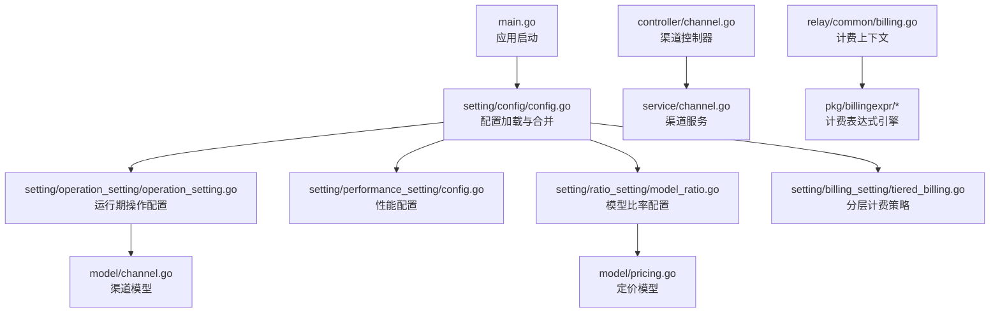
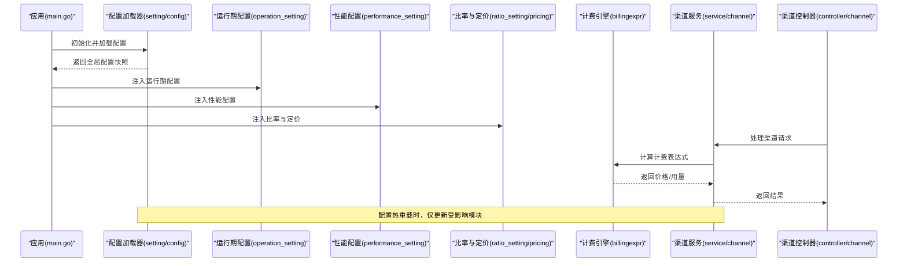
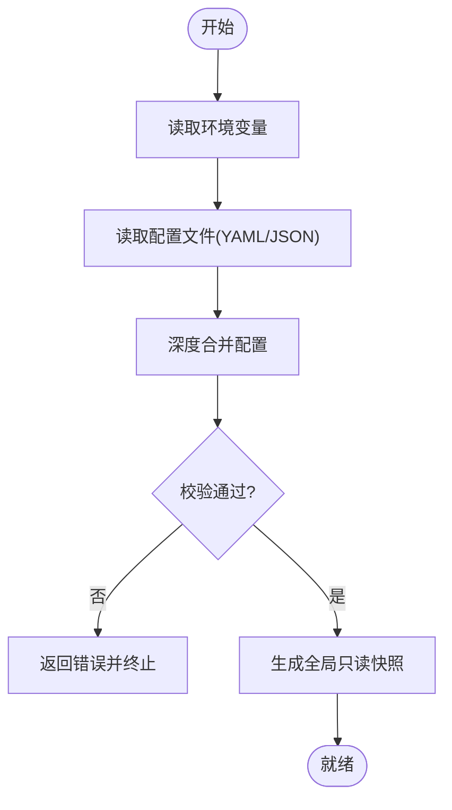
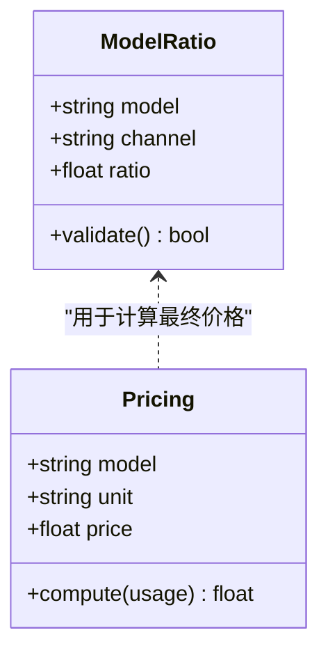
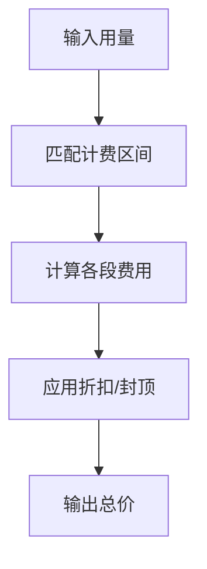
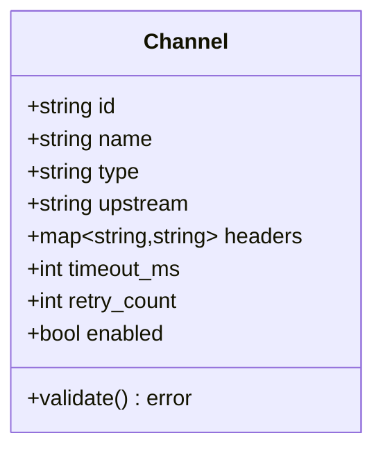
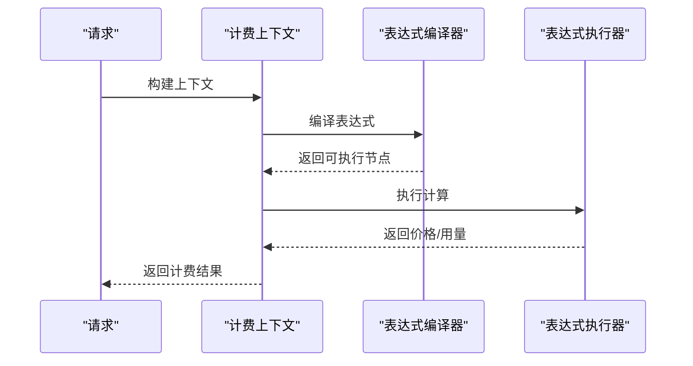
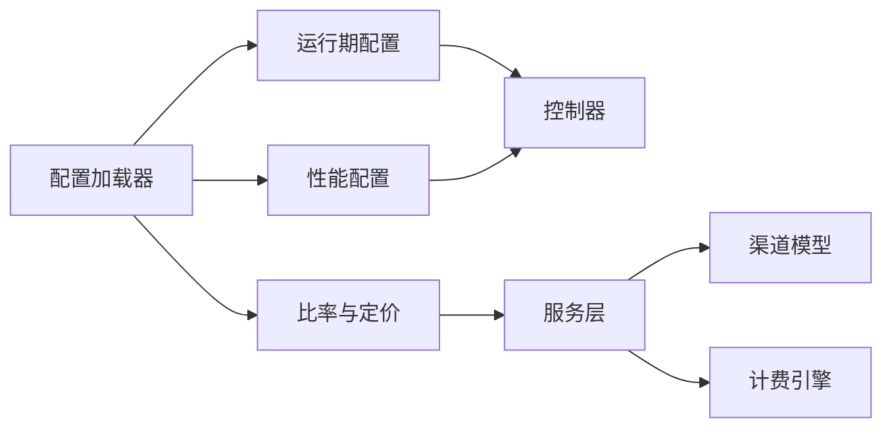

# 配置文件管理

<cite>
**本文引用的文件**   
- [setting/config/config.go](file://setting/config/config.go)
- [setting/operation_setting/operation_setting.go](file://setting/operation_setting/operation_setting.go)
- [setting/performance_setting/config.go](file://setting/performance_setting/config.go)
- [setting/ratio_setting/model_ratio.go](file://setting/ratio_setting/model_ratio.go)
- [setting/billing_setting/tiered_billing.go](file://setting/billing_setting/tiered_billing.go)
- [model/channel.go](file://model/channel.go)
- [model/pricing.go](file://model/pricing.go)
- [controller/channel.go](file://controller/channel.go)
- [service/channel.go](file://service/channel.go)
- [relay/common/billing.go](file://relay/common/billing.go)
- [pkg/billingexpr/types.go](file://pkg/billingexpr/types.go)
- [pkg/billingexpr/compile.go](file://pkg/billingexpr/compile.go)
- [pkg/billingexpr/run.go](file://pkg/billingexpr/run.go)
- [common/env.go](file://common/env.go)
- [main.go](file://main.go)
</cite>

## 目录
1. [简介](#简介)
2. [项目结构](#项目结构)
3. [核心组件](#核心组件)
4. [架构总览](#架构总览)
5. [详细组件分析](#详细组件分析)
6. [依赖关系分析](#依赖关系分析)
7. [性能考量](#性能考量)
8. [故障排查指南](#故障排查指南)
9. [结论](#结论)
10. [附录](#附录)

## 简介
本文件面向“配置文件管理系统”，聚焦 YAML 配置的结构、校验规则与热重载机制，覆盖渠道、模型、计费策略等核心能力。文档基于仓库中的设置模块（setting）、模型层（model）、控制器（controller）与服务层（service），以及计费表达式引擎（billingexpr）进行系统化梳理，帮助读者快速理解配置的加载顺序、合并策略、版本兼容性与最佳实践，并提供常见错误定位方法。

## 项目结构
配置相关代码主要分布在 setting 子包中，按功能域划分：
- 通用配置入口与加载：setting/config
- 运行期操作配置：setting/operation_setting
- 性能指标与监控：setting/performance_setting
- 比率与定价：setting/ratio_setting、model/pricing
- 分层计费策略：setting/billing_setting
- 环境变量与系统级开关：common/env
- 启动流程与初始化：main.go

图表来源
- [main.go](file://main.go)
- [setting/config/config.go](file://setting/config/config.go)
- [setting/operation_setting/operation_setting.go](file://setting/operation_setting/operation_setting.go)
- [setting/performance_setting/config.go](file://setting/performance_setting/config.go)
- [setting/ratio_setting/model_ratio.go](file://setting/ratio_setting/model_ratio.go)
- [setting/billing_setting/tiered_billing.go](file://setting/billing_setting/tiered_billing.go)
- [model/channel.go](file://model/channel.go)
- [model/pricing.go](file://model/pricing.go)
- [controller/channel.go](file://controller/channel.go)
- [service/channel.go](file://service/channel.go)
- [relay/common/billing.go](file://relay/common/billing.go)
- [pkg/billingexpr/types.go](file://pkg/billingexpr/types.go)
- [pkg/billingexpr/compile.go](file://pkg/billingexpr/compile.go)
- [pkg/billingexpr/run.go](file://pkg/billingexpr/run.go)

章节来源
- [setting/config/config.go](file://setting/config/config.go)
- [setting/operation_setting/operation_setting.go](file://setting/operation_setting/operation_setting.go)
- [setting/performance_setting/config.go](file://setting/performance_setting/config.go)
- [setting/ratio_setting/model_ratio.go](file://setting/ratio_setting/model_ratio.go)
- [setting/billing_setting/tiered_billing.go](file://setting/billing_setting/tiered_billing.go)
- [model/channel.go](file://model/channel.go)
- [model/pricing.go](file://model/pricing.go)
- [controller/channel.go](file://controller/channel.go)
- [service/channel.go](file://service/channel.go)
- [relay/common/billing.go](file://relay/common/billing.go)
- [pkg/billingexpr/types.go](file://pkg/billingexpr/types.go)
- [pkg/billingexpr/compile.go](file://pkg/billingexpr/compile.go)
- [pkg/billingexpr/run.go](file://pkg/billingexpr/run.go)
- [common/env.go](file://common/env.go)
- [main.go](file://main.go)

## 核心组件
- 配置加载器（setting/config）：负责读取 YAML/JSON/环境变量等多源配置，执行字段映射、默认值填充、校验与合并，并暴露全局只读视图。
- 运行期操作配置（setting/operation_setting）：提供运行时可切换的开关与阈值，如限流、鉴权、监控采样等。
- 性能配置（setting/performance_setting）：定义缓存、并发、超时、指标采集等性能相关参数。
- 比率与定价（setting/ratio_setting、model/pricing）：维护模型到渠道的映射、汇率与定价策略，支持动态刷新。
- 分层计费（setting/billing_setting）：定义阶梯式计费规则与结算逻辑。
- 计费表达式引擎（pkg/billingexpr）：编译与执行计费表达式，实现灵活的价格计算与折扣策略。
- 渠道模型与服务（model/channel、service/channel、controller/channel）：承载渠道元数据、连接信息与调用路由。

章节来源
- [setting/config/config.go](file://setting/config/config.go)
- [setting/operation_setting/operation_setting.go](file://setting/operation_setting/operation_setting.go)
- [setting/performance_setting/config.go](file://setting/performance_setting/config.go)
- [setting/ratio_setting/model_ratio.go](file://setting/ratio_setting/model_ratio.go)
- [setting/billing_setting/tiered_billing.go](file://setting/billing_setting/tiered_billing.go)
- [model/channel.go](file://model/channel.go)
- [model/pricing.go](file://model/pricing.go)
- [controller/channel.go](file://controller/channel.go)
- [service/channel.go](file://service/channel.go)
- [relay/common/billing.go](file://relay/common/billing.go)
- [pkg/billingexpr/types.go](file://pkg/billingexpr/types.go)
- [pkg/billingexpr/compile.go](file://pkg/billingexpr/compile.go)
- [pkg/billingexpr/run.go](file://pkg/billingexpr/run.go)

## 架构总览
配置系统的整体工作流如下：
- 启动阶段：从多源（YAML/JSON/环境变量/数据库）加载配置，执行校验与合并，生成不可变的全局配置快照。
- 运行阶段：控制器接收请求，通过服务层访问渠道与定价信息；计费引擎根据表达式计算用量与费用。
- 热重载：监听配置变更事件，增量更新受影响模块，保证不中断服务。

图表来源
- [main.go](file://main.go)
- [setting/config/config.go](file://setting/config/config.go)
- [setting/operation_setting/operation_setting.go](file://setting/operation_setting/operation_setting.go)
- [setting/performance_setting/config.go](file://setting/performance_setting/config.go)
- [setting/ratio_setting/model_ratio.go](file://setting/ratio_setting/model_ratio.go)
- [model/pricing.go](file://model/pricing.go)
- [pkg/billingexpr/compile.go](file://pkg/billingexpr/compile.go)
- [pkg/billingexpr/run.go](file://pkg/billingexpr/run.go)
- [service/channel.go](file://service/channel.go)
- [controller/channel.go](file://controller/channel.go)

## 详细组件分析

### 配置加载与合并策略
- 多源优先级：环境变量 > 命令行参数 > 配置文件（YAML/JSON）> 默认值。相同键名以高优先级覆盖低优先级。
- 合并策略：结构化对象采用深度合并，数组通常以高优先级替换；嵌套字段缺失时使用默认值补齐。
- 校验规则：必填字段缺失或类型不匹配将导致加载失败；范围校验（如端口、超时）在加载阶段完成。
- 版本兼容：新增字段具备向后兼容默认值；废弃字段保留兼容路径并在日志中提示迁移建议。

图表来源
- [setting/config/config.go](file://setting/config/config.go)
- [common/env.go](file://common/env.go)

章节来源
- [setting/config/config.go](file://setting/config/config.go)
- [common/env.go](file://common/env.go)

### 运行期操作配置（Operation Setting）
- 作用：在不重启的情况下调整限流、鉴权、审计、监控采样等运行时行为。
- 典型字段：限流阈值、白名单、审计开关、指标采样率、灰度发布比例等。
- 热重载：监听配置变更事件，原子替换引用，确保并发安全。

章节来源
- [setting/operation_setting/operation_setting.go](file://setting/operation_setting/operation_setting.go)

### 性能配置（Performance Setting）
- 作用：控制缓存大小、并发度、超时、重试、指标采集频率等。
- 关键项：HTTP 客户端超时、连接池大小、缓存 TTL、Prometheus 指标导出间隔。
- 影响面：直接影响吞吐、延迟与资源占用，需结合压测调优。

章节来源
- [setting/performance_setting/config.go](file://setting/performance_setting/config.go)

### 比率与定价（Model Ratio & Pricing）
- 比率配置：定义模型到渠道的映射、汇率换算、分组权重。
- 定价模型：支持固定价、按 token 计价、按图像分辨率计价等。
- 刷新机制：支持定时拉取或事件触发更新，避免频繁 IO。

图表来源
- [setting/ratio_setting/model_ratio.go](file://setting/ratio_setting/model_ratio.go)
- [model/pricing.go](file://model/pricing.go)

章节来源
- [setting/ratio_setting/model_ratio.go](file://setting/ratio_setting/model_ratio.go)
- [model/pricing.go](file://model/pricing.go)

### 分层计费策略（Tiered Billing）
- 设计：按用量区间分段计价，支持封顶、折扣、免费额度等。
- 表达式：使用 billingexpr 引擎编译与执行表达式，实现复杂计费逻辑。
- 结算：支持按会话、按用户、按渠道维度结算。

图表来源
- [setting/billing_setting/tiered_billing.go](file://setting/billing_setting/tiered_billing.go)
- [pkg/billingexpr/compile.go](file://pkg/billingexpr/compile.go)
- [pkg/billingexpr/run.go](file://pkg/billingexpr/run.go)

章节来源
- [setting/billing_setting/tiered_billing.go](file://setting/billing_setting/tiered_billing.go)
- [pkg/billingexpr/types.go](file://pkg/billingexpr/types.go)
- [pkg/billingexpr/compile.go](file://pkg/billingexpr/compile.go)
- [pkg/billingexpr/run.go](file://pkg/billingexpr/run.go)

### 渠道配置与验证（Channel）
- 渠道模型：包含名称、类型、上游地址、认证密钥、超时、重试、标签等。
- 验证规则：必填字段校验、URL 格式、密钥长度、协议白名单、SSRF 防护。
- 测试与诊断：提供连通性测试、延迟探测、可用性统计。

图表来源
- [model/channel.go](file://model/channel.go)
- [controller/channel.go](file://controller/channel.go)
- [service/channel.go](file://service/channel.go)

章节来源
- [model/channel.go](file://model/channel.go)
- [controller/channel.go](file://controller/channel.go)
- [service/channel.go](file://service/channel.go)

### 计费上下文与表达式执行（Billing Context & Engine）
- 计费上下文：封装请求元数据、用量、渠道、用户、租户等信息。
- 表达式编译：将 YAML/JSON 中的表达式编译为可执行 AST。
- 执行与缓存：执行表达式并缓存结果，减少重复计算开销。

图表来源
- [relay/common/billing.go](file://relay/common/billing.go)
- [pkg/billingexpr/compile.go](file://pkg/billingexpr/compile.go)
- [pkg/billingexpr/run.go](file://pkg/billingexpr/run.go)

章节来源
- [relay/common/billing.go](file://relay/common/billing.go)
- [pkg/billingexpr/types.go](file://pkg/billingexpr/types.go)
- [pkg/billingexpr/compile.go](file://pkg/billingexpr/compile.go)
- [pkg/billingexpr/run.go](file://pkg/billingexpr/run.go)

## 依赖关系分析
- 配置加载器依赖环境变量解析与文件 IO，产出全局快照供其他模块消费。
- 运行期配置与性能配置被控制器与服务层广泛使用，需保证线程安全与原子更新。
- 渠道模型与定价模型在服务层组合使用，计费引擎作为独立子系统提供可扩展的计算能力。
- 控制器仅做路由与参数校验，业务逻辑下沉至服务层，便于测试与维护。

图表来源
- [setting/config/config.go](file://setting/config/config.go)
- [setting/operation_setting/operation_setting.go](file://setting/operation_setting/operation_setting.go)
- [setting/performance_setting/config.go](file://setting/performance_setting/config.go)
- [setting/ratio_setting/model_ratio.go](file://setting/ratio_setting/model_ratio.go)
- [model/channel.go](file://model/channel.go)
- [relay/common/billing.go](file://relay/common/billing.go)
- [controller/channel.go](file://controller/channel.go)
- [service/channel.go](file://service/channel.go)

章节来源
- [setting/config/config.go](file://setting/config/config.go)
- [setting/operation_setting/operation_setting.go](file://setting/operation_setting/operation_setting.go)
- [setting/performance_setting/config.go](file://setting/performance_setting/config.go)
- [setting/ratio_setting/model_ratio.go](file://setting/ratio_setting/model_ratio.go)
- [model/channel.go](file://model/channel.go)
- [relay/common/billing.go](file://relay/common/billing.go)
- [controller/channel.go](file://controller/channel.go)
- [service/channel.go](file://service/channel.go)

## 性能考量
- 配置加载：建议在启动阶段一次性加载并缓存，避免请求路径上的 IO 与解析开销。
- 热重载：采用原子替换与读写锁保护，减少锁竞争；对热点配置（如限流阈值）使用无锁读取。
- 计费表达式：编译后缓存 AST，执行时避免重复解析；对高频模型建立本地缓存。
- 渠道调用：合理设置超时与重试，启用连接池与 HTTP/2，降低网络抖动影响。

[本节为通用指导，无需特定文件来源]

## 故障排查指南
- 配置加载失败：检查必填字段是否缺失、类型是否匹配、路径是否正确；查看启动日志中的校验错误。
- 热重载无效：确认监听的事件源是否生效；检查模块是否实现了原子更新接口。
- 渠道不可用：验证上游地址、认证密钥、协议白名单；使用通道测试接口定位问题。
- 计费异常：核对表达式语法与变量命名；打印计费上下文与中间结果，定位计算分支。

章节来源
- [setting/config/config.go](file://setting/config/config.go)
- [controller/channel.go](file://controller/channel.go)
- [relay/common/billing.go](file://relay/common/billing.go)

## 结论
本配置文件管理系统通过多源加载、严格校验、深度合并与热重载机制，为渠道、模型、计费策略等核心功能提供了稳定可靠的配置支撑。借助计费表达式引擎，系统具备高度可扩展的定价能力。建议在生产环境遵循最小权限原则、分环境隔离配置、定期演练热重载与回滚流程，以确保系统的高可用与可维护性。

[本节为总结性内容，无需特定文件来源]

## 附录

### 配置选项层级与必填字段（示例说明）
- 渠道配置
  - 必填：id、name、type、upstream、headers（至少包含认证头）
  - 可选：timeout_ms、retry_count、enabled、tags
  - 校验：upstream 必须为合法 URL；headers 键值非空；timeout_ms 为正整数
- 模型比率
  - 必填：model、channel、ratio
  - 可选：group、weight
  - 校验：ratio 为正数；model 与 channel 存在对应关系
- 定价策略
  - 必填：model、unit、price
  - 可选：discount、cap、currency
  - 校验：price 为非负数；unit 为支持的计量单位
- 计费表达式
  - 必填：expression（字符串形式）
  - 可选：variables、functions
  - 校验：表达式语法正确；变量在上下文中可解析

[本节为概念性说明，无需特定文件来源]

### 配置文件模板（结构示意）
- 根节点：version、app、channels、models、pricing、billing、performance、operation
- channels：数组，每项为渠道对象
- models：映射，key 为模型名，值为比率与分组
- pricing：映射，key 为模型名，值为定价对象
- billing：表达式与变量定义
- performance：超时、并发、缓存、指标
- operation：限流、鉴权、审计、监控

[本节为概念性说明，无需特定文件来源]

### 最佳实践
- 将敏感信息（密钥、令牌）放入环境变量或密钥管理服务，不在配置文件中明文存储。
- 使用分环境配置文件（开发、测试、生产），并通过环境变量覆盖差异项。
- 对关键配置变更进行评审与灰度发布，配合健康检查与自动回滚。
- 定期清理废弃字段与过期渠道，保持配置整洁。

[本节为通用指导，无需特定文件来源]

### 常见配置错误与解决方案
- 字段缺失或类型错误：依据启动日志定位具体字段，补全或修正类型。
- 热重载未生效：确认监听路径与事件源；检查模块是否实现原子更新。
- 渠道连通失败：检查网络可达性、证书与代理设置；使用通道测试接口诊断。
- 计费结果异常：简化表达式逐步定位；打印上下文与中间变量。

[本节为通用指导，无需特定文件来源]