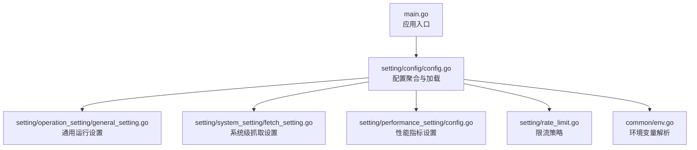
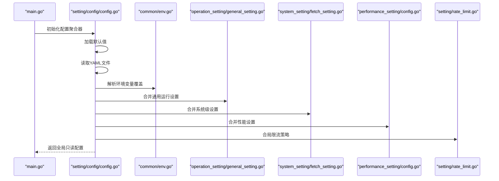
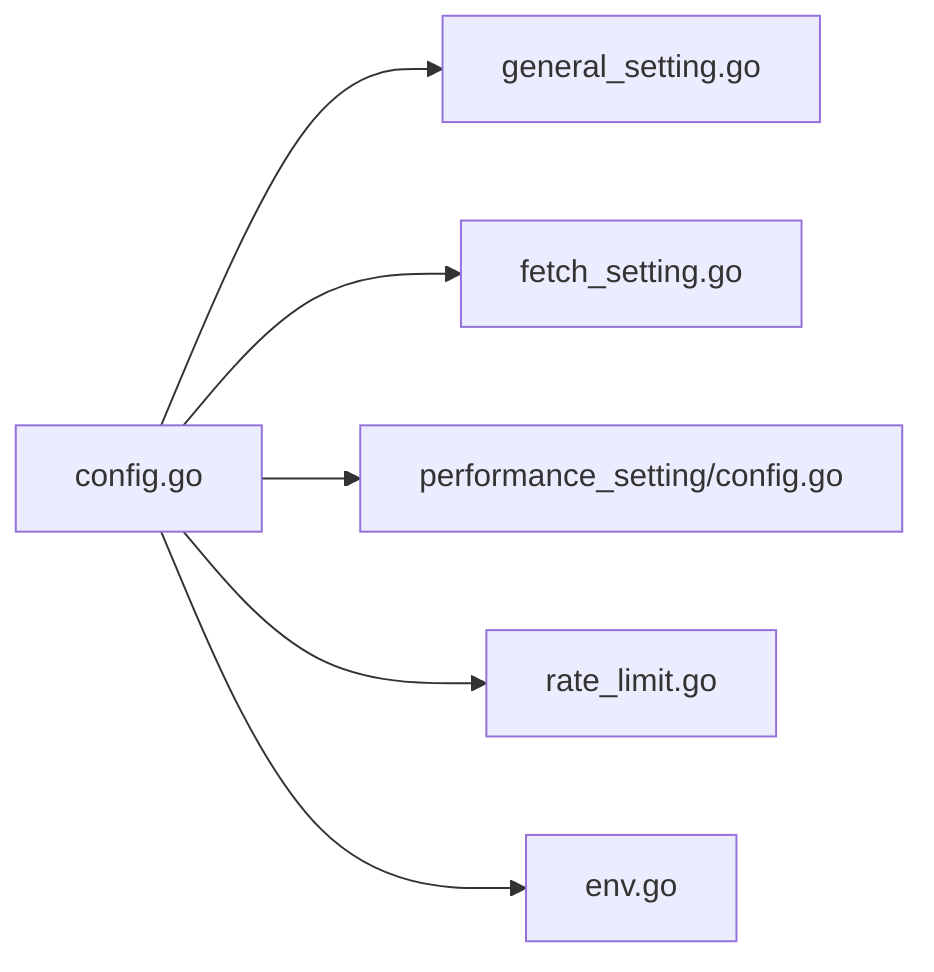

# 配置文件结构

<cite>
**本文引用的文件**   
- [setting/config/config.go](file://setting/config/config.go)
- [setting/operation_setting/general_setting.go](file://setting/operation_setting/general_setting.go)
- [setting/system_setting/fetch_setting.go](file://setting/system_setting/fetch_setting.go)
- [setting/performance_setting/config.go](file://setting/performance_setting/config.go)
- [setting/rate_limit.go](file://setting/rate_limit.go)
- [common/env.go](file://common/env.go)
- [main.go](file://main.go)
</cite>

## 目录
1. [简介](#简介)
2. [项目结构](#项目结构)
3. [核心组件](#核心组件)
4. [架构总览](#架构总览)
5. [详细组件分析](#详细组件分析)
6. [依赖关系分析](#依赖关系分析)
7. [性能考虑](#性能考虑)
8. [故障排查指南](#故障排查指南)
9. [结论](#结论)
10. [附录：配置模板与字段说明](#附录配置模板与字段说明)

## 简介
本文件面向希望理解并正确维护系统 YAML 配置文件的读者，系统性阐述配置的整体架构、层级结构与命名约定；结合代码库中的实际实现，解释配置的加载顺序、合并策略与版本兼容机制；并提供完整的配置模板与字段说明，帮助快速搭建与排障。

## 项目结构
本项目将“配置”拆分为多个领域子模块（如运行期设置、系统设置、性能设置、限流等），每个子模块定义对应的结构体与默认值，并在启动时按优先级进行加载与合并。YAML 配置文件通常位于应用根目录或环境变量指定的路径，由主程序在初始化阶段统一读取。



图表来源
- [main.go](file://main.go)
- [setting/config/config.go](file://setting/config/config.go)
- [setting/operation_setting/general_setting.go](file://setting/operation_setting/general_setting.go)
- [setting/system_setting/fetch_setting.go](file://setting/system_setting/fetch_setting.go)
- [setting/performance_setting/config.go](file://setting/performance_setting/config.go)
- [setting/rate_limit.go](file://setting/rate_limit.go)
- [common/env.go](file://common/env.go)

章节来源
- [main.go](file://main.go)
- [setting/config/config.go](file://setting/config/config.go)

## 核心组件
- 配置聚合器：负责统一加载 YAML、合并默认值与环境变量、校验必填项，并输出全局只读配置对象。
- 领域设置：各业务域（通用、系统、性能、限流）各自维护独立的结构体与默认值，便于演进与维护。
- 环境变量桥接：通过环境变量覆盖关键敏感项（如密钥、URL、端口），避免硬编码。

章节来源
- [setting/config/config.go](file://setting/config/config.go)
- [common/env.go](file://common/env.go)

## 架构总览
下图展示了从启动到配置生效的关键流程：主程序启动后，依次加载默认配置、读取 YAML、应用环境变量覆盖、执行校验与合并，最终生成全局可用配置。



图表来源
- [main.go](file://main.go)
- [setting/config/config.go](file://setting/config/config.go)
- [common/env.go](file://common/env.go)
- [setting/operation_setting/general_setting.go](file://setting/operation_setting/general_setting.go)
- [setting/system_setting/fetch_setting.go](file://setting/system_setting/fetch_setting.go)
- [setting/performance_setting/config.go](file://setting/performance_setting/config.go)
- [setting/rate_limit.go](file://setting/rate_limit.go)

## 详细组件分析

### 配置聚合器（setting/config/config.go）
- 职责
  - 定义全局配置结构体，聚合各子模块设置。
  - 提供加载函数：默认值 -> YAML -> 环境变量覆盖 -> 校验 -> 合并。
  - 暴露只读访问接口，供其他模块使用。
- 数据结构要点
  - 顶层包含各子模块的字段，均为可选，未设置时使用默认值。
  - 关键字段具备类型约束与范围校验。
- 加载与合并
  - 优先级：环境变量 > YAML > 默认值。
  - 对数组/映射类字段采用增量合并策略（新增项追加，同名键覆盖）。
- 错误处理
  - 解析失败返回结构化错误，包含字段名与原因。
  - 缺失必填项时拒绝启动并提示修复建议。

章节来源
- [setting/config/config.go](file://setting/config/config.go)

### 通用运行设置（setting/operation_setting/general_setting.go）
- 职责
  - 管理服务监听地址、端口、日志级别、跨域、静态资源路径等基础运行参数。
- 典型字段
  - 监听地址与端口：字符串与整数，默认本地回环与常用端口。
  - 日志级别：枚举型，支持调试/信息/警告/错误。
  - 跨域白名单：字符串列表，空表示允许所有。
  - 静态资源路径：相对或绝对路径，默认内置。
- 验证规则
  - 端口范围校验（合法区间）。
  - 路径存在性检查（可选，视部署方式而定）。

章节来源
- [setting/operation_setting/general_setting.go](file://setting/operation_setting/general_setting.go)

### 系统级抓取设置（setting/system_setting/fetch_setting.go）
- 职责
  - 控制对外部资源的抓取行为，包括超时、重试、代理、UA 等。
- 典型字段
  - 超时时间：毫秒或秒，默认保守值。
  - 重试次数与退避策略：整数与延迟倍数。
  - 代理 URL：可选，支持 http/https。
  - User-Agent：自定义请求头标识。
- 验证规则
  - 超时为正数。
  - 代理 URL 格式校验。

章节来源
- [setting/system_setting/fetch_setting.go](file://setting/system_setting/fetch_setting.go)

### 性能指标设置（setting/performance_setting/config.go）
- 职责
  - 启用/关闭性能指标采集、采样率、导出目标等。
- 典型字段
  - 是否启用：布尔开关。
  - 采样率：百分比或比例系数。
  - 导出目标：内存/文件/远程端点。
- 验证规则
  - 采样率在合理范围内。
  - 导出目标为已知枚举之一。

章节来源
- [setting/performance_setting/config.go](file://setting/performance_setting/config.go)

### 限流策略（setting/rate_limit.go）
- 职责
  - 定义全局与模型级别的限流规则，包括 QPS、并发、令牌桶参数等。
- 典型字段
  - 全局 QPS：整数。
  - 单模型 QPS：映射模型名到数值。
  - 令牌桶容量与填充速率：正数。
- 验证规则
  - 数值非负。
  - 容量不小于填充速率（可选约束）。

章节来源
- [setting/rate_limit.go](file://setting/rate_limit.go)

### 环境变量桥接（common/env.go）
- 职责
  - 提供统一的环境变量读取与类型转换工具。
  - 支持默认值、必填校验与格式化。
- 用法
  - 在配置加载阶段调用，将敏感或动态配置注入到配置对象中。
- 特性
  - 大小写不敏感。
  - 支持 JSON/YAML 片段作为环境变量值（用于复杂结构）。

章节来源
- [common/env.go](file://common/env.go)

## 依赖关系分析
- 低耦合高内聚：各子模块仅依赖自身结构体与公共工具（如 env 解析）。
- 单向依赖：config 聚合器依赖各子模块，但子模块不反向依赖 config。
- 无循环依赖：通过只读接口暴露配置，避免运行时修改。



图表来源
- [setting/config/config.go](file://setting/config/config.go)
- [setting/operation_setting/general_setting.go](file://setting/operation_setting/general_setting.go)
- [setting/system_setting/fetch_setting.go](file://setting/system_setting/fetch_setting.go)
- [setting/performance_setting/config.go](file://setting/performance_setting/config.go)
- [setting/rate_limit.go](file://setting/rate_limit.go)
- [common/env.go](file://common/env.go)

章节来源
- [setting/config/config.go](file://setting/config/config.go)

## 性能考虑
- 配置加载仅在启动时执行一次，避免重复 I/O。
- 大对象（如限流映射）建议在启动时预计算，减少运行时开销。
- 环境变量覆盖适合热更新敏感项，但频繁重启仍需谨慎。

## 故障排查指南
- 常见错误
  - YAML 语法错误：检查缩进、引号与特殊字符。
  - 必填项缺失：根据错误提示补齐字段。
  - 类型不匹配：确保数值、布尔、字符串类型正确。
  - 端口冲突：确认端口未被占用。
  - 代理 URL 非法：检查协议与主机名格式。
- 定位步骤
  - 查看启动日志中的配置解析错误堆栈。
  - 逐项注释 YAML 块以隔离问题。
  - 使用最小化配置逐步恢复功能。

章节来源
- [setting/config/config.go](file://setting/config/config.go)
- [common/env.go](file://common/env.go)

## 结论
通过分层化的配置设计与严格的加载/合并/校验流程，系统在可维护性与稳定性之间取得平衡。遵循本文的模板与规范，可快速搭建生产可用的配置环境，并降低变更风险。

## 附录：配置模板与字段说明
以下为推荐的 YAML 配置模板与字段说明（示例结构，具体字段以代码实现为准）：

```yaml
# 通用运行设置
operation:
  listen_address: "0.0.0.0"
  port: 8080
  log_level: "info"
  cors_origins: []
  static_path: "./web/dist"

# 系统级抓取设置
system_fetch:
  timeout_ms: 30000
  retry_count: 3
  backoff_multiplier: 2
  proxy_url: ""
  user_agent: "NewAPI/1.0"

# 性能指标设置
performance:
  enabled: false
  sampling_rate: 0.1
  exporter: "memory"

# 限流策略
rate_limit:
  global_qps: 1000
  model_qps:
    default: 100
  token_bucket:
    capacity: 200
    refill_rate: 50
```

字段说明
- operation.listen_address: 字符串，服务监听地址，默认本地回环。
- operation.port: 整数，服务端口，默认 8080。
- operation.log_level: 枚举，日志级别，默认 info。
- operation.cors_origins: 字符串列表，跨域白名单，空表示允许所有。
- operation.static_path: 字符串，前端静态资源路径，默认内置。
- system_fetch.timeout_ms: 整数，外部请求超时毫秒数，默认 30000。
- system_fetch.retry_count: 整数，重试次数，默认 3。
- system_fetch.backoff_multiplier: 数字，退避倍数，默认 2。
- system_fetch.proxy_url: 字符串，代理地址，可选。
- system_fetch.user_agent: 字符串，请求 UA，可选。
- performance.enabled: 布尔，是否启用性能指标，默认 false。
- performance.sampling_rate: 数字，采样率 0~1，默认 0.1。
- performance.exporter: 枚举，导出目标 memory/file/remote，默认 memory。
- rate_limit.global_qps: 整数，全局 QPS，默认 1000。
- rate_limit.model_qps: 映射，模型名到 QPS，默认 default=100。
- rate_limit.token_bucket.capacity: 整数，令牌桶容量，默认 200。
- rate_limit.token_bucket.refill_rate: 整数，每秒填充速率，默认 50。

章节来源
- [setting/operation_setting/general_setting.go](file://setting/operation_setting/general_setting.go)
- [setting/system_setting/fetch_setting.go](file://setting/system_setting/fetch_setting.go)
- [setting/performance_setting/config.go](file://setting/performance_setting/config.go)
- [setting/rate_limit.go](file://setting/rate_limit.go)