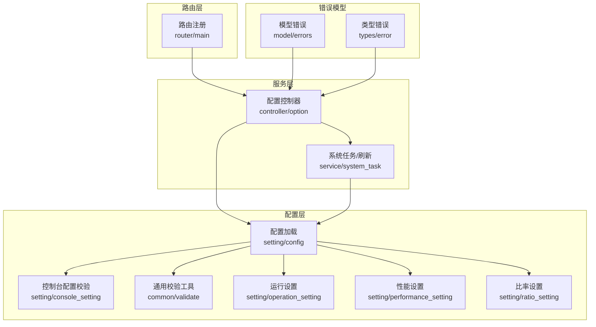
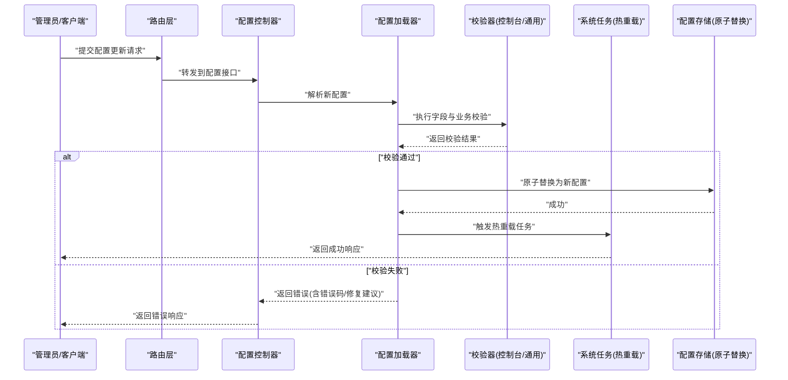
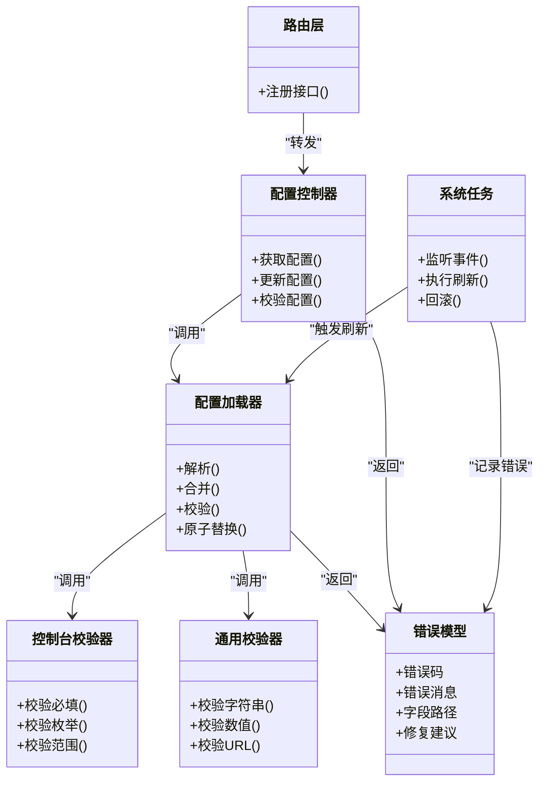

# 配置验证与热重载

<cite>
**本文引用的文件**   
- [setting/config/config.go](file://setting/config/config.go)
- [setting/console_setting/validation.go](file://setting/console_setting/validation.go)
- [common/validate.go](file://common/validate.go)
- [model/errors.go](file://model/errors.go)
- [types/error.go](file://types/error.go)
- [service/system_task.go](file://service/system_task.go)
- [controller/option.go](file://controller/option.go)
- [router/main.go](file://router/main.go)
- [setting/operation_setting/general_setting.go](file://setting/operation_setting/general_setting.go)
- [setting/performance_setting/config.go](file://setting/performance_setting/config.go)
- [setting/ratio_setting/model_ratio.go](file://setting/ratio_setting/model_ratio.go)
</cite>

## 目录
1. [简介](#简介)
2. [项目结构](#项目结构)
3. [核心组件](#核心组件)
4. [架构总览](#架构总览)
5. [详细组件分析](#详细组件分析)
6. [依赖关系分析](#依赖关系分析)
7. [性能考量](#性能考量)
8. [故障排查指南](#故障排查指南)
9. [结论](#结论)
10. [附录](#附录)

## 简介
本文件系统性梳理并文档化“配置验证与热重载”机制，覆盖以下方面：
- 配置文件语法检查、类型校验与业务规则校验
- 自定义验证器、错误处理与回滚机制
- 热重载的实现原理、监听机制与状态同步
- 配置调试工具、常见问题排查与性能优化建议

该机制贯穿系统设置、控制台设置、运行期参数与比率配置等模块，确保在变更配置时既安全又高效。

## 项目结构
与配置验证和热重载相关的代码主要分布在以下目录：
- setting/config: 配置加载与基础校验
- setting/console_setting: 控制台相关配置的校验
- common/validate: 通用校验工具
- model/errors, types/error: 错误定义与统一错误模型
- service/system_task: 后台任务（含配置刷新）
- controller/option: 配置读取与更新接口
- router/main: 路由注册（暴露配置相关接口）
- setting/*_setting: 各子系统配置结构与默认值

图表来源
- [setting/config/config.go](file://setting/config/config.go)
- [setting/console_setting/validation.go](file://setting/console_setting/validation.go)
- [common/validate.go](file://common/validate.go)
- [service/system_task.go](file://service/system_task.go)
- [controller/option.go](file://controller/option.go)
- [router/main.go](file://router/main.go)
- [model/errors.go](file://model/errors.go)
- [types/error.go](file://types/error.go)

章节来源
- [setting/config/config.go](file://setting/config/config.go)
- [setting/console_setting/validation.go](file://setting/console_setting/validation.go)
- [common/validate.go](file://common/validate.go)
- [service/system_task.go](file://service/system_task.go)
- [controller/option.go](file://controller/option.go)
- [router/main.go](file://router/main.go)
- [model/errors.go](file://model/errors.go)
- [types/error.go](file://types/error.go)

## 核心组件
- 配置加载与校验入口
  - 负责解析配置源、合并默认值、执行字段级与业务级校验
  - 提供原子替换能力，保证并发读安全
- 控制台配置校验
  - 针对控制台可见的配置项进行强校验（如必填、枚举、范围）
- 通用校验工具
  - 提供字符串、数值、URL、邮箱等常用校验函数
- 错误模型
  - 统一错误码、错误信息、堆栈上下文，便于前端展示与日志追踪
- 系统任务与热重载
  - 监听配置变更事件，触发异步刷新；失败时回滚到上一版本
- 控制器与路由
  - 暴露配置查询、更新、校验接口；路由注册对外暴露端点

章节来源
- [setting/config/config.go](file://setting/config/config.go)
- [setting/console_setting/validation.go](file://setting/console_setting/validation.go)
- [common/validate.go](file://common/validate.go)
- [model/errors.go](file://model/errors.go)
- [types/error.go](file://types/error.go)
- [service/system_task.go](file://service/system_task.go)
- [controller/option.go](file://controller/option.go)
- [router/main.go](file://router/main.go)

## 架构总览
下图展示了从配置变更到生效的完整流程，包括校验、原子替换、任务调度与回滚。

图表来源
- [controller/option.go](file://controller/option.go)
- [setting/config/config.go](file://setting/config/config.go)
- [setting/console_setting/validation.go](file://setting/console_setting/validation.go)
- [common/validate.go](file://common/validate.go)
- [service/system_task.go](file://service/system_task.go)

## 详细组件分析

### 配置加载与校验（setting/config）
- 职责
  - 解析多来源配置（文件、环境变量、数据库等）
  - 合并默认值与用户配置
  - 执行字段级校验（类型、必填、格式）与业务规则校验（互斥、依赖、范围）
  - 提供原子替换接口，避免并发读写导致的不一致
- 关键流程
  - 解析 -> 合并 -> 校验 -> 原子替换 -> 触发热重载
- 错误处理
  - 将校验错误映射为统一错误模型，包含错误码、字段路径与修复建议

章节来源
- [setting/config/config.go](file://setting/config/config.go)

### 控制台配置校验（setting/console_setting）
- 职责
  - 对控制台可编辑的配置项进行强校验
  - 支持枚举、正则、范围、白名单等约束
- 典型规则
  - 必填字段缺失、非法枚举值、数值越界、重复键名等
- 输出
  - 结构化错误列表，便于前端逐条提示

章节来源
- [setting/console_setting/validation.go](file://setting/console_setting/validation.go)

### 通用校验工具（common/validate）
- 职责
  - 提供可复用的校验函数（字符串、数值、URL、邮箱、IP、时间等）
  - 封装常见边界条件与异常分支
- 使用方式
  - 在各配置模块中按需调用，保持校验一致性

章节来源
- [common/validate.go](file://common/validate.go)

### 错误模型（model/errors, types/error）
- 职责
  - 统一定义错误码、错误消息、字段定位与修复建议
  - 支持国际化与分级错误（致命、警告）
- 设计要点
  - 错误码唯一且稳定，便于前端与运维识别
  - 附带上下文（字段路径、期望值、实际值）

章节来源
- [model/errors.go](file://model/errors.go)
- [types/error.go](file://types/error.go)

### 热重载与状态同步（service/system_task）
- 职责
  - 监听配置变更事件，触发异步刷新
  - 刷新失败时自动回滚到上一版本，保证服务可用
- 关键机制
  - 事件驱动：配置更新后发布事件
  - 任务队列：异步执行刷新逻辑
  - 幂等性：重复事件不造成副作用
  - 回滚策略：保存快照，失败即恢复

章节来源
- [service/system_task.go](file://service/system_task.go)

### 配置控制器与路由（controller/option, router/main）
- 职责
  - 暴露配置查询、校验、更新接口
  - 路由注册对外暴露端点，统一鉴权与限流
- 典型接口
  - GET /api/options: 获取当前配置
  - PUT /api/options: 提交新配置（触发校验与热重载）
  - POST /api/options/validate: 仅校验不生效

章节来源
- [controller/option.go](file://controller/option.go)
- [router/main.go](file://router/main.go)

### 子系统配置示例
- 运行设置（general_setting）
  - 控制全局开关、超时、重试策略等
- 性能设置（performance_setting）
  - 控制缓存、并发、限流阈值等
- 比率设置（model_ratio）
  - 控制模型计费比率、折扣系数、上限限制等

章节来源
- [setting/operation_setting/general_setting.go](file://setting/operation_setting/general_setting.go)
- [setting/performance_setting/config.go](file://setting/performance_setting/config.go)
- [setting/ratio_setting/model_ratio.go](file://setting/ratio_setting/model_ratio.go)

## 依赖关系分析
配置验证与热重载的依赖关系如下：

图表来源
- [setting/config/config.go](file://setting/config/config.go)
- [setting/console_setting/validation.go](file://setting/console_setting/validation.go)
- [common/validate.go](file://common/validate.go)
- [model/errors.go](file://model/errors.go)
- [types/error.go](file://types/error.go)
- [service/system_task.go](file://service/system_task.go)
- [controller/option.go](file://controller/option.go)
- [router/main.go](file://router/main.go)

章节来源
- [setting/config/config.go](file://setting/config/config.go)
- [setting/console_setting/validation.go](file://setting/console_setting/validation.go)
- [common/validate.go](file://common/validate.go)
- [model/errors.go](file://model/errors.go)
- [types/error.go](file://types/error.go)
- [service/system_task.go](file://service/system_task.go)
- [controller/option.go](file://controller/option.go)
- [router/main.go](file://router/main.go)

## 性能考量
- 校验阶段
  - 优先进行轻量级校验（类型、必填），再执行重校验（网络、外部依赖）
  - 批量校验时短路失败，减少不必要的计算
- 原子替换
  - 使用内存指针或无锁数据结构，避免锁竞争
  - 大对象替换采用双缓冲，降低抖动
- 热重载
  - 异步执行，避免阻塞请求链路
  - 去重与节流，防止频繁变更导致风暴
- 缓存与快照
  - 保留最近有效快照，快速回滚
  - 校验结果可短期缓存，提升重复提交效率

[本节为通用指导，不直接分析具体文件]

## 故障排查指南
- 常见错误与修复建议
  - 必填字段缺失：检查表单或JSON是否遗漏关键字段
  - 类型不匹配：确认输入类型与配置结构体定义一致
  - 枚举值非法：核对允许值列表
  - 数值越界：调整至允许范围
  - URL/邮箱格式错误：修正格式或使用校验工具
- 定位方法
  - 查看错误码与字段路径，快速定位问题位置
  - 启用调试日志，观察校验与热重载过程
  - 使用“仅校验”接口提前发现问题
- 回滚与恢复
  - 若热重载失败，系统自动回滚到上一版本
  - 手动触发重新加载，确保配置一致性

章节来源
- [model/errors.go](file://model/errors.go)
- [types/error.go](file://types/error.go)
- [service/system_task.go](file://service/system_task.go)

## 结论
本机制通过分层校验、原子替换与异步热重载，实现了配置变更的安全性与实时性。统一的错误模型与回滚策略保障了系统的稳定性。建议在新增配置项时同步完善校验规则与错误提示，并在变更流程中加入“仅校验”步骤以降低风险。

[本节为总结性内容，不直接分析具体文件]

## 附录
- 配置调试工具
  - 仅校验接口：POST /api/options/validate
  - 获取当前配置：GET /api/options
  - 更新配置：PUT /api/options
- 最佳实践
  - 变更前先校验，变更后观察日志
  - 小步快跑，逐步扩大变更范围
  - 重要配置变更需双人复核

[本节为补充信息，不直接分析具体文件]