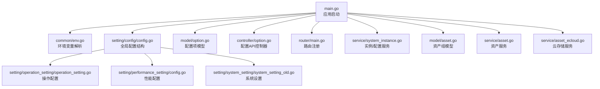
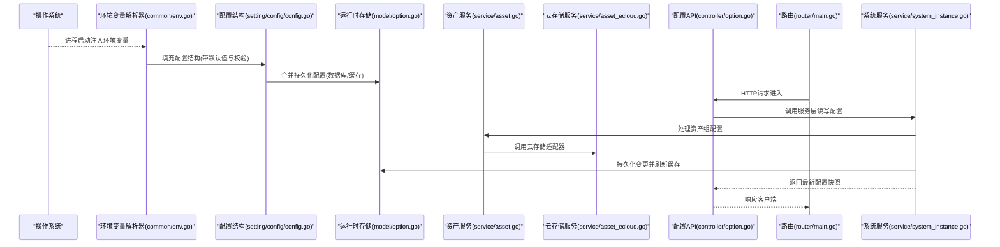
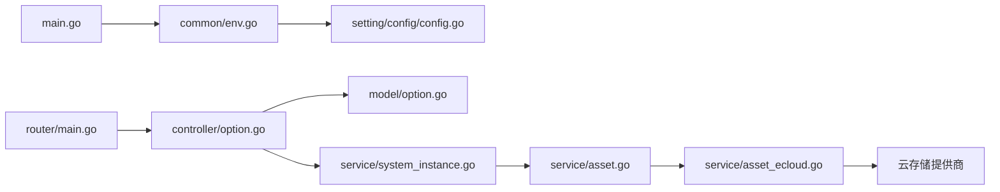

# 配置管理

<cite>
**本文引用的文件**   
- [main.go](file://main.go)
- [common/env.go](file://common/env.go)
- [constant/env.go](file://constant/env.go)
- [setting/config/config.go](file://setting/config/config.go)
- [setting/operation_setting/operation_setting.go](file://setting/operation_setting/operation_setting.go)
- [setting/performance_setting/config.go](file://setting/performance_setting/config.go)
- [setting/system_setting/system_setting_old.go](file://setting/system_setting/system_setting_old.go)
- [model/option.go](file://model/option.go)
- [controller/option.go](file://controller/option.go)
- [router/main.go](file://router/main.go)
- [service/system_instance.go](file://service/system_instance.go)
- [model/asset.go](file://model/asset.go)
- [service/asset.go](file://service/asset.go)
- [service/asset_ecloud.go](file://service/asset_ecloud.go)
</cite>

## 更新摘要
**所做更改**   
- 新增资产组配置选项的详细说明
- 添加云存储配置选项的配置指南
- 更新配置优先级和继承关系以包含新的资产和云存储设置
- 扩展系统设置、操作配置章节以涵盖资产管理和云存储功能

## 目录
1. [简介](#简介)
2. [项目结构](#项目结构)
3. [核心组件](#核心组件)
4. [架构总览](#架构总览)
5. [详细组件分析](#详细组件分析)
6. [依赖关系分析](#依赖关系分析)
7. [性能考量](#性能考量)
8. [故障排查指南](#故障排查指南)
9. [结论](#结论)
10. [附录](#附录)

## 简介
本文件为配置管理系统提供系统化、可操作的文档，覆盖环境变量配置、配置文件与数据库持久化、运行时动态更新、优先级与继承规则、常见问题的定位与修复，以及系统设置、操作配置、性能调优、安全配置、资产组和云存储配置的完整管理方式。读者无需深入代码即可理解并正确使用系统的配置能力。

## 项目结构
配置相关代码主要分布在以下模块：
- 环境变量解析与加载：common/env.go、constant/env.go
- 配置结构与默认值：setting/config/config.go、setting/operation_setting/operation_setting.go、setting/performance_setting/config.go、setting/system_setting/system_setting_old.go
- 运行时配置持久化与热更新：model/option.go、controller/option.go、router/main.go、service/system_instance.go
- 资产组配置管理：model/asset.go、service/asset.go、service/asset_ecloud.go
- 应用入口与初始化：main.go

图表来源
- [main.go](file://main.go)
- [common/env.go](file://common/env.go)
- [setting/config/config.go](file://setting/config/config.go)
- [setting/operation_setting/operation_setting.go](file://setting/operation_setting/operation_setting.go)
- [setting/performance_setting/config.go](file://setting/performance_setting/config.go)
- [setting/system_setting/system_setting_old.go](file://setting/system_setting/system_setting_old.go)
- [model/option.go](file://model/option.go)
- [controller/option.go](file://controller/option.go)
- [router/main.go](file://router/main.go)
- [service/system_instance.go](file://service/system_instance.go)
- [model/asset.go](file://model/asset.go)
- [service/asset.go](file://service/asset.go)
- [service/asset_ecloud.go](file://service/asset_ecloud.go)

章节来源
- [main.go](file://main.go)
- [common/env.go](file://common/env.go)
- [constant/env.go](file://constant/env.go)
- [setting/config/config.go](file://setting/config/config.go)
- [setting/operation_setting/operation_setting.go](file://setting/operation_setting/operation_setting.go)
- [setting/performance_setting/config.go](file://setting/performance_setting/config.go)
- [setting/system_setting/system_setting_old.go](file://setting/system_setting/system_setting_old.go)
- [model/option.go](file://model/option.go)
- [controller/option.go](file://controller/option.go)
- [router/main.go](file://router/main.go)
- [service/system_instance.go](file://service/system_instance.go)
- [model/asset.go](file://model/asset.go)
- [service/asset.go](file://service/asset.go)
- [service/asset_ecloud.go](file://service/asset_ecloud.go)

## 核心组件
- 环境变量解析器：负责从进程环境读取键值对，进行类型转换与校验，暴露统一接口供配置层使用。
- 配置结构体与默认值：集中定义系统级、操作级、性能级等配置项的字段、默认值与取值范围。
- 运行时配置存储：通过数据库表或内存缓存维护当前生效的配置快照，支持热更新。
- 配置API控制器：对外暴露查询、修改、验证、回滚等接口，供控制台或自动化脚本调用。
- 路由与服务：将配置API挂载到HTTP路由，并在服务层提供一致性访问与事务保障。
- 资产组管理器：管理资产组的创建、配置、权限控制与生命周期。
- 云存储适配器：支持多种云存储后端（S3、OSS、COS等）的统一接口抽象。

章节来源
- [common/env.go](file://common/env.go)
- [setting/config/config.go](file://setting/config/config.go)
- [setting/operation_setting/operation_setting.go](file://setting/operation_setting/operation_setting.go)
- [setting/performance_setting/config.go](file://setting/performance_setting/config.go)
- [setting/system_setting/system_setting_old.go](file://setting/system_setting/system_setting_old.go)
- [model/option.go](file://model/option.go)
- [controller/option.go](file://controller/option.go)
- [router/main.go](file://router/main.go)
- [service/system_instance.go](file://service/system_instance.go)
- [model/asset.go](file://model/asset.go)
- [service/asset.go](file://service/asset.go)
- [service/asset_ecloud.go](file://service/asset_ecloud.go)

## 架构总览
下图展示了配置从"环境变量 → 配置结构 → 运行时存储 → API"的完整链路，以及各层级之间的职责边界与数据流向。

图表来源
- [common/env.go](file://common/env.go)
- [setting/config/config.go](file://setting/config/config.go)
- [model/option.go](file://model/option.go)
- [controller/option.go](file://controller/option.go)
- [router/main.go](file://router/main.go)
- [service/system_instance.go](file://service/system_instance.go)
- [service/asset.go](file://service/asset.go)
- [service/asset_ecloud.go](file://service/asset_ecloud.go)

## 详细组件分析

### 环境变量配置
- 作用域与命名规范：建议按模块划分前缀（如 SYSTEM_、PERF_、OP_、ASSET_、CLOUD_），避免冲突；大小写敏感。
- 类型映射：字符串、布尔、整数、浮点、数组/JSON等类型需严格匹配，错误时回退到默认值。
- 校验策略：在加载阶段进行格式与范围校验，失败应记录告警并采用安全默认值。
- 示例参考路径：[common/env.go](file://common/env.go)、[constant/env.go](file://constant/env.go)

**新增** 资产组和云存储相关的环境变量：
- ASSET_GROUP_*：资产组基础配置
- CLOUD_STORAGE_*：云存储后端配置
- ASSET_CACHE_*：资产缓存配置

章节来源
- [common/env.go](file://common/env.go)
- [constant/env.go](file://constant/env.go)

### 配置文件与默认值管理
- 配置结构组织：系统设置、操作设置、性能设置分别位于独立包，便于维护与测试。
- 默认值策略：所有关键参数必须提供合理默认值，确保无外部配置也能稳定运行。
- 覆盖机制：环境变量优先于默认值，后续可与持久化配置合并。
- 示例参考路径：[setting/config/config.go](file://setting/config/config.go)、[setting/operation_setting/operation_setting.go](file://setting/operation_setting/operation_setting.go)、[setting/performance_setting/config.go](file://setting/performance_setting/config.go)、[setting/system_setting/system_setting_old.go](file://setting/system_setting/system_setting_old.go)

**新增** 资产组和云存储配置结构：
- AssetGroupConfig：资产组配置结构体
- CloudStorageConfig：云存储配置结构体
- StorageProviderConfig：存储提供商配置

章节来源
- [setting/config/config.go](file://setting/config/config.go)
- [setting/operation_setting/operation_setting.go](file://setting/operation_setting/operation_setting.go)
- [setting/performance_setting/config.go](file://setting/performance_setting/config.go)
- [setting/system_setting/system_setting_old.go](file://setting/system_setting/system_setting_old.go)

### 运行时配置更新
- 存储模型：配置项以键值形式持久化，包含版本、时间戳、描述等元数据。
- 热更新流程：API接收变更请求 → 服务层校验与落库 → 刷新内存缓存 → 通知相关组件重载。
- 并发控制：使用锁或原子操作保证读多写少场景的一致性。
- 示例参考路径：[model/option.go](file://model/option.go)、[controller/option.go](file://controller/option.go)、[service/system_instance.go](file://service/system_instance.go)

图表来源
- [model/option.go](file://model/option.go)
- [controller/option.go](file://controller/option.go)
- [service/system_instance.go](file://service/system_instance.go)

章节来源
- [model/option.go](file://model/option.go)
- [controller/option.go](file://controller/option.go)
- [service/system_instance.go](file://service/system_instance.go)

### 资产组配置管理
- 资产组概念：资产组是对文件、媒体资源等进行逻辑分组的配置单元，支持权限控制和访问策略。
- 配置选项：包括组名、描述、存储位置、访问权限、缓存策略、生命周期管理等。
- 权限控制：基于角色的访问控制（RBAC），支持细粒度的资源访问权限。
- 生命周期管理：支持资产的上传、下载、删除、迁移等操作。

**新增** 资产组配置详解：
- 基本配置：组标识、名称、描述、状态
- 存储配置：存储桶、路径模板、访问模式
- 权限配置：访问控制列表、角色绑定、IP白名单
- 缓存配置：缓存策略、过期时间、压缩选项
- 监控配置：访问日志、统计指标、告警规则

章节来源
- [model/asset.go](file://model/asset.go)
- [service/asset.go](file://service/asset.go)

### 云存储配置管理
- 存储提供商支持：支持AWS S3、阿里云OSS、腾讯云COS、Google Cloud Storage等多种云存储服务。
- 统一接口抽象：通过适配器模式屏蔽不同云服务的差异，提供统一的API接口。
- 配置选项：包括连接参数、认证信息、网络配置、性能调优等。
- 故障转移：支持多存储提供商的自动切换和负载均衡。

**新增** 云存储配置详解：
- 通用配置：提供商类型、区域设置、超时配置
- 认证配置：Access Key、Secret Key、Token管理
- 网络配置：代理设置、SSL配置、连接池大小
- 性能配置：分块大小、并发数、重试策略
- 安全配置：加密选项、签名验证、访问审计

章节来源
- [service/asset_ecloud.go](file://service/asset_ecloud.go)

### 配置优先级与继承关系
- 优先级顺序（从高到低）：
  1) 环境变量（进程级）
  2) 运行时配置（数据库/缓存）
  3) 默认值（代码内）
- 继承关系：
  - 模块级配置可继承全局默认值
  - 运行时配置可覆盖默认值与环境变量中未显式设置的项
  - 资产组配置可继承全局存储策略
  - 云存储配置可继承全局网络和安全策略
- 最佳实践：
  - 明确标注每个选项的来源与优先级
  - 变更运行时配置后，记录审计日志

**更新** 新增资产组和云存储配置的继承关系：
- 资产组可以继承全局的存储策略和访问控制规则
- 云存储配置可以继承全局的网络和安全设置
- 特定资产组可以覆盖全局的缓存和性能配置

章节来源
- [setting/config/config.go](file://setting/config/config.go)
- [model/option.go](file://model/option.go)
- [controller/option.go](file://controller/option.go)
- [model/asset.go](file://model/asset.go)
- [service/asset_ecloud.go](file://service/asset_ecloud.go)

### 系统设置、操作配置、性能调优、安全配置与扩展配置
- 系统设置：实例标识、基础网络、认证、国际化等。
- 操作配置：渠道亲和、签到、监控、支付、配额、状态码范围等。
- 性能调优：连接池、超时、限流、缓存、并发度等。
- 安全配置：SSRF防护、请求体限制、CORS、鉴权中间件等。
- 扩展配置：第三方集成开关、适配器开关、特性标志位等。
- **新增** 资产组配置：资产分组策略、权限控制、生命周期管理。
- **新增** 云存储配置：存储提供商选择、连接参数、性能优化、故障转移。
- 示例参考路径：[setting/system_setting/system_setting_old.go](file://setting/system_setting/system_setting_old.go)、[setting/operation_setting/operation_setting.go](file://setting/operation_setting/operation_setting.go)、[setting/performance_setting/config.go](file://setting/performance_setting/config.go)

章节来源
- [setting/system_setting/system_setting_old.go](file://setting/system_setting/system_setting_old.go)
- [setting/operation_setting/operation_setting.go](file://setting/operation_setting/operation_setting.go)
- [setting/performance_setting/config.go](file://setting/performance_setting/config.go)
- [model/asset.go](file://model/asset.go)
- [service/asset_ecloud.go](file://service/asset_ecloud.go)

## 依赖关系分析
- 低耦合高内聚：配置结构体与解析逻辑分离，运行时存储与API解耦。
- 关键依赖链：
  - main.go → common/env.go → setting/config/config.go
  - controller/option.go → model/option.go → service/system_instance.go
  - router/main.go → controller/option.go
  - service/asset.go → service/asset_ecloud.go → 云存储适配器
- 潜在风险：
  - 循环依赖：应避免配置结构直接依赖API或服务层
  - 并发读写：运行时配置需加锁或使用不可变快照
  - 云存储连接：需要处理网络异常和服务端限流

图表来源
- [main.go](file://main.go)
- [common/env.go](file://common/env.go)
- [setting/config/config.go](file://setting/config/config.go)
- [router/main.go](file://router/main.go)
- [controller/option.go](file://controller/option.go)
- [model/option.go](file://model/option.go)
- [service/system_instance.go](file://service/system_instance.go)
- [service/asset.go](file://service/asset.go)
- [service/asset_ecloud.go](file://service/asset_ecloud.go)

章节来源
- [main.go](file://main.go)
- [common/env.go](file://common/env.go)
- [setting/config/config.go](file://setting/config/config.go)
- [router/main.go](file://router/main.go)
- [controller/option.go](file://controller/option.go)
- [model/option.go](file://model/option.go)
- [service/system_instance.go](file://service/system_instance.go)
- [service/asset.go](file://service/asset.go)
- [service/asset_ecloud.go](file://service/asset_ecloud.go)

## 性能考量
- 配置读取路径优化：热点配置应缓存至内存，避免频繁IO。
- 批量更新：支持批量提交配置变更，减少事务开销。
- 懒加载：非必需配置按需加载，缩短启动时间。
- 监控与度量：对配置变更频率、耗时、错误率进行埋点统计。
- **新增** 资产组性能优化：
  - 资产元数据缓存：减少数据库查询压力
  - 批量操作支持：提高大规模资产管理的效率
  - 异步处理：非关键操作采用异步执行
- **新增** 云存储性能优化：
  - 连接池管理：复用网络连接，减少握手开销
  - 分块传输：大文件分块上传下载，提高传输效率
  - 本地缓存：热点文件本地缓存，降低云端访问频率

## 故障排查指南
- 常见问题
  - 环境变量未生效：检查命名规范、大小写、作用域与优先级。
  - 运行时配置不生效：确认缓存是否刷新、权限是否足够、是否存在并发竞争。
  - 默认值异常：核对配置结构默认值与校验逻辑。
  - **新增** 资产组配置问题：检查权限设置、存储路径、访问策略。
  - **新增** 云存储连接问题：验证认证信息、网络连接、服务商状态。
- 定位步骤
  - 查看配置加载日志与校验错误
  - 对比环境变量、运行时配置与默认值的差异
  - 检查API调用链路与服务层事务状态
  - **新增** 检查资产组权限和存储连接状态
  - **新增** 验证云存储提供商的认证和网络配置
- 恢复措施
  - 回滚到上一个稳定版本配置
  - 重置有问题的配置项为默认值
  - 隔离问题模块并逐步恢复
  - **新增** 重新配置资产组权限和存储连接
  - **新增** 切换备用云存储提供商或修复认证信息

**Section sources**   
- [controller/option.go](file://controller/option.go)
- [model/option.go](file://model/option.go)
- [service/system_instance.go](file://service/system_instance.go)
- [service/asset.go](file://service/asset.go)
- [service/asset_ecloud.go](file://service/asset_ecloud.go)

## 结论
本配置管理系统通过清晰的分层设计与严格的优先级规则，实现了从环境变量到运行时配置的全链路管理。借助统一的API与服务层封装，系统具备高可用、易扩展、可观测的特性。新增的资产组和云存储配置功能进一步增强了系统的文件管理和存储能力。建议在部署与运维中遵循本文的最佳实践，确保配置变更的安全性与稳定性。

## 附录
- 配置项清单与默认值：参见各配置结构体定义与注释
- 环境变量命名约定：参见常量与环境解析实现
- API契约：参见配置控制器与路由注册
- **新增** 资产组配置示例：参见资产组模型和服务实现
- **新增** 云存储配置示例：参见云存储服务实现和适配器配置