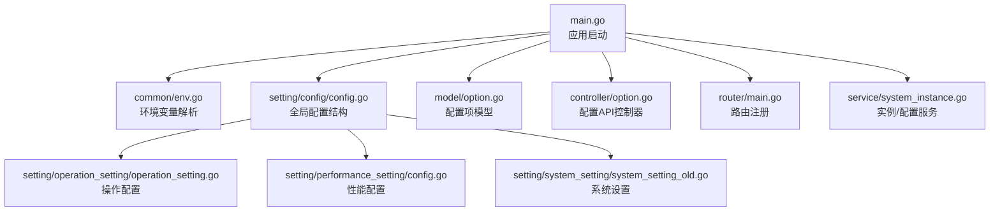
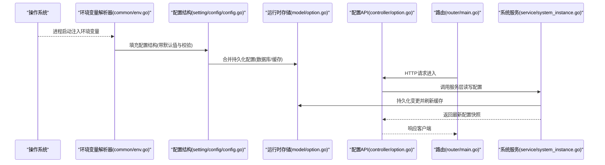
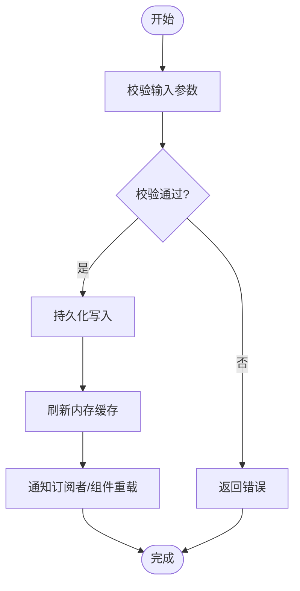
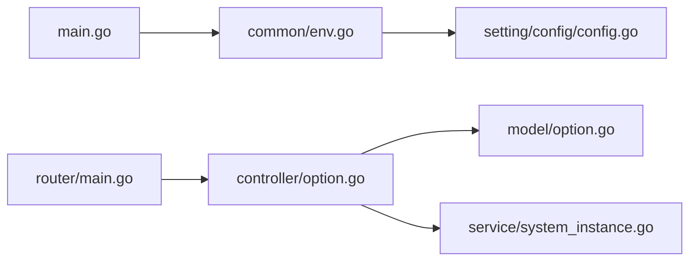

# 配置管理

<cite>
**本文引用的文件**   
- [main.go](file://main.go)
- [common/env.go](file://common/env.go)
- [constant/env.go](file://constant/env.go)
- [setting/config/config.go](file://setting/config/config.go)
- [setting/operation_setting/operation_setting.go](file://setting/operation_setting/operation_setting.go)
- [setting/performance_setting/config.go](file://setting/performance_setting/config.go)
- [setting/system_setting/system_setting_old.go](file://setting/system_setting/system_setting_old.go)
- [model/option.go](file://model/option.go)
- [controller/option.go](file://controller/option.go)
- [router/main.go](file://router/main.go)
- [service/system_instance.go](file://service/system_instance.go)
</cite>

## 目录
1. [简介](#简介)
2. [项目结构](#项目结构)
3. [核心组件](#核心组件)
4. [架构总览](#架构总览)
5. [详细组件分析](#详细组件分析)
6. [依赖关系分析](#依赖关系分析)
7. [性能考量](#性能考量)
8. [故障排查指南](#故障排查指南)
9. [结论](#结论)
10. [附录](#附录)

## 简介
本文件为配置管理系统提供系统化、可操作的文档，覆盖环境变量配置、配置文件与数据库持久化、运行时动态更新、优先级与继承规则、常见问题的定位与修复，以及系统设置、操作配置、性能调优、安全配置和扩展配置的完整管理方式。读者无需深入代码即可理解并正确使用系统的配置能力。

## 项目结构
配置相关代码主要分布在以下模块：
- 环境变量解析与加载：common/env.go、constant/env.go
- 配置结构与默认值：setting/config/config.go、setting/operation_setting/operation_setting.go、setting/performance_setting/config.go、setting/system_setting/system_setting_old.go
- 运行时配置持久化与热更新：model/option.go、controller/option.go、router/main.go、service/system_instance.go
- 应用入口与初始化：main.go

图表来源
- [main.go](file://main.go)
- [common/env.go](file://common/env.go)
- [setting/config/config.go](file://setting/config/config.go)
- [setting/operation_setting/operation_setting.go](file://setting/operation_setting/operation_setting.go)
- [setting/performance_setting/config.go](file://setting/performance_setting/config.go)
- [setting/system_setting/system_setting_old.go](file://setting/system_setting/system_setting_old.go)
- [model/option.go](file://model/option.go)
- [controller/option.go](file://controller/option.go)
- [router/main.go](file://router/main.go)
- [service/system_instance.go](file://service/system_instance.go)

章节来源
- [main.go](file://main.go)
- [common/env.go](file://common/env.go)
- [constant/env.go](file://constant/env.go)
- [setting/config/config.go](file://setting/config/config.go)
- [setting/operation_setting/operation_setting.go](file://setting/operation_setting/operation_setting.go)
- [setting/performance_setting/config.go](file://setting/performance_setting/config.go)
- [setting/system_setting/system_setting_old.go](file://setting/system_setting/system_setting_old.go)
- [model/option.go](file://model/option.go)
- [controller/option.go](file://controller/option.go)
- [router/main.go](file://router/main.go)
- [service/system_instance.go](file://service/system_instance.go)

## 核心组件
- 环境变量解析器：负责从进程环境读取键值对，进行类型转换与校验，暴露统一接口供配置层使用。
- 配置结构体与默认值：集中定义系统级、操作级、性能级等配置项的字段、默认值与取值范围。
- 运行时配置存储：通过数据库表或内存缓存维护当前生效的配置快照，支持热更新。
- 配置API控制器：对外暴露查询、修改、验证、回滚等接口，供控制台或自动化脚本调用。
- 路由与服务：将配置API挂载到HTTP路由，并在服务层提供一致性访问与事务保障。

章节来源
- [common/env.go](file://common/env.go)
- [setting/config/config.go](file://setting/config/config.go)
- [setting/operation_setting/operation_setting.go](file://setting/operation_setting/operation_setting.go)
- [setting/performance_setting/config.go](file://setting/performance_setting/config.go)
- [setting/system_setting/system_setting_old.go](file://setting/system_setting/system_setting_old.go)
- [model/option.go](file://model/option.go)
- [controller/option.go](file://controller/option.go)
- [router/main.go](file://router/main.go)
- [service/system_instance.go](file://service/system_instance.go)

## 架构总览
下图展示了配置从“环境变量 → 配置结构 → 运行时存储 → API”的完整链路，以及各层级之间的职责边界与数据流向。

图表来源
- [common/env.go](file://common/env.go)
- [setting/config/config.go](file://setting/config/config.go)
- [model/option.go](file://model/option.go)
- [controller/option.go](file://controller/option.go)
- [router/main.go](file://router/main.go)
- [service/system_instance.go](file://service/system_instance.go)

## 详细组件分析

### 环境变量配置
- 作用域与命名规范：建议按模块划分前缀（如 SYSTEM_、PERF_、OP_），避免冲突；大小写敏感。
- 类型映射：字符串、布尔、整数、浮点、数组/JSON等类型需严格匹配，错误时回退到默认值。
- 校验策略：在加载阶段进行格式与范围校验，失败应记录告警并采用安全默认值。
- 示例参考路径：[common/env.go](file://common/env.go)、[constant/env.go](file://constant/env.go)

章节来源
- [common/env.go](file://common/env.go)
- [constant/env.go](file://constant/env.go)

### 配置文件与默认值管理
- 配置结构组织：系统设置、操作设置、性能设置分别位于独立包，便于维护与测试。
- 默认值策略：所有关键参数必须提供合理默认值，确保无外部配置也能稳定运行。
- 覆盖机制：环境变量优先于默认值，后续可与持久化配置合并。
- 示例参考路径：[setting/config/config.go](file://setting/config/config.go)、[setting/operation_setting/operation_setting.go](file://setting/operation_setting/operation_setting.go)、[setting/performance_setting/config.go](file://setting/performance_setting/config.go)、[setting/system_setting/system_setting_old.go](file://setting/system_setting/system_setting_old.go)

章节来源
- [setting/config/config.go](file://setting/config/config.go)
- [setting/operation_setting/operation_setting.go](file://setting/operation_setting/operation_setting.go)
- [setting/performance_setting/config.go](file://setting/performance_setting/config.go)
- [setting/system_setting/system_setting_old.go](file://setting/system_setting/system_setting_old.go)

### 运行时配置更新
- 存储模型：配置项以键值形式持久化，包含版本、时间戳、描述等元数据。
- 热更新流程：API接收变更请求 → 服务层校验与落库 → 刷新内存缓存 → 通知相关组件重载。
- 并发控制：使用锁或原子操作保证读多写少场景的一致性。
- 示例参考路径：[model/option.go](file://model/option.go)、[controller/option.go](file://controller/option.go)、[service/system_instance.go](file://service/system_instance.go)

图表来源
- [model/option.go](file://model/option.go)
- [controller/option.go](file://controller/option.go)
- [service/system_instance.go](file://service/system_instance.go)

章节来源
- [model/option.go](file://model/option.go)
- [controller/option.go](file://controller/option.go)
- [service/system_instance.go](file://service/system_instance.go)

### 配置优先级与继承关系
- 优先级顺序（从高到低）：
  1) 环境变量（进程级）
  2) 运行时配置（数据库/缓存）
  3) 默认值（代码内）
- 继承关系：
  - 模块级配置可继承全局默认值
  - 运行时配置可覆盖默认值与环境变量中未显式设置的项
- 最佳实践：
  - 明确标注每个选项的来源与优先级
  - 变更运行时配置后，记录审计日志

章节来源
- [setting/config/config.go](file://setting/config/config.go)
- [model/option.go](file://model/option.go)
- [controller/option.go](file://controller/option.go)

### 系统设置、操作配置、性能调优、安全配置与扩展配置
- 系统设置：实例标识、基础网络、认证、国际化等。
- 操作配置：渠道亲和、签到、监控、支付、配额、状态码范围等。
- 性能调优：连接池、超时、限流、缓存、并发度等。
- 安全配置：SSRF防护、请求体限制、CORS、鉴权中间件等。
- 扩展配置：第三方集成开关、适配器开关、特性标志位等。
- 示例参考路径：[setting/system_setting/system_setting_old.go](file://setting/system_setting/system_setting_old.go)、[setting/operation_setting/operation_setting.go](file://setting/operation_setting/operation_setting.go)、[setting/performance_setting/config.go](file://setting/performance_setting/config.go)

章节来源
- [setting/system_setting/system_setting_old.go](file://setting/system_setting/system_setting_old.go)
- [setting/operation_setting/operation_setting.go](file://setting/operation_setting/operation_setting.go)
- [setting/performance_setting/config.go](file://setting/performance_setting/config.go)

## 依赖关系分析
- 低耦合高内聚：配置结构体与解析逻辑分离，运行时存储与API解耦。
- 关键依赖链：
  - main.go → common/env.go → setting/config/config.go
  - controller/option.go → model/option.go → service/system_instance.go
  - router/main.go → controller/option.go
- 潜在风险：
  - 循环依赖：应避免配置结构直接依赖API或服务层
  - 并发读写：运行时配置需加锁或使用不可变快照

图表来源
- [main.go](file://main.go)
- [common/env.go](file://common/env.go)
- [setting/config/config.go](file://setting/config/config.go)
- [router/main.go](file://router/main.go)
- [controller/option.go](file://controller/option.go)
- [model/option.go](file://model/option.go)
- [service/system_instance.go](file://service/system_instance.go)

章节来源
- [main.go](file://main.go)
- [common/env.go](file://common/env.go)
- [setting/config/config.go](file://setting/config/config.go)
- [router/main.go](file://router/main.go)
- [controller/option.go](file://controller/option.go)
- [model/option.go](file://model/option.go)
- [service/system_instance.go](file://service/system_instance.go)

## 性能考量
- 配置读取路径优化：热点配置应缓存至内存，避免频繁IO。
- 批量更新：支持批量提交配置变更，减少事务开销。
- 懒加载：非必需配置按需加载，缩短启动时间。
- 监控与度量：对配置变更频率、耗时、错误率进行埋点统计。

## 故障排查指南
- 常见问题
  - 环境变量未生效：检查命名规范、大小写、作用域与优先级。
  - 运行时配置不生效：确认缓存是否刷新、权限是否足够、是否存在并发竞争。
  - 默认值异常：核对配置结构默认值与校验逻辑。
- 定位步骤
  - 查看配置加载日志与校验错误
  - 对比环境变量、运行时配置与默认值的差异
  - 检查API调用链路与服务层事务状态
- 恢复措施
  - 回滚到上一个稳定版本配置
  - 重置有问题的配置项为默认值
  - 隔离问题模块并逐步恢复

章节来源
- [controller/option.go](file://controller/option.go)
- [model/option.go](file://model/option.go)
- [service/system_instance.go](file://service/system_instance.go)

## 结论
本配置管理系统通过清晰的分层设计与严格的优先级规则，实现了从环境变量到运行时配置的全链路管理。借助统一的API与服务层封装，系统具备高可用、易扩展、可观测的特性。建议在部署与运维中遵循本文的最佳实践，确保配置变更的安全性与稳定性。

## 附录
- 配置项清单与默认值：参见各配置结构体定义与注释
- 环境变量命名约定：参见常量与环境解析实现
- API契约：参见配置控制器与路由注册