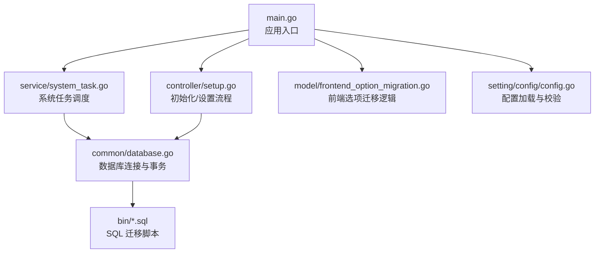
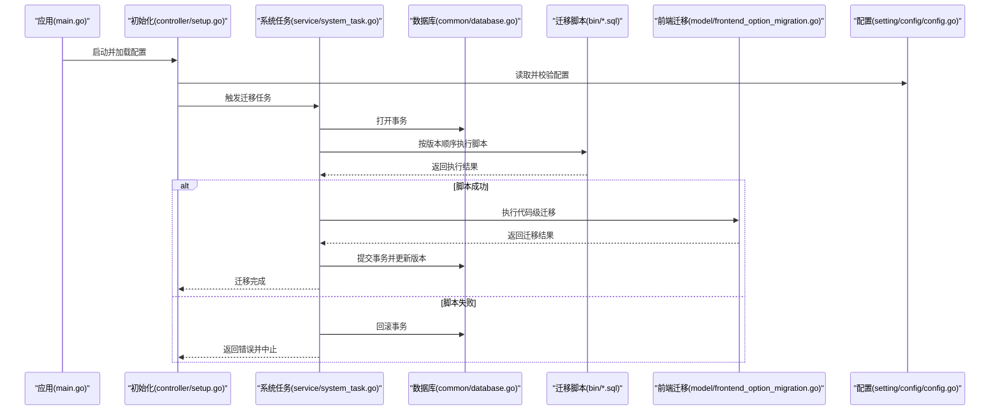
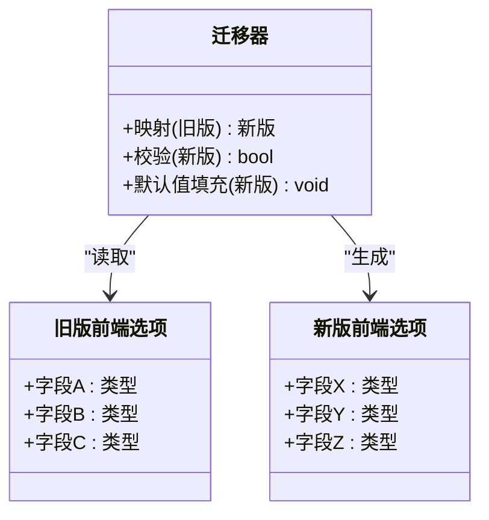
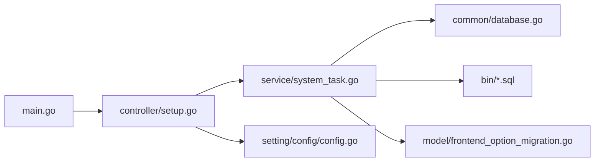

# 配置迁移

<cite>
**本文引用的文件**
- [main.go](file://main.go)
- [model/frontend_option_migration.go](file://model/frontend_option_migration.go)
- [model/frontend_option_migration_test.go](file://model/frontend_option_migration_test.go)
- [bin/migration_v0.2-v0.3.sql](file://bin/migration_v0.2-v0.3.sql)
- [bin/migration_v0.3-v0.4.sql](file://bin/migration_v0.3-v0.4.sql)
- [setting/config/config.go](file://setting/config/config.go)
- [common/database.go](file://common/database.go)
- [service/system_task.go](file://service/system_task.go)
- [controller/setup.go](file://controller/setup.go)
</cite>

## 目录
1. [简介](#简介)
2. [项目结构](#项目结构)
3. [核心组件](#核心组件)
4. [架构总览](#架构总览)
5. [详细组件分析](#详细组件分析)
6. [依赖关系分析](#依赖关系分析)
7. [性能考虑](#性能考虑)
8. [故障排除指南](#故障排除指南)
9. [结论](#结论)
10. [附录](#附录)

## 简介
本文件围绕“配置迁移系统”展开，聚焦以下目标：
- 解释配置版本的兼容性处理策略与实现思路
- 说明自动迁移机制、执行顺序与回滚策略
- 提供来自实际代码库的示例路径，展示如何编写配置迁移脚本和处理数据格式变更
- 记录迁移脚本命名规范、执行顺序与错误恢复机制
- 阐述配置结构的版本演进、向后兼容性保证与迁移测试方法
- 给出最佳实践与故障排除建议

## 项目结构
与配置迁移相关的代码主要分布在以下位置：
- SQL 迁移脚本：bin 目录下按版本号命名的 .sql 文件
- 前端选项迁移逻辑：model/frontend_option_migration.go 及其测试
- 配置加载与校验：setting/config/config.go
- 数据库初始化与连接：common/database.go
- 系统任务与启动流程：service/system_task.go、controller/setup.go、main.go

图表来源
- [main.go:1-200](file://main.go#L1-L200)
- [service/system_task.go:1-200](file://service/system_task.go#L1-L200)
- [controller/setup.go:1-200](file://controller/setup.go#L1-L200)
- [common/database.go:1-200](file://common/database.go#L1-L200)
- [bin/migration_v0.2-v0.3.sql:1-200](file://bin/migration_v0.2-v0.3.sql#L1-L200)
- [bin/migration_v0.3-v0.4.sql:1-200](file://bin/migration_v0.3-v0.4.sql#L1-L200)
- [model/frontend_option_migration.go:1-200](file://model/frontend_option_migration.go#L1-L200)
- [setting/config/config.go:1-200](file://setting/config/config.go#L1-L200)

章节来源
- [main.go:1-200](file://main.go#L1-L200)
- [service/system_task.go:1-200](file://service/system_task.go#L1-L200)
- [controller/setup.go:1-200](file://controller/setup.go#L1-L200)
- [common/database.go:1-200](file://common/database.go#L1-L200)
- [bin/migration_v0.2-v0.3.sql:1-200](file://bin/migration_v0.2-v0.3.sql#L1-L200)
- [bin/migration_v0.3-v0.4.sql:1-200](file://bin/migration_v0.3-v0.4.sql#L1-L200)
- [model/frontend_option_migration.go:1-200](file://model/frontend_option_migration.go#L1-L200)
- [setting/config/config.go:1-200](file://setting/config/config.go#L1-L200)

## 核心组件
- SQL 迁移脚本（bin/*.sql）
  - 命名规范：migration_起始版本_终止版本.sql，例如 v0.2-v0.3、v0.3-v0.4
  - 内容组织：DDL/DML 语句按幂等性原则编写，支持重复执行不破坏数据
  - 执行方式：由系统启动或初始化阶段按版本顺序执行
- 前端选项迁移（model/frontend_option_migration.go）
  - 负责将旧版前端选项结构迁移到新版结构
  - 包含字段映射、默认值填充、类型转换与校验
  - 配套单元测试覆盖边界情况与异常路径
- 配置加载与校验（setting/config/config.go）
  - 读取配置文件与环境变量，合并并校验必填项
  - 在迁移前后进行一致性检查，确保新结构可用
- 数据库连接与事务（common/database.go）
  - 提供连接池、事务封装、重试与超时控制
  - 为迁移脚本提供稳定的执行环境
- 系统任务与初始化（service/system_task.go、controller/setup.go、main.go）
  - 启动时检测当前版本与目标版本
  - 按顺序执行迁移脚本与代码级迁移逻辑
  - 失败时回滚或进入安全模式，避免脏数据

章节来源
- [bin/migration_v0.2-v0.3.sql:1-200](file://bin/migration_v0.2-v0.3.sql#L1-L200)
- [bin/migration_v0.3-v0.4.sql:1-200](file://bin/migration_v0.3-v0.4.sql#L1-L200)
- [model/frontend_option_migration.go:1-200](file://model/frontend_option_migration.go#L1-L200)
- [model/frontend_option_migration_test.go:1-200](file://model/frontend_option_migration_test.go#L1-L200)
- [setting/config/config.go:1-200](file://setting/config/config.go#L1-L200)
- [common/database.go:1-200](file://common/database.go#L1-L200)
- [service/system_task.go:1-200](file://service/system_task.go#L1-L200)
- [controller/setup.go:1-200](file://controller/setup.go#L1-L200)
- [main.go:1-200](file://main.go#L1-L200)

## 架构总览
配置迁移的整体流程如下：
- 应用启动后，读取当前配置版本与目标版本
- 若存在差异，则按版本顺序执行 SQL 迁移脚本与代码级迁移逻辑
- 每次迁移在独立事务中执行，失败即回滚并记录错误
- 迁移完成后更新版本标记，确保幂等性

图表来源
- [main.go:1-200](file://main.go#L1-L200)
- [controller/setup.go:1-200](file://controller/setup.go#L1-L200)
- [service/system_task.go:1-200](file://service/system_task.go#L1-L200)
- [common/database.go:1-200](file://common/database.go#L1-L200)
- [bin/migration_v0.2-v0.3.sql:1-200](file://bin/migration_v0.2-v0.3.sql#L1-L200)
- [bin/migration_v0.3-v0.4.sql:1-200](file://bin/migration_v0.3-v0.4.sql#L1-L200)
- [model/frontend_option_migration.go:1-200](file://model/frontend_option_migration.go#L1-L200)
- [setting/config/config.go:1-200](file://setting/config/config.go#L1-L200)

## 详细组件分析

### SQL 迁移脚本（bin/*.sql）
- 命名规范
  - 使用 migration_起始版本_终止版本.sql 的形式，便于排序与识别
  - 示例：migration_v0.2-v0.3.sql、migration_v0.3-v0.4.sql
- 执行顺序
  - 按文件名自然排序执行，确保从低版本到高版本逐步升级
- 幂等性与回滚
  - 脚本应设计为幂等，重复执行不会造成副作用
  - 建议在关键步骤前备份或创建临时表，以便失败时快速回滚
- 错误处理
  - 遇到错误立即停止后续脚本，记录详细日志
  - 提供可逆操作（如新增列后再删除旧列）以降低风险

章节来源
- [bin/migration_v0.2-v0.3.sql:1-200](file://bin/migration_v0.2-v0.3.sql#L1-L200)
- [bin/migration_v0.3-v0.4.sql:1-200](file://bin/migration_v0.3-v0.4.sql#L1-L200)

### 前端选项迁移（model/frontend_option_migration.go）
- 职责
  - 将旧版前端选项结构转换为新版结构
  - 处理字段重命名、类型转换、默认值填充与校验
- 数据结构
  - 定义旧版与新版的结构体，并提供映射函数
  - 对缺失字段进行安全默认值填充
- 测试
  - 覆盖正常路径、边界条件与异常场景
  - 验证迁移后的结构与业务逻辑一致

图表来源
- [model/frontend_option_migration.go:1-200](file://model/frontend_option_migration.go#L1-L200)

章节来源
- [model/frontend_option_migration.go:1-200](file://model/frontend_option_migration.go#L1-L200)
- [model/frontend_option_migration_test.go:1-200](file://model/frontend_option_migration_test.go#L1-L200)

### 配置加载与校验（setting/config/config.go）
- 功能
  - 读取配置文件与环境变量，合并为最终配置
  - 校验必填项与取值范围，确保迁移前后配置有效
- 版本兼容
  - 支持多版本配置键名，优先使用新版本键，回退到旧版本键
  - 在迁移过程中进行一致性检查，防止脏配置进入运行态

章节来源
- [setting/config/config.go:1-200](file://setting/config/config.go#L1-L200)

### 数据库连接与事务（common/database.go）
- 功能
  - 管理连接池、超时与重试
  - 提供事务封装，确保迁移脚本原子执行
- 错误恢复
  - 捕获异常并回滚事务，记录错误上下文
  - 提供健康检查与连接状态监控

章节来源
- [common/database.go:1-200](file://common/database.go#L1-L200)

### 系统任务与初始化（service/system_task.go、controller/setup.go、main.go）
- 启动流程
  - main.go 初始化应用上下文
  - controller/setup.go 加载配置并触发迁移任务
  - service/system_task.go 按版本顺序执行迁移脚本与代码级迁移
- 错误处理
  - 任一阶段失败即中止并回滚，避免部分迁移导致不一致
  - 记录详细日志与堆栈信息，便于定位问题

章节来源
- [main.go:1-200](file://main.go#L1-L200)
- [controller/setup.go:1-200](file://controller/setup.go#L1-L200)
- [service/system_task.go:1-200](file://service/system_task.go#L1-L200)

## 依赖关系分析
- 模块耦合
  - 迁移任务依赖数据库连接与事务能力
  - 前端迁移逻辑依赖配置加载与校验
  - SQL 脚本与代码级迁移需保持版本一致
- 外部依赖
  - 数据库驱动与连接池
  - 配置文件解析与环境变量读取
- 潜在循环依赖
  - 通过分层与接口隔离避免循环依赖
  - 迁移逻辑与业务逻辑解耦，降低耦合度

图表来源
- [main.go:1-200](file://main.go#L1-L200)
- [controller/setup.go:1-200](file://controller/setup.go#L1-L200)
- [service/system_task.go:1-200](file://service/system_task.go#L1-L200)
- [common/database.go:1-200](file://common/database.go#L1-L200)
- [bin/migration_v0.2-v0.3.sql:1-200](file://bin/migration_v0.2-v0.3.sql#L1-L200)
- [bin/migration_v0.3-v0.4.sql:1-200](file://bin/migration_v0.3-v0.4.sql#L1-L200)
- [model/frontend_option_migration.go:1-200](file://model/frontend_option_migration.go#L1-L200)
- [setting/config/config.go:1-200](file://setting/config/config.go#L1-L200)

章节来源
- [main.go:1-200](file://main.go#L1-L200)
- [controller/setup.go:1-200](file://controller/setup.go#L1-L200)
- [service/system_task.go:1-200](file://service/system_task.go#L1-L200)
- [common/database.go:1-200](file://common/database.go#L1-L200)
- [bin/migration_v0.2-v0.3.sql:1-200](file://bin/migration_v0.2-v0.3.sql#L1-L200)
- [bin/migration_v0.3-v0.4.sql:1-200](file://bin/migration_v0.3-v0.4.sql#L1-L200)
- [model/frontend_option_migration.go:1-200](file://model/frontend_option_migration.go#L1-L200)
- [setting/config/config.go:1-200](file://setting/config/config.go#L1-L200)

## 性能考虑
- 批量执行
  - 将多条 DDL/DML 合并为单次事务，减少网络往返
- 索引与锁
  - 避免在大表上频繁加锁，必要时分批次迁移
- 缓存与预热
  - 迁移完成后清理相关缓存，避免脏读
- 监控与告警
  - 记录迁移耗时与错误率，设置阈值告警

[本节为通用指导，无需引用具体文件]

## 故障排除指南
- 常见问题
  - 脚本执行失败：检查语法、权限与依赖对象是否存在
  - 数据不一致：核对迁移前后数据量与关键字段
  - 配置冲突：确认新旧键名共存时的优先级与默认值
- 排查步骤
  - 查看迁移日志与错误堆栈
  - 回滚到上一版本并复现问题
  - 使用最小数据集验证迁移逻辑
- 恢复策略
  - 使用备份恢复数据库
  - 重新执行幂等脚本
  - 修正配置后重启服务

章节来源
- [common/database.go:1-200](file://common/database.go#L1-L200)
- [service/system_task.go:1-200](file://service/system_task.go#L1-L200)
- [model/frontend_option_migration_test.go:1-200](file://model/frontend_option_migration_test.go#L1-L200)

## 结论
本项目的配置迁移系统通过 SQL 脚本与代码级迁移相结合，实现了版本化、幂等且可回滚的迁移流程。配合严格的配置校验与事务保障，确保了数据一致性与系统稳定性。遵循命名规范、执行顺序与错误恢复机制，可有效降低迁移风险并提升可维护性。

[本节为总结，无需引用具体文件]

## 附录
- 最佳实践
  - 每个迁移脚本只解决一个版本差异，保持单一职责
  - 所有迁移脚本必须幂等，支持重复执行
  - 在迁移前后进行数据快照与校验
  - 为复杂迁移编写单元测试与集成测试
- 测试方法
  - 使用隔离数据库执行全量迁移
  - 对比迁移前后配置与数据结构
  - 模拟失败场景验证回滚逻辑

[本节为补充信息，无需引用具体文件]