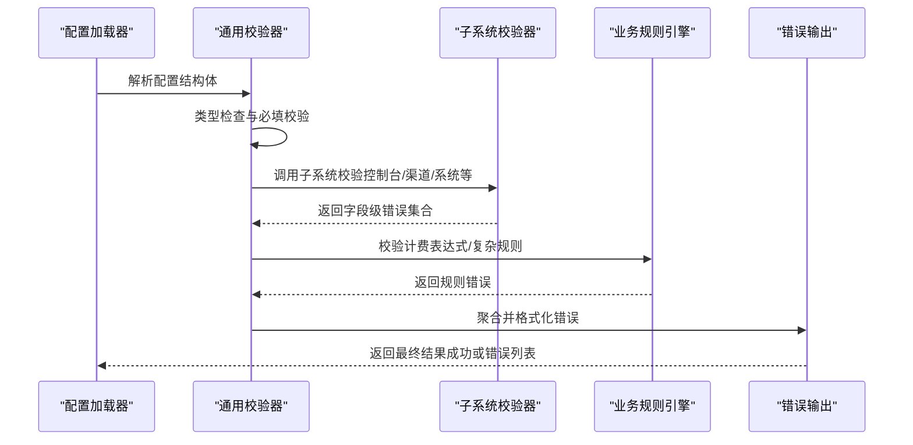
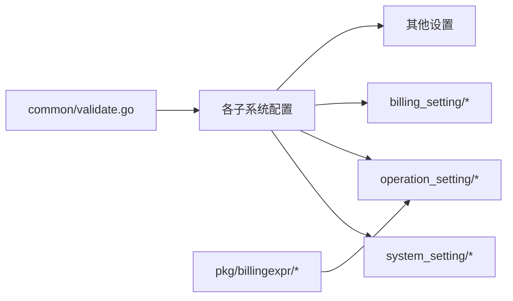

# 配置验证

<cite>
**本文引用的文件**   
- [common/validate.go](file://common/validate.go)
- [setting/config/config.go](file://setting/config/config.go)
- [setting/console_setting/validation.go](file://setting/console_setting/validation.go)
- [model/channel_settings_test.go](file://model/channel_settings_test.go)
- [dto/channel_settings.go](file://dto/channel_settings.go)
- [setting/ratio_setting/model_ratio.go](file://setting/ratio_setting/model_ratio.go)
- [setting/performance_setting/config.go](file://setting/performance_setting/config.go)
- [setting/system_setting/fetch_setting.go](file://setting/system_setting/fetch_setting.go)
- [setting/system_setting/passkey.go](file://setting/system_setting/passkey.go)
- [setting/system_setting/oidc.go](file://setting/system_setting/oidc.go)
- [setting/system_setting/discord.go](file://setting/system_setting/discord.go)
- [setting/system_setting/legal.go](file://setting/system_setting/legal.go)
- [setting/operation_setting/general_setting.go](file://setting/operation_setting/general_setting.go)
- [setting/operation_setting/payment_setting.go](file://setting/operation_setting/payment_setting.go)
- [setting/operation_setting/token_setting.go](file://setting/operation_setting/token_setting.go)
- [setting/operation_setting/quota_setting.go](file://setting/operation_setting/quota_setting.go)
- [setting/operation_setting/channel_affinity_setting.go](file://setting/operation_setting/channel_affinity_setting.go)
- [setting/operation_setting/status_code_ranges.go](file://setting/operation_setting/status_code_ranges.go)
- [setting/billing_setting/tiered_billing.go](file://setting/billing_setting/tiered_billing.go)
- [setting/midjourney.go](file://setting/midjourney.go)
- [setting/chat.go](file://setting/chat.go)
- [setting/sensitive.go](file://setting/sensitive.go)
- [setting/rate_limit.go](file://setting/rate_limit.go)
- [setting/user_usable_group.go](file://setting/user_usable_group.go)
- [setting/payment_creem.go](file://setting/payment_creem.go)
- [setting/payment_stripe.go](file://setting/payment_stripe.go)
- [setting/payment_waffo.go](file://setting/payment_waffo.go)
- [setting/payment_waffo_pancake.go](file://setting/payment_waffo_pancake.go)
- [pkg/billingexpr/types.go](file://pkg/billingexpr/types.go)
- [pkg/billingexpr/run.go](file://pkg/billingexpr/run.go)
- [pkg/billingexpr/compile.go](file://pkg/billingexpr/compile.go)
</cite>

## 目录
1. [简介](#简介)
2. [项目结构](#项目结构)
3. [核心组件](#核心组件)
4. [架构总览](#架构总览)
5. [详细组件分析](#详细组件分析)
6. [依赖关系分析](#依赖关系分析)
7. [性能考虑](#性能考虑)
8. [故障排查指南](#故障排查指南)
9. [结论](#结论)
10. [附录](#附录)

## 简介
本文件面向“配置验证系统”，系统性阐述配置项的类型检查、范围校验与业务规则校验机制，覆盖内置规则、自定义验证器开发方法、错误输出格式、执行时机、性能优化与批量验证策略。文档结合代码库中的实际实现进行说明，帮助读者快速理解并扩展验证能力。

## 项目结构
配置验证相关代码主要分布在以下模块：
- common/validate.go：通用校验工具与基础校验函数
- setting/*：各子系统配置定义与对应校验逻辑（如控制台设置、计费、性能、系统设置、运营设置等）
- dto/channel_settings.go：渠道设置的数据传输对象及校验入口
- model/channel_settings_test.go：渠道设置的测试用例，体现边界与异常场景
- pkg/billingexpr/*：计费表达式编译与运行，属于复杂业务规则验证的一部分

```mermaid
graph TB
subgraph "通用层"
V["common/validate.go"]
end
subgraph "配置定义与校验"
Cfg["setting/config/config.go"]
Console["setting/console_setting/validation.go"]
Perf["setting/performance_setting/config.go"]
Fetch["setting/system_setting/fetch_setting.go"]
Passkey["setting/system_setting/passkey.go"]
OIDC["setting/system_setting/oidc.go"]
Discord["setting/system_setting/discord.go"]
Legal["setting/system_setting/legal.go"]
General["setting/operation_setting/general_setting.go"]
Payment["setting/operation_setting/payment_setting.go"]
Token["setting/operation_setting/token_setting.go"]
Quota["setting/operation_setting/quota_setting.go"]
Affinity["setting/operation_setting/channel_affinity_setting.go"]
StatusCodes["setting/operation_setting/status_code_ranges.go"]
Tiered["setting/billing_setting/tiered_billing.go"]
Midjourney["setting/midjourney.go"]
Chat["setting/chat.go"]
Sensitive["setting/sensitive.go"]
RateLimit["setting/rate_limit.go"]
UsableGroup["setting/user_usable_group.go"]
PayCreem["setting/payment_creem.go"]
PayStripe["setting/payment_stripe.go"]
PayWaffo["setting/payment_waffo.go"]
PayWaffoPancake["setting/payment_waffo_pancake.go"]
end
subgraph "数据传输与模型"
DTO["dto/channel_settings.go"]
ModelTest["model/channel_settings_test.go"]
end
subgraph "业务规则引擎"
ExprTypes["pkg/billingexpr/types.go"]
ExprRun["pkg/billingexpr/run.go"]
ExprCompile["pkg/billingexpr/compile.go"]
end
V --> Cfg
V --> DTO
V --> ModelTest
Cfg --> Console
Cfg --> Perf
Cfg --> Fetch
Cfg --> Passkey
Cfg --> OIDC
Cfg --> Discord
Cfg --> Legal
Cfg --> General
Cfg --> Payment
Cfg --> Token
Cfg --> Quota
Cfg --> Affinity
Cfg --> StatusCodes
Cfg --> Tiered
Cfg --> Midjourney
Cfg --> Chat
Cfg --> Sensitive
Cfg --> RateLimit
Cfg --> UsableGroup
Cfg --> PayCreem
Cfg --> PayStripe
Cfg --> PayWaffo
Cfg --> PayWaffoPancake
DTO --> ModelTest
ExprTypes --> ExprCompile
ExprCompile --> ExprRun
```

**图表来源** 
- [common/validate.go](file://common/validate.go)
- [setting/config/config.go](file://setting/config/config.go)
- [setting/console_setting/validation.go](file://setting/console_setting/validation.go)
- [dto/channel_settings.go](file://dto/channel_settings.go)
- [model/channel_settings_test.go](file://model/channel_settings_test.go)
- [pkg/billingexpr/types.go](file://pkg/billingexpr/types.go)
- [pkg/billingexpr/compile.go](file://pkg/billingexpr/compile.go)
- [pkg/billingexpr/run.go](file://pkg/billingexpr/run.go)

**章节来源**
- [common/validate.go](file://common/validate.go)
- [setting/config/config.go](file://setting/config/config.go)

## 核心组件
- 通用校验工具（common/validate.go）
  - 提供类型断言、空值检查、数值范围、字符串长度、URL/邮箱格式等基础校验函数
  - 支持组合多个校验条件，统一返回结构化错误信息
- 配置结构与校验入口（setting/config/config.go）
  - 定义全局配置结构体，并在加载后触发相应子系统的校验流程
- 控制台设置校验（setting/console_setting/validation.go）
  - 针对控制台功能开关、界面选项等进行合法性校验
- 渠道设置DTO与测试（dto/channel_settings.go, model/channel_settings_test.go）
  - 定义渠道相关配置的传输对象，包含字段级校验；测试覆盖边界与异常路径

**章节来源**
- [common/validate.go](file://common/validate.go)
- [setting/config/config.go](file://setting/config/config.go)
- [setting/console_setting/validation.go](file://setting/console_setting/validation.go)
- [dto/channel_settings.go](file://dto/channel_settings.go)
- [model/channel_settings_test.go](file://model/channel_settings_test.go)

## 架构总览
配置验证的整体流程如下：
- 配置加载阶段：读取配置文件或环境变量，解析为结构体
- 类型检查：确保字段类型正确，缺失必填字段时立即报错
- 范围校验：对数值、枚举、长度、时间窗口等进行边界检查
- 业务规则校验：跨字段依赖、外部服务可用性、表达式合法性等
- 错误聚合：收集所有错误并格式化输出，便于前端展示与调试

**图表来源** 
- [common/validate.go](file://common/validate.go)
- [setting/config/config.go](file://setting/config/config.go)
- [setting/console_setting/validation.go](file://setting/console_setting/validation.go)
- [pkg/billingexpr/compile.go](file://pkg/billingexpr/compile.go)
- [pkg/billingexpr/run.go](file://pkg/billingexpr/run.go)

## 详细组件分析

### 通用校验器（common/validate.go）
- 职责
  - 提供统一的校验函数族：非空、最小/最大、区间、正则、枚举、URL、邮箱等
  - 支持链式组合与批量校验，返回标准化错误结构
- 设计要点
  - 错误信息可本地化，便于多语言展示
  - 支持上下文定位（字段路径），利于前端高亮错误位置
- 使用建议
  - 在DTO/配置结构体的Validate方法中优先使用通用校验函数
  - 将复杂规则下沉到子系统或业务规则引擎

**章节来源**
- [common/validate.go](file://common/validate.go)

### 配置加载与集中校验（setting/config/config.go）
- 职责
  - 定义全局配置结构体，负责加载与分发校验任务
  - 协调子系统校验顺序，避免重复计算
- 设计要点
  - 分层校验：先类型与必填，再范围，最后业务规则
  - 支持热重载时的增量校验，减少全量开销

**章节来源**
- [setting/config/config.go](file://setting/config/config.go)

### 控制台设置校验（setting/console_setting/validation.go）
- 职责
  - 校验控制台功能开关、页面布局、权限控制等配置
- 典型规则
  - 开关互斥、依赖关系（如开启某功能需同时启用其他开关）
  - 白名单/黑名单格式校验

**章节来源**
- [setting/console_setting/validation.go](file://setting/console_setting/validation.go)

### 渠道设置DTO与测试（dto/channel_settings.go, model/channel_settings_test.go）
- 职责
  - 定义渠道相关配置的字段与校验规则
  - 通过测试覆盖边界情况（空值、越界、非法枚举）
- 典型规则
  - 连接超时、重试次数、并发限制等数值范围
  - 密钥格式、签名算法选择等枚举约束

**章节来源**
- [dto/channel_settings.go](file://dto/channel_settings.go)
- [model/channel_settings_test.go](file://model/channel_settings_test.go)

### 计费表达式规则（pkg/billingexpr/*）
- 职责
  - 编译与运行计费表达式，用于动态定价、折扣、封顶等复杂业务规则
- 设计要点
  - 表达式语法安全沙箱，防止注入与无限循环
  - 运行时错误捕获与诊断信息输出

**章节来源**
- [pkg/billingexpr/types.go](file://pkg/billingexpr/types.go)
- [pkg/billingexpr/compile.go](file://pkg/billingexpr/compile.go)
- [pkg/billingexpr/run.go](file://pkg/billingexpr/run.go)

### 系统设置校验（setting/system_setting/*）
- 涵盖模块
  - fetch_setting.go：抓取行为、超时、重试策略
  - passkey.go：Passkey认证参数校验
  - oidc.go：OIDC提供者配置合法性
  - discord.go：Discord集成参数校验
  - legal.go：法律声明与隐私条款相关配置
- 典型规则
  - URL有效性、证书指纹格式、回调地址白名单
  - 第三方服务ID/Secret的格式与长度

**章节来源**
- [setting/system_setting/fetch_setting.go](file://setting/system_setting/fetch_setting.go)
- [setting/system_setting/passkey.go](file://setting/system_setting/passkey.go)
- [setting/system_setting/oidc.go](file://setting/system_setting/oidc.go)
- [setting/system_setting/discord.go](file://setting/system_setting/discord.go)
- [setting/system_setting/legal.go](file://setting/system_setting/legal.go)

### 运营设置校验（setting/operation_setting/*）
- 涵盖模块
  - general_setting.go：通用运营开关与阈值
  - payment_setting.go：支付网关配置校验
  - token_setting.go：令牌生命周期、刷新策略
  - quota_setting.go：配额与限流策略
  - channel_affinity_setting.go：渠道亲和性路由规则
  - status_code_ranges.go：状态码映射与处理规则
- 典型规则
  - 支付回调地址、签名算法、币种精度
  - 令牌过期时间、刷新间隔、最大并发
  - 配额上限、冷却时间、熔断阈值
  - 路由权重、健康检查间隔

**章节来源**
- [setting/operation_setting/general_setting.go](file://setting/operation_setting/general_setting.go)
- [setting/operation_setting/payment_setting.go](file://setting/operation_setting/payment_setting.go)
- [setting/operation_setting/token_setting.go](file://setting/operation_setting/token_setting.go)
- [setting/operation_setting/quota_setting.go](file://setting/operation_setting/quota_setting.go)
- [setting/operation_setting/channel_affinity_setting.go](file://setting/operation_setting/channel_affinity_setting.go)
- [setting/operation_setting/status_code_ranges.go](file://setting/operation_setting/status_code_ranges.go)

### 其他配置模块校验
- 计费分层（setting/billing_setting/tiered_billing.go）
- 媒体与聊天（setting/midjourney.go, setting/chat.go）
- 敏感词过滤（setting/sensitive.go）
- 速率限制（setting/rate_limit.go）
- 用户可用组（setting/user_usable_group.go）
- 支付网关（setting/payment_creem.go, setting/payment_stripe.go, setting/payment_waffo.go, setting/payment_waffo_pancake.go）

**章节来源**
- [setting/billing_setting/tiered_billing.go](file://setting/billing_setting/tiered_billing.go)
- [setting/midjourney.go](file://setting/midjourney.go)
- [setting/chat.go](file://setting/chat.go)
- [setting/sensitive.go](file://setting/sensitive.go)
- [setting/rate_limit.go](file://setting/rate_limit.go)
- [setting/user_usable_group.go](file://setting/user_usable_group.go)
- [setting/payment_creem.go](file://setting/payment_creem.go)
- [setting/payment_stripe.go](file://setting/payment_stripe.go)
- [setting/payment_waffo.go](file://setting/payment_waffo.go)
- [setting/payment_waffo_pancake.go](file://setting/payment_waffo_pancake.go)

## 依赖关系分析
- 耦合度
  - 通用校验器被所有子系统复用，低耦合高内聚
  - 子系统校验器之间尽量解耦，通过配置加载器协调顺序
- 外部依赖
  - 第三方服务（支付、OIDC、Discord等）的配置校验需保证格式与可达性
  - 计费表达式引擎需隔离执行环境，避免影响主进程
- 潜在循环依赖
  - 避免子系统间直接互相引用，通过接口或事件总线通信

**图表来源** 
- [common/validate.go](file://common/validate.go)
- [setting/system_setting/fetch_setting.go](file://setting/system_setting/fetch_setting.go)
- [setting/operation_setting/general_setting.go](file://setting/operation_setting/general_setting.go)
- [setting/billing_setting/tiered_billing.go](file://setting/billing_setting/tiered_billing.go)
- [pkg/billingexpr/types.go](file://pkg/billingexpr/types.go)

**章节来源**
- [common/validate.go](file://common/validate.go)
- [setting/config/config.go](file://setting/config/config.go)

## 性能考虑
- 校验顺序优化
  - 先做轻量级类型与必填校验，再做重量的范围与业务规则校验
- 缓存与增量校验
  - 对热点配置（如渠道亲和性、状态码映射）进行缓存，变更时仅重新校验受影响部分
- 并行校验
  - 子系统校验相互独立时可并行执行，缩短整体耗时
- 表达式引擎优化
  - 预编译计费表达式，运行时避免重复解析
  - 限制表达式复杂度与执行时长，防止资源耗尽

[本节为通用指导，不直接分析具体文件]

## 故障排查指南
- 常见错误类型
  - 类型不匹配：字段类型与期望不符
  - 必填缺失：缺少必要配置项
  - 范围越界：数值超出允许区间
  - 格式非法：URL、邮箱、密钥等格式不正确
  - 业务规则失败：跨字段依赖或外部服务不可用
- 定位技巧
  - 查看错误路径（字段层级），快速定位问题配置
  - 启用详细日志，记录校验输入与中间结果
  - 使用单元测试复现边界场景，验证修复效果
- 恢复策略
  - 提供默认回退值，保障服务可用性
  - 分阶段灰度发布配置变更，观察错误率

**章节来源**
- [model/channel_settings_test.go](file://model/channel_settings_test.go)
- [setting/console_setting/validation.go](file://setting/console_setting/validation.go)

## 结论
配置验证系统是保障系统稳定性与安全性的关键基础设施。通过分层校验（类型、范围、业务规则）、统一错误输出、性能优化与批量验证策略，能够有效降低配置错误带来的风险。建议在实际项目中遵循本文最佳实践，持续完善校验规则与调试能力。

[本节为总结性内容，不直接分析具体文件]

## 附录
- 内置验证规则清单（示例）
  - 非空校验、最小/最大值、区间、长度、正则、枚举、URL、邮箱、IP、时间戳
- 自定义验证器开发步骤
  - 定义校验函数，接收配置片段与上下文
  - 返回结构化错误（字段路径、错误码、消息）
  - 在子系统校验入口注册并调用
- 错误格式化输出
  - 统一错误结构，包含字段路径、错误码、人类可读消息
  - 支持多语言本地化
- 执行时机
  - 配置加载后立即执行类型与必填校验
  - 启动前执行范围与业务规则校验
  - 热重载时执行增量校验
- 批量验证策略
  - 收集所有错误，一次性返回，便于前端统一展示
  - 按优先级排序，优先显示阻塞性错误

[本节为概念性内容，不直接分析具体文件]