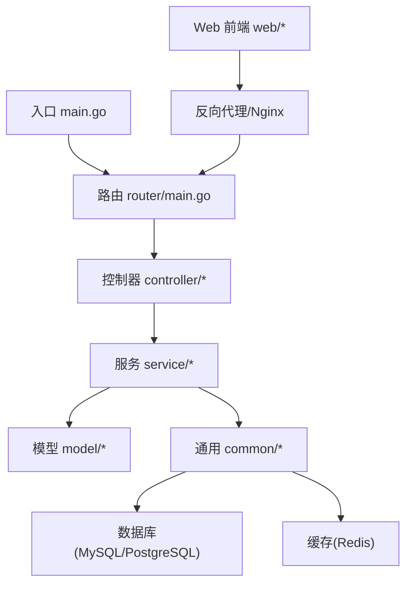
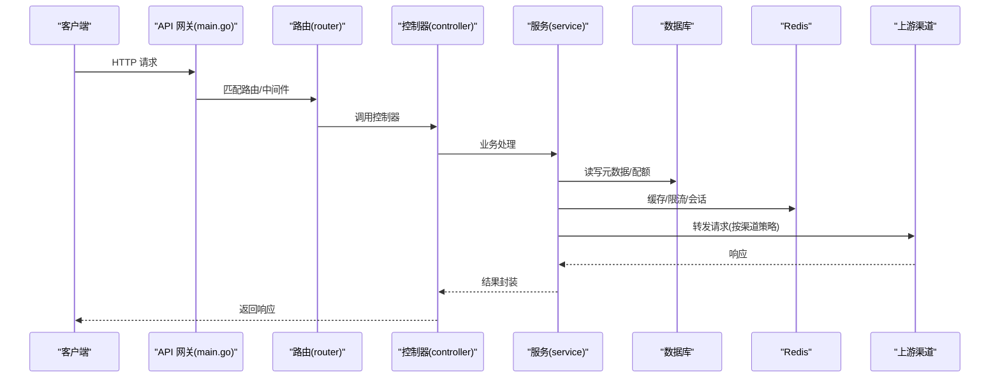
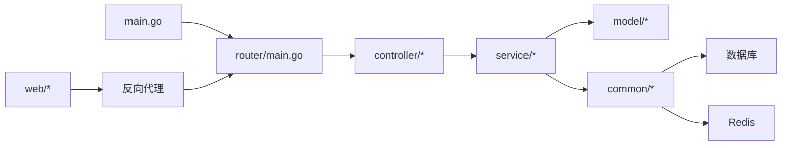

# 快速开始

<cite>
**本文引用的文件**   
- [README.zh_CN.md](file://README.zh_CN.md)
- [Dockerfile](file://Dockerfile)
- [docker-compose.yml](file://docker-compose.yml)
- [docker-compose.dev.yml](file://docker-compose.dev.yml)
- [main.go](file://main.go)
- [go.mod](file://go.mod)
- [setting/config/config.go](file://setting/config/config.go)
- [common/redis.go](file://common/redis.go)
- [common/database.go](file://common/database.go)
- [router/main.go](file://router/main.go)
- [controller/setup.go](file://controller/setup.go)
- [model/setup.go](file://model/setup.go)
- [web/package.json](file://web/package.json)
- [start-backend.bat](file://start-backend.bat)
- [start-frontend.bat](file://start-frontend.bat)
</cite>

## 目录
1. [简介](#简介)
2. [项目结构](#项目结构)
3. [核心组件](#核心组件)
4. [架构总览](#架构总览)
5. [详细组件分析](#详细组件分析)
6. [依赖关系分析](#依赖关系分析)
7. [性能注意事项](#性能注意事项)
8. [故障排除指南](#故障排除指南)
9. [结论](#结论)
10. [附录](#附录)

## 简介
本快速开始指南面向首次接触 AI API 网关的用户，目标是在最短时间内完成安装、配置与验证，体验基本功能。内容涵盖：
- 环境要求与依赖项（Go 版本、数据库、Redis）
- Docker 一键部署与源码编译部署两种方式
- 最小化配置文件示例与启动命令
- 初始化设置（管理员账户创建、首个渠道配置）
- 常见问题排查与验证方法
- 前后端分离部署与单文件部署选项

## 项目结构
本项目采用 Go 后端 + Web 前端（React/RustBuild）的架构，支持容器化与源码构建。关键目录说明：
- 根目录：包含入口 main.go、Dockerfile、compose 文件、脚本等
- setting/config：配置加载与校验逻辑
- common：通用能力（数据库、Redis、限流、日志等）
- router：路由注册与中间件挂载
- controller：业务控制器（含初始化、渠道、计费、用户等）
- model：数据模型与迁移
- web：前端工程（包管理、构建配置）
- relay/channel：各上游厂商适配层

图表来源
- [main.go:1-200](file://main.go#L1-L200)
- [router/main.go:1-200](file://router/main.go#L1-L200)
- [setting/config/config.go:1-200](file://setting/config/config.go#L1-L200)
- [common/database.go:1-200](file://common/database.go#L1-L200)
- [common/redis.go:1-200](file://common/redis.go#L1-L200)

章节来源
- [README.zh_CN.md:1-200](file://README.zh_CN.md#L1-L200)
- [go.mod:1-100](file://go.mod#L1-L100)

## 核心组件
- 配置系统：集中式配置加载与环境变量覆盖，支持运行时读取
- 数据库：自动建表与迁移，支持 MySQL/PostgreSQL
- 缓存：Redis 作为会话、限流、配额与热点数据缓存
- 路由与中间件：统一鉴权、限流、审计、CORS、Gzip 等
- 渠道适配：多厂商 OpenAI/Claude/Gemini 等协议适配与计费
- 前端控制台：可视化配置、监控与使用统计

章节来源
- [setting/config/config.go:1-200](file://setting/config/config.go#L1-L200)
- [common/database.go:1-200](file://common/database.go#L1-L200)
- [common/redis.go:1-200](file://common/redis.go#L1-L200)
- [router/main.go:1-200](file://router/main.go#L1-L200)

## 架构总览
下图展示从请求进入网关到转发至上游渠道的核心流程，以及数据库与缓存的交互。

图表来源
- [main.go:1-200](file://main.go#L1-L200)
- [router/main.go:1-200](file://router/main.go#L1-L200)
- [controller/setup.go:1-200](file://controller/setup.go#L1-L200)
- [service/*:1-200](file://service/http.go#L1-L200)
- [common/database.go:1-200](file://common/database.go#L1-L200)
- [common/redis.go:1-200](file://common/redis.go#L1-L200)

## 详细组件分析

### 环境要求与依赖
- Go 语言：建议使用 go.mod 中声明的版本（见 go.mod）
- 数据库：MySQL 或 PostgreSQL（连接串通过环境变量或配置文件提供）
- Redis：用于会话、限流、配额与缓存
- 可选：Nginx（用于静态资源与反向代理）、Docker/Docker Compose

章节来源
- [go.mod:1-100](file://go.mod#L1-L100)
- [common/database.go:1-200](file://common/database.go#L1-L200)
- [common/redis.go:1-200](file://common/redis.go#L1-L200)

### Docker 部署（推荐）
- 使用 docker-compose 一键拉起后端、数据库与 Redis
- 镜像构建基于 Dockerfile，默认暴露端口供访问
- 可通过环境变量覆盖数据库与 Redis 连接信息

步骤概览：
1. 准备 docker-compose.yml 与 .env（数据库、Redis、端口等）
2. 执行 docker compose up -d
3. 访问控制台进行初始化设置

章节来源
- [docker-compose.yml:1-200](file://docker-compose.yml#L1-L200)
- [Dockerfile:1-200](file://Dockerfile#L1-L200)

### 源码编译部署
- 拉取源码后，使用 Go 工具链编译并运行
- 前端可独立构建并通过 Nginx 反代或直接由后端嵌入

步骤概览：
1. 安装 Go（版本参考 go.mod）
2. 编译后端：go build -o new-api
3. 启动后端：./new-api
4. 前端构建：在 web 目录下执行构建命令（参考 package.json）

章节来源
- [main.go:1-200](file://main.go#L1-L200)
- [go.mod:1-100](file://go.mod#L1-L100)
- [web/package.json:1-200](file://web/package.json#L1-L200)

### 最小化配置与启动命令
- 必需环境变量（示例键名）：
  - 数据库连接串：DATABASE_URL
  - Redis 连接串：REDIS_URL
  - 监听端口：PORT
- 启动命令（二进制）：./new-api
- 开发模式（Compose）：docker compose -f docker-compose.dev.yml up -d

章节来源
- [setting/config/config.go:1-200](file://setting/config/config.go#L1-L200)
- [common/database.go:1-200](file://common/database.go#L1-L200)
- [common/redis.go:1-200](file://common/redis.go#L1-L200)
- [docker-compose.dev.yml:1-200](file://docker-compose.dev.yml#L1-L200)

### 初始化设置（管理员与渠道）
- 首次启动后，访问控制台进行“初始化向导”
- 创建管理员账户并登录
- 添加第一个渠道（如 OpenAI/Claude/Gemini），填写密钥与基础参数
- 保存后，可在“渠道测试”页面验证连通性

章节来源
- [controller/setup.go:1-200](file://controller/setup.go#L1-L200)
- [model/setup.go:1-200](file://model/setup.go#L1-L200)

### 前后端分离部署
- 前端构建产物放置于 Nginx 或静态服务器
- 后端以独立进程运行，提供 API
- 通过 Nginx 将 /api 转发至后端，其余路径指向前端静态资源

章节来源
- [web/package.json:1-200](file://web/package.json#L1-L200)
- [router/main.go:1-200](file://router/main.go#L1-L200)

### 单文件部署选项
- 将前端资源嵌入后端，直接输出单一可执行文件
- 适合轻量级部署与快速演示

章节来源
- [Dockerfile:1-200](file://Dockerfile#L1-L200)
- [main.go:1-200](file://main.go#L1-L200)

## 依赖关系分析
- 入口 main.go 负责初始化配置、数据库、Redis、路由与中间件
- router 注册 API 与 Web 路由，挂载鉴权、限流、审计等中间件
- controller 处理具体业务，调用 service 层
- service 层协调 model、common（DB/Redis/限流/计费）与上游渠道
- web 前端通过反向代理与后端通信

图表来源
- [main.go:1-200](file://main.go#L1-L200)
- [router/main.go:1-200](file://router/main.go#L1-L200)
- [common/database.go:1-200](file://common/database.go#L1-L200)
- [common/redis.go:1-200](file://common/redis.go#L1-L200)

章节来源
- [go.mod:1-100](file://go.mod#L1-L100)

## 性能注意事项
- 合理设置 Redis 连接池与超时，避免阻塞
- 数据库连接池大小与慢查询优化
- 启用 Gzip 与缓存策略，减少带宽与重复计算
- 针对高频接口开启限流与熔断保护

[本节为通用指导，不直接分析具体文件]

## 故障排除指南
- 无法连接数据库：检查 DATABASE_URL、网络可达性与账号权限
- Redis 连接失败：检查 REDIS_URL、防火墙与密码
- 端口占用：修改 PORT 或释放占用端口
- 前端无法访问：确认 Nginx 反向代理与静态资源路径
- 渠道不可用：核对密钥、模型名称与基础 URL

章节来源
- [common/database.go:1-200](file://common/database.go#L1-L200)
- [common/redis.go:1-200](file://common/redis.go#L1-L200)
- [setting/config/config.go:1-200](file://setting/config/config.go#L1-L200)

## 结论
通过本指南，您可以在数分钟内完成 AI API 网关的安装与基础配置，体验渠道接入与请求转发的核心能力。建议在生产环境中完善安全、监控与备份策略，并根据实际负载调优数据库与缓存参数。

[本节为总结，不直接分析具体文件]

## 附录

### 常用命令速查
- Docker 启动：docker compose up -d
- 开发模式：docker compose -f docker-compose.dev.yml up -d
- 源码编译：go build -o new-api && ./new-api
- 前端构建：在 web 目录下执行构建命令（参考 package.json）

章节来源
- [docker-compose.yml:1-200](file://docker-compose.yml#L1-L200)
- [docker-compose.dev.yml:1-200](file://docker-compose.dev.yml#L1-L200)
- [main.go:1-200](file://main.go#L1-L200)
- [web/package.json:1-200](file://web/package.json#L1-L200)

### 验证安装是否成功
- 访问控制台首页，确认页面正常加载
- 登录后进入“渠道”，新增一个渠道并点击“测试”，应返回成功
- 发起一次简单的聊天请求（OpenAI 兼容接口），应获得响应

章节来源
- [controller/setup.go:1-200](file://controller/setup.go#L1-L200)
- [router/main.go:1-200](file://router/main.go#L1-L200)

### Windows 快捷脚本
- start-backend.bat：快速启动后端
- start-frontend.bat：快速启动前端开发服务器

章节来源
- [start-backend.bat:1-200](file://start-backend.bat#L1-L200)
- [start-frontend.bat:1-200](file://start-frontend.bat#L1-L200)