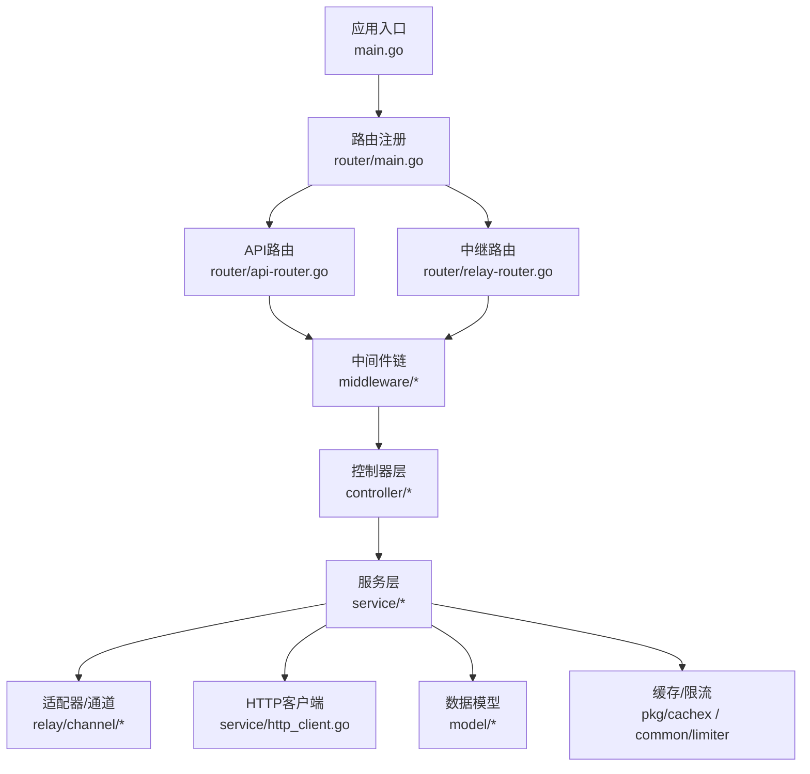
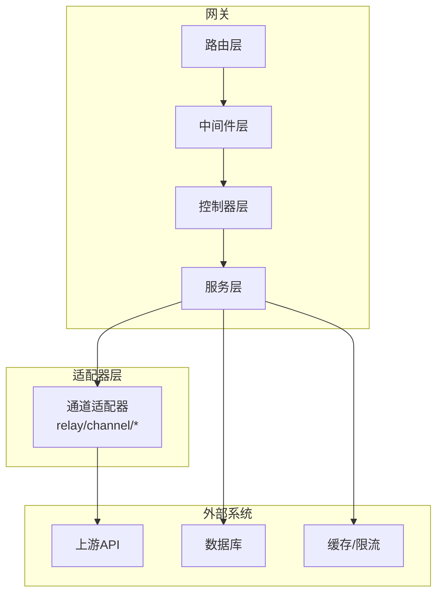
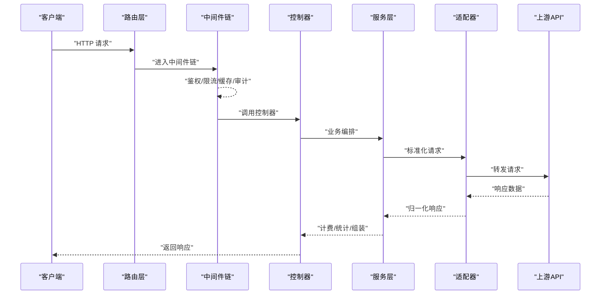
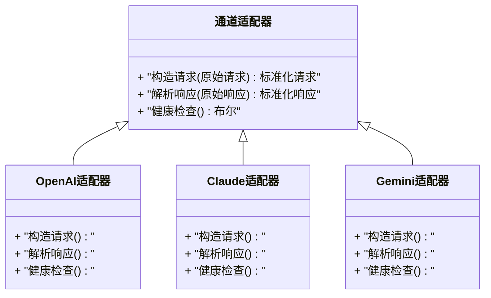
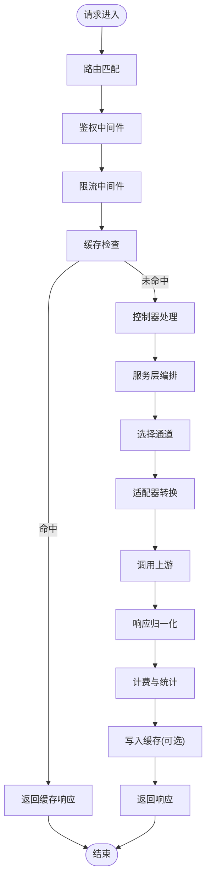
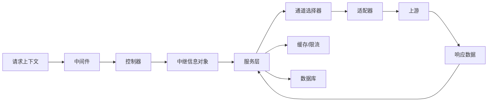
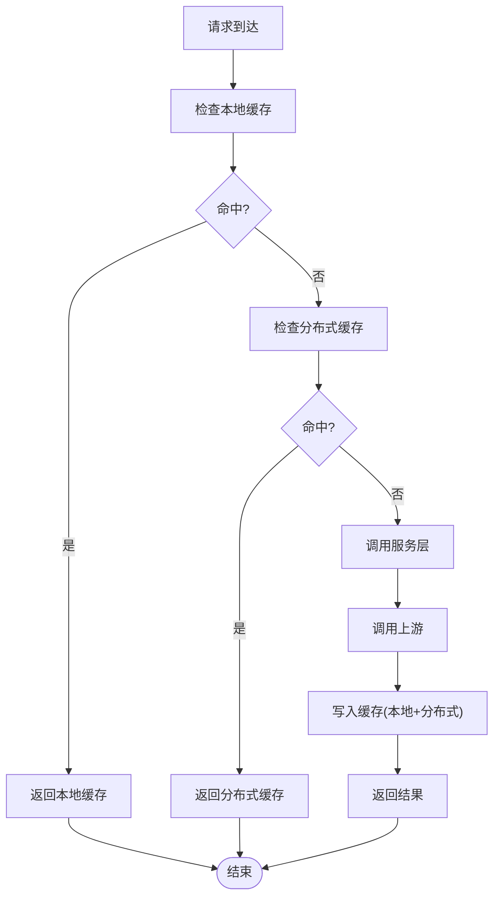
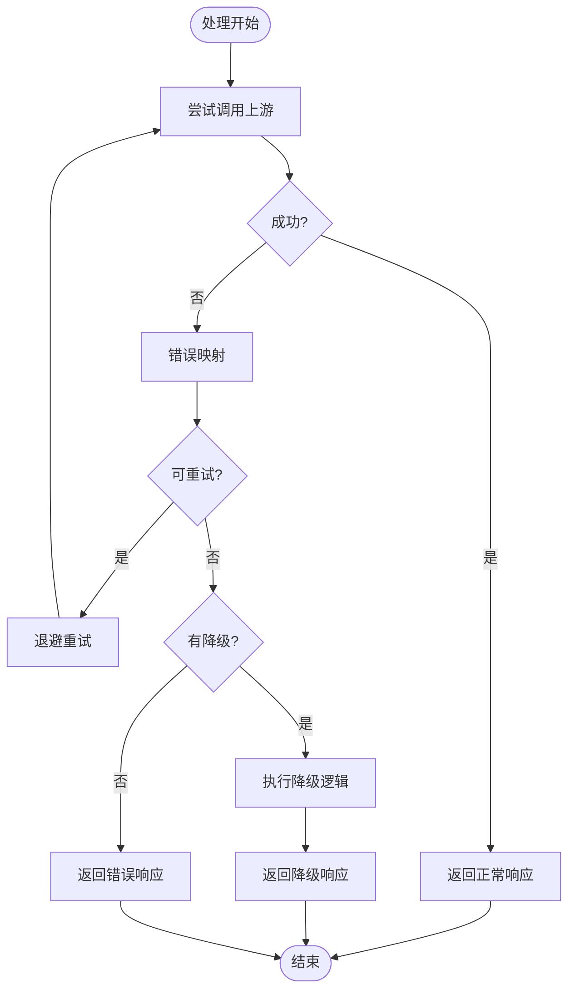
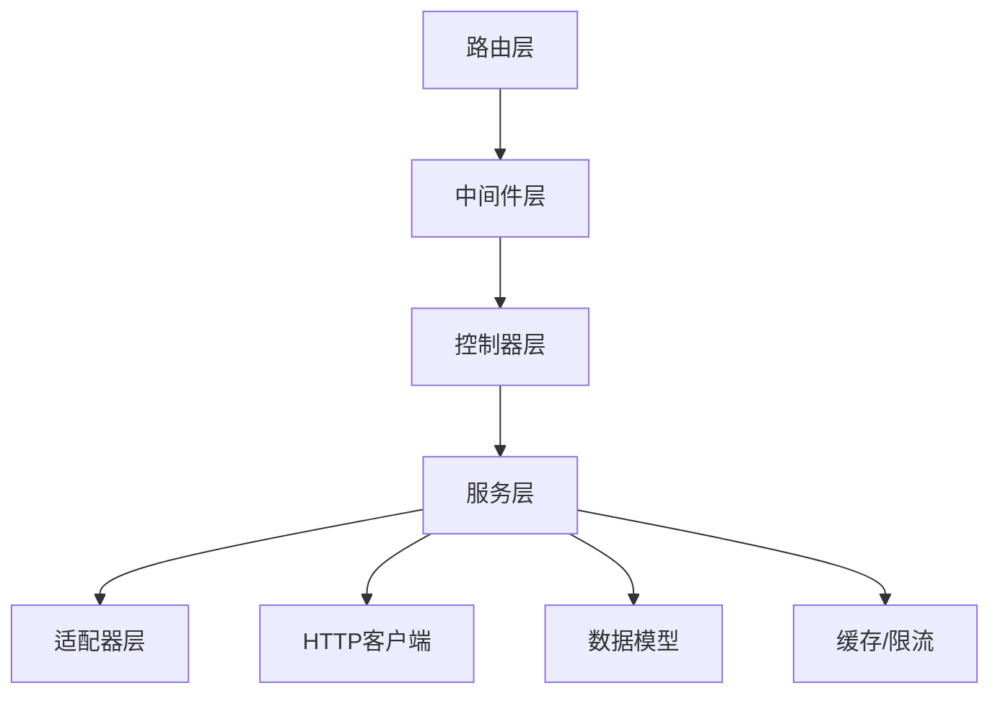

# 架构概览

<cite>
**本文引用的文件**   
- [main.go](file://main.go)
- [router/main.go](file://router/main.go)
- [router/api-router.go](file://router/api-router.go)
- [router/relay-router.go](file://router/relay-router.go)
- [middleware/auth.go](file://middleware/auth.go)
- [middleware/rate-limit.go](file://middleware/rate-limit.go)
- [middleware/cache.go](file://middleware/cache.go)
- [middleware/distributor.go](file://middleware/distributor.go)
- [common/limiter/limiter.go](file://common/limiter/limiter.go)
- [pkg/cachex/hybrid_cache.go](file://pkg/cachex/hybrid_cache.go)
- [relay/relay_adaptor.go](file://relay/relay_adaptor.go)
- [relay/channel/adapter.go](file://relay/channel/adapter.go)
- [relay/common/relay_info.go](file://relay/common/relay_info.go)
- [service/http_client.go](file://service/http_client.go)
- [model/channel.go](file://model/channel.go)
- [controller/relay.go](file://controller/relay.go)
</cite>

## 目录
1. [简介](#简介)
2. [项目结构](#项目结构)
3. [核心组件](#核心组件)
4. [架构总览](#架构总览)
5. [详细组件分析](#详细组件分析)
6. [依赖关系分析](#依赖关系分析)
7. [性能考量](#性能考量)
8. [故障排查指南](#故障排查指南)
9. [结论](#结论)
10. [附录](#附录)

## 简介
本文件为AI API网关的架构概览文档，面向希望快速理解系统整体设计与关键实现细节的读者。文档围绕微服务架构、中间件模式与适配器模式展开，解释路由层、中间件层、业务逻辑层与数据访问层的职责划分；梳理从HTTP请求进入至响应返回的完整链路；说明数据流向与状态管理、缓存策略与性能优化、错误处理与异常恢复机制；并给出扩展点与插件化设计思路，辅以架构图与交互流程图，帮助读者在高层设计与落地实现之间建立清晰映射。

## 项目结构
本项目采用分层与按功能域组织相结合的结构：
- 入口与路由：main.go负责应用启动与全局初始化；router下按模块拆分路由（API、中继、Web等）。
- 中间件：middleware提供鉴权、限流、缓存、分发、日志等横切能力。
- 业务逻辑：controller处理具体业务控制器；service封装领域服务与外部调用；relay负责协议适配与上游转发。
- 数据模型与存储：model定义实体与持久化相关逻辑；common/pkg提供通用工具、缓存、限流等基础设施。
- 前端：web目录包含React前端资源与构建配置。

图表来源
- [main.go:1-200](file://main.go#L1-L200)
- [router/main.go:1-200](file://router/main.go#L1-L200)
- [router/api-router.go:1-200](file://router/api-router.go#L1-L200)
- [router/relay-router.go:1-200](file://router/relay-router.go#L1-L200)

章节来源
- [main.go:1-200](file://main.go#L1-L200)
- [router/main.go:1-200](file://router/main.go#L1-L200)
- [router/api-router.go:1-200](file://router/api-router.go#L1-L200)
- [router/relay-router.go:1-200](file://router/relay-router.go#L1-L200)

## 核心组件
- 路由层：集中注册REST与中继接口，统一挂载中间件链，完成路径匹配与上下文初始化。
- 中间件层：提供鉴权、限流、缓存、压缩、请求体限制、审计、统计等横切能力，保证可插拔与组合性。
- 业务逻辑层：控制器接收请求参数并进行校验，服务层编排业务流程（计费、配额、选择通道、转换请求、调用上游、聚合结果）。
- 数据访问层：通过model与ORM/存储抽象进行持久化操作；同时通过service/http_client与第三方上游通信。
- 适配器层：将不同上游厂商的协议转换为内部统一格式，屏蔽差异，支持多通道与动态扩展。

章节来源
- [router/api-router.go:1-200](file://router/api-router.go#L1-L200)
- [router/relay-router.go:1-200](file://router/relay-router.go#L1-L200)
- [middleware/auth.go:1-200](file://middleware/auth.go#L1-L200)
- [middleware/rate-limit.go:1-200](file://middleware/rate-limit.go#L1-L200)
- [controller/relay.go:1-200](file://controller/relay.go#L1-L200)
- [relay/relay_adaptor.go:1-200](file://relay/relay_adaptor.go#L1-L200)
- [relay/channel/adapter.go:1-200](file://relay/channel/adapter.go#L1-L200)

## 架构总览
系统采用“网关+适配器”的微服务模式：
- 网关作为统一入口，承载鉴权、限流、缓存、审计等通用能力。
- 业务层根据模型与渠道配置选择合适通道，并通过适配器将请求标准化后转发到上游。
- 上游响应经适配器归一化后回写网关，由中间件与控制器完成计费、统计与返回。

图表来源
- [router/main.go:1-200](file://router/main.go#L1-L200)
- [middleware/auth.go:1-200](file://middleware/auth.go#L1-L200)
- [controller/relay.go:1-200](file://controller/relay.go#L1-L200)
- [relay/channel/adapter.go:1-200](file://relay/channel/adapter.go#L1-L200)
- [service/http_client.go:1-200](file://service/http_client.go#L1-L200)

## 详细组件分析

### 路由与中间件链
- 路由注册：按模块划分，API路由与中继路由分别挂载不同的中间件组合。
- 中间件链：鉴权→限流→缓存→请求体限制→审计→统计→业务处理器。每个中间件独立且可组合，便于按需启用与调试。
- 上下文传递：请求ID、用户信息、租户标识等在中间件中注入，贯穿后续处理。

图表来源
- [router/api-router.go:1-200](file://router/api-router.go#L1-L200)
- [router/relay-router.go:1-200](file://router/relay-router.go#L1-L200)
- [middleware/auth.go:1-200](file://middleware/auth.go#L1-L200)
- [middleware/rate-limit.go:1-200](file://middleware/rate-limit.go#L1-L200)
- [controller/relay.go:1-200](file://controller/relay.go#L1-L200)
- [relay/channel/adapter.go:1-200](file://relay/channel/adapter.go#L1-L200)

章节来源
- [router/api-router.go:1-200](file://router/api-router.go#L1-L200)
- [router/relay-router.go:1-200](file://router/relay-router.go#L1-L200)
- [middleware/auth.go:1-200](file://middleware/auth.go#L1-L200)
- [middleware/rate-limit.go:1-200](file://middleware/rate-limit.go#L1-L200)

### 适配器模式与通道扩展
- 适配器接口：定义统一的请求/响应转换方法，屏蔽上游差异。
- 通道实现：各厂商或协议以独立包实现适配器，便于热插拔与灰度发布。
- 选择策略：服务层依据模型、权重、亲和性与健康状态选择通道。

图表来源
- [relay/relay_adaptor.go:1-200](file://relay/relay_adaptor.go#L1-L200)
- [relay/channel/adapter.go:1-200](file://relay/channel/adapter.go#L1-L200)

章节来源
- [relay/relay_adaptor.go:1-200](file://relay/relay_adaptor.go#L1-L200)
- [relay/channel/adapter.go:1-200](file://relay/channel/adapter.go#L1-L200)

### 请求处理流程（中继场景）
- 路由匹配：识别中继接口，挂载鉴权、限流、缓存等中间件。
- 控制器：参数校验、上下文准备、调用服务层。
- 服务层：选择通道、转换请求、调用上游、聚合响应、计费与统计。
- 适配器：将内部请求转换为上游格式，并将上游响应归一化。
- 中间件：记录审计、更新统计、处理缓存命中/未命中。

图表来源
- [controller/relay.go:1-200](file://controller/relay.go#L1-L200)
- [middleware/cache.go:1-200](file://middleware/cache.go#L1-L200)
- [middleware/rate-limit.go:1-200](file://middleware/rate-limit.go#L1-L200)
- [relay/common/relay_info.go:1-200](file://relay/common/relay_info.go#L1-L200)

章节来源
- [controller/relay.go:1-200](file://controller/relay.go#L1-L200)
- [middleware/cache.go:1-200](file://middleware/cache.go#L1-L200)
- [middleware/rate-limit.go:1-200](file://middleware/rate-limit.go#L1-L200)
- [relay/common/relay_info.go:1-200](file://relay/common/relay_info.go#L1-L200)

### 数据流向与状态管理
- 请求上下文：携带用户、租户、请求ID、追踪信息等，贯穿中间件与服务层。
- 中继信息：统一封装请求/响应元数据、计费字段、流式状态等。
- 通道选择状态：基于权重、亲和性、健康检查与负载指标动态选择。
- 缓存状态：键空间隔离、TTL与失效策略、读写一致性保障。

图表来源
- [relay/common/relay_info.go:1-200](file://relay/common/relay_info.go#L1-L200)
- [pkg/cachex/hybrid_cache.go:1-200](file://pkg/cachex/hybrid_cache.go#L1-L200)
- [model/channel.go:1-200](file://model/channel.go#L1-L200)

章节来源
- [relay/common/relay_info.go:1-200](file://relay/common/relay_info.go#L1-L200)
- [pkg/cachex/hybrid_cache.go:1-200](file://pkg/cachex/hybrid_cache.go#L1-L200)
- [model/channel.go:1-200](file://model/channel.go#L1-L200)

### 缓存策略与性能优化
- 混合缓存：本地内存与分布式缓存结合，提升命中率与可用性。
- 键空间隔离：按租户/模型/接口维度隔离键空间，避免污染。
- 限流：令牌桶/滑动窗口算法，保护上游与系统稳定性。
- 连接池与超时：HTTP客户端复用连接、设置合理超时与重试策略。
- 流式处理：对长时任务与流式响应进行增量处理，降低内存占用。

图表来源
- [pkg/cachex/hybrid_cache.go:1-200](file://pkg/cachex/hybrid_cache.go#L1-L200)
- [common/limiter/limiter.go:1-200](file://common/limiter/limiter.go#L1-L200)
- [service/http_client.go:1-200](file://service/http_client.go#L1-L200)

章节来源
- [pkg/cachex/hybrid_cache.go:1-200](file://pkg/cachex/hybrid_cache.go#L1-L200)
- [common/limiter/limiter.go:1-200](file://common/limiter/limiter.go#L1-L200)
- [service/http_client.go:1-200](file://service/http_client.go#L1-L200)

### 错误处理与异常恢复
- 中间件兜底：统一捕获异常，记录审计日志，返回标准错误码。
- 上游错误映射：将上游错误码映射为内部错误语义，便于上层处理。
- 重试与降级：对瞬态错误进行有限重试，失败时切换通道或返回降级响应。
- 熔断与隔离：对不稳定上游进行熔断，避免雪崩效应。

图表来源
- [middleware/recover.go:1-200](file://middleware/recover.go#L1-L200)
- [service/http_client.go:1-200](file://service/http_client.go#L1-L200)
- [model/errors.go:1-200](file://model/errors.go#L1-L200)

章节来源
- [middleware/recover.go:1-200](file://middleware/recover.go#L1-L200)
- [service/http_client.go:1-200](file://service/http_client.go#L1-L200)
- [model/errors.go:1-200](file://model/errors.go#L1-L200)

### 扩展点与插件化设计
- 中间件插件：新增横切能力只需实现中间件接口并注册到路由链。
- 通道适配器插件：新增上游只需实现适配器接口并在注册表中登记。
- 转换器插件：文本/媒体请求与响应的转换可通过注册表扩展。
- 事件钩子：在关键节点（如计费、统计、审计）暴露事件钩子供外部订阅。

章节来源
- [relay/channel/adapter.go:1-200](file://relay/channel/adapter.go#L1-L200)
- [middleware/auth.go:1-200](file://middleware/auth.go#L1-L200)
- [router/api-router.go:1-200](file://router/api-router.go#L1-L200)

## 依赖关系分析
- 路由依赖中间件：路由层仅负责挂载与调度，不耦合具体业务。
- 控制器依赖服务层：控制器保持薄，复杂逻辑下沉至服务层。
- 服务层依赖适配器与HTTP客户端：对外部系统的调用通过适配器与HTTP客户端解耦。
- 数据层依赖模型：持久化逻辑集中在model中，便于维护与测试。

图表来源
- [router/api-router.go:1-200](file://router/api-router.go#L1-L200)
- [middleware/auth.go:1-200](file://middleware/auth.go#L1-L200)
- [controller/relay.go:1-200](file://controller/relay.go#L1-L200)
- [relay/channel/adapter.go:1-200](file://relay/channel/adapter.go#L1-L200)
- [service/http_client.go:1-200](file://service/http_client.go#L1-L200)
- [model/channel.go:1-200](file://model/channel.go#L1-L200)
- [pkg/cachex/hybrid_cache.go:1-200](file://pkg/cachex/hybrid_cache.go#L1-L200)

章节来源
- [router/api-router.go:1-200](file://router/api-router.go#L1-L200)
- [controller/relay.go:1-200](file://controller/relay.go#L1-L200)
- [relay/channel/adapter.go:1-200](file://relay/channel/adapter.go#L1-L200)
- [service/http_client.go:1-200](file://service/http_client.go#L1-L200)
- [model/channel.go:1-200](file://model/channel.go#L1-L200)
- [pkg/cachex/hybrid_cache.go:1-200](file://pkg/cachex/hybrid_cache.go#L1-L200)

## 性能考量
- 连接复用与超时控制：HTTP客户端应启用连接池，合理设置超时与最大空闲连接数。
- 缓存命中率优化：键设计需考虑热点与倾斜，使用多级缓存与预取策略。
- 限流与背压：在高并发场景下，通过限流与队列缓冲保护系统稳定。
- 流式处理：对大响应与长任务采用流式读取与分片处理，减少内存峰值。
- 监控与度量：采集关键指标（延迟、吞吐、错误率、缓存命中率），用于容量规划与调优。

## 故障排查指南
- 常见问题定位：
  - 鉴权失败：检查中间件鉴权逻辑与令牌有效性。
  - 限流触发：查看限流配置与阈值，确认是否被误伤。
  - 缓存不一致：核对键空间与TTL策略，验证读写一致性。
  - 上游错误：查看错误映射与重试策略，确认是否触发降级。
- 诊断手段：
  - 审计日志：开启详细审计，追踪请求全链路。
  - 指标采集：关注P95/P99延迟、错误率与上游健康状态。
  - 链路追踪：通过请求ID串联上下游调用。

章节来源
- [middleware/auth.go:1-200](file://middleware/auth.go#L1-L200)
- [middleware/rate-limit.go:1-200](file://middleware/rate-limit.go#L1-L200)
- [middleware/cache.go:1-200](file://middleware/cache.go#L1-L200)
- [service/http_client.go:1-200](file://service/http_client.go#L1-L200)

## 结论
本架构通过清晰的层次划分与插件化设计，实现了高内聚、低耦合的可扩展网关。中间件模式保障了横切能力的可组合性，适配器模式屏蔽了上游差异，服务层编排保证了业务灵活性与可观测性。配合缓存、限流与错误恢复机制，系统在性能与稳定性方面具备良好表现。未来可在事件钩子、动态路由与智能调度等方面继续演进。

## 附录
- 术语表：
  - 中继：将内部请求转换为上游协议并转发的过程。
  - 适配器：实现统一接口的上游协议转换组件。
  - 中间件：处理横切关注的可插拔组件。
- 参考文件：
  - 入口与路由：[main.go](file://main.go), [router/main.go](file://router/main.go), [router/api-router.go](file://router/api-router.go), [router/relay-router.go](file://router/relay-router.go)
  - 中间件：[middleware/auth.go](file://middleware/auth.go), [middleware/rate-limit.go](file://middleware/rate-limit.go), [middleware/cache.go](file://middleware/cache.go)
  - 业务与适配器：[controller/relay.go](file://controller/relay.go), [relay/relay_adaptor.go](file://relay/relay_adaptor.go), [relay/channel/adapter.go](file://relay/channel/adapter.go)
  - 基础设施：[service/http_client.go](file://service/http_client.go), [pkg/cachex/hybrid_cache.go](file://pkg/cachex/hybrid_cache.go), [common/limiter/limiter.go](file://common/limiter/limiter.go)
  - 数据模型：[model/channel.go](file://model/channel.go)