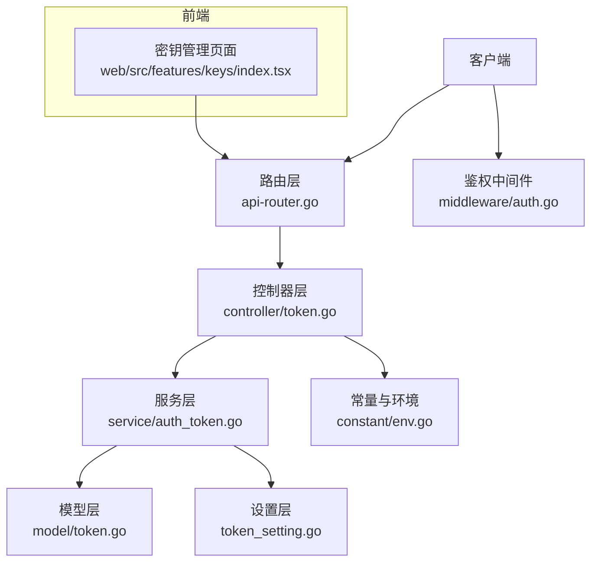
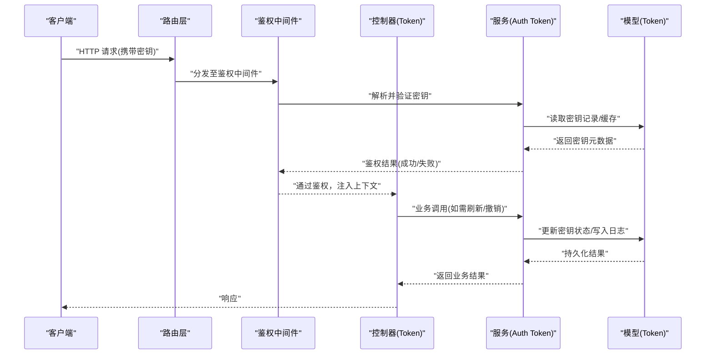
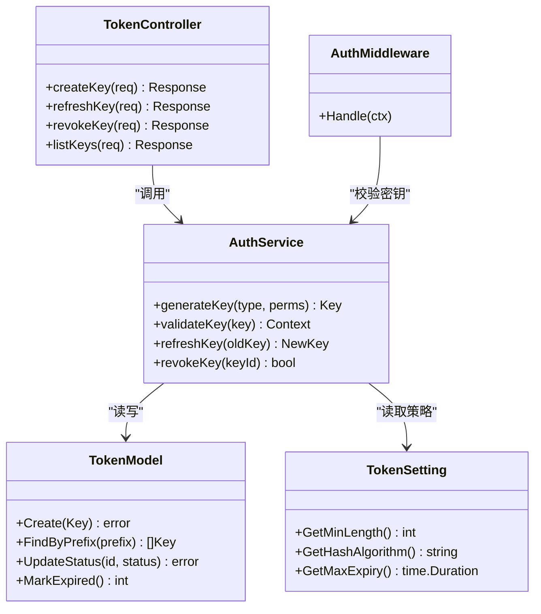
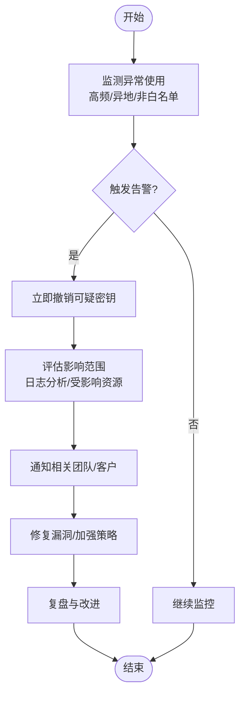

# API密钥管理

<cite>
**本文引用的文件**   
- [main.go](file://main.go)
- [controller/token.go](file://controller/token.go)
- [model/token.go](file://model/token.go)
- [service/auth_token.go](file://service/auth_token.go)
- [middleware/auth.go](file://middleware/auth.go)
- [setting/operation_setting/token_setting.go](file://setting/operation_setting/token_setting.go)
- [constant/env.go](file://constant/env.go)
- [router/api-router.go](file://router/api-router.go)
- [web/src/features/keys/index.tsx](file://web/src/features/keys/index.tsx)
</cite>

## 目录
1. [简介](#简介)
2. [项目结构](#项目结构)
3. [核心组件](#核心组件)
4. [架构总览](#架构总览)
5. [详细组件分析](#详细组件分析)
6. [依赖关系分析](#依赖关系分析)
7. [性能考量](#性能考量)
8. [故障排查指南](#故障排查指南)
9. [结论](#结论)
10. [附录](#附录)

## 简介
本文件面向API密钥管理系统，围绕密钥的生成、验证、刷新与撤销机制展开，覆盖密钥生命周期管理与安全存储策略，阐述管理员密钥、用户密钥、应用密钥等类型及其权限范围，并提供密钥轮换策略、自动化管理工具建议、最佳实践与安全建议，以及泄露检测与应急响应流程。文档从基础使用到高级安全配置循序渐进，帮助读者构建可运维、可扩展且安全的密钥管理体系。

## 项目结构
本项目采用分层架构：路由层负责HTTP接口注册，控制器层处理请求参数与业务编排，服务层封装认证与令牌逻辑，模型层定义数据实体与持久化，中间件完成鉴权拦截，设置层提供系统级开关与策略，前端提供密钥管理界面。

**图示来源** 
- [router/api-router.go](file://router/api-router.go)
- [controller/token.go](file://controller/token.go)
- [service/auth_token.go](file://service/auth_token.go)
- [model/token.go](file://model/token.go)
- [middleware/auth.go](file://middleware/auth.go)
- [setting/operation_setting/token_setting.go](file://setting/operation_setting/token_setting.go)
- [constant/env.go](file://constant/env.go)
- [web/src/features/keys/index.tsx](file://web/src/features/keys/index.tsx)

**章节来源**
- [main.go](file://main.go)
- [router/api-router.go](file://router/api-router.go)

## 核心组件
- 控制器（Token）：暴露密钥创建、查询、刷新、撤销等API；校验输入并调用服务层。
- 服务（Auth Token）：实现密钥生成、校验、刷新、撤销的核心逻辑；对接模型与设置。
- 模型（Token）：定义密钥数据结构、状态、过期时间、权限范围等字段及持久化操作。
- 中间件（Auth）：在请求进入时解析并验证密钥，注入上下文供后续处理使用。
- 设置（Token Setting）：集中管理密钥策略（如长度、有效期、前缀、哈希算法、速率限制）。
- 常量与环境（Env）：提供密钥相关的环境变量与默认值。
- 前端（Keys）：提供密钥创建、查看、刷新、撤销的用户界面。

**章节来源**
- [controller/token.go](file://controller/token.go)
- [service/auth_token.go](file://service/auth_token.go)
- [model/token.go](file://model/token.go)
- [middleware/auth.go](file://middleware/auth.go)
- [setting/operation_setting/token_setting.go](file://setting/operation_setting/token_setting.go)
- [constant/env.go](file://constant/env.go)
- [web/src/features/keys/index.tsx](file://web/src/features/keys/index.tsx)

## 架构总览
下图展示一次“通过API密钥访问受保护资源”的典型调用链：客户端携带密钥发起请求，中间件进行鉴权，控制器接收请求并调用服务层，服务层根据策略生成或校验密钥，最终返回结果。

**图示来源** 
- [router/api-router.go](file://router/api-router.go)
- [middleware/auth.go](file://middleware/auth.go)
- [controller/token.go](file://controller/token.go)
- [service/auth_token.go](file://service/auth_token.go)
- [model/token.go](file://model/token.go)

## 详细组件分析

### 控制器层：Token 控制器
职责
- 提供密钥管理的REST接口：创建、查询、刷新、撤销。
- 校验请求参数（如密钥类型、用途、有效期、权限范围）。
- 调用服务层执行具体逻辑，统一错误码与响应格式。

关键流程
- 创建密钥：校验输入 -> 调用服务生成密钥 -> 写入模型 -> 返回密钥信息（仅首次显示完整值）。
- 刷新密钥：校验当前密钥有效性 -> 生成新密钥 -> 更新模型 -> 返回新密钥。
- 撤销密钥：校验权限 -> 标记为失效 -> 记录审计日志。

**章节来源**
- [controller/token.go](file://controller/token.go)

### 服务层：Auth Token 服务
职责
- 实现密钥生成算法（随机性、长度、前缀、编码）。
- 实现密钥校验（哈希比对、状态检查、过期判断、权限匹配）。
- 实现刷新与撤销策略（原子更新、并发安全、审计追踪）。
- 与设置层交互，读取密钥策略（如最小长度、最大有效期、哈希算法）。

关键流程
- 生成密钥：选择算法 -> 生成随机字节 -> 编码为字符串 -> 计算哈希 -> 落库。
- 校验密钥：提取密钥 -> 查找记录 -> 比对哈希 -> 检查状态与过期 -> 返回授权上下文。
- 刷新密钥：校验旧密钥 -> 生成新密钥 -> 原子替换 -> 记录历史版本。
- 撤销密钥：幂等更新状态 -> 广播失效（缓存/会话）-> 审计记录。

**章节来源**
- [service/auth_token.go](file://service/auth_token.go)
- [setting/operation_setting/token_setting.go](file://setting/operation_setting/token_setting.go)

### 模型层：Token 模型
职责
- 定义密钥实体：唯一标识、原始值哈希、前缀、类型、权限、状态、过期时间、创建/更新时间。
- 提供CRUD与查询方法：按前缀/类型/状态检索、分页、计数。
- 支持索引优化：对前缀、状态、过期时间建立索引以提升查询性能。

数据结构要点
- 类型枚举：管理员密钥、用户密钥、应用密钥等。
- 权限范围：资源访问粒度（只读/读写）、模型白名单、IP白名单等。
- 状态机：有效、已刷新、已撤销、已过期。

**章节来源**
- [model/token.go](file://model/token.go)

### 中间件：鉴权中间件
职责
- 解析请求头中的密钥（如Authorization: Bearer <key>）。
- 调用服务层校验密钥，失败则直接拒绝。
- 将用户/应用上下文注入到请求上下文，供后续控制器使用。

关键流程
- 提取密钥 -> 调用服务校验 -> 命中缓存则快速返回 -> 未命中则查库 -> 设置过期时间 -> 返回结果。

**章节来源**
- [middleware/auth.go](file://middleware/auth.go)

### 设置层：Token 设置
职责
- 集中管理密钥策略：长度、前缀、哈希算法、有效期上限、刷新窗口、速率限制。
- 提供运行时配置热更新能力，避免重启影响。

关键项
- 最小长度与最大长度。
- 前缀规则（区分类型）。
- 哈希算法（如SHA-256/BLAKE3）。
- 刷新策略（是否允许自助刷新、冷却时间）。
- 撤销传播延迟（缓存失效时间）。

**章节来源**
- [setting/operation_setting/token_setting.go](file://setting/operation_setting/token_setting.go)

### 常量与环境：环境变量
职责
- 提供密钥相关的环境变量：数据库连接、缓存地址、密钥策略默认值。
- 提供安全开关：是否启用严格模式、是否强制HTTPS、是否启用审计日志。

**章节来源**
- [constant/env.go](file://constant/env.go)

### 前端：密钥管理页面
职责
- 提供密钥创建、查看（脱敏）、刷新、撤销的UI。
- 展示密钥类型、权限、状态、过期时间等元数据。
- 支持批量操作与导出审计日志。

**章节来源**
- [web/src/features/keys/index.tsx](file://web/src/features/keys/index.tsx)

## 依赖关系分析

**图示来源** 
- [controller/token.go](file://controller/token.go)
- [service/auth_token.go](file://service/auth_token.go)
- [model/token.go](file://model/token.go)
- [middleware/auth.go](file://middleware/auth.go)
- [setting/operation_setting/token_setting.go](file://setting/operation_setting/token_setting.go)

**章节来源**
- [router/api-router.go](file://router/api-router.go)

## 性能考量
- 缓存优先：鉴权中间件应结合内存/分布式缓存（如Redis）缓存密钥元数据，降低DB压力。
- 索引优化：对前缀、状态、过期时间建立索引，提升查询效率。
- 异步审计：审计日志写入采用异步队列，避免阻塞主流程。
- 批量操作：刷新与撤销支持批量接口，减少网络往返。
- 限流控制：对密钥创建、刷新、撤销等操作实施速率限制，防止滥用。

[本节为通用指导，不直接分析具体文件]

## 故障排查指南
常见问题与定位步骤
- 鉴权失败：检查请求头中密钥是否正确、是否过期、是否被撤销；查看中间件日志与服务层校验结果。
- 刷新失败：确认旧密钥仍有效、权限足够；检查刷新冷却时间与并发冲突。
- 撤销无效：检查状态更新是否成功、缓存是否及时失效；核对权限与角色。
- 性能问题：观察缓存命中率、DB慢查询、锁竞争；调整缓存TTL与索引。

建议日志与监控
- 记录每次鉴权的密钥前缀、来源IP、结果、耗时。
- 监控密钥创建/刷新/撤销频率与异常率。
- 告警阈值：短时间内大量失败、密钥被频繁刷新、撤销后仍被使用。

**章节来源**
- [middleware/auth.go](file://middleware/auth.go)
- [service/auth_token.go](file://service/auth_token.go)

## 结论
本系统通过清晰的分层架构与完善的策略配置，实现了API密钥的全生命周期管理。借助中间件鉴权、服务层策略、模型持久化与前端界面，形成闭环管理能力。建议在生产环境中启用强密码策略、严格权限控制、缓存加速与审计追踪，并结合自动化轮换与泄露检测，持续提升安全性与可运维性。

[本节为总结，不直接分析具体文件]

## 附录

### 密钥类型与权限范围
- 管理员密钥：拥有系统级高权限，用于后台管理与配置变更。
- 用户密钥：绑定特定用户，具备该用户的资源访问权限。
- 应用密钥：绑定特定应用或服务，具备受限的API访问范围。

权限维度
- 资源粒度：模型白名单、端点白名单。
- 操作粒度：只读、读写、管理。
- 访问控制：IP白名单、时间窗口、地域限制。

**章节来源**
- [model/token.go](file://model/token.go)
- [setting/operation_setting/token_setting.go](file://setting/operation_setting/token_setting.go)

### 密钥生命周期管理
- 生成：遵循策略（长度、前缀、哈希），首次返回完整值，后续仅显示脱敏。
- 激活：设置初始状态为有效，可选预热缓存。
- 使用：中间件校验，命中缓存则快速放行。
- 刷新：支持自助刷新，保留历史版本以便回滚。
- 撤销：立即失效，广播缓存失效，记录审计。
- 过期：定时任务清理过期密钥，释放资源。

**章节来源**
- [service/auth_token.go](file://service/auth_token.go)
- [model/token.go](file://model/token.go)

### 安全存储策略
- 存储形式：仅存储哈希值，不存明文。
- 哈希算法：选用抗碰撞、抗预计算的算法（如SHA-256/BLAKE3）。
- 加密传输：强制HTTPS，禁用明文传输。
- 访问控制：最小权限原则，分离管理员与普通用户视图。
- 审计追踪：记录所有敏感操作，支持溯源。

**章节来源**
- [setting/operation_setting/token_setting.go](file://setting/operation_setting/token_setting.go)
- [constant/env.go](file://constant/env.go)

### 密钥轮换策略与自动化
- 轮换周期：按业务风险设定（如90天），到期前提醒。
- 自动轮换：通过定时任务或事件驱动触发，无缝切换新旧密钥。
- 灰度发布：先启用新密钥，观察稳定后再停用旧密钥。
- 回滚机制：保留最近N个版本，支持一键回滚。

**章节来源**
- [service/auth_token.go](file://service/auth_token.go)
- [setting/operation_setting/token_setting.go](file://setting/operation_setting/token_setting.go)

### 最佳实践与安全建议
- 最小权限：按需授予最低必要权限。
- 隔离环境：开发/测试/生产环境密钥隔离。
- 定期审计：审查密钥使用与权限分配。
- 泄露检测：监控异常使用模式（高频、异地、非白名单）。
- 应急响应：发现泄露后立即撤销，评估影响面，通知相关方。

**章节来源**
- [middleware/auth.go](file://middleware/auth.go)
- [service/auth_token.go](file://service/auth_token.go)

### 泄露检测与应急响应流程

**图示来源** 
- [middleware/auth.go](file://middleware/auth.go)
- [service/auth_token.go](file://service/auth_token.go)