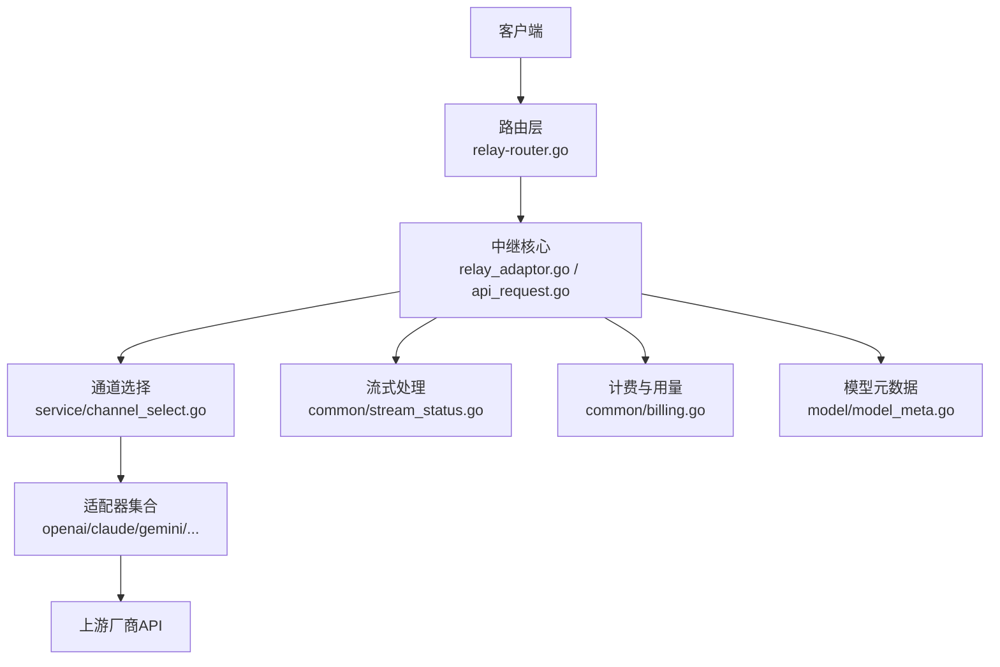
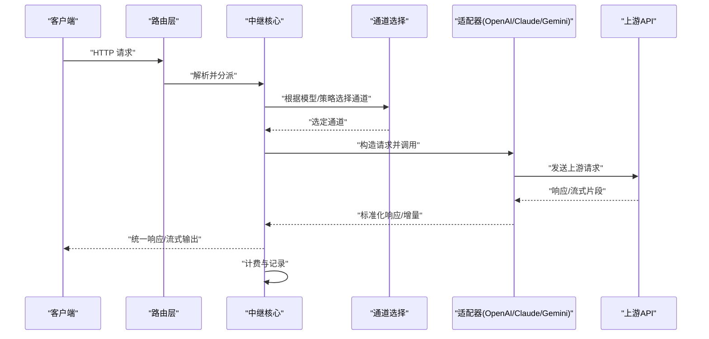
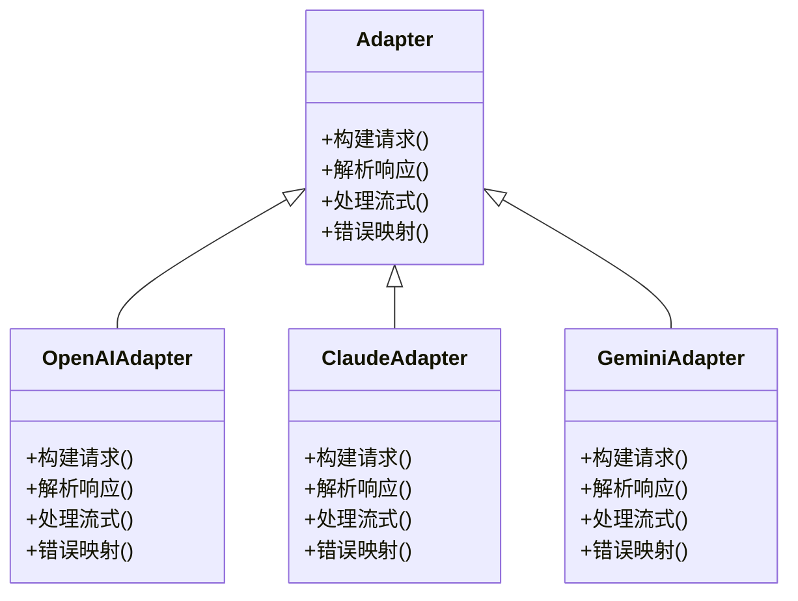
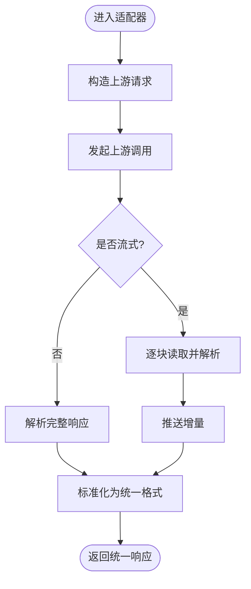
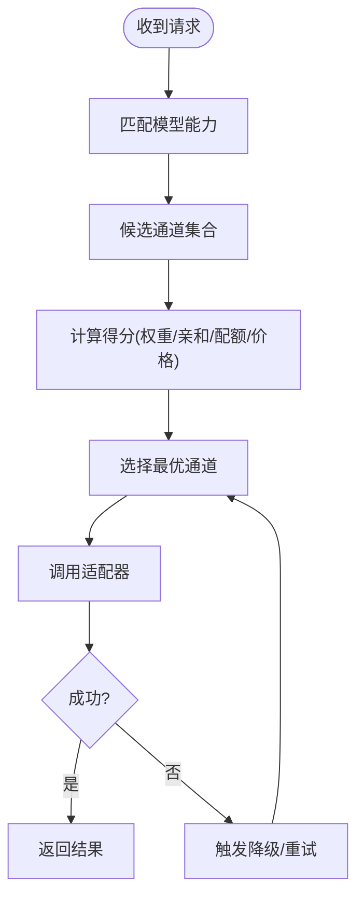
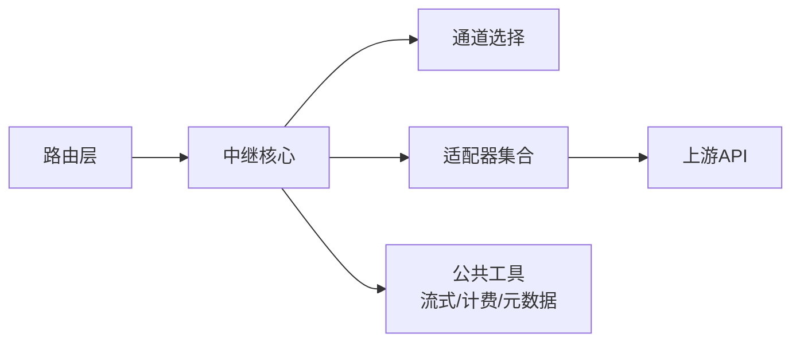

# 多模型支持

<cite>
**本文引用的文件**   
- [relay_adaptor.go](file://relay/relay_adaptor.go)
- [api_request.go](file://relay/channel/api_request.go)
- [adapter.go](file://relay/channel/adapter.go)
- [openai/adaptor.go](file://relay/channel/openai/adaptor.go)
- [claude/adaptor.go](file://relay/channel/claude/adaptor.go)
- [gemini/adaptor.go](file://relay/channel/gemini/adaptor.go)
- [request_conversion.go](file://relay/common/request_conversion.go)
- [stream_status.go](file://relay/common/stream_status.go)
- [billing.go](file://relay/common/billing.go)
- [relay_info.go](file://relay/common/relay_info.go)
- [channel_select.go](file://service/channel_select.go)
- [channel_affinity.go](file://service/channel_affinity.go)
- [model_meta.go](file://model/model_meta.go)
- [pricing_default.go](file://model/pricing_default.go)
- [relay-router.go](file://router/relay-router.go)
- [relay-openai.go](file://relay/channel/openai/relay-openai.go)
- [relay-claude.go](file://relay/channel/claude/relay-claude.go)
- [relay-gemini-native.go](file://relay/channel/gemini/relay-gemini-native.go)
- [audio_handler.go](file://relay/audio_handler.go)
- [image_handler.go](file://relay/image_handler.go)
- [responses_handler.go](file://relay/responses_handler.go)
- [chat_completions_via_responses.go](file://relay/chat_completions_via_responses.go)
- [error.go](file://dto/error.go)
- [error.go](file://types/error.go)
</cite>

## 目录
1. [简介](#简介)
2. [项目结构](#项目结构)
3. [核心组件](#核心组件)
4. [架构总览](#架构总览)
5. [详细组件分析](#详细组件分析)
6. [依赖关系分析](#依赖关系分析)
7. [性能考量](#性能考量)
8. [故障排查指南](#故障排查指南)
9. [结论](#结论)
10. [附录：配置与集成示例](#附录配置与集成示例)

## 简介
本文件系统性阐述“多模型支持”能力的设计与实现，覆盖统一适配多个AI提供商（OpenAI、Claude、Gemini等）的API，解释适配器模式在请求转换与响应处理中的运用，梳理文本生成、图像生成、音频处理、视频生成等多模态支持，并说明模型路由策略与智能选择算法。文档从基础概念到高级配置，提供完整的知识体系与落地指南。

## 项目结构
多模型支持的核心位于 relay 层与 service 层：
- relay 层负责协议适配、流式处理、计费与转发；
- service 层负责通道选择、亲和性、配额与计费表达式；
- model 层维护模型元数据、定价与能力；
- router 层将外部请求分发至对应处理器；
- dto/types 定义通用错误与数据结构。

图表来源
- [relay-router.go](file://router/relay-router.go)
- [relay_adaptor.go](file://relay/relay_adaptor.go)
- [api_request.go](file://relay/channel/api_request.go)
- [channel_select.go](file://service/channel_select.go)
- [stream_status.go](file://relay/common/stream_status.go)
- [billing.go](file://relay/common/billing.go)
- [model_meta.go](file://model/model_meta.go)

章节来源
- [relay_adaptor.go](file://relay/relay_adaptor.go)
- [api_request.go](file://relay/channel/api_request.go)
- [adapter.go](file://relay/channel/adapter.go)
- [relay-router.go](file://router/relay-router.go)

## 核心组件
- 适配器接口与抽象：统一对外暴露请求/响应转换与调用能力，屏蔽各厂商差异。
- 请求转换：将统一内部请求格式转换为各厂商特定格式。
- 响应处理：将各厂商响应标准化为统一格式，包括流式增量。
- 通道选择：基于权重、亲和性、健康状态、配额等策略选择具体通道。
- 计费与用量：按模型与渠道统计token/次数，支持表达式计费。
- 模型元数据：描述模型能力、定价、支持的模态与参数范围。

章节来源
- [adapter.go](file://relay/channel/adapter.go)
- [request_conversion.go](file://relay/common/request_conversion.go)
- [stream_status.go](file://relay/common/stream_status.go)
- [billing.go](file://relay/common/billing.go)
- [relay_info.go](file://relay/common/relay_info.go)
- [model_meta.go](file://model/model_meta.go)

## 架构总览
下图展示一次典型的多模型请求生命周期：路由分发→适配器适配→通道选择→上游调用→流式返回→计费与日志。

图表来源
- [relay-router.go](file://router/relay-router.go)
- [relay_adaptor.go](file://relay/relay_adaptor.go)
- [channel_select.go](file://service/channel_select.go)
- [relay-openai.go](file://relay/channel/openai/relay-openai.go)
- [relay-claude.go](file://relay/channel/claude/relay-claude.go)
- [relay-gemini-native.go](file://relay/channel/gemini/relay-gemini-native.go)

## 详细组件分析

### 适配器模式与统一接口
- 设计要点
  - 每个厂商一个适配器包，实现统一的请求构造、响应解析、流式处理与错误映射。
  - 通过适配器抽象，上层无需关心下游差异，新增厂商只需实现适配器。
- 关键文件
  - 适配器抽象与公共逻辑：[adapter.go](file://relay/channel/adapter.go)、[api_request.go](file://relay/channel/api_request.go)
  - OpenAI 适配器：[openai/adaptor.go](file://relay/channel/openai/adaptor.go)、[relay-openai.go](file://relay/channel/openai/relay-openai.go)
  - Claude 适配器：[claude/adaptor.go](file://relay/channel/claude/adaptor.go)、[relay-claude.go](file://relay/channel/claude/relay-claude.go)
  - Gemini 适配器：[gemini/adaptor.go](file://relay/channel/gemini/adaptor.go)、[relay-gemini-native.go](file://relay/channel/gemini/relay-gemini-native.go)

图表来源
- [adapter.go](file://relay/channel/adapter.go)
- [openai/adaptor.go](file://relay/channel/openai/adaptor.go)
- [claude/adaptor.go](file://relay/channel/claude/adaptor.go)
- [gemini/adaptor.go](file://relay/channel/gemini/adaptor.go)

章节来源
- [adapter.go](file://relay/channel/adapter.go)
- [api_request.go](file://relay/channel/api_request.go)
- [openai/adaptor.go](file://relay/channel/openai/adaptor.go)
- [claude/adaptor.go](file://relay/channel/claude/adaptor.go)
- [gemini/adaptor.go](file://relay/channel/gemini/adaptor.go)

### 请求转换与响应处理机制
- 请求转换
  - 统一入口将业务请求转为内部中间表示，再由各适配器转换为上游格式。
  - 支持文本、图像、音频、视频等不同模态的参数映射。
- 响应处理
  - 非流式：直接解析为标准对象。
  - 流式：逐块解析并推送增量，保持顺序与完整性。
- 关键文件
  - 请求转换：[request_conversion.go](file://relay/common/request_conversion.go)
  - 流式状态管理：[stream_status.go](file://relay/common/stream_status.go)
  - 各模态处理器：音频 [audio_handler.go](file://relay/audio_handler.go)、图像 [image_handler.go](file://relay/image_handler.go)、Responses/Chat 兼容 [responses_handler.go](file://relay/responses_handler.go)、[chat_completions_via_responses.go](file://relay/chat_completions_via_responses.go)

图表来源
- [request_conversion.go](file://relay/common/request_conversion.go)
- [stream_status.go](file://relay/common/stream_status.go)
- [audio_handler.go](file://relay/audio_handler.go)
- [image_handler.go](file://relay/image_handler.go)
- [responses_handler.go](file://relay/responses_handler.go)
- [chat_completions_via_responses.go](file://relay/chat_completions_via_responses.go)

章节来源
- [request_conversion.go](file://relay/common/request_conversion.go)
- [stream_status.go](file://relay/common/stream_status.go)
- [audio_handler.go](file://relay/audio_handler.go)
- [image_handler.go](file://relay/image_handler.go)
- [responses_handler.go](file://relay/responses_handler.go)
- [chat_completions_via_responses.go](file://relay/chat_completions_via_responses.go)

### 模型路由策略与智能选择
- 选择维度
  - 模型能力匹配（文本/图像/音频/视频）、可用性与健康检查、配额与余额、价格与性价比、亲和性与负载均衡。
- 策略组合
  - 权重轮询、亲和绑定、失败重试与降级、动态切换。
- 关键文件
  - 通道选择：[channel_select.go](file://service/channel_select.go)
  - 亲和性：[channel_affinity.go](file://service/channel_affinity.go)
  - 模型元数据与定价：[model_meta.go](file://model/model_meta.go)、[pricing_default.go](file://model/pricing_default.go)

图表来源
- [channel_select.go](file://service/channel_select.go)
- [channel_affinity.go](file://service/channel_affinity.go)
- [model_meta.go](file://model/model_meta.go)
- [pricing_default.go](file://model/pricing_default.go)

章节来源
- [channel_select.go](file://service/channel_select.go)
- [channel_affinity.go](file://service/channel_affinity.go)
- [model_meta.go](file://model/model_meta.go)
- [pricing_default.go](file://model/pricing_default.go)

### 多模态支持
- 文本生成
  - Chat Completions/Responses 兼容，支持系统消息、工具调用、函数参数等。
- 图像生成
  - 图像创建、编辑、风格化等，统一封装为图像处理器。
- 音频处理
  - TTS/ASR 等能力，统一音频处理器。
- 视频生成
  - 任务型异步生成与轮询，结合任务处理器。
- 关键文件
  - 图像：[image_handler.go](file://relay/image_handler.go)
  - 音频：[audio_handler.go](file://relay/audio_handler.go)
  - Responses/Chat 兼容：[responses_handler.go](file://relay/responses_handler.go)、[chat_completions_via_responses.go](file://relay/chat_completions_via_responses.go)

章节来源
- [image_handler.go](file://relay/image_handler.go)
- [audio_handler.go](file://relay/audio_handler.go)
- [responses_handler.go](file://relay/responses_handler.go)
- [chat_completions_via_responses.go](file://relay/chat_completions_via_responses.go)

## 依赖关系分析
- 模块耦合
  - 路由层依赖中继核心；中继核心依赖适配器与通道选择；适配器依赖各自的上游实现。
- 外部依赖
  - HTTP 客户端、缓存、限流、审计与监控等通用能力由 common/middleware 提供。
- 潜在循环
  - 通过接口解耦避免循环依赖；适配器仅依赖公共转换与流式工具。

图表来源
- [relay-router.go](file://router/relay-router.go)
- [relay_adaptor.go](file://relay/relay_adaptor.go)
- [channel_select.go](file://service/channel_select.go)
- [billing.go](file://relay/common/billing.go)
- [stream_status.go](file://relay/common/stream_status.go)
- [model_meta.go](file://model/model_meta.go)

章节来源
- [relay-router.go](file://router/relay-router.go)
- [relay_adaptor.go](file://relay/relay_adaptor.go)
- [channel_select.go](file://service/channel_select.go)
- [billing.go](file://relay/common/billing.go)
- [stream_status.go](file://relay/common/stream_status.go)
- [model_meta.go](file://model/model_meta.go)

## 性能考量
- 流式传输
  - 使用增量解析与零拷贝策略降低延迟与内存占用。
- 并发与池化
  - 合理设置并发度与连接池，避免上游限流。
- 缓存与亲和
  - 利用亲和性减少跨节点抖动，提升命中率与稳定性。
- 计费表达式
  - 预编译表达式，避免运行时重复解析。

## 故障排查指南
- 常见错误分类
  - 认证失败、参数不合法、上游限流、超时、网络异常、模型不可用。
- 错误映射
  - 各适配器将上游错误码映射为统一错误结构，便于前端提示与重试策略。
- 调试建议
  - 开启详细日志、检查模型元数据与定价、验证通道健康状态、查看配额与余额。
- 关键文件
  - 错误定义：[error.go](file://dto/error.go)、[error.go](file://types/error.go)

章节来源
- [error.go](file://dto/error.go)
- [error.go](file://types/error.go)

## 结论
本项目通过适配器模式与统一的中继核心，实现了多模型、多模态的统一接入与智能路由。借助流式处理、亲和性选择与精细化计费，系统在可扩展性、稳定性与成本可控方面具备良好表现。后续可继续扩展更多厂商与模态，完善自适应路由与观测能力。

## 附录：配置与集成示例
- 配置要点
  - 模型元数据：声明模型名称、能力、定价与参数范围。
  - 通道配置：密钥、端点、权重、亲和标签、健康检查阈值。
  - 路由策略：权重分配、亲和绑定、降级与重试规则。
- 集成步骤
  - 注册适配器与模型元数据；
  - 配置通道与路由策略；
  - 启用流式与计费；
  - 校验端到端连通性与错误映射。
- 参考文件
  - 模型元数据与定价：[model_meta.go](file://model/model_meta.go)、[pricing_default.go](file://model/pricing_default.go)
  - 通道选择与亲和：[channel_select.go](file://service/channel_select.go)、[channel_affinity.go](file://service/channel_affinity.go)
  - 路由与处理器：[relay-router.go](file://router/relay-router.go)、[responses_handler.go](file://relay/responses_handler.go)