# 核心特性

<cite>
**本文引用的文件**   
- [main.go](file://main.go)
- [router/main.go](file://router/main.go)
- [controller/relay.go](file://controller/relay.go)
- [middleware/distributor.go](file://middleware/distributor.go)
- [service/channel_select.go](file://service/channel_select.go)
- [relay/channel/openai/adaptor.go](file://relay/channel/openai/adaptor.go)
- [relay/channel/claude/adaptor.go](file://relay/channel/claude/adaptor.go)
- [relay/channel/gemini/adaptor.go](file://relay/channel/gemini/adaptor.go)
- [dto/openai_request.go](file://dto/openai_request.go)
- [dto/openai_response.go](file://dto/openai_response.go)
- [pkg/billingexpr/run.go](file://pkg/billingexpr/run.go)
- [model/pricing.go](file://model/pricing.go)
- [service/billing.go](file://service/billing.go)
- [controller/token.go](file://controller/token.go)
- [model/token.go](file://model/token.go)
- [middleware/auth.go](file://middleware/auth.go)
- [service/auth_token.go](file://service/auth_token.go)
- [model/user.go](file://model/user.go)
- [service/authz/enforcer.go](file://service/authz/enforcer.go)
- [model/casbin_rule.go](file://model/casbin_rule.go)
- [middleware/logger.go](file://middleware/logger.go)
- [model/log.go](file://model/log.go)
- [common/disk_cache.go](file://common/disk_cache.go)
- [pkg/cachex/hybrid_cache.go](file://pkg/cachex/hybrid_cache.go)
- [setting/performance_setting/config.go](file://setting/performance_setting/config.go)
- [common/rate-limit.go](file://common/rate-limit.go)
- [common/limiter/limiter.go](file://common/limiter/limiter.go)
- [controller/asset.go](file://controller/asset.go)
- [model/asset.go](file://model/asset.go)
- [service/asset.go](file://service/asset.go)
- [service/asset_ecloud.go](file://service/asset_ecloud.go)
- [router/asset-router.go](file://router/asset-router.go)
</cite>

## 更新摘要
**所做更改**
- 新增资产管理系统功能增强章节，详细说明云存储支持和改进的资产组管理界面
- 更新架构总览图以包含资产管理组件
- 添加资产管理和云存储相关的详细组件分析
- 扩展依赖关系分析以涵盖资产管理相关模块

## 目录
1. [简介](#简介)
2. [项目结构](#项目结构)
3. [核心组件](#核心组件)
4. [架构总览](#架构总览)
5. [详细组件分析](#详细组件分析)
6. [资产管理系统增强](#资产管理系统增强)
7. [依赖关系分析](#依赖关系分析)
8. [性能考量](#性能考量)
9. [故障排查指南](#故障排查指南)
10. [结论](#结论)
11. [附录：配置与使用示例](#附录配置与使用示例)

## 简介
本文件面向AI API网关的核心特性，围绕多模型统一适配、负载均衡与故障转移、计费系统、权限与角色管理、API密钥与认证、监控与日志、性能优化与缓存等主题进行系统化说明。文档既适合初学者快速上手，也为高级用户提供深入的技术细节与实现路径。最新版本增强了资产管理系统，支持云存储集成和改进的资产组管理界面。

## 项目结构
本项目采用分层与模块化组织方式：
- 路由层：负责HTTP路由注册与请求分发
- 控制器层：处理业务入口逻辑（如转发、鉴权、计费、资产管理）
- 中间件层：提供鉴权、限流、日志、缓存、分发等横切能力
- 服务层：封装渠道选择、计费计算、令牌管理、权限控制、资产管理等核心服务
- 适配器层：对接各AI提供商（OpenAI、Claude、Gemini等）
- 数据模型与配置：持久化实体、定价策略、性能与限流配置
- 前端资源：Web控制台与交互界面

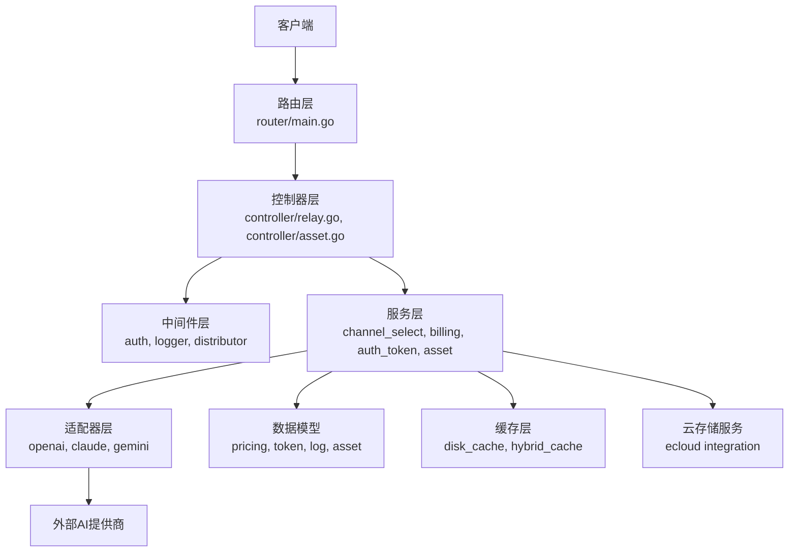

**图示来源** 
- [router/main.go](file://router/main.go)
- [controller/relay.go](file://controller/relay.go)
- [controller/asset.go](file://controller/asset.go)
- [middleware/distributor.go](file://middleware/distributor.go)
- [service/channel_select.go](file://service/channel_select.go)
- [service/asset.go](file://service/asset.go)
- [service/asset_ecloud.go](file://service/asset_ecloud.go)
- [relay/channel/openai/adaptor.go](file://relay/channel/openai/adaptor.go)
- [relay/channel/claude/adaptor.go](file://relay/channel/claude/adaptor.go)
- [relay/channel/gemini/adaptor.go](file://relay/channel/gemini/adaptor.go)
- [common/disk_cache.go](file://common/disk_cache.go)
- [pkg/cachex/hybrid_cache.go](file://pkg/cachex/hybrid_cache.go)

**章节来源**
- [main.go](file://main.go)
- [router/main.go](file://router/main.go)

## 核心组件
- 多模型统一接口适配：通过适配器将不同提供商的协议统一为内部标准格式，屏蔽差异
- 负载均衡与故障转移：基于权重、亲和性、健康状态智能分配请求，失败自动切换
- 计费系统：支持按token计费、套餐订阅、余额扣减与结算
- 权限与角色：基于RBAC与Casbin规则，细粒度控制资源访问
- API密钥与认证：支持多种认证方式与密钥生命周期管理
- 监控与日志：结构化日志、审计记录、性能指标采集
- 性能优化与缓存：磁盘缓存、混合缓存、限流与并发池
- **资产管理系统**：支持本地和云存储的资产上传、管理、分组和访问控制

**章节来源**
- [controller/relay.go](file://controller/relay.go)
- [controller/asset.go](file://controller/asset.go)
- [middleware/distributor.go](file://middleware/distributor.go)
- [service/channel_select.go](file://service/channel_select.go)
- [service/asset.go](file://service/asset.go)
- [pkg/billingexpr/run.go](file://pkg/billingexpr/run.go)
- [model/pricing.go](file://model/pricing.go)
- [service/billing.go](file://service/billing.go)
- [controller/token.go](file://controller/token.go)
- [model/token.go](file://model/token.go)
- [middleware/auth.go](file://middleware/auth.go)
- [service/auth_token.go](file://service/auth_token.go)
- [service/authz/enforcer.go](file://service/authz/enforcer.go)
- [model/casbin_rule.go](file://model/casbin_rule.go)
- [middleware/logger.go](file://middleware/logger.go)
- [model/log.go](file://model/log.go)
- [common/disk_cache.go](file://common/disk_cache.go)
- [pkg/cachex/hybrid_cache.go](file://pkg/cachex/hybrid_cache.go)

## 架构总览
下图展示了从请求进入到响应返回的关键流程，包括鉴权、分发、计费、适配器调用、缓存以及资产管理功能。

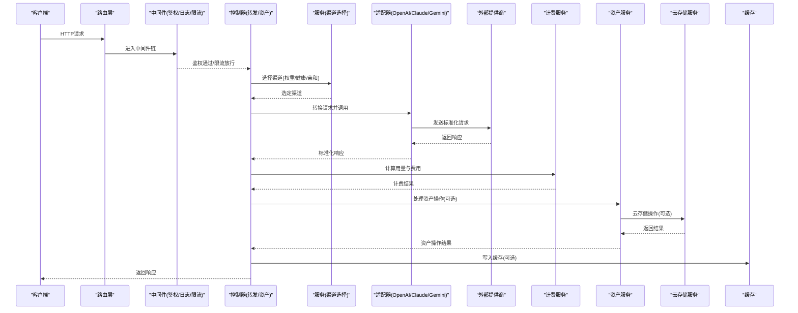

**图示来源** 
- [controller/relay.go](file://controller/relay.go)
- [controller/asset.go](file://controller/asset.go)
- [middleware/distributor.go](file://middleware/distributor.go)
- [service/channel_select.go](file://service/channel_select.go)
- [service/asset.go](file://service/asset.go)
- [service/asset_ecloud.go](file://service/asset_ecloud.go)
- [relay/channel/openai/adaptor.go](file://relay/channel/openai/adaptor.go)
- [relay/channel/claude/adaptor.go](file://relay/channel/claude/adaptor.go)
- [relay/channel/gemini/adaptor.go](file://relay/channel/gemini/adaptor.go)
- [service/billing.go](file://service/billing.go)
- [pkg/billingexpr/run.go](file://pkg/billingexpr/run.go)
- [common/disk_cache.go](file://common/disk_cache.go)
- [pkg/cachex/hybrid_cache.go](file://pkg/cachex/hybrid_cache.go)

## 详细组件分析

### 多模型支持与统一接口适配
- 适配器模式：每个提供商实现统一的请求/响应转换接口，屏蔽协议差异
- 支持的提供商：OpenAI、Claude、Gemini等，扩展新提供商只需新增适配器
- 请求/响应映射：将不同格式的输入转换为内部标准结构，再输出为标准响应

```mermaid
classDiagram
class OpenAIAdaptor {
+convertRequest(req) StandardRequest
+convertResponse(resp) StandardResponse
+call(request) Response
}
class ClaudeAdaptor {
+convertRequest(req) StandardRequest
+convertResponse(resp) StandardResponse
+call(request) Response
}
class GeminiAdaptor {
+convertRequest(req) StandardRequest
+convertResponse(resp) StandardResponse
+call(request) Response
}
class StandardRequest {
+model string
+messages []Message
+options map[string]interface{}
}
class StandardResponse {
+content string
+usage Usage
+finishReason string
}
OpenAIAdaptor --> StandardRequest : "生成"
OpenAIAdaptor --> StandardResponse : "返回"
ClaudeAdaptor --> StandardRequest : "生成"
ClaudeAdaptor --> StandardResponse : "返回"
GeminiAdaptor --> StandardRequest : "生成"
GeminiAdaptor --> StandardResponse : "返回"
```

**图示来源** 
- [relay/channel/openai/adaptor.go](file://relay/channel/openai/adaptor.go)
- [relay/channel/claude/adaptor.go](file://relay/channel/claude/adaptor.go)
- [relay/channel/gemini/adaptor.go](file://relay/channel/gemini/adaptor.go)
- [dto/openai_request.go](file://dto/openai_request.go)
- [dto/openai_response.go](file://dto/openai_response.go)

**章节来源**
- [relay/channel/openai/adaptor.go](file://relay/channel/openai/adaptor.go)
- [relay/channel/claude/adaptor.go](file://relay/channel/claude/adaptor.go)
- [relay/channel/gemini/adaptor.go](file://relay/channel/gemini/adaptor.go)
- [dto/openai_request.go](file://dto/openai_request.go)
- [dto/openai_response.go](file://dto/openai_response.go)

### 负载均衡与故障转移机制
- 渠道选择策略：支持权重轮询、亲和性绑定、健康检查、失败重试
- 智能分配：根据模型可用性、延迟、配额、成本动态调整
- 故障转移：当主渠道失败时自动切换到备用渠道，保证高可用

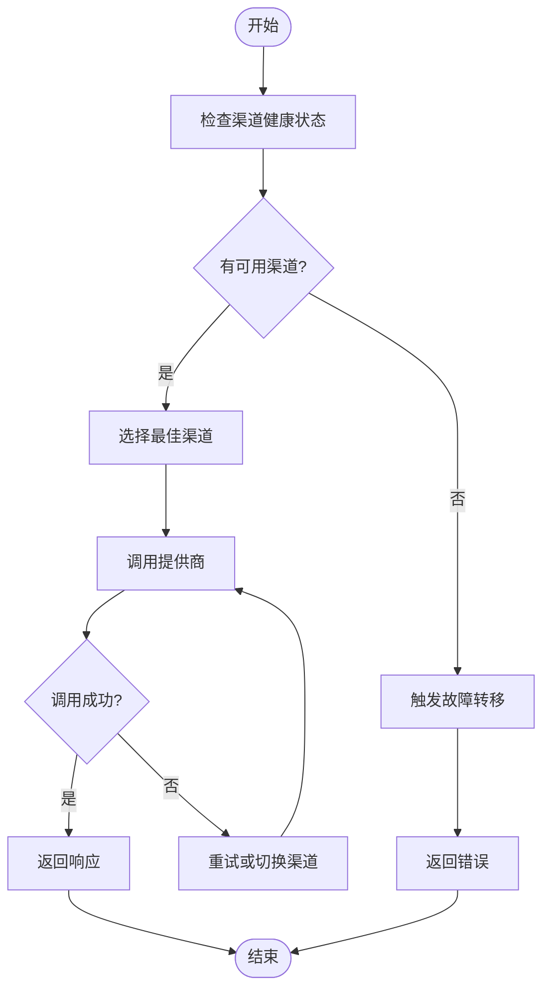

**图示来源** 
- [middleware/distributor.go](file://middleware/distributor.go)
- [service/channel_select.go](file://service/channel_select.go)

**章节来源**
- [middleware/distributor.go](file://middleware/distributor.go)
- [service/channel_select.go](file://service/channel_select.go)

### 计费系统工作原理
- 按token计费：统计输入/输出token数，结合定价策略计算费用
- 套餐订阅：支持包月/包年套餐，优先扣除套餐额度
- 余额管理：用户账户余额实时扣减，不足时拒绝请求
- 表达式引擎：使用表达式语言灵活定义计费规则

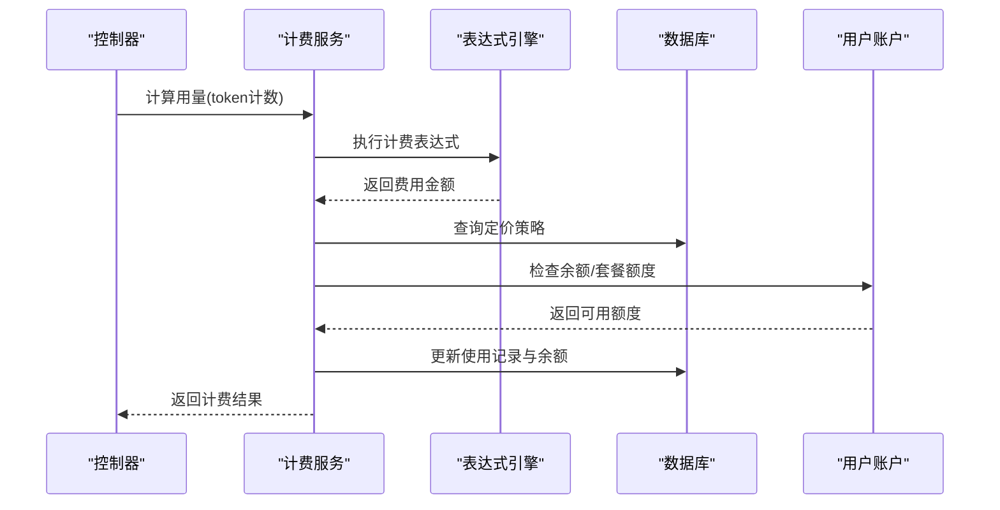

**图示来源** 
- [service/billing.go](file://service/billing.go)
- [pkg/billingexpr/run.go](file://pkg/billingexpr/run.go)
- [model/pricing.go](file://model/pricing.go)

**章节来源**
- [service/billing.go](file://service/billing.go)
- [pkg/billingexpr/run.go](file://pkg/billingexpr/run.go)
- [model/pricing.go](file://model/pricing.go)

### 用户权限控制与角色管理
- RBAC模型：基于角色的访问控制，支持资源级权限
- Casbin集成：使用Casbin规则引擎进行权限决策
- 细粒度控制：可针对渠道、模型、操作类型设置权限

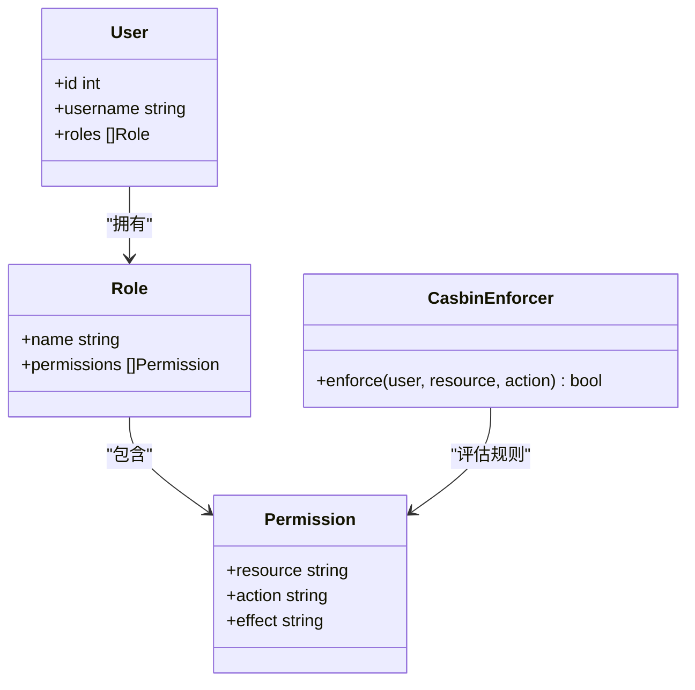

**图示来源** 
- [model/user.go](file://model/user.go)
- [model/casbin_rule.go](file://model/casbin_rule.go)
- [service/authz/enforcer.go](file://service/authz/enforcer.go)

**章节来源**
- [model/user.go](file://model/user.go)
- [model/casbin_rule.go](file://model/casbin_rule.go)
- [service/authz/enforcer.go](file://service/authz/enforcer.go)

### API密钥管理与认证机制
- 密钥类型：支持用户密钥、应用密钥、临时密钥
- 认证流程：验证密钥有效性、检查权限、记录审计日志
- 生命周期管理：支持密钥创建、更新、禁用、删除

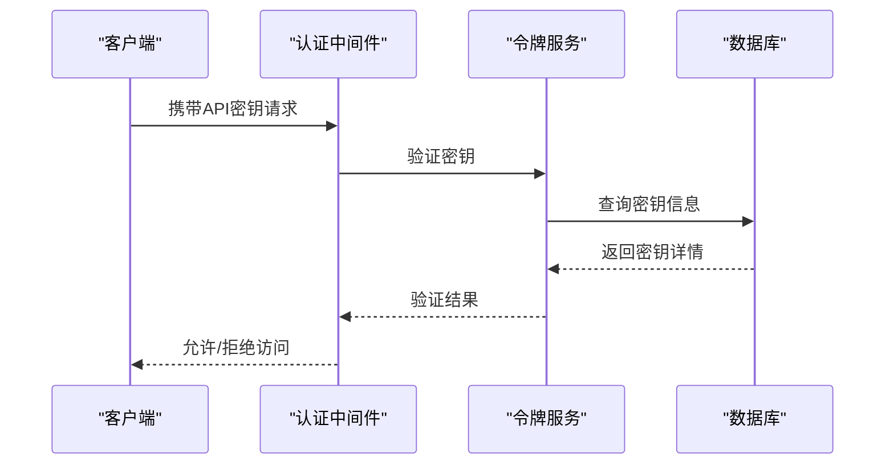

**图示来源** 
- [middleware/auth.go](file://middleware/auth.go)
- [service/auth_token.go](file://service/auth_token.go)
- [controller/token.go](file://controller/token.go)
- [model/token.go](file://model/token.go)

**章节来源**
- [middleware/auth.go](file://middleware/auth.go)
- [service/auth_token.go](file://service/auth_token.go)
- [controller/token.go](file://controller/token.go)
- [model/token.go](file://model/token.go)

### 实时监控与日志记录
- 结构化日志：记录请求上下文、耗时、状态码、IP地址
- 审计日志：记录敏感操作、权限变更、计费事件
- 性能指标：收集QPS、延迟、错误率等关键指标

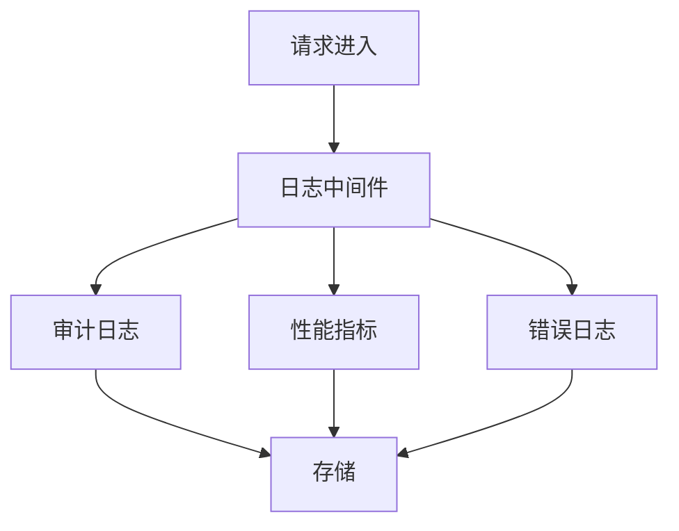

**图示来源** 
- [middleware/logger.go](file://middleware/logger.go)
- [model/log.go](file://model/log.go)

**章节来源**
- [middleware/logger.go](file://middleware/logger.go)
- [model/log.go](file://model/log.go)

### 性能优化与缓存机制
- 磁盘缓存：大对象持久化缓存，减少内存占用
- 混合缓存：内存+磁盘双层缓存，提升命中率
- 限流控制：基于令牌桶算法的分布式限流
- 并发优化：连接池、goroutine池、异步处理

```mermaid
classDiagram
class DiskCache {
+Get(key) interface{}
+Set(key, value, ttl) bool
+Delete(key) bool
}
class HybridCache {
+Get(key) interface{}
+Set(key, value, ttl) bool
-memoryCache MemoryCache
-diskCache DiskCache
}
class RateLimiter {
+Allow(clientID) bool
+Reset(clientID) void
}
HybridCache --> DiskCache : "使用"
```

**图示来源** 
- [common/disk_cache.go](file://common/disk_cache.go)
- [pkg/cachex/hybrid_cache.go](file://pkg/cachex/hybrid_cache.go)
- [common/rate-limit.go](file://common/rate-limit.go)
- [common/limiter/limiter.go](file://common/limiter/limiter.go)

**章节来源**
- [common/disk_cache.go](file://common/disk_cache.go)
- [pkg/cachex/hybrid_cache.go](file://pkg/cachex/hybrid_cache.go)
- [common/rate-limit.go](file://common/rate-limit.go)
- [common/limiter/limiter.go](file://common/limiter/limiter.go)

## 资产管理系统增强

### 云存储支持
系统现已支持多种云存储服务，提供统一的资产存储和管理接口：

- **多云存储集成**：支持阿里云OSS、腾讯云COS、AWS S3等主流云存储服务
- **自动故障转移**：当主存储不可用时自动切换到备用存储
- **数据同步**：支持跨存储的数据同步和备份
- **访问控制**：基于用户的细粒度访问权限控制

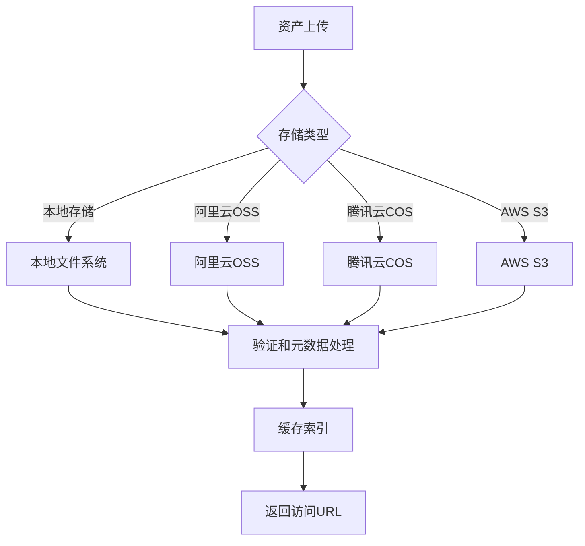

**图示来源** 
- [service/asset_ecloud.go](file://service/asset_ecloud.go)
- [controller/asset.go](file://controller/asset.go)

**章节来源**
- [service/asset_ecloud.go](file://service/asset_ecloud.go)
- [controller/asset.go](file://controller/asset.go)

### 改进的资产组管理界面
全新的资产组管理界面提供了更直观的操作体验：

- **可视化分组**：拖拽式资产分组管理，支持多级分类
- **批量操作**：支持批量上传、移动、删除等操作
- **搜索过滤**：基于名称、类型、时间等多维度搜索和过滤
- **权限管理**：为不同用户组设置不同的资产访问权限

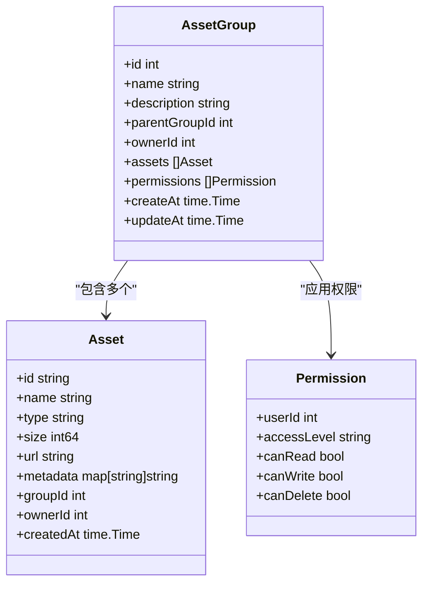

**图示来源** 
- [model/asset.go](file://model/asset.go)
- [controller/asset.go](file://controller/asset.go)

**章节来源**
- [model/asset.go](file://model/asset.go)
- [controller/asset.go](file://controller/asset.go)

### 资产生命周期管理
完整的资产生命周期管理功能：

- **版本控制**：支持资产版本管理，保留历史版本
- **自动清理**：配置过期策略，自动清理无用资产
- **迁移工具**：支持在不同存储间迁移资产数据
- **审计追踪**：记录所有资产操作的完整审计日志

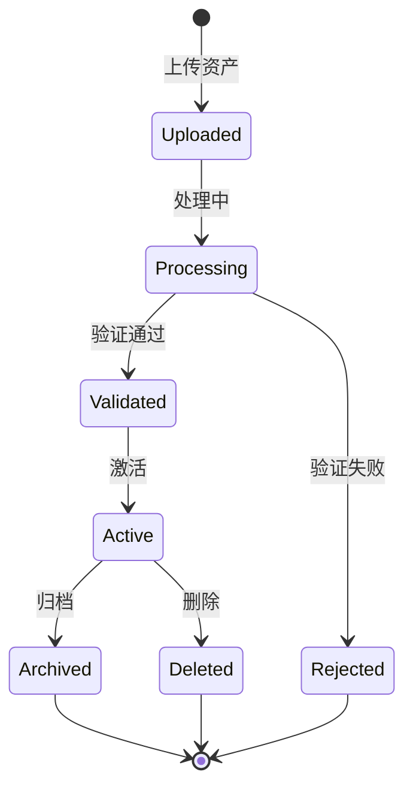

**图示来源** 
- [service/asset.go](file://service/asset.go)
- [model/asset.go](file://model/asset.go)

**章节来源**
- [service/asset.go](file://service/asset.go)
- [model/asset.go](file://model/asset.go)

## 依赖关系分析
系统各组件间的依赖关系如下，现已包含资产管理相关模块：

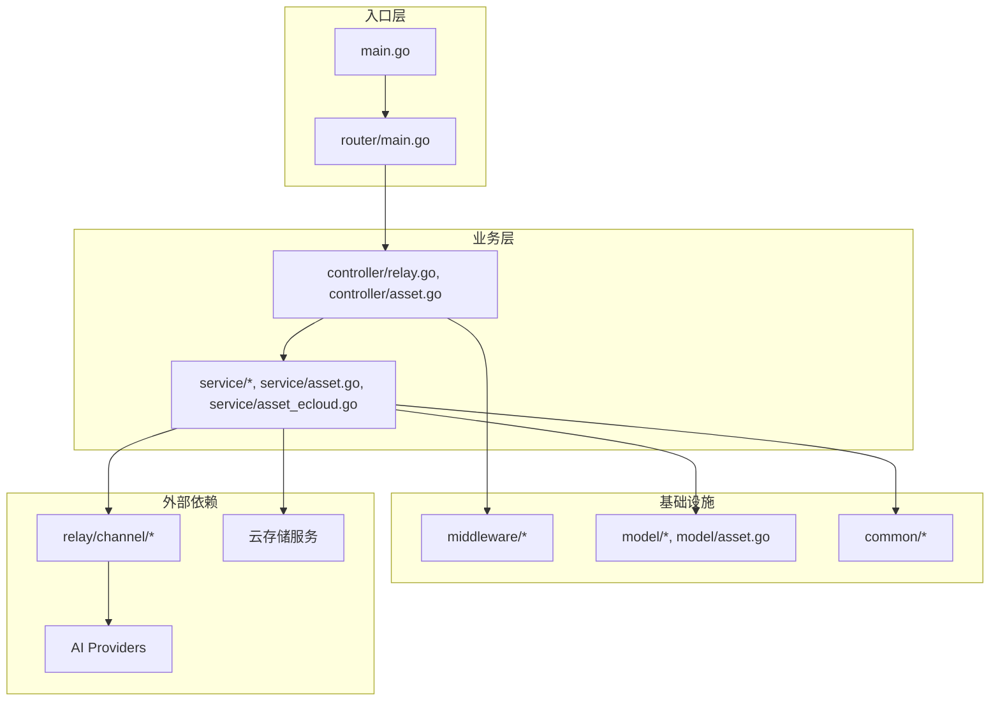

**图示来源** 
- [main.go](file://main.go)
- [router/main.go](file://router/main.go)
- [controller/relay.go](file://controller/relay.go)
- [controller/asset.go](file://controller/asset.go)
- [service/channel_select.go](file://service/channel_select.go)
- [service/asset.go](file://service/asset.go)
- [service/asset_ecloud.go](file://service/asset_ecloud.go)
- [middleware/auth.go](file://middleware/auth.go)
- [model/pricing.go](file://model/pricing.go)
- [model/asset.go](file://model/asset.go)
- [common/disk_cache.go](file://common/disk_cache.go)

**章节来源**
- [main.go](file://main.go)
- [router/main.go](file://router/main.go)
- [controller/relay.go](file://controller/relay.go)
- [controller/asset.go](file://controller/asset.go)

## 性能考量
- 缓存策略：合理使用内存缓存和磁盘缓存，避免缓存穿透和雪崩
- 限流配置：根据系统负载动态调整限流阈值
- 连接池：优化HTTP连接池大小，避免连接泄漏
- 异步处理：非关键路径操作异步执行，提升响应速度
- 监控告警：建立完善的监控体系，及时发现性能瓶颈
- **存储优化**：云存储连接池管理、分块上传、断点续传
- **资产缓存**：热门资产的CDN加速和本地缓存

## 故障排查指南
- 认证失败：检查API密钥有效性、权限配置、密钥过期时间
- 渠道不可用：查看渠道健康状态、网络连通性、配额限制
- 计费异常：核对定价策略、token计数准确性、余额充足性
- 性能问题：分析慢查询、缓存命中率、限流触发情况
- 日志分析：查看错误日志、审计日志、性能指标
- **资产问题**：检查云存储连接配置、权限设置、存储空间限制
- **上传失败**：验证文件格式、大小限制、网络连通性

**章节来源**
- [middleware/auth.go](file://middleware/auth.go)
- [service/channel_select.go](file://service/channel_select.go)
- [service/billing.go](file://service/billing.go)
- [middleware/logger.go](file://middleware/logger.go)
- [service/asset.go](file://service/asset.go)

## 结论
本AI API网关通过统一适配器、智能负载均衡、完善计费系统、细粒度权限控制、安全认证机制、全面监控日志以及性能优化策略，为多模型AI服务提供了稳定、高效、安全的接入平台。最新版本增强的资产管理系统进一步提升了系统的完整性和实用性，支持多云存储集成和改进的用户界面，能够更好地满足企业级应用场景的需求。系统设计充分考虑了可扩展性和可维护性，能够适应不断变化的业务需求和技术演进。

## 附录：配置与使用示例

### 多模型配置示例
- OpenAI配置：设置API密钥、基础URL、模型列表
- Claude配置：配置消息格式、温度参数、最大token数
- Gemini配置：设置生成配置、安全设置、速率限制

### 负载均衡策略配置
- 权重分配：为不同渠道设置请求权重
- 亲和性规则：基于用户ID或模型类型绑定特定渠道
- 健康检查：配置检查间隔、超时时间、失败阈值

### 计费规则配置
- 按token定价：设置输入/输出token单价
- 套餐配置：定义包月/包年套餐额度与价格
- 折扣规则：配置批量折扣、促销折扣

### 权限控制配置
- 角色定义：创建管理员、开发者、普通用户等角色
- 权限规则：为角色分配渠道访问、模型使用权限
- 资源隔离：实现租户间的数据隔离

### 监控与日志配置
- 日志级别：设置INFO、WARN、ERROR等不同级别
- 指标采集：配置QPS、延迟、错误率等指标
- 告警规则：设置阈值触发告警通知

### 资产管理系统配置
- **云存储配置**：设置阿里云OSS、腾讯云COS、AWS S3等存储服务的连接参数
- **存储策略**：配置默认存储类型、备份策略、数据保留期限
- **访问控制**：配置用户和组的资产访问权限
- **缓存策略**：设置资产缓存策略和CDN配置

**章节来源**
- [router/asset-router.go](file://router/asset-router.go)
- [controller/asset.go](file://controller/asset.go)
- [service/asset.go](file://service/asset.go)
- [service/asset_ecloud.go](file://service/asset_ecloud.go)
- [model/asset.go](file://model/asset.go)