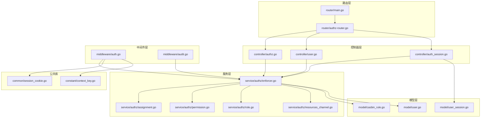
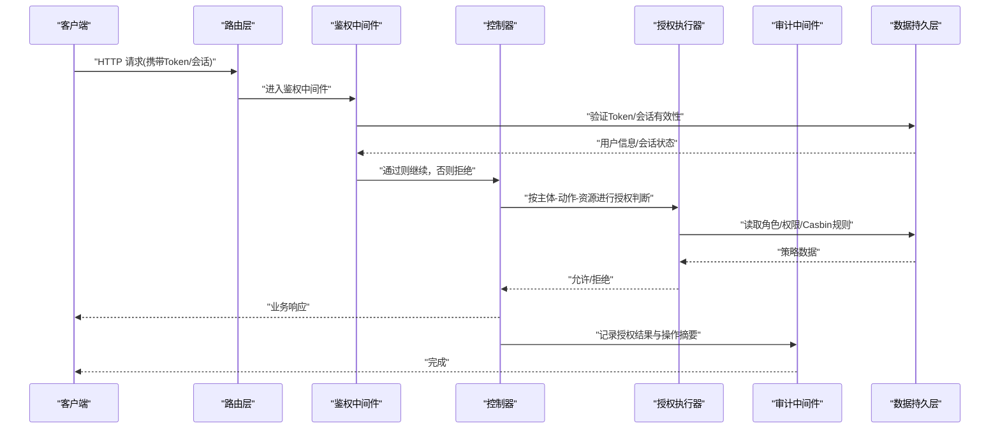
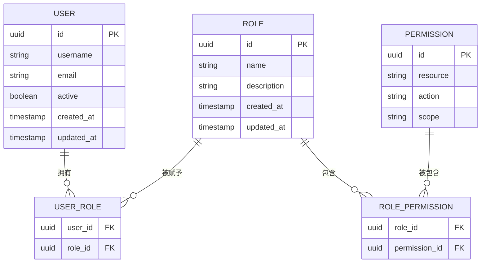
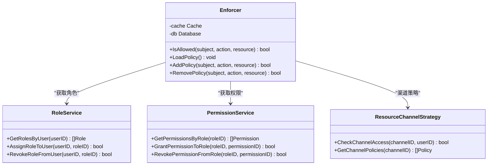
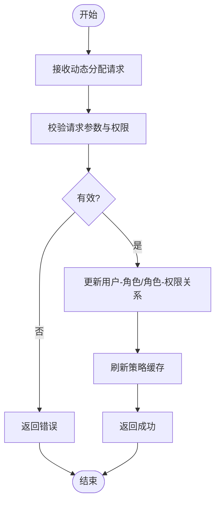
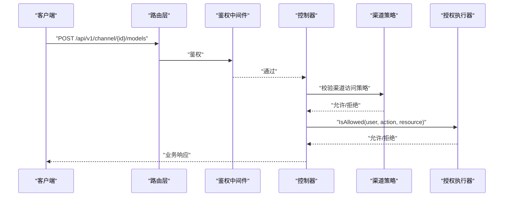
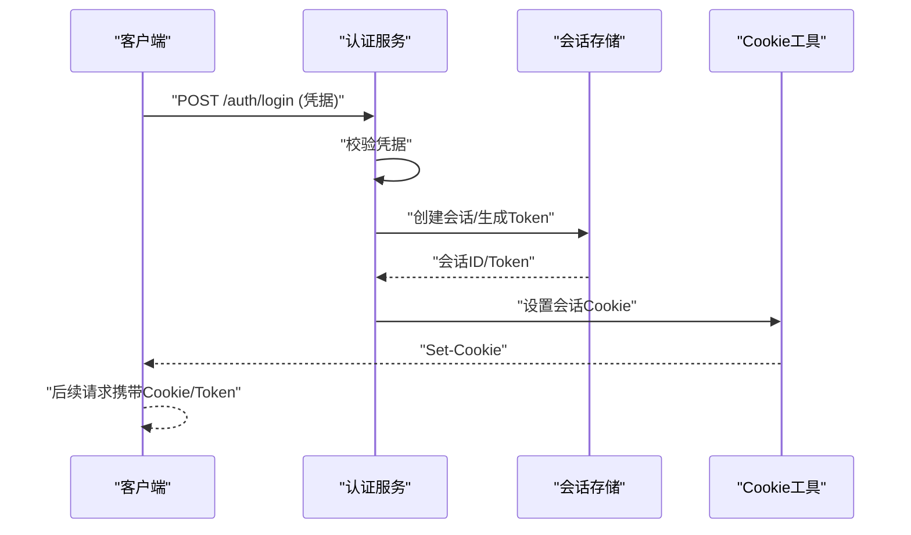
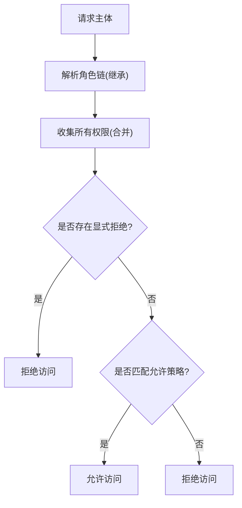
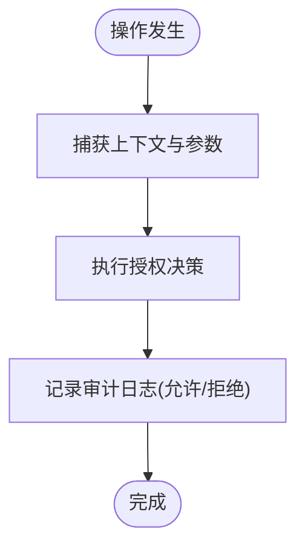
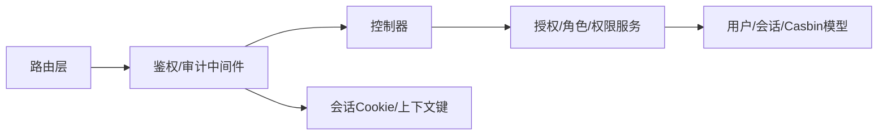

# 用户权限管理

<cite>
**本文引用的文件**   
- [main.go](file://main.go)
- [router/main.go](file://router/main.go)
- [router/authz-router.go](file://router/authz-router.go)
- [controller/authz.go](file://controller/authz.go)
- [controller/user.go](file://controller/user.go)
- [controller/auth_session.go](file://controller/auth_session.go)
- [middleware/auth.go](file://middleware/auth.go)
- [middleware/audit.go](file://middleware/audit.go)
- [service/authz/enforcer.go](file://service/authz/enforcer.go)
- [service/authz/assignment.go](file://service/authz/assignment.go)
- [service/authz/permission.go](file://service/authz/permission.go)
- [service/authz/role.go](file://service/authz/role.go)
- [service/authz/resources_channel.go](file://service/authz/resources_channel.go)
- [model/casbin_rule.go](file://model/casbin_rule.go)
- [model/user.go](file://model/user.go)
- [model/user_session.go](file://model/user_session.go)
- [common/session_cookie.go](file://common/session_cookie.go)
- [constant/context_key.go](file://constant/context_key.go)
</cite>

## 目录
1. [简介](#简介)
2. [项目结构](#项目结构)
3. [核心组件](#核心组件)
4. [架构总览](#架构总览)
5. [详细组件分析](#详细组件分析)
6. [依赖关系分析](#依赖关系分析)
7. [性能考量](#性能考量)
8. [故障排查指南](#故障排查指南)
9. [结论](#结论)
10. [附录](#附录)

## 简介
本文件为用户权限管理系统的权威文档，围绕基于角色的访问控制（RBAC）模型展开，覆盖用户、角色、权限之间的关系与继承覆盖机制；阐述API级权限控制与资源访问限制；说明认证流程与会话管理；提供权限配置最佳实践与安全建议；并包含权限审计与日志记录能力。内容兼顾管理员配置与开发者API集成需求。

## 项目结构
权限相关代码主要分布在以下层次：
- 路由层：注册受保护路由与鉴权中间件
- 控制器层：处理用户、会话、授权等请求
- 服务层：封装授权决策、角色与权限分配、资源策略
- 模型层：持久化用户、会话、Casbin规则等
- 中间件层：统一鉴权、审计、限流等横切关注点
- 公共库：会话Cookie、上下文键、常量等

图表来源
- [router/main.go](file://router/main.go)
- [router/authz-router.go](file://router/authz-router.go)
- [controller/authz.go](file://controller/authz.go)
- [controller/user.go](file://controller/user.go)
- [controller/auth_session.go](file://controller/auth_session.go)
- [service/authz/enforcer.go](file://service/authz/enforcer.go)
- [service/authz/assignment.go](file://service/authz/assignment.go)
- [service/authz/permission.go](file://service/authz/permission.go)
- [service/authz/role.go](file://service/authz/role.go)
- [service/authz/resources_channel.go](file://service/authz/resources_channel.go)
- [model/casbin_rule.go](file://model/casbin_rule.go)
- [model/user.go](file://model/user.go)
- [model/user_session.go](file://model/user_session.go)
- [common/session_cookie.go](file://common/session_cookie.go)
- [constant/context_key.go](file://constant/context_key.go)

章节来源
- [router/main.go](file://router/main.go)
- [router/authz-router.go](file://router/authz-router.go)

## 核心组件
- 授权执行器（Enforcer）：封装Casbin策略引擎调用，提供统一的授权决策接口
- 角色与权限服务：负责角色定义、权限集合、角色-权限绑定与查询
- 动态分配服务：支持运行时将权限或角色动态授予用户，并即时生效
- 资源通道策略：针对渠道/资源维度的细粒度访问控制
- 认证中间件：校验Token/会话，注入用户上下文，触发授权检查
- 审计中间件：记录关键操作与授权结果，便于追踪与合规

章节来源
- [service/authz/enforcer.go](file://service/authz/enforcer.go)
- [service/authz/role.go](file://service/authz/role.go)
- [service/authz/permission.go](file://service/authz/permission.go)
- [service/authz/assignment.go](file://service/authz/assignment.go)
- [service/authz/resources_channel.go](file://service/authz/resources_channel.go)
- [middleware/auth.go](file://middleware/auth.go)
- [middleware/audit.go](file://middleware/audit.go)

## 架构总览
下图展示一次受保护API请求的完整链路：从路由到中间件鉴权，再到控制器与服务层的授权决策，最后返回结果并记录审计日志。

图表来源
- [router/main.go](file://router/main.go)
- [middleware/auth.go](file://middleware/auth.go)
- [controller/authz.go](file://controller/authz.go)
- [service/authz/enforcer.go](file://service/authz/enforcer.go)
- [middleware/audit.go](file://middleware/audit.go)

## 详细组件分析

### RBAC模型与实体关系
- 用户（User）：系统主体，具备唯一标识与基础属性
- 角色（Role）：一组权限的集合，可被多个用户拥有
- 权限（Permission）：对特定资源的动作许可（如“读取”、“写入”）
- 资源（Resource）：受控对象，如API端点、渠道、数据集等
- 关系：用户-角色多对多，角色-权限多对多；支持角色继承与覆盖

图表来源
- [model/user.go](file://model/user.go)
- [model/casbin_rule.go](file://model/casbin_rule.go)

章节来源
- [model/user.go](file://model/user.go)
- [model/casbin_rule.go](file://model/casbin_rule.go)

### 授权执行器（Enforcer）
- 职责：封装Casbin策略引擎，提供IsAllowed(subject, action, resource)等接口
- 输入：主体（用户/角色）、动作（读/写/管理等）、资源（端点/渠道/对象ID）
- 输出：布尔授权结果，必要时附带原因
- 缓存：对热点策略进行内存/Redis缓存，降低数据库压力
- 扩展：支持自定义策略加载器与评估器

图表来源
- [service/authz/enforcer.go](file://service/authz/enforcer.go)
- [service/authz/role.go](file://service/authz/role.go)
- [service/authz/permission.go](file://service/authz/permission.go)
- [service/authz/resources_channel.go](file://service/authz/resources_channel.go)

章节来源
- [service/authz/enforcer.go](file://service/authz/enforcer.go)
- [service/authz/role.go](file://service/authz/role.go)
- [service/authz/permission.go](file://service/authz/permission.go)
- [service/authz/resources_channel.go](file://service/authz/resources_channel.go)

### 动态权限分配
- 场景：临时提升权限、项目级授权、按租户隔离
- 实现：在运行时调用分配服务更新用户-角色或角色-权限关系，并刷新策略缓存
- 生效：下一次授权请求即生效，避免重启

图表来源
- [service/authz/assignment.go](file://service/authz/assignment.go)

章节来源
- [service/authz/assignment.go](file://service/authz/assignment.go)

### API级权限控制与资源访问限制
- 路由级：为受保护路由挂载鉴权中间件
- 控制器级：在业务入口再次校验资源维度权限（如渠道ID、模型名）
- 策略维度：支持按资源类型、作用域、标签进行精细化控制

图表来源
- [router/authz-router.go](file://router/authz-router.go)
- [middleware/auth.go](file://middleware/auth.go)
- [controller/authz.go](file://controller/authz.go)
- [service/authz/resources_channel.go](file://service/authz/resources_channel.go)
- [service/authz/enforcer.go](file://service/authz/enforcer.go)

章节来源
- [router/authz-router.go](file://router/authz-router.go)
- [middleware/auth.go](file://middleware/auth.go)
- [controller/authz.go](file://controller/authz.go)
- [service/authz/resources_channel.go](file://service/authz/resources_channel.go)

### 认证流程与会话管理
- 登录：用户名密码/OAuth/Passkey等，成功后签发Token或创建会话
- 会话：服务端存储会话状态，客户端通过Cookie或Header传递
- 刷新：支持Token刷新与会话续期
- 注销：销毁会话与失效Token

图表来源
- [controller/auth_session.go](file://controller/auth_session.go)
- [common/session_cookie.go](file://common/session_cookie.go)
- [model/user_session.go](file://model/user_session.go)

章节来源
- [controller/auth_session.go](file://controller/auth_session.go)
- [common/session_cookie.go](file://common/session_cookie.go)
- [model/user_session.go](file://model/user_session.go)

### 权限继承与覆盖机制
- 继承：子角色继承父角色全部权限，支持多层继承链
- 覆盖：显式拒绝优先于继承允许（Deny-overrides-Allow）
- 作用域：权限可按资源作用域限定（如租户、组织、项目）

图表来源
- [service/authz/enforcer.go](file://service/authz/enforcer.go)
- [service/authz/role.go](file://service/authz/role.go)

章节来源
- [service/authz/enforcer.go](file://service/authz/enforcer.go)
- [service/authz/role.go](file://service/authz/role.go)

### 权限审计与日志记录
- 审计点：登录、授权决策、敏感操作、策略变更
- 内容：主体、动作、资源、结果、时间戳、IP、UA
- 存储：集中日志或审计表，支持检索与导出

图表来源
- [middleware/audit.go](file://middleware/audit.go)

章节来源
- [middleware/audit.go](file://middleware/audit.go)

## 依赖关系分析
- 路由依赖中间件：所有受保护路由均经过鉴权与审计中间件
- 控制器依赖服务：业务逻辑委托给授权服务与资源策略
- 服务依赖模型：读写用户、会话、Casbin规则等持久化数据
- 中间件依赖公共库：会话Cookie、上下文键、常量等

图表来源
- [router/main.go](file://router/main.go)
- [middleware/auth.go](file://middleware/auth.go)
- [controller/authz.go](file://controller/authz.go)
- [service/authz/enforcer.go](file://service/authz/enforcer.go)
- [model/user.go](file://model/user.go)
- [model/user_session.go](file://model/user_session.go)
- [model/casbin_rule.go](file://model/casbin_rule.go)
- [common/session_cookie.go](file://common/session_cookie.go)
- [constant/context_key.go](file://constant/context_key.go)

章节来源
- [router/main.go](file://router/main.go)
- [middleware/auth.go](file://middleware/auth.go)
- [controller/authz.go](file://controller/authz.go)
- [service/authz/enforcer.go](file://service/authz/enforcer.go)
- [model/user.go](file://model/user.go)
- [model/user_session.go](file://model/user_session.go)
- [model/casbin_rule.go](file://model/casbin_rule.go)
- [common/session_cookie.go](file://common/session_cookie.go)
- [constant/context_key.go](file://constant/context_key.go)

## 性能考量
- 策略缓存：对高频策略进行内存/Redis缓存，减少数据库查询
- 批量加载：初始化时预加载常用角色与权限，降低冷启动延迟
- 异步审计：将审计日志写入队列，避免阻塞主流程
- 连接池：数据库与缓存连接复用，提高并发吞吐
- 限流：结合中间件限流，防止滥用与DDoS

[本节为通用指导，不直接分析具体文件]

## 故障排查指南
- 鉴权失败：检查Token/会话有效性、用户状态、角色绑定是否正确
- 授权拒绝：确认策略是否加载、资源与作用域是否匹配、是否存在显式拒绝
- 性能问题：查看缓存命中率、数据库慢查询、审计写入耗时
- 审计缺失：确认审计中间件是否启用、日志落盘是否正常

章节来源
- [middleware/auth.go](file://middleware/auth.go)
- [middleware/audit.go](file://middleware/audit.go)
- [service/authz/enforcer.go](file://service/authz/enforcer.go)

## 结论
本权限管理系统以RBAC为核心，结合Casbin策略引擎与分层中间件，实现了灵活的API级权限控制与资源访问限制。通过动态分配、继承覆盖、审计日志与缓存优化，满足管理员配置与开发者集成的双重需求。建议在生产环境启用最小权限原则、严格的作用域隔离与完善的审计追踪。

[本节为总结性内容，不直接分析具体文件]

## 附录
- 管理员配置建议
  - 使用最小权限原则，按需授予角色与权限
  - 明确资源作用域，避免跨租户越权
  - 定期审查角色与权限映射，清理冗余策略
  - 开启审计与告警，及时发现异常行为
- 开发者集成指南
  - 在控制器中调用授权服务进行资源级校验
  - 使用上下文键传递用户与角色信息
  - 对敏感操作增加二次确认与审计记录
  - 合理设计策略粒度，平衡安全与性能

[本节为补充性内容，不直接分析具体文件]