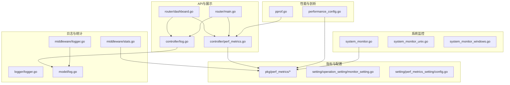
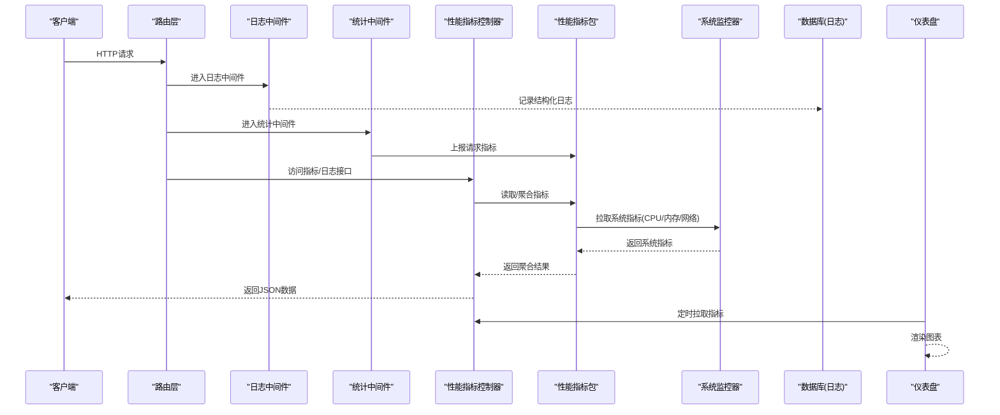
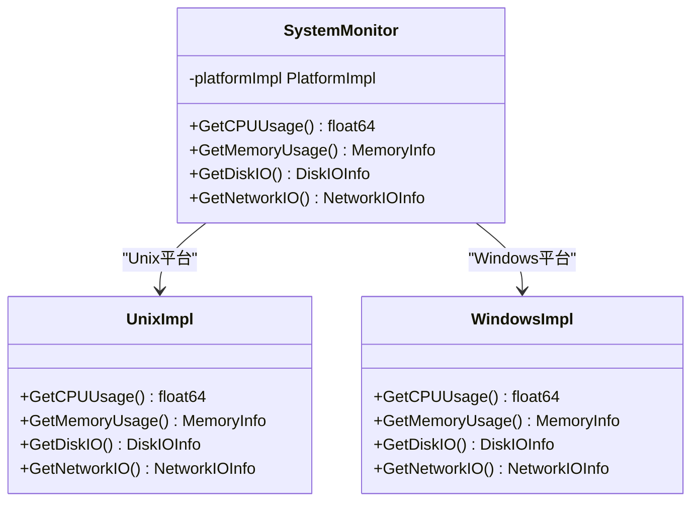
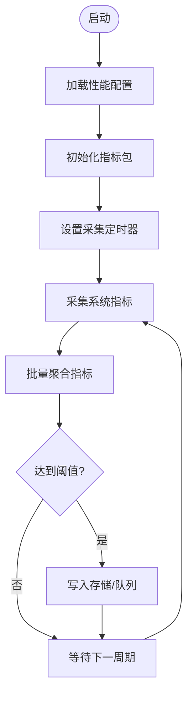
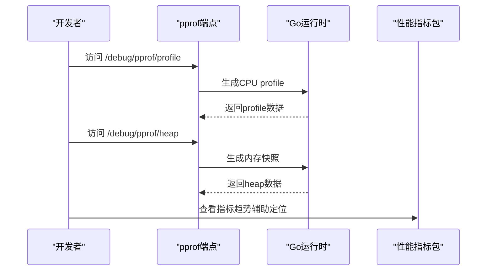
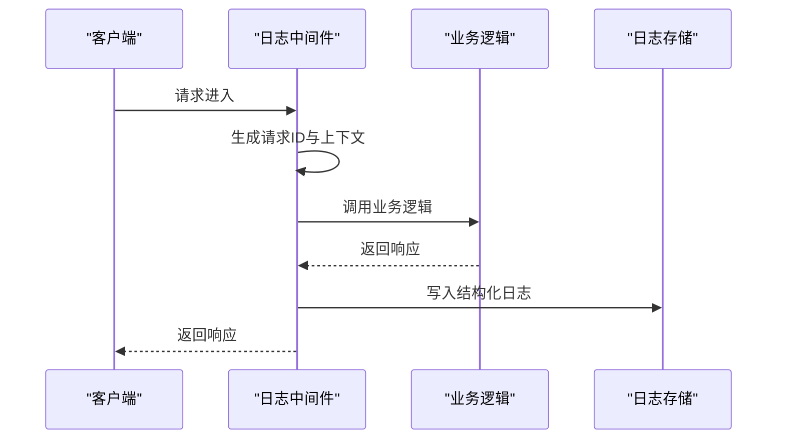
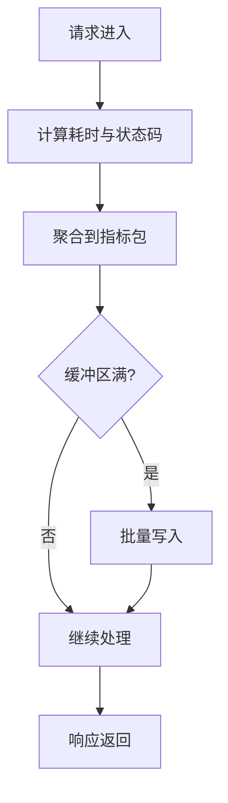
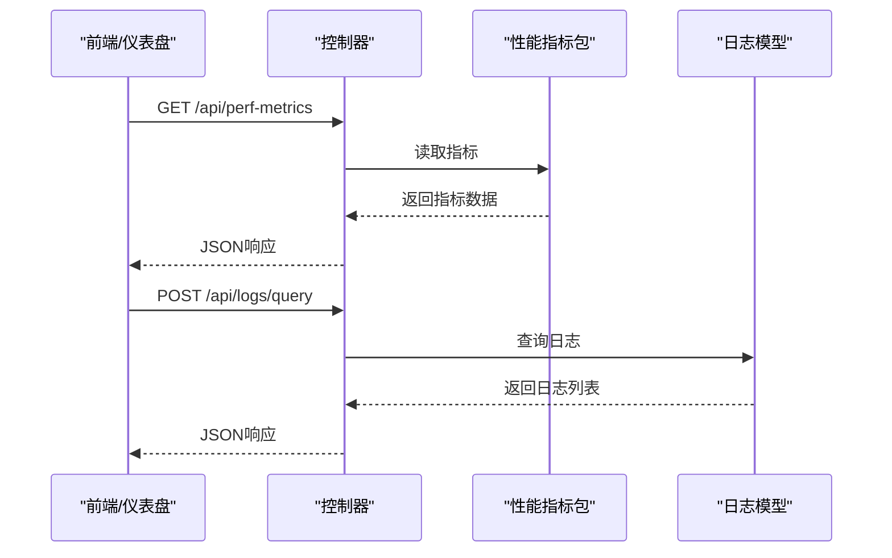
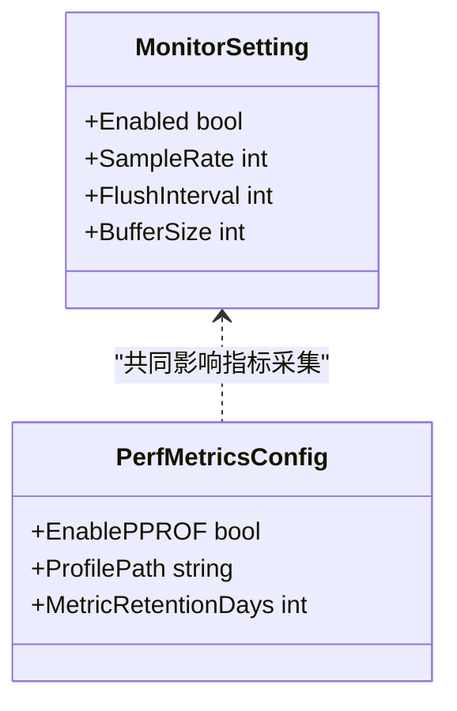
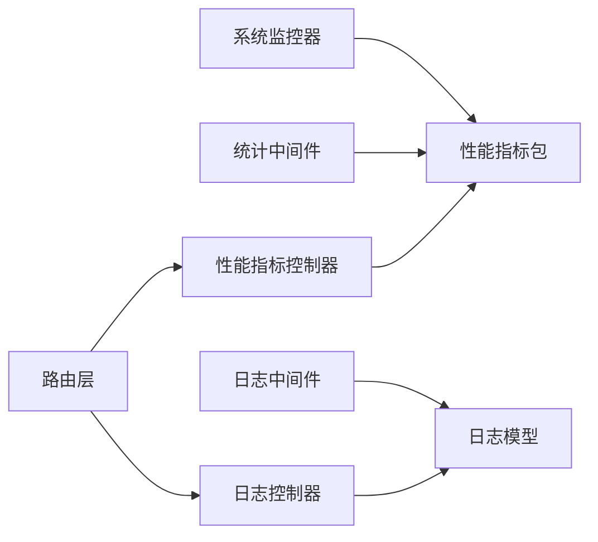

# 监控与日志

<cite>
**本文引用的文件**   
- [common/system_monitor.go](file://common/system_monitor.go)
- [common/system_monitor_unix.go](file://common/system_monitor_unix.go)
- [common/system_monitor_windows.go](file://common/system_monitor_windows.go)
- [common/performance_config.go](file://common/performance_config.go)
- [common/pprof.go](file://common/pprof.go)
- [logger/logger.go](file://logger/logger.go)
- [middleware/logger.go](file://middleware/logger.go)
- [middleware/stats.go](file://middleware/stats.go)
- [model/log.go](file://model/log.go)
- [controller/log.go](file://controller/log.go)
- [controller/perf_metrics.go](file://controller/perf_metrics.go)
- [setting/operation_setting/monitor_setting.go](file://setting/operation_setting/monitor_setting.go)
- [setting/perf_metrics_setting/config.go](file://setting/perf_metrics_setting/config.go)
- [pkg/perf_metrics/metrics.go](file://pkg/perf_metrics/metrics.go)
- [pkg/perf_metrics/flush.go](file://pkg/perf_metrics/flush.go)
- [pkg/perf_metrics/types.go](file://pkg/perf_metrics/types.go)
- [router/main.go](file://router/main.go)
- [router/dashboard.go](file://router/dashboard.go)
</cite>

## 目录
1. [简介](#简介)
2. [项目结构](#项目结构)
3. [核心组件](#核心组件)
4. [架构总览](#架构总览)
5. [详细组件分析](#详细组件分析)
6. [依赖关系分析](#依赖关系分析)
7. [性能考量](#性能考量)
8. [故障诊断指南](#故障诊断指南)
9. [结论](#结论)
10. [附录](#附录)

## 简介
本章节面向运维与开发者，系统化阐述该项目的监控与日志体系：包括系统级性能指标（CPU、内存、网络I/O等）的采集与分析、结构化日志与分布式追踪、告警规则与通知机制的配置方法、性能分析工具与故障诊断流程、监控仪表板的自定义配置，以及日志轮转与归档策略。文档以代码为依据，提供可操作的实践建议与可视化图示，帮助快速落地生产环境的可观测性建设。

## 项目结构
监控与日志相关能力分布在以下模块：
- 系统监控：系统资源指标采集与平台差异实现
- 性能配置：性能相关开关与阈值配置
- pprof：运行时性能剖析接口
- 日志框架：统一日志输出与中间件记录
- 统计中间件：请求统计与关键指标聚合
- 模型层：日志持久化模型
- 控制器：对外暴露的性能指标与日志查询接口
- 设置项：监控与性能指标的开关、采样率、刷新周期等
- 性能指标包：通用指标定义、批量写入与类型封装
- 路由：仪表盘与指标导出端点注册

**图表来源** 
- [common/system_monitor.go](file://common/system_monitor.go)
- [common/system_monitor_unix.go](file://common/system_monitor_unix.go)
- [common/system_monitor_windows.go](file://common/system_monitor_windows.go)
- [common/performance_config.go](file://common/performance_config.go)
- [common/pprof.go](file://common/pprof.go)
- [logger/logger.go](file://logger/logger.go)
- [middleware/logger.go](file://middleware/logger.go)
- [middleware/stats.go](file://middleware/stats.go)
- [model/log.go](file://model/log.go)
- [controller/log.go](file://controller/log.go)
- [controller/perf_metrics.go](file://controller/perf_metrics.go)
- [setting/operation_setting/monitor_setting.go](file://setting/operation_setting/monitor_setting.go)
- [setting/perf_metrics_setting/config.go](file://setting/perf_metrics_setting/config.go)
- [pkg/perf_metrics/metrics.go](file://pkg/perf_metrics/metrics.go)
- [pkg/perf_metrics/flush.go](file://pkg/perf_metrics/flush.go)
- [pkg/perf_metrics/types.go](file://pkg/perf_metrics/types.go)
- [router/main.go](file://router/main.go)
- [router/dashboard.go](file://router/dashboard.go)

**章节来源**
- [common/system_monitor.go](file://common/system_monitor.go)
- [common/system_monitor_unix.go](file://common/system_monitor_unix.go)
- [common/system_monitor_windows.go](file://common/system_monitor_windows.go)
- [common/performance_config.go](file://common/performance_config.go)
- [common/pprof.go](file://common/pprof.go)
- [logger/logger.go](file://logger/logger.go)
- [middleware/logger.go](file://middleware/logger.go)
- [middleware/stats.go](file://middleware/stats.go)
- [model/log.go](file://model/log.go)
- [controller/log.go](file://controller/log.go)
- [controller/perf_metrics.go](file://controller/perf_metrics.go)
- [setting/operation_setting/monitor_setting.go](file://setting/operation_setting/monitor_setting.go)
- [setting/perf_metrics_setting/config.go](file://setting/perf_metrics_setting/config.go)
- [pkg/perf_metrics/metrics.go](file://pkg/perf_metrics/metrics.go)
- [pkg/perf_metrics/flush.go](file://pkg/perf_metrics/flush.go)
- [pkg/perf_metrics/types.go](file://pkg/perf_metrics/types.go)
- [router/main.go](file://router/main.go)
- [router/dashboard.go](file://router/dashboard.go)

## 核心组件
- 系统监控器：负责采集CPU、内存、磁盘与网络等系统级指标，并提供跨平台实现
- 性能配置：集中管理性能相关开关、采样频率、缓冲大小等参数
- pprof：暴露标准Go剖析接口，支持CPU、内存、阻塞、goroutine等分析
- 日志框架：统一日志初始化与输出格式，支持结构化字段
- 统计中间件：在HTTP链路中收集请求耗时、状态码、流量等指标
- 指标包：定义通用指标类型、批量写入与刷新机制
- 控制器与路由：对外暴露指标查询、日志检索与仪表盘页面

**章节来源**
- [common/system_monitor.go](file://common/system_monitor.go)
- [common/performance_config.go](file://common/performance_config.go)
- [common/pprof.go](file://common/pprof.go)
- [logger/logger.go](file://logger/logger.go)
- [middleware/stats.go](file://middleware/stats.go)
- [pkg/perf_metrics/metrics.go](file://pkg/perf_metrics/metrics.go)
- [pkg/perf_metrics/flush.go](file://pkg/perf_metrics/flush.go)
- [pkg/perf_metrics/types.go](file://pkg/perf_metrics/types.go)
- [controller/perf_metrics.go](file://controller/perf_metrics.go)
- [controller/log.go](file://controller/log.go)
- [router/main.go](file://router/main.go)
- [router/dashboard.go](file://router/dashboard.go)

## 架构总览
下图展示了从请求进入、指标采集、日志落盘到外部可视化的整体流程。

**图表来源** 
- [router/main.go](file://router/main.go)
- [middleware/logger.go](file://middleware/logger.go)
- [middleware/stats.go](file://middleware/stats.go)
- [controller/perf_metrics.go](file://controller/perf_metrics.go)
- [pkg/perf_metrics/metrics.go](file://pkg/perf_metrics/metrics.go)
- [common/system_monitor.go](file://common/system_monitor.go)
- [model/log.go](file://model/log.go)

## 详细组件分析

### 系统监控器（CPU、内存、网络I/O）
- 职责：采集进程与宿主机的CPU使用率、内存占用、磁盘读写、网络收发等指标；提供Unix与Windows两套实现
- 关键点：
  - 通过平台特定实现获取底层指标，保证跨平台一致性
  - 指标按固定周期采集并缓存，供上层控制器或任务消费
  - 结合性能配置控制采样频率与缓冲上限，避免过度开销

**图表来源** 
- [common/system_monitor.go](file://common/system_monitor.go)
- [common/system_monitor_unix.go](file://common/system_monitor_unix.go)
- [common/system_monitor_windows.go](file://common/system_monitor_windows.go)

**章节来源**
- [common/system_monitor.go](file://common/system_monitor.go)
- [common/system_monitor_unix.go](file://common/system_monitor_unix.go)
- [common/system_monitor_windows.go](file://common/system_monitor_windows.go)

### 性能配置与指标刷新
- 职责：集中管理性能指标采集开关、采样间隔、批处理大小、是否启用pprof等
- 关键点：
  - 通过配置项动态调整采集频率与存储策略
  - 与指标包的批量写入配合，降低写放大
  - 支持运行时热更新（若实现），便于调优

**图表来源** 
- [common/performance_config.go](file://common/performance_config.go)
- [pkg/perf_metrics/metrics.go](file://pkg/perf_metrics/metrics.go)
- [pkg/perf_metrics/flush.go](file://pkg/perf_metrics/flush.go)

**章节来源**
- [common/performance_config.go](file://common/performance_config.go)
- [setting/perf_metrics_setting/config.go](file://setting/perf_metrics_setting/config.go)
- [pkg/perf_metrics/metrics.go](file://pkg/perf_metrics/metrics.go)
- [pkg/perf_metrics/flush.go](file://pkg/perf_metrics/flush.go)

### pprof 性能剖析
- 职责：暴露标准Go剖析接口，支持CPU、内存、阻塞、goroutine等分析
- 关键点：
  - 通过HTTP端点暴露pprof路径
  - 建议在调试环境开启，生产环境谨慎启用
  - 结合指标包与系统监控，定位热点与瓶颈

**图表来源** 
- [common/pprof.go](file://common/pprof.go)
- [pkg/perf_metrics/metrics.go](file://pkg/perf_metrics/metrics.go)

**章节来源**
- [common/pprof.go](file://common/pprof.go)

### 日志框架与中间件
- 职责：统一日志初始化、格式化与输出；在HTTP链路中记录请求上下文、耗时、状态码等
- 关键点：
  - 结构化日志字段包含请求ID、用户信息、模型名、渠道、耗时、状态码等
  - 中间件确保异常不中断主流程，同时记录错误堆栈
  - 支持异步写入与缓冲，降低对请求延迟的影响

**图表来源** 
- [logger/logger.go](file://logger/logger.go)
- [middleware/logger.go](file://middleware/logger.go)
- [model/log.go](file://model/log.go)

**章节来源**
- [logger/logger.go](file://logger/logger.go)
- [middleware/logger.go](file://middleware/logger.go)
- [model/log.go](file://model/log.go)

### 统计中间件与指标聚合
- 职责：在请求链路中统计QPS、延迟分布、状态码分布、带宽等
- 关键点：
  - 基于中间件拦截请求与响应，计算耗时与计数
  - 将指标推送到性能指标包进行聚合与批量写入
  - 支持按维度（如模型、渠道、用户）拆分统计

**图表来源** 
- [middleware/stats.go](file://middleware/stats.go)
- [pkg/perf_metrics/metrics.go](file://pkg/perf_metrics/metrics.go)

**章节来源**
- [middleware/stats.go](file://middleware/stats.go)
- [pkg/perf_metrics/metrics.go](file://pkg/perf_metrics/metrics.go)

### 控制器与API
- 职责：暴露性能指标查询、日志检索、仪表盘数据接口
- 关键点：
  - 指标接口返回聚合后的系统与应用指标
  - 日志接口支持过滤条件（时间范围、级别、关键字）
  - 仪表盘接口为前端提供图表所需的数据源

**图表来源** 
- [controller/perf_metrics.go](file://controller/perf_metrics.go)
- [controller/log.go](file://controller/log.go)
- [pkg/perf_metrics/metrics.go](file://pkg/perf_metrics/metrics.go)
- [model/log.go](file://model/log.go)

**章节来源**
- [controller/perf_metrics.go](file://controller/perf_metrics.go)
- [controller/log.go](file://controller/log.go)
- [pkg/perf_metrics/metrics.go](file://pkg/perf_metrics/metrics.go)
- [model/log.go](file://model/log.go)

### 设置项与监控配置
- 职责：提供监控开关、采样率、刷新周期、告警阈值等配置项
- 关键点：
  - 监控设置项集中管理，便于统一维护
  - 性能指标配置支持动态调整，适应不同负载场景
  - 与控制器和中间件联动生效

**图表来源** 
- [setting/operation_setting/monitor_setting.go](file://setting/operation_setting/monitor_setting.go)
- [setting/perf_metrics_setting/config.go](file://setting/perf_metrics_setting/config.go)

**章节来源**
- [setting/operation_setting/monitor_setting.go](file://setting/operation_setting/monitor_setting.go)
- [setting/perf_metrics_setting/config.go](file://setting/perf_metrics_setting/config.go)

## 依赖关系分析
- 低耦合高内聚：系统监控、指标包、中间件、控制器之间通过清晰接口交互
- 外部依赖：数据库用于日志持久化；可选的外部存储用于指标归档
- 潜在循环依赖：通过分层设计避免，控制器仅依赖指标包与模型层

**图表来源** 
- [common/system_monitor.go](file://common/system_monitor.go)
- [middleware/stats.go](file://middleware/stats.go)
- [middleware/logger.go](file://middleware/logger.go)
- [controller/perf_metrics.go](file://controller/perf_metrics.go)
- [controller/log.go](file://controller/log.go)
- [model/log.go](file://model/log.go)
- [pkg/perf_metrics/metrics.go](file://pkg/perf_metrics/metrics.go)
- [router/main.go](file://router/main.go)

**章节来源**
- [common/system_monitor.go](file://common/system_monitor.go)
- [middleware/stats.go](file://middleware/stats.go)
- [middleware/logger.go](file://middleware/logger.go)
- [controller/perf_metrics.go](file://controller/perf_metrics.go)
- [controller/log.go](file://controller/log.go)
- [model/log.go](file://model/log.go)
- [pkg/perf_metrics/metrics.go](file://pkg/perf_metrics/metrics.go)
- [router/main.go](file://router/main.go)

## 性能考量
- 指标采集频率：根据负载与存储能力调整采样间隔，避免高频采集导致CPU抖动
- 批量写入：利用指标包的批处理机制减少写放大，提升吞吐
- 异步日志：日志写入应异步化，避免阻塞请求链路
- pprof使用：仅在调试或问题排查时开启，生产环境谨慎启用
- 内存与缓冲：合理设置缓冲区大小，防止OOM与丢数据

[本节为通用指导，无需引用具体文件]

## 故障诊断指南
- 常见问题定位：
  - CPU飙升：使用pprof生成CPU profile，结合系统监控确认热点函数
  - 内存泄漏：抓取heap快照，分析对象增长趋势
  - 高延迟：检查统计中间件的延迟分布，定位慢请求
  - 日志丢失：检查日志中间件与存储连接，确认缓冲与写入策略
- 诊断步骤：
  - 启用pprof并采集快照
  - 查看系统监控指标趋势
  - 检索相关日志，关联请求ID
  - 复现问题并对比前后指标变化

**章节来源**
- [common/pprof.go](file://common/pprof.go)
- [middleware/stats.go](file://middleware/stats.go)
- [middleware/logger.go](file://middleware/logger.go)
- [controller/perf_metrics.go](file://controller/perf_metrics.go)
- [controller/log.go](file://controller/log.go)

## 结论
本项目的监控与日志体系以模块化设计为基础，覆盖系统指标采集、结构化日志、性能剖析与指标聚合等关键环节。通过合理的配置与中间件机制，可在不影响主链路的前提下实现高效的可观测性。建议在生产环境中结合外部存储与可视化平台，构建完整的监控告警与故障诊断闭环。

[本节为总结性内容，无需引用具体文件]

## 附录
- 监控仪表板自定义：
  - 基于控制器提供的指标接口，前端可自由组合图表与筛选条件
  - 支持按时间范围、模型、渠道、用户等多维度下钻分析
- 日志轮转与归档策略：
  - 建议按天或大小进行日志轮转，保留一定周期的历史数据
  - 冷数据可归档至对象存储，降低成本并满足合规要求
- 告警规则与通知：
  - 基于指标阈值（如CPU>80%、延迟>500ms）触发告警
  - 通知渠道支持邮件、企业微信、钉钉等

[本节为扩展建议，无需引用具体文件]