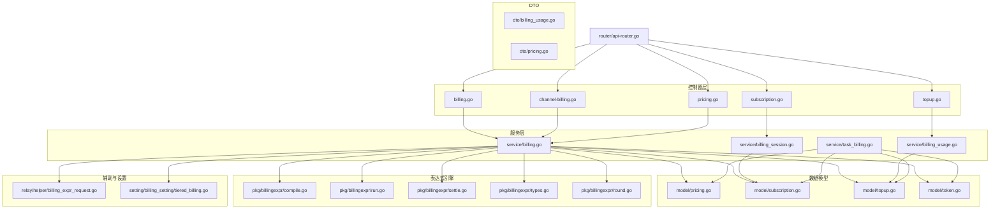
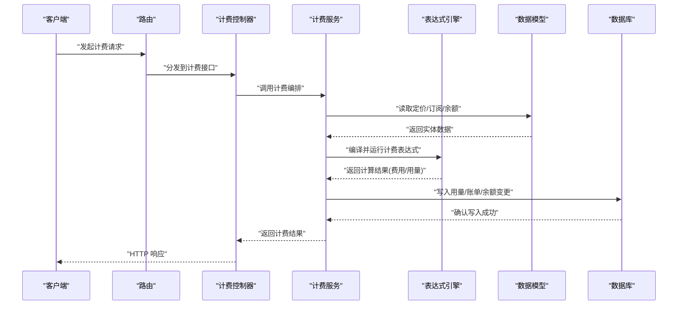
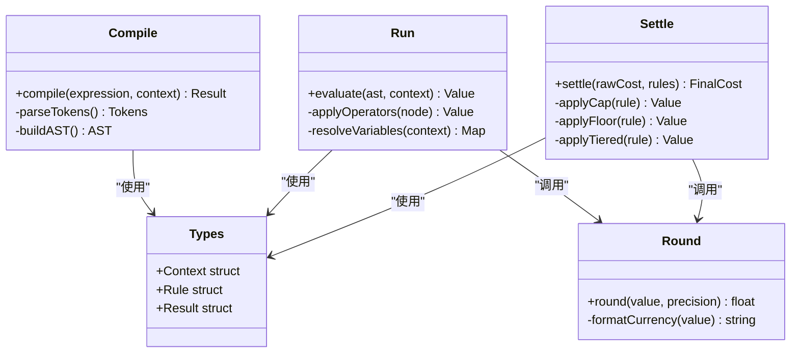
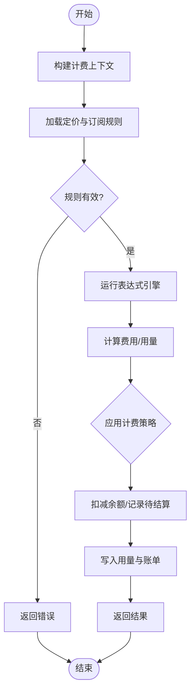
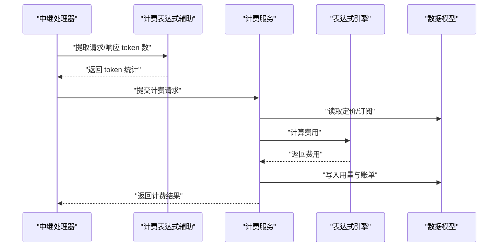
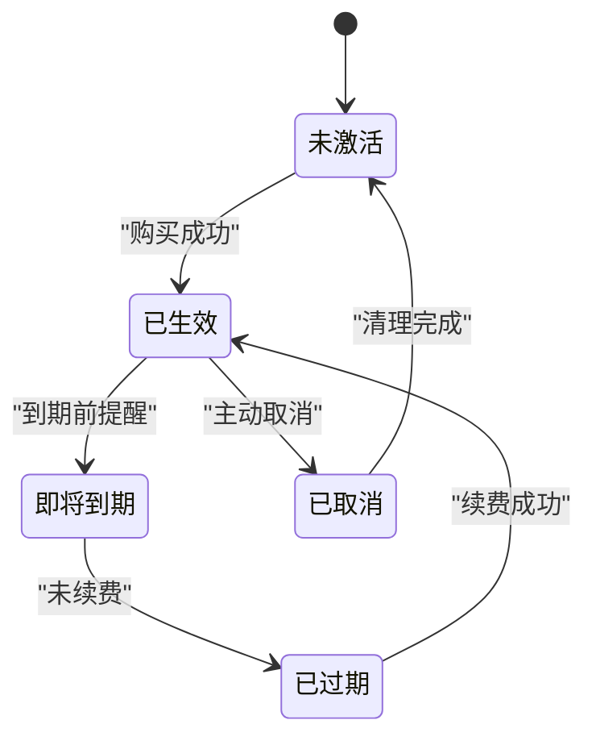
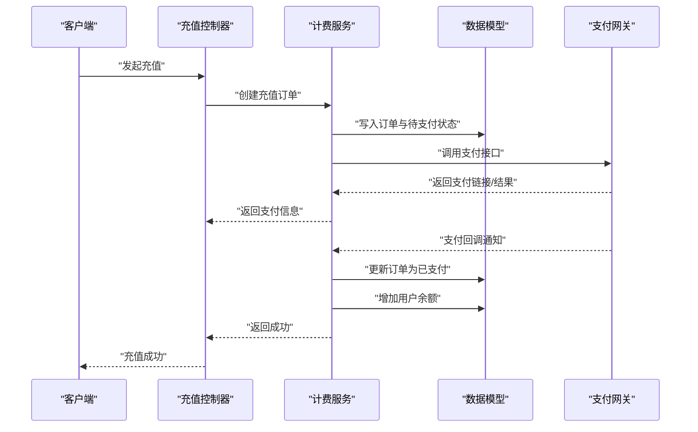
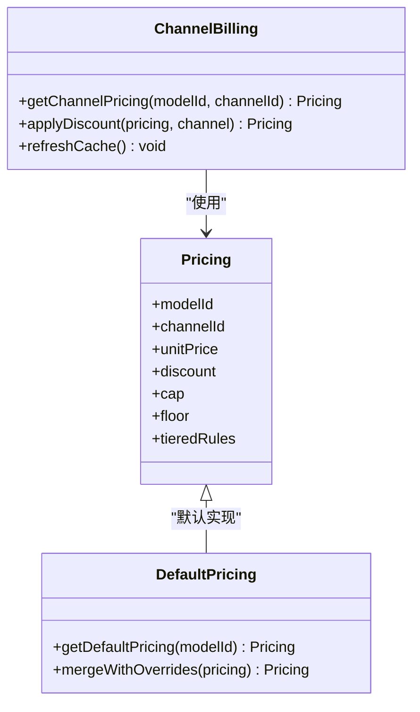
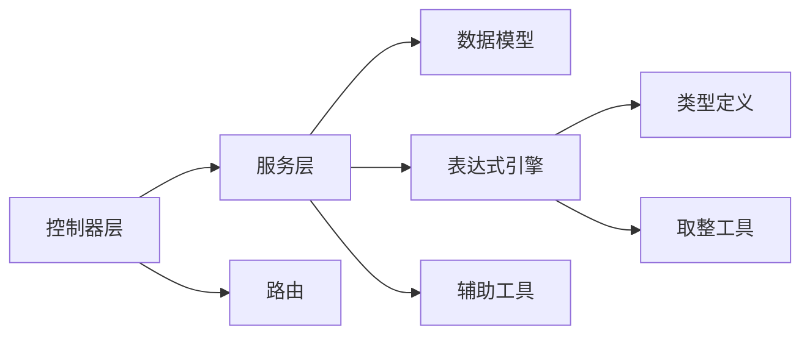

# 计费系统

<cite>
**本文引用的文件**   
- [billing.go](file://controller/billing.go)
- [channel-billing.go](file://controller/channel-billing.go)
- [subscription.go](file://controller/subscription.go)
- [topup.go](file://controller/topup.go)
- [pricing.go](file://controller/pricing.go)
- [billing_usage.go](file://dto/billing_usage.go)
- [pricing.go](file://dto/pricing.go)
- [billingexpr/compile.go](file://pkg/billingexpr/compile.go)
- [billingexpr/run.go](file://pkg/billingexpr/run.go)
- [billingexpr/settle.go](file://pkg/billingexpr/settle.go)
- [billingexpr/types.go](file://pkg/billingexpr/types.go)
- [billingexpr/round.go](file://pkg/billingexpr/round.go)
- [helper/billing_expr_request.go](file://relay/helper/billing_expr_request.go)
- [service/billing.go](file://service/billing.go)
- [service/billing_session.go](file://service/billing_session.go)
- [service/billing_usage.go](file://service/billing_usage.go)
- [service/task_billing.go](file://service/task_billing.go)
- [model/pricing.go](file://model/pricing.go)
- [model/pricing_default.go](file://model/pricing_default.go)
- [model/pricing_refresh.go](file://model/pricing_refresh.go)
- [model/subscription.go](file://model/subscription.go)
- [model/token.go](file://model/token.go)
- [model/topup.go](file://model/topup.go)
- [setting/billing_setting/tiered_billing.go](file://setting/billing_setting/tiered_billing.go)
- [router/api-router.go](file://router/api-router.go)
</cite>

## 目录
1. [简介](#简介)
2. [项目结构](#项目结构)
3. [核心组件](#核心组件)
4. [架构总览](#架构总览)
5. [详细组件分析](#详细组件分析)
6. [依赖关系分析](#依赖关系分析)
7. [性能考量](#性能考量)
8. [故障排查指南](#故障排查指南)
9. [结论](#结论)
10. [附录](#附录)

## 简介
本文件系统性地梳理并文档化该项目的计费能力，覆盖按 token 计费、套餐订阅、余额管理、计费表达式引擎、多计费模式配置（按量付费、包月套餐、混合计费）、计费数据模型与查询接口、规则编写与调试、财务报表生成与对账等。内容从基础配置到高级定制化的完整使用流程，帮助运营、研发与财务快速上手与深度扩展。

## 项目结构
计费相关代码分布在控制器、服务层、数据模型、DTO、表达式引擎与路由等模块中：
- 控制器层：对外暴露计费、定价、订阅、充值等 API
- 服务层：封装计费会话、用量统计、任务结算等业务逻辑
- 数据模型：定价、订阅、充值、令牌等持久化实体
- DTO：计费与定价的数据传输对象
- 表达式引擎：计费表达式的编译、运行、结算与取整
- 路由：API 路由注册

图表来源
- [router/api-router.go](file://router/api-router.go)
- [controller/billing.go](file://controller/billing.go)
- [controller/channel-billing.go](file://controller/channel-billing.go)
- [controller/subscription.go](file://controller/subscription.go)
- [controller/topup.go](file://controller/topup.go)
- [controller/pricing.go](file://controller/pricing.go)
- [service/billing.go](file://service/billing.go)
- [service/billing_session.go](file://service/billing_session.go)
- [service/billing_usage.go](file://service/billing_usage.go)
- [service/task_billing.go](file://service/task_billing.go)
- [model/pricing.go](file://model/pricing.go)
- [model/subscription.go](file://model/subscription.go)
- [model/topup.go](file://model/topup.go)
- [model/token.go](file://model/token.go)
- [dto/billing_usage.go](file://dto/billing_usage.go)
- [dto/pricing.go](file://dto/pricing.go)
- [pkg/billingexpr/compile.go](file://pkg/billingexpr/compile.go)
- [pkg/billingexpr/run.go](file://pkg/billingexpr/run.go)
- [pkg/billingexpr/settle.go](file://pkg/billingexpr/settle.go)
- [pkg/billingexpr/types.go](file://pkg/billingexpr/types.go)
- [pkg/billingexpr/round.go](file://pkg/billingexpr/round.go)
- [relay/helper/billing_expr_request.go](file://relay/helper/billing_expr_request.go)
- [setting/billing_setting/tiered_billing.go](file://setting/billing_setting/tiered_billing.go)

章节来源
- [router/api-router.go](file://router/api-router.go)
- [controller/billing.go](file://controller/billing.go)
- [controller/channel-billing.go](file://controller/channel-billing.go)
- [controller/subscription.go](file://controller/subscription.go)
- [controller/topup.go](file://controller/topup.go)
- [controller/pricing.go](file://controller/pricing.go)
- [service/billing.go](file://service/billing.go)
- [service/billing_session.go](file://service/billing_session.go)
- [service/billing_usage.go](file://service/billing_usage.go)
- [service/task_billing.go](file://service/task_billing.go)
- [model/pricing.go](file://model/pricing.go)
- [model/subscription.go](file://model/subscription.go)
- [model/topup.go](file://model/topup.go)
- [model/token.go](file://model/token.go)
- [dto/billing_usage.go](file://dto/billing_usage.go)
- [dto/pricing.go](file://dto/pricing.go)
- [pkg/billingexpr/compile.go](file://pkg/billingexpr/compile.go)
- [pkg/billingexpr/run.go](file://pkg/billingexpr/run.go)
- [pkg/billingexpr/settle.go](file://pkg/billingexpr/settle.go)
- [pkg/billingexpr/types.go](file://pkg/billingexpr/types.go)
- [pkg/billingexpr/round.go](file://pkg/billingexpr/round.go)
- [relay/helper/billing_expr_request.go](file://relay/helper/billing_expr_request.go)
- [setting/billing_setting/tiered_billing.go](file://setting/billing_setting/tiered_billing.go)

## 核心组件
- 计费控制器：提供计费、渠道计费、定价、订阅、充值等 HTTP 接口
- 计费服务：编排计费会话、用量聚合、任务结算、余额扣减与校验
- 表达式引擎：将复杂定价规则编译为可执行表达式，支持运行时求值与结算
- 数据模型：定价、订阅、充值、令牌等实体的持久化与查询
- DTO：计费与定价的输入输出数据结构
- 路由：统一注册计费相关 API

章节来源
- [controller/billing.go](file://controller/billing.go)
- [controller/channel-billing.go](file://controller/channel-billing.go)
- [controller/pricing.go](file://controller/pricing.go)
- [controller/subscription.go](file://controller/subscription.go)
- [controller/topup.go](file://controller/topup.go)
- [service/billing.go](file://service/billing.go)
- [service/billing_session.go](file://service/billing_session.go)
- [service/billing_usage.go](file://service/billing_usage.go)
- [service/task_billing.go](file://service/task_billing.go)
- [model/pricing.go](file://model/pricing.go)
- [model/subscription.go](file://model/subscription.go)
- [model/topup.go](file://model/topup.go)
- [model/token.go](file://model/token.go)
- [dto/billing_usage.go](file://dto/billing_usage.go)
- [dto/pricing.go](file://dto/pricing.go)
- [pkg/billingexpr/compile.go](file://pkg/billingexpr/compile.go)
- [pkg/billingexpr/run.go](file://pkg/billingexpr/run.go)
- [pkg/billingexpr/settle.go](file://pkg/billingexpr/settle.go)
- [pkg/billingexpr/types.go](file://pkg/billingexpr/types.go)
- [pkg/billingexpr/round.go](file://pkg/billingexpr/round.go)
- [relay/helper/billing_expr_request.go](file://relay/helper/billing_expr_request.go)
- [setting/billing_setting/tiered_billing.go](file://setting/billing_setting/tiered_billing.go)

## 架构总览
计费系统采用“控制器-服务-模型”分层架构，结合表达式引擎实现灵活定价。请求进入后由控制器解析参数，服务层编排计费会话、读取定价与订阅信息，调用表达式引擎计算费用，最终落库并返回结果。

图表来源
- [router/api-router.go](file://router/api-router.go)
- [controller/billing.go](file://controller/billing.go)
- [service/billing.go](file://service/billing.go)
- [model/pricing.go](file://model/pricing.go)
- [model/subscription.go](file://model/subscription.go)
- [model/topup.go](file://model/topup.go)
- [model/token.go](file://model/token.go)
- [pkg/billingexpr/compile.go](file://pkg/billingexpr/compile.go)
- [pkg/billingexpr/run.go](file://pkg/billingexpr/run.go)
- [pkg/billingexpr/settle.go](file://pkg/billingexpr/settle.go)

## 详细组件分析

### 计费表达式引擎
表达式引擎负责将复杂的定价规则编译为可执行表达式，并在运行时基于请求上下文进行求值与结算。其关键职责包括：
- 编译：将文本表达式解析为内部 AST/字节码
- 运行：在给定上下文中求值，产出费用或折扣
- 结算：处理封顶、保底、阶梯、混合计费策略
- 取整：按业务精度进行四舍五入或截断

图表来源
- [pkg/billingexpr/compile.go](file://pkg/billingexpr/compile.go)
- [pkg/billingexpr/run.go](file://pkg/billingexpr/run.go)
- [pkg/billingexpr/settle.go](file://pkg/billingexpr/settle.go)
- [pkg/billingexpr/types.go](file://pkg/billingexpr/types.go)
- [pkg/billingexpr/round.go](file://pkg/billingexpr/round.go)

章节来源
- [pkg/billingexpr/compile.go](file://pkg/billingexpr/compile.go)
- [pkg/billingexpr/run.go](file://pkg/billingexpr/run.go)
- [pkg/billingexpr/settle.go](file://pkg/billingexpr/settle.go)
- [pkg/billingexpr/types.go](file://pkg/billingexpr/types.go)
- [pkg/billingexpr/round.go](file://pkg/billingexpr/round.go)

### 计费服务与会话
计费服务编排一次完整的计费过程：
- 构建计费上下文（用户、模型、渠道、用量）
- 读取定价与订阅信息，确定适用规则
- 调用表达式引擎计算费用
- 扣减余额或记录待结算
- 写入用量与账单明细

图表来源
- [service/billing.go](file://service/billing.go)
- [service/billing_session.go](file://service/billing_session.go)
- [service/billing_usage.go](file://service/billing_usage.go)
- [pkg/billingexpr/run.go](file://pkg/billingexpr/run.go)
- [pkg/billingexpr/settle.go](file://pkg/billingexpr/settle.go)

章节来源
- [service/billing.go](file://service/billing.go)
- [service/billing_session.go](file://service/billing_session.go)
- [service/billing_usage.go](file://service/billing_usage.go)

### 按 Token 计费
按 token 计费的核心在于准确统计输入/输出 token 数，并结合定价规则计算费用。通常步骤如下：
- 统计请求与响应的 token 数量
- 根据模型与渠道映射获取单价
- 应用折扣、封顶、保底等规则
- 写入用量与账单

图表来源
- [relay/helper/billing_expr_request.go](file://relay/helper/billing_expr_request.go)
- [service/billing.go](file://service/billing.go)
- [model/pricing.go](file://model/pricing.go)
- [pkg/billingexpr/run.go](file://pkg/billingexpr/run.go)

章节来源
- [relay/helper/billing_expr_request.go](file://relay/helper/billing_expr_request.go)
- [service/billing.go](file://service/billing.go)
- [model/pricing.go](file://model/pricing.go)
- [pkg/billingexpr/run.go](file://pkg/billingexpr/run.go)

### 套餐订阅
套餐订阅支持包月、包年等固定周期权益，包含：
- 订阅创建与续费
- 权益范围与限制（模型、并发、速率）
- 到期自动处理与重置
- 与按量计费的混合策略

图表来源
- [controller/subscription.go](file://controller/subscription.go)
- [model/subscription.go](file://model/subscription.go)
- [service/billing_session.go](file://service/billing_session.go)

章节来源
- [controller/subscription.go](file://controller/subscription.go)
- [model/subscription.go](file://model/subscription.go)
- [service/billing_session.go](file://service/billing_session.go)

### 余额管理与充值
余额管理涵盖：
- 用户余额查询与更新
- 充值订单创建与支付回调
- 余额冻结与解冻（用于预授权）
- 退款与冲正

图表来源
- [controller/topup.go](file://controller/topup.go)
- [service/billing_usage.go](file://service/billing_usage.go)
- [model/topup.go](file://model/topup.go)

章节来源
- [controller/topup.go](file://controller/topup.go)
- [service/billing_usage.go](file://service/billing_usage.go)
- [model/topup.go](file://model/topup.go)

### 定价与渠道计费
定价与渠道计费支持：
- 模型级与渠道级定价
- 动态定价刷新与缓存
- 渠道差异化折扣与加价
- 按量与套餐混合计费

图表来源
- [controller/pricing.go](file://controller/pricing.go)
- [controller/channel-billing.go](file://controller/channel-billing.go)
- [model/pricing.go](file://model/pricing.go)
- [model/pricing_default.go](file://model/pricing_default.go)
- [model/pricing_refresh.go](file://model/pricing_refresh.go)

章节来源
- [controller/pricing.go](file://controller/pricing.go)
- [controller/channel-billing.go](file://controller/channel-billing.go)
- [model/pricing.go](file://model/pricing.go)
- [model/pricing_default.go](file://model/pricing_default.go)
- [model/pricing_refresh.go](file://model/pricing_refresh.go)

### 计费数据模型与查询接口
计费数据模型包括：
- 定价表：模型、渠道、单价、折扣、封顶、保底、阶梯规则
- 订阅表：用户、套餐、有效期、权益
- 充值表：订单、金额、状态、支付信息
- 令牌表：访问令牌、权限、余额关联
- 用量表：请求、响应、token 数、费用明细

查询接口建议：
- 按用户维度查询用量与费用汇总
- 按时间范围导出报表
- 按模型/渠道维度分析成本
- 订阅状态与到期提醒

章节来源
- [model/pricing.go](file://model/pricing.go)
- [model/subscription.go](file://model/subscription.go)
- [model/topup.go](file://model/topup.go)
- [model/token.go](file://model/token.go)
- [dto/billing_usage.go](file://dto/billing_usage.go)
- [dto/pricing.go](file://dto/pricing.go)

### 计费规则编写与调试
计费规则通过表达式引擎定义，支持变量、函数、条件与循环。编写指南：
- 明确输入变量（如 token 数、模型、渠道、用户等级）
- 使用内置函数（取整、汇率转换、折扣计算）
- 组合条件分支（如高峰时段加价）
- 应用封顶与保底策略
- 调试方法：单元测试、日志输出、表达式预览

章节来源
- [pkg/billingexpr/compile.go](file://pkg/billingexpr/compile.go)
- [pkg/billingexpr/run.go](file://pkg/billingexpr/run.go)
- [pkg/billingexpr/settle.go](file://pkg/billingexpr/settle.go)
- [pkg/billingexpr/types.go](file://pkg/billingexpr/types.go)
- [pkg/billingexpr/round.go](file://pkg/billingexpr/round.go)

### 财务报表生成与对账
财务报表功能包括：
- 收入报表：充值总额、退款、净收入
- 成本报表：按模型/渠道的费用汇总
- 利润报表：收入减去成本
- 对账：与支付网关流水核对

章节来源
- [service/task_billing.go](file://service/task_billing.go)
- [dto/billing_usage.go](file://dto/billing_usage.go)
- [model/topup.go](file://model/topup.go)
- [model/pricing.go](file://model/pricing.go)

## 依赖关系分析
计费系统的依赖关系清晰，控制器依赖服务层，服务层依赖数据模型与表达式引擎。表达式引擎独立于业务逻辑，便于复用与测试。

图表来源
- [controller/billing.go](file://controller/billing.go)
- [service/billing.go](file://service/billing.go)
- [model/pricing.go](file://model/pricing.go)
- [pkg/billingexpr/types.go](file://pkg/billingexpr/types.go)
- [pkg/billingexpr/round.go](file://pkg/billingexpr/round.go)
- [relay/helper/billing_expr_request.go](file://relay/helper/billing_expr_request.go)
- [router/api-router.go](file://router/api-router.go)

章节来源
- [controller/billing.go](file://controller/billing.go)
- [service/billing.go](file://service/billing.go)
- [model/pricing.go](file://model/pricing.go)
- [pkg/billingexpr/types.go](file://pkg/billingexpr/types.go)
- [pkg/billingexpr/round.go](file://pkg/billingexpr/round.go)
- [relay/helper/billing_expr_request.go](file://relay/helper/billing_expr_request.go)
- [router/api-router.go](file://router/api-router.go)

## 性能考量
- 表达式编译缓存：避免重复编译相同表达式
- 用量统计批处理：批量写入减少 IO 开销
- 余额更新原子性：使用事务保证一致性
- 订阅状态缓存：降低频繁查询压力
- 分页与索引优化：提升查询效率

[本节为通用指导，不直接分析具体文件]

## 故障排查指南
常见问题与排查步骤：
- 计费结果为空：检查表达式语法与上下文变量
- 余额不足：确认充值是否到账与冻结逻辑
- 订阅失效：检查到期时间与续费状态
- 渠道计费异常：核对渠道定价与折扣配置
- 报表不一致：核对对账流水与数据库记录

章节来源
- [service/billing.go](file://service/billing.go)
- [service/billing_session.go](file://service/billing_session.go)
- [service/billing_usage.go](file://service/billing_usage.go)
- [model/pricing.go](file://model/pricing.go)
- [model/subscription.go](file://model/subscription.go)
- [model/topup.go](file://model/topup.go)

## 结论
本计费系统通过表达式引擎实现了高度灵活的定价能力，支持按 token 计费、套餐订阅与余额管理的完整闭环。分层架构与清晰的依赖关系便于扩展与维护。建议在生产环境中加强监控与对账，确保计费准确性与财务合规性。

[本节为总结，不直接分析具体文件]

## 附录
- 计费模式配置示例：按量付费、包月套餐、混合计费
- 表达式语法参考：变量、函数、条件、循环
- 数据模型字段说明：定价、订阅、充值、令牌、用量
- 接口文档：计费、定价、订阅、充值 API 定义

[本节为补充信息，不直接分析具体文件]