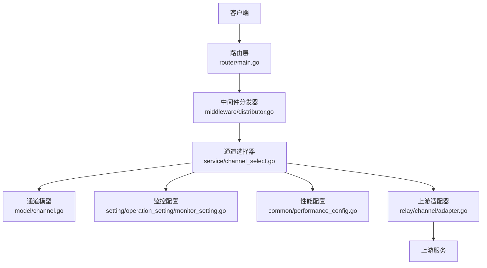
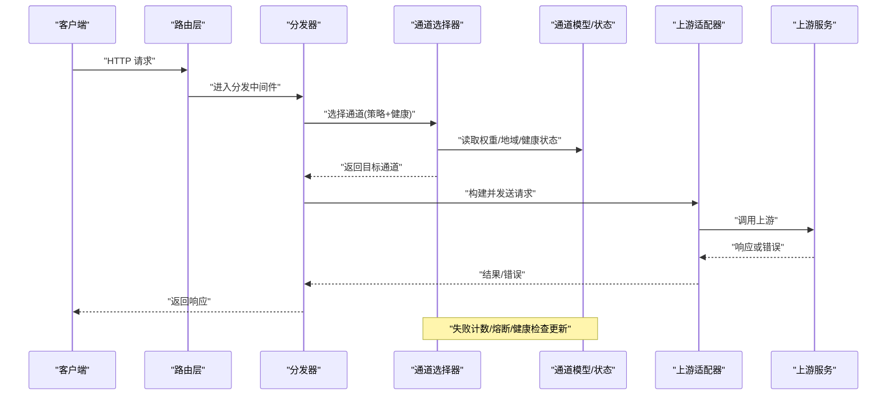
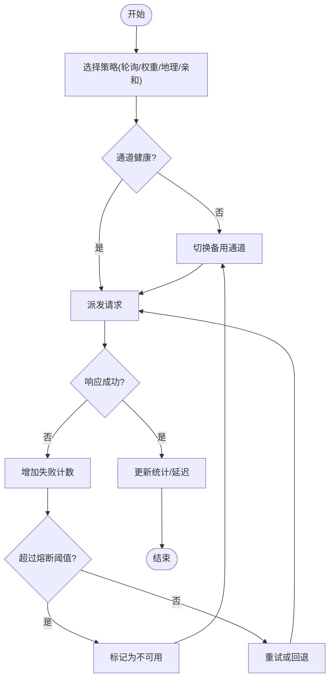
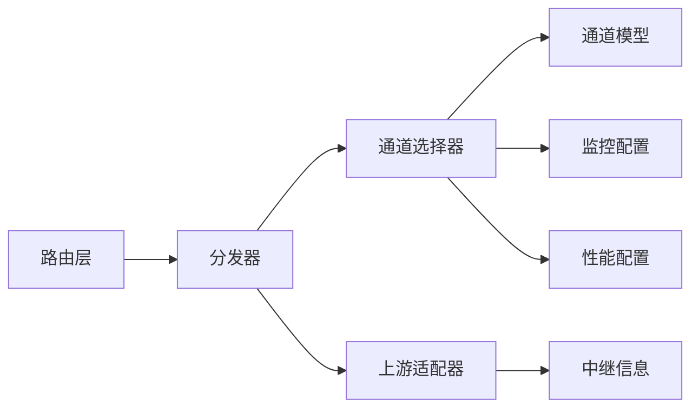

# 负载均衡与故障转移

<cite>
**本文引用的文件**
- [main.go](file://main.go)
- [middleware/distributor.go](file://middleware/distributor.go)
- [service/channel_select.go](file://service/channel_select.go)
- [model/channel.go](file://model/channel.go)
- [setting/operation_setting/monitor_setting.go](file://setting/operation_setting/monitor_setting.go)
- [common/performance_config.go](file://common/performance_config.go)
- [relay/channel/adapter.go](file://relay/channel/adapter.go)
- [relay/common/relay_info.go](file://relay/common/relay_info.go)
- [controller/channel_test.go](file://controller/channel_test.go)
- [router/main.go](file://router/main.go)
</cite>

## 目录
1. [简介](#简介)
2. [项目结构](#项目结构)
3. [核心组件](#核心组件)
4. [架构总览](#架构总览)
5. [详细组件分析](#详细组件分析)
6. [依赖关系分析](#依赖关系分析)
7. [性能考量](#性能考量)
8. [故障排查指南](#故障排查指南)
9. [结论](#结论)
10. [附录](#附录)

## 简介
本章节面向运维与开发者，系统性阐述本项目的负载均衡与故障转移能力。内容涵盖：
- 智能请求分配算法（轮询、权重、地理位置匹配等）
- 渠道健康检查与自动故障转移机制
- 连接池管理与资源优化策略
- 配置选项与调优参数
- 性能监控指标与故障诊断方法
- 部署最佳实践与常见问题解决方案

## 项目结构
与负载均衡和故障转移相关的代码主要分布在以下模块：
- 中间件层：负责请求分发与路由选择
- 服务层：实现通道选择策略与健康状态管理
- 模型层：定义通道元数据与属性
- 设置层：提供监控与性能相关配置
- 适配层：统一对外协议与上游对接
- 路由层：将请求接入到分发流程

**图示来源**
- [router/main.go](file://router/main.go)
- [middleware/distributor.go](file://middleware/distributor.go)
- [service/channel_select.go](file://service/channel_select.go)
- [model/channel.go](file://model/channel.go)
- [setting/operation_setting/monitor_setting.go](file://setting/operation_setting/monitor_setting.go)
- [common/performance_config.go](file://common/performance_config.go)
- [relay/channel/adapter.go](file://relay/channel/adapter.go)

**章节来源**
- [router/main.go](file://router/main.go)
- [middleware/distributor.go](file://middleware/distributor.go)
- [service/channel_select.go](file://service/channel_select.go)

## 核心组件
- 分发器（中间件）：接收请求并调用通道选择器，完成初始路由决策与上下文注入
- 通道选择器：根据策略（轮询、权重、地理匹配、亲和性等）挑选目标通道，维护健康状态与失败计数
- 通道模型：描述通道标识、权重、地域、超时、重试、熔断等元数据
- 监控与性能配置：控制健康检查频率、阈值、统计采样、限流与并发限制
- 上游适配器：封装不同上游协议的请求构造与响应解析，屏蔽差异

**章节来源**
- [middleware/distributor.go](file://middleware/distributor.go)
- [service/channel_select.go](file://service/channel_select.go)
- [model/channel.go](file://model/channel.go)
- [setting/operation_setting/monitor_setting.go](file://setting/operation_setting/monitor_setting.go)
- [common/performance_config.go](file://common/performance_config.go)
- [relay/channel/adapter.go](file://relay/channel/adapter.go)

## 架构总览
下图展示一次请求从入口到上游的完整路径，以及负载均衡与故障转移的关键节点。

**图示来源**
- [router/main.go](file://router/main.go)
- [middleware/distributor.go](file://middleware/distributor.go)
- [service/channel_select.go](file://service/channel_select.go)
- [model/channel.go](file://model/channel.go)
- [relay/channel/adapter.go](file://relay/channel/adapter.go)

## 详细组件分析

### 分发器（中间件）
职责：
- 拦截请求，注入上下文（如用户、租户、模型组）
- 调用通道选择器进行路由决策
- 记录关键指标（耗时、状态码、错误类型）
- 支持重试与降级策略

关键点：
- 在请求早期完成鉴权与限流，避免无效流量进入选择器
- 对长连接/流式场景保持上下文一致性，确保同一会话走同一路径（可选亲和性）

**章节来源**
- [middleware/distributor.go](file://middleware/distributor.go)

### 通道选择器（负载均衡与故障转移）
职责：
- 实现多种分配策略：轮询、加权轮询、最少活跃、延迟优先、地理位置匹配、亲和性
- 维护通道健康状态、失败计数、熔断窗口、冷却时间
- 自动故障转移：当主通道不可用时快速切换到备用通道
- 统计与观测：暴露成功率、延迟分布、错误分类

算法要点：
- 轮询：按顺序均匀分配，适合同质通道
- 加权轮询：依据权重比例分配，适合异构通道
- 最少活跃/延迟优先：结合实时负载与延迟反馈，降低拥塞
- 地理位置匹配：基于请求来源IP或配置规则就近选择，减少跨域延迟
- 亲和性：保证特定用户或会话固定到某通道，提升缓存命中率

故障转移流程：
- 健康检查：周期性探测（TCP/HTTP），标记不可用通道
- 失败阈值：连续失败达到阈值触发熔断，停止向该通道派发
- 冷却恢复：冷却期后重新尝试，成功则恢复正常

**图示来源**
- [service/channel_select.go](file://service/channel_select.go)
- [model/channel.go](file://model/channel.go)
- [setting/operation_setting/monitor_setting.go](file://setting/operation_setting/monitor_setting.go)

**章节来源**
- [service/channel_select.go](file://service/channel_select.go)
- [model/channel.go](file://model/channel.go)
- [setting/operation_setting/monitor_setting.go](file://setting/operation_setting/monitor_setting.go)

### 通道模型与元数据
字段与作用：
- 标识与名称：唯一识别通道
- 权重：影响轮询分配比例
- 地域/标签：用于地理匹配与亲和性分组
- 超时与重试：控制请求生命周期与容错
- 熔断参数：失败阈值、冷却时间、半开试探
- 健康检查：探测URL、间隔、阈值

**章节来源**
- [model/channel.go](file://model/channel.go)

### 监控与性能配置
关键配置项：
- 健康检查间隔、失败阈值、恢复阈值
- 统计采样率、延迟分桶、错误分类
- 并发限制、队列长度、背压策略
- 日志级别与采样，避免高吞吐下日志风暴

**章节来源**
- [setting/operation_setting/monitor_setting.go](file://setting/operation_setting/monitor_setting.go)
- [common/performance_config.go](file://common/performance_config.go)

### 上游适配器与请求转发
职责：
- 统一请求构造（头部、签名、体转换）
- 处理流式响应与断线重连
- 错误映射与重试语义标准化

**章节来源**
- [relay/channel/adapter.go](file://relay/channel/adapter.go)
- [relay/common/relay_info.go](file://relay/common/relay_info.go)

## 依赖关系分析
- 分发器依赖通道选择器进行路由决策
- 通道选择器依赖通道模型与监控配置
- 适配器依赖通用中继信息与协议常量
- 路由层将请求接入分发器，形成端到端链路

**图示来源**
- [router/main.go](file://router/main.go)
- [middleware/distributor.go](file://middleware/distributor.go)
- [service/channel_select.go](file://service/channel_select.go)
- [model/channel.go](file://model/channel.go)
- [setting/operation_setting/monitor_setting.go](file://setting/operation_setting/monitor_setting.go)
- [common/performance_config.go](file://common/performance_config.go)
- [relay/channel/adapter.go](file://relay/channel/adapter.go)
- [relay/common/relay_info.go](file://relay/common/relay_info.go)

**章节来源**
- [router/main.go](file://router/main.go)
- [middleware/distributor.go](file://middleware/distributor.go)
- [service/channel_select.go](file://service/channel_select.go)

## 性能考量
- 选择策略复杂度：轮询/加权为O(1)，最少活跃/延迟优先需维护实时指标，注意锁粒度与无锁数据结构
- 健康检查开销：合理设置间隔与批量探测，避免雪崩
- 连接池与并发：限制最大并发、队列长度，启用背压与快速失败
- 统计与日志：采样与分级，避免高吞吐下的I/O瓶颈
- 内存与GC：复用对象、减少分配，使用缓冲池

[本节为通用指导，不直接分析具体文件]

## 故障排查指南
常见现象与定位步骤：
- 请求频繁失败：查看通道健康状态、失败计数、熔断阈值；检查上游可用性
- 延迟升高：观察延迟分布、队列长度、连接池占用；评估是否热点通道过载
- 地域问题：校验地理匹配规则与IP库准确性
- 亲和性异常：确认会话键一致性与绑定策略

建议工具与指标：
- 成功率、错误分类、P50/P95/P99延迟
- 健康检查通过率、熔断触发次数
- 连接池使用率、队列深度、背压事件
- 日志关键字：选择失败、熔断、回退、重试

**章节来源**
- [controller/channel_test.go](file://controller/channel_test.go)

## 结论
本项目通过中间件分发与通道选择器实现了灵活的负载均衡与健壮的故障转移。配合完善的通道模型、监控配置与上游适配器，能够在多上游、多地域场景下保障高可用与低延迟。建议在生产环境结合业务特征选择合适的策略与参数，持续观测指标并动态调优。

[本节为总结性内容，不直接分析具体文件]

## 附录
- 配置清单：健康检查、熔断、统计、并发限制、日志级别
- 策略选择建议：同质通道用轮询/加权，异构通道用最少活跃/延迟优先，跨国场景用地理匹配
- 最佳实践：灰度发布、渐进放量、回滚预案、容量规划

[本节为补充信息，不直接分析具体文件]