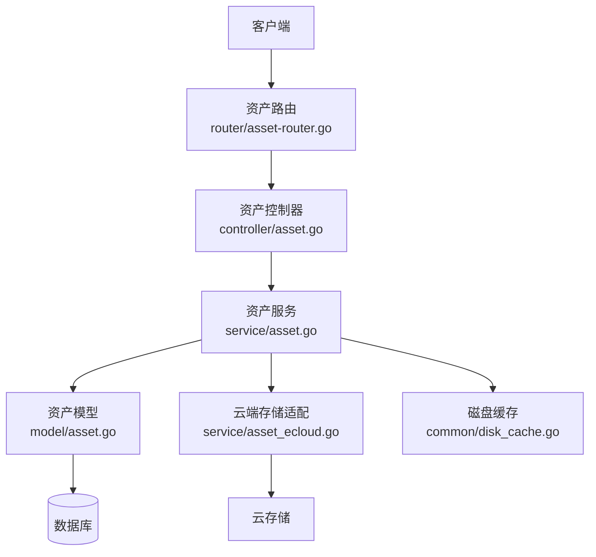
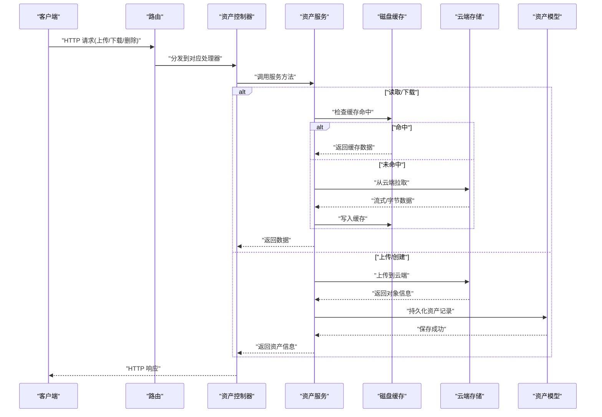
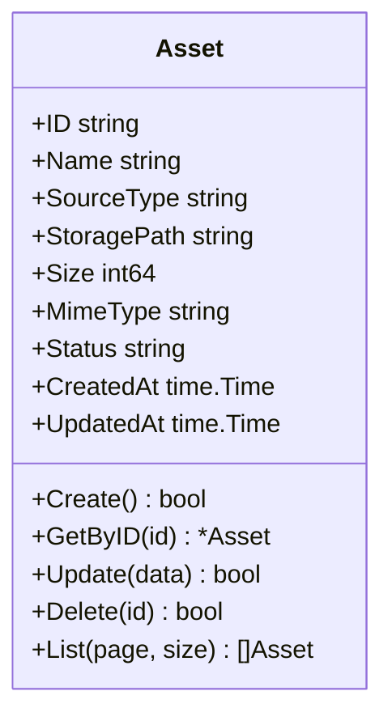
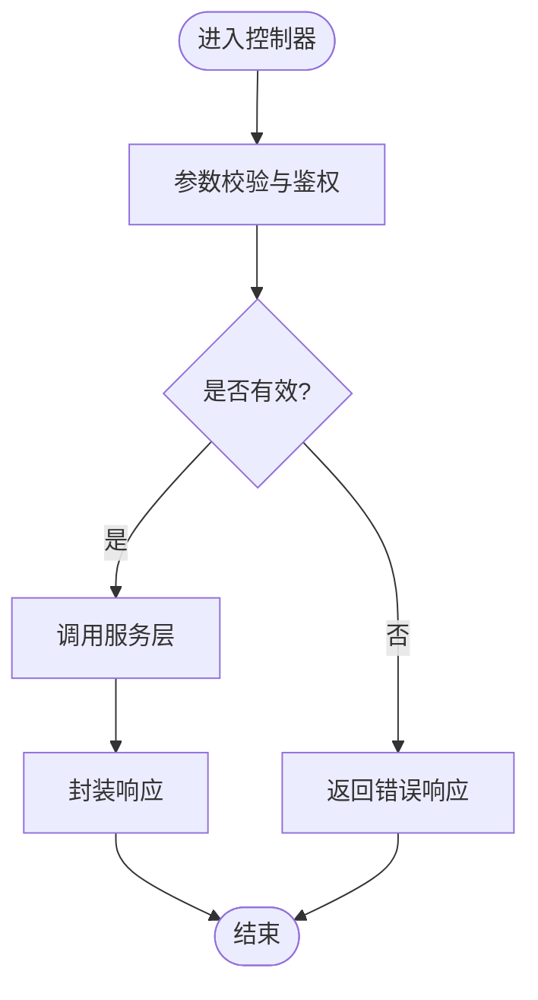
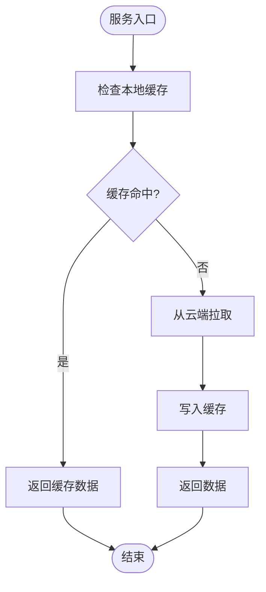
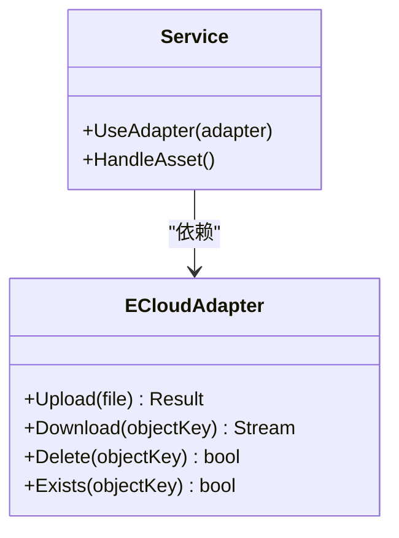
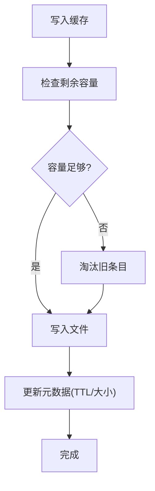
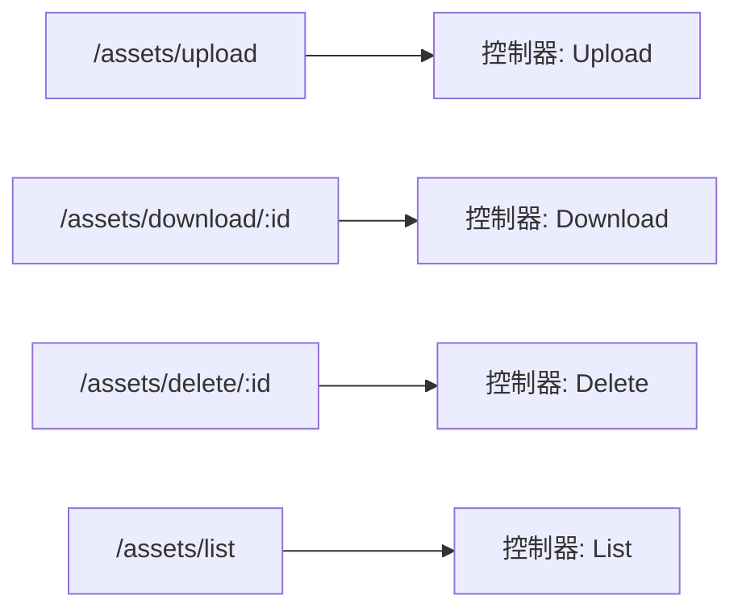
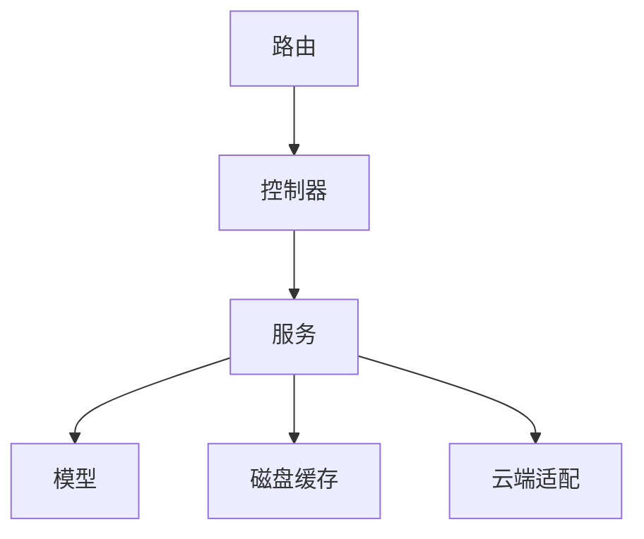

# 资产管理

<cite>
**本文引用的文件**   
- [controller/asset.go](file://controller/asset.go)
- [model/asset.go](file://model/asset.go)
- [service/asset.go](file://service/asset.go)
- [service/asset_ecloud.go](file://service/asset_ecloud.go)
- [router/asset-router.go](file://router/asset-router.go)
- [dto/task.go](file://dto/task.go)
- [types/file_source.go](file://types/file_source.go)
- [common/disk_cache.go](file://common/disk_cache.go)
- [common/disk_cache_config.go](file://common/disk_cache_config.go)
- [setting/operation_setting/general_setting.go](file://setting/operation_setting/general_setting.go)
</cite>

## 目录
1. [简介](#简介)
2. [项目结构](#项目结构)
3. [核心组件](#核心组件)
4. [架构总览](#架构总览)
5. [详细组件分析](#详细组件分析)
6. [依赖关系分析](#依赖关系分析)
7. [性能考量](#性能考量)
8. [故障排查指南](#故障排查指南)
9. [结论](#结论)
10. [附录](#附录)

## 简介
本文件围绕“资产管理”能力进行系统化文档化，涵盖资产模型、控制器接口、服务层逻辑、路由配置与前端交互要点。目标是帮助读者快速理解资产上传、存储、缓存、下载与生命周期管理的设计与实现路径，并提供排障与优化建议。

## 项目结构
资产管理相关代码主要分布在以下模块：
- 控制器层：对外暴露 HTTP API，负责参数校验、鉴权与响应封装
- 模型层：定义资产数据模型与数据库映射
- 服务层：实现资产创建、查询、删除、下载、云存储对接与本地缓存等核心业务
- 路由层：注册资产相关路由，将 URL 映射到控制器方法
- DTO/类型：统一请求/响应结构与通用类型（如文件来源）
- 配置项：磁盘缓存、操作设置等影响资产行为的配置

图表来源
- [router/asset-router.go](file://router/asset-router.go)
- [controller/asset.go](file://controller/asset.go)
- [service/asset.go](file://service/asset.go)
- [model/asset.go](file://model/asset.go)
- [service/asset_ecloud.go](file://service/asset_ecloud.go)
- [common/disk_cache.go](file://common/disk_cache.go)

章节来源
- [router/asset-router.go](file://router/asset-router.go)
- [controller/asset.go](file://controller/asset.go)
- [service/asset.go](file://service/asset.go)
- [model/asset.go](file://model/asset.go)
- [service/asset_ecloud.go](file://service/asset_ecloud.go)
- [common/disk_cache.go](file://common/disk_cache.go)

## 核心组件
- 资产模型：定义资产的标识、来源、存储位置、元数据与状态字段，提供持久化与查询能力
- 资产控制器：处理上传、获取、删除、列表等 HTTP 请求，完成鉴权与参数校验
- 资产服务：编排资产生命周期，协调本地磁盘缓存与云端存储，返回统一结果
- 云端存储适配：抽象不同云厂商的上传/下载接口，屏蔽差异
- 磁盘缓存：对热点资源进行本地缓存，降低重复 IO 与网络开销
- 路由注册：将资产相关端点挂载到 Web 服务器

章节来源
- [model/asset.go](file://model/asset.go)
- [controller/asset.go](file://controller/asset.go)
- [service/asset.go](file://service/asset.go)
- [service/asset_ecloud.go](file://service/asset_ecloud.go)
- [common/disk_cache.go](file://common/disk_cache.go)
- [router/asset-router.go](file://router/asset-router.go)

## 架构总览
资产管理的整体流程如下：
- 客户端通过路由访问控制器
- 控制器调用服务层完成业务编排
- 服务层根据策略选择本地缓存或云端存储
- 模型层负责数据持久化与查询
- 配置项控制行为（如缓存大小、过期策略）

图表来源
- [router/asset-router.go](file://router/asset-router.go)
- [controller/asset.go](file://controller/asset.go)
- [service/asset.go](file://service/asset.go)
- [service/asset_ecloud.go](file://service/asset_ecloud.go)
- [common/disk_cache.go](file://common/disk_cache.go)
- [model/asset.go](file://model/asset.go)

## 详细组件分析

### 资产模型（Model）
- 职责：定义资产实体结构、数据库映射、索引与约束；提供创建、查询、更新、删除等方法
- 关键字段：唯一标识、名称、来源类型、存储路径、大小、内容类型、状态、时间戳等
- 复杂度：常见 CRUD 为 O(1)/O(logN)，分页与过滤需结合索引设计

图表来源
- [model/asset.go](file://model/asset.go)

章节来源
- [model/asset.go](file://model/asset.go)

### 资产控制器（Controller）
- 职责：接收并校验请求参数，鉴权后调用服务层，封装响应
- 典型端点：上传、下载、删除、详情、列表
- 错误处理：参数校验失败、权限不足、资源不存在、服务端异常

图表来源
- [controller/asset.go](file://controller/asset.go)

章节来源
- [controller/asset.go](file://controller/asset.go)

### 资产服务（Service）
- 职责：编排资产生命周期，协调缓存与云端存储，保证一致性
- 关键流程：
  - 上传：校验输入 -> 生成唯一标识 -> 上传至云端 -> 落盘缓存（可选）-> 持久化资产记录
  - 下载：优先读缓存 -> 未命中则从云端拉取 -> 回写缓存 -> 返回数据
  - 删除：删除云端对象 -> 清理本地缓存 -> 更新或删除资产记录
- 并发与事务：确保上传/删除操作的原子性与幂等性

图表来源
- [service/asset.go](file://service/asset.go)
- [common/disk_cache.go](file://common/disk_cache.go)
- [service/asset_ecloud.go](file://service/asset_ecloud.go)

章节来源
- [service/asset.go](file://service/asset.go)
- [service/asset_ecloud.go](file://service/asset_ecloud.go)
- [common/disk_cache.go](file://common/disk_cache.go)

### 云端存储适配（ECloud）
- 职责：抽象不同云厂商的上传/下载接口，统一错误码与重试策略
- 扩展性：新增云厂商只需实现适配器接口，注入到服务层

图表来源
- [service/asset_ecloud.go](file://service/asset_ecloud.go)
- [service/asset.go](file://service/asset.go)

章节来源
- [service/asset_ecloud.go](file://service/asset_ecloud.go)
- [service/asset.go](file://service/asset.go)

### 磁盘缓存（Disk Cache）
- 职责：基于本地文件系统缓存热点资产，支持容量限制与过期策略
- 配置项：缓存目录、最大容量、单文件大小上限、TTL 等

图表来源
- [common/disk_cache.go](file://common/disk_cache.go)
- [common/disk_cache_config.go](file://common/disk_cache_config.go)

章节来源
- [common/disk_cache.go](file://common/disk_cache.go)
- [common/disk_cache_config.go](file://common/disk_cache_config.go)

### 路由注册（Router）
- 职责：将资产相关端点挂载到 Web 服务器，绑定控制器方法
- 典型端点：/api/assets/upload, /api/assets/download/:id, /api/assets/delete/:id, /api/assets/list

图表来源
- [router/asset-router.go](file://router/asset-router.go)
- [controller/asset.go](file://controller/asset.go)

章节来源
- [router/asset-router.go](file://router/asset-router.go)
- [controller/asset.go](file://controller/asset.go)

### 数据类型与 DTO
- 文件来源类型：用于区分本地上传、第三方导入等来源
- 任务 DTO：用于异步任务的状态与进度传递（如大文件上传）

章节来源
- [types/file_source.go](file://types/file_source.go)
- [dto/task.go](file://dto/task.go)

### 配置项（Operation Setting）
- 作用：控制资产行为（如是否启用缓存、缓存大小、超时等）
- 读取方式：在初始化时加载配置，服务层按需使用

章节来源
- [setting/operation_setting/general_setting.go](file://setting/operation_setting/general_setting.go)

## 依赖关系分析
- 控制器依赖服务层，服务层依赖模型与外部存储（云端/缓存）
- 路由仅负责分发，不承载业务逻辑
- 配置项贯穿服务层与缓存模块

图表来源
- [router/asset-router.go](file://router/asset-router.go)
- [controller/asset.go](file://controller/asset.go)
- [service/asset.go](file://service/asset.go)
- [model/asset.go](file://model/asset.go)
- [common/disk_cache.go](file://common/disk_cache.go)
- [service/asset_ecloud.go](file://service/asset_ecloud.go)

章节来源
- [router/asset-router.go](file://router/asset-router.go)
- [controller/asset.go](file://controller/asset.go)
- [service/asset.go](file://service/asset.go)
- [model/asset.go](file://model/asset.go)
- [common/disk_cache.go](file://common/disk_cache.go)
- [service/asset_ecloud.go](file://service/asset_ecloud.go)

## 性能考量
- 缓存命中率：合理设置 TTL 与容量，避免频繁淘汰导致抖动
- 流式传输：大文件下载采用流式，减少内存占用
- 并发控制：上传/下载限流，防止资源争用
- 索引优化：按常用查询条件建立索引，提升列表与检索性能
- 重试与退避：云端请求失败时指数退避，提高稳定性

## 故障排查指南
- 上传失败：检查参数校验、权限、云端配额与网络连通性
- 下载缓慢：确认缓存命中情况、带宽与 CDN 配置
- 删除不一致：核对云端对象是否存在、本地缓存是否清理
- 缓存溢出：调整容量上限与淘汰策略，监控磁盘使用率
- 日志定位：查看控制器与服务层日志，追踪请求链路

章节来源
- [controller/asset.go](file://controller/asset.go)
- [service/asset.go](file://service/asset.go)
- [common/disk_cache.go](file://common/disk_cache.go)
- [service/asset_ecloud.go](file://service/asset_ecloud.go)

## 结论
资产管理模块以清晰的层次划分与可扩展的适配设计，实现了上传、下载、删除与缓存的统一管理。通过合理的配置与优化策略，可在高并发与大数据量场景下保持稳定与高效。建议在生产环境完善监控与告警，持续跟踪缓存命中率与云端延迟指标。

## 附录
- 最佳实践
  - 为大文件启用分片上传与断点续传
  - 对敏感资产增加访问审计与水印
  - 定期清理过期缓存与无效资产记录
- 常见问题
  - 跨域与 CORS 配置
  - 时区与时间戳一致性
  - 多租户隔离与命名空间