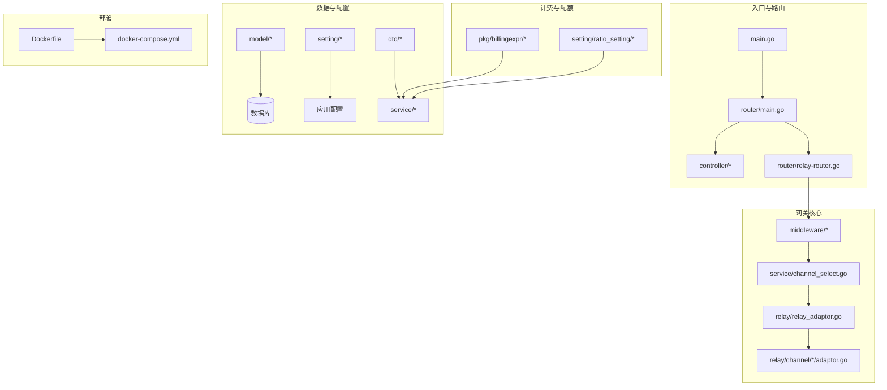
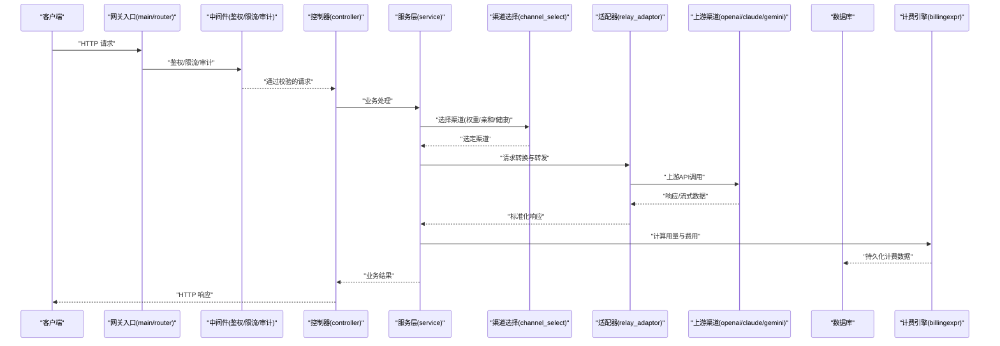
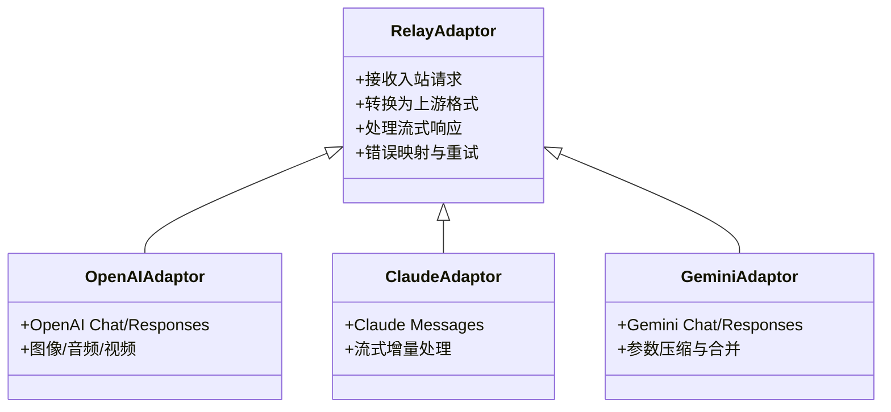
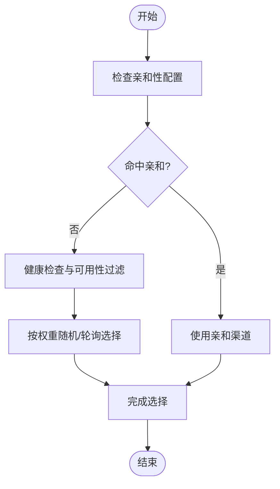
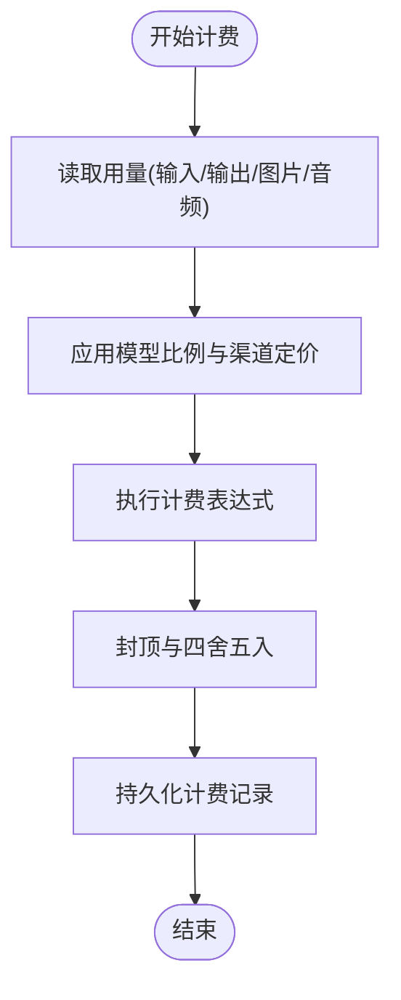
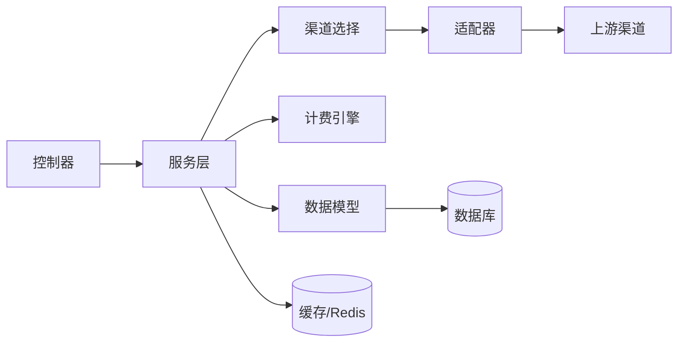

# 项目介绍

<cite>
**本文档引用的文件**   
- [README.md](file://README.md)
- [main.go](file://main.go)
- [go.mod](file://go.mod)
- [Dockerfile](file://Dockerfile)
- [docker-compose.yml](file://docker-compose.yml)
- [router/main.go](file://router/main.go)
- [relay/relay_adaptor.go](file://relay/relay_adaptor.go)
- [relay/channel/openai/adaptor.go](file://relay/channel/openai/adaptor.go)
- [relay/channel/claude/adaptor.go](file://relay/channel/claude/adaptor.go)
- [relay/channel/gemini/adaptor.go](file://relay/channel/gemini/adaptor.go)
- [controller/relay.go](file://controller/relay.go)
- [middleware/distributor.go](file://middleware/distributor.go)
- [service/channel_select.go](file://service/channel_select.go)
- [model/channel.go](file://model/channel.go)
- [dto/billing_usage.go](file://dto/billing_usage.go)
- [pkg/billingexpr/run.go](file://pkg/billingexpr/run.go)
- [setting/ratio_setting/model_ratio.go](file://setting/ratio_setting/model_ratio.go)
- [constant/channel.go](file://constant/channel.go)
- [common/constants.go](file://common/constants.go)
- [i18n/locales/zh-CN.yaml](file://i18n/locales/zh-CN.yaml)
</cite>

## 目录
1. [简介](#简介)
2. [项目结构](#项目结构)
3. [核心组件](#核心组件)
4. [架构总览](#架构总览)
5. [详细组件分析](#详细组件分析)
6. [依赖关系分析](#依赖关系分析)
7. [性能考量](#性能考量)
8. [故障排查指南](#故障排查指南)
9. [结论](#结论)
10. [附录](#附录)

## 简介
本项目是一个统一的AI API网关，面向开发者与企业提供“一个接口、多模型接入”的能力。通过标准化OpenAI兼容的REST接口，统一对接OpenAI、Claude、Gemini、Anthropic等主流AI服务提供商，屏蔽各厂商协议差异，实现请求转发、负载均衡、计费与配额管理、用户权限控制、审计与监控等关键能力。

核心价值主张：
- 统一接口：以OpenAI兼容API为入口，降低多模型接入成本
- 多模型支持：内置对多家主流模型的适配层，开箱即用
- 智能路由与负载均衡：按策略将请求分发到不同渠道，提升可用性与吞吐
- 精细化计费与配额：基于用量与定价策略进行结算与限额控制
- 安全与权限：完善的鉴权、授权、审计与风控能力
- 可观测性：日志、指标、链路追踪与系统监控一体化

适用对象：
- 初学者：提供清晰的入门路径与文档，快速搭建并运行
- 资深开发者：模块化架构、插件化适配、可扩展的计费与路由策略

许可证与社区：
- 许可证信息见仓库根目录相关说明文件
- 社区支持与贡献规范见 .github 目录下的模板与行为准则

版本历史与更新：
- 变更与里程碑请参考发行说明与迁移脚本（bin 目录）

**章节来源**
- [README.md](file://README.md)
- [go.mod:1-20](file://go.mod#L1-L20)

## 项目结构
后端采用Go语言开发，前后端分离。后端核心模块包括路由、控制器、中间件、服务层、数据模型、计费表达式引擎、适配器与渠道管理等；前端位于 web 目录，提供控制台与Playground等界面。

**图表来源**
- [main.go:1-50](file://main.go#L1-L50)
- [router/main.go:1-80](file://router/main.go#L1-L80)
- [relay/relay_adaptor.go:1-120](file://relay/relay_adaptor.go#L1-L120)
- [service/channel_select.go:1-120](file://service/channel_select.go#L1-L120)
- [Dockerfile:1-60](file://Dockerfile#L1-L60)
- [docker-compose.yml:1-80](file://docker-compose.yml#L1-L80)

**章节来源**
- [main.go:1-50](file://main.go#L1-L50)
- [router/main.go:1-80](file://router/main.go#L1-L80)
- [go.mod:1-20](file://go.mod#L1-L20)

## 核心组件
- 统一网关入口与路由：负责HTTP请求接入、鉴权、限流、审计与转发
- 适配器与渠道层：对OpenAI、Claude、Gemini等厂商协议进行适配与转换
- 渠道选择与负载均衡：根据权重、亲和性、健康状态等策略选择上游渠道
- 计费与配额引擎：基于用量与定价表达式计算费用，支持分层与封顶
- 权限与认证：支持Token、OAuth、Passkey等多方式认证与细粒度授权
- 可观测性：结构化日志、指标采集、审计记录与系统监控

**章节来源**
- [controller/relay.go:1-120](file://controller/relay.go#L1-L120)
- [middleware/distributor.go:1-120](file://middleware/distributor.go#L1-L120)
- [relay/relay_adaptor.go:1-120](file://relay/relay_adaptor.go#L1-L120)
- [service/channel_select.go:1-120](file://service/channel_select.go#L1-L120)
- [dto/billing_usage.go:1-120](file://dto/billing_usage.go#L1-L120)
- [pkg/billingexpr/run.go:1-120](file://pkg/billingexpr/run.go#L1-L120)

## 架构总览
整体采用“网关+适配器+渠道”的分层架构。请求进入后经过鉴权、限流、审计等中间件，再由路由分发至控制器，控制器调用服务层进行渠道选择与负载均衡，最终通过适配器将请求转换为上游厂商格式并返回响应。计费与配额在请求处理过程中实时计算与落库。

**图表来源**
- [main.go:1-50](file://main.go#L1-L50)
- [router/main.go:1-80](file://router/main.go#L1-L80)
- [controller/relay.go:1-120](file://controller/relay.go#L1-L120)
- [middleware/distributor.go:1-120](file://middleware/distributor.go#L1-L120)
- [service/channel_select.go:1-120](file://service/channel_select.go#L1-L120)
- [relay/relay_adaptor.go:1-120](file://relay/relay_adaptor.go#L1-L120)
- [pkg/billingexpr/run.go:1-120](file://pkg/billingexpr/run.go#L1-L120)

## 详细组件分析

### 统一接口与路由
- 提供OpenAI兼容的REST接口，涵盖文本、图像、音频、视频、Embedding、Rerank等能力
- 路由注册与分组清晰，便于扩展新接口与新功能模块

**章节来源**
- [router/main.go:1-80](file://router/main.go#L1-L80)
- [controller/relay.go:1-120](file://controller/relay.go#L1-L120)

### 适配器与渠道层
- 适配器抽象了不同厂商的协议差异，统一请求/响应格式
- 已内置OpenAI、Claude、Gemini等渠道适配器，支持流式与非流式响应

**图表来源**
- [relay/relay_adaptor.go:1-120](file://relay/relay_adaptor.go#L1-L120)
- [relay/channel/openai/adaptor.go:1-120](file://relay/channel/openai/adaptor.go#L1-L120)
- [relay/channel/claude/adaptor.go:1-120](file://relay/channel/claude/adaptor.go#L1-L120)
- [relay/channel/gemini/adaptor.go:1-120](file://relay/channel/gemini/adaptor.go#L1-L120)

**章节来源**
- [relay/relay_adaptor.go:1-120](file://relay/relay_adaptor.go#L1-L120)
- [relay/channel/openai/adaptor.go:1-120](file://relay/channel/openai/adaptor.go#L1-L120)
- [relay/channel/claude/adaptor.go:1-120](file://relay/channel/claude/adaptor.go#L1-L120)
- [relay/channel/gemini/adaptor.go:1-120](file://relay/channel/gemini/adaptor.go#L1-L120)

### 渠道选择与负载均衡
- 支持按权重、亲和性、健康检查、地域或模型匹配等策略选择渠道
- 动态调整与缓存优化，保障高并发下的低延迟与高可用

**图表来源**
- [service/channel_select.go:1-120](file://service/channel_select.go#L1-L120)
- [model/channel.go:1-120](file://model/channel.go#L1-L120)
- [constant/channel.go:1-60](file://constant/channel.go#L1-L60)

**章节来源**
- [service/channel_select.go:1-120](file://service/channel_select.go#L1-L120)
- [model/channel.go:1-120](file://model/channel.go#L1-L120)
- [constant/channel.go:1-60](file://constant/channel.go#L1-L60)

### 计费管理与配额控制
- 基于表达式引擎的动态计费，支持分层计价、封顶、折扣与币种换算
- 与用量统计、模型比例、渠道定价联动，实现精细化结算

**图表来源**
- [dto/billing_usage.go:1-120](file://dto/billing_usage.go#L1-L120)
- [pkg/billingexpr/run.go:1-120](file://pkg/billingexpr/run.go#L1-L120)
- [setting/ratio_setting/model_ratio.go:1-120](file://setting/ratio_setting/model_ratio.go#L1-L120)

**章节来源**
- [dto/billing_usage.go:1-120](file://dto/billing_usage.go#L1-L120)
- [pkg/billingexpr/run.go:1-120](file://pkg/billingexpr/run.go#L1-L120)
- [setting/ratio_setting/model_ratio.go:1-120](file://setting/ratio_setting/model_ratio.go#L1-L120)

### 用户权限控制与认证
- 支持多种认证方式（Token、OAuth、Passkey），结合角色与资源级授权
- 审计日志与访问控制策略可配置，满足企业合规需求

**章节来源**
- [controller/auth_session.go:1-120](file://controller/auth_session.go#L1-L120)
- [controller/authz.go:1-120](file://controller/authz.go#L1-L120)
- [model/user.go:1-120](file://model/user.go#L1-L120)

### 国际化与本地化
- 多语言支持，覆盖中文、英文、繁体等常用语言
- 前端与后端共享键值，保证一致性体验

**章节来源**
- [i18n/locales/zh-CN.yaml:1-120](file://i18n/locales/zh-CN.yaml#L1-L120)
- [i18n/i18n.go:1-80](file://i18n/i18n.go#L1-L80)

## 依赖关系分析
- 外部依赖：数据库、Redis、对象存储、支付网关、邮件服务等
- 内部依赖：控制器依赖服务层，服务层依赖渠道选择与适配器，适配器依赖具体渠道实现
- 配置依赖：运行时配置、模型比例、渠道设置、计费表达式等

**图表来源**
- [controller/relay.go:1-120](file://controller/relay.go#L1-L120)
- [service/channel_select.go:1-120](file://service/channel_select.go#L1-L120)
- [relay/relay_adaptor.go:1-120](file://relay/relay_adaptor.go#L1-L120)
- [model/channel.go:1-120](file://model/channel.go#L1-L120)
- [pkg/billingexpr/run.go:1-120](file://pkg/billingexpr/run.go#L1-L120)

**章节来源**
- [go.mod:1-20](file://go.mod#L1-L20)
- [common/constants.go:1-60](file://common/constants.go#L1-L60)

## 性能考量
- 高并发与低延迟：连接池、异步处理、流式响应与缓存优化
- 负载均衡与健康检查：避免热点与单点故障，提升整体可用性
- 计费与配额：表达式预编译与缓存，减少运行时开销
- 可观测性：指标采集与采样日志，定位瓶颈与异常

[本节为通用指导，不直接分析具体文件]

## 故障排查指南
- 常见问题：渠道不可用、鉴权失败、限流触发、计费异常、响应超时
- 排查步骤：查看审计日志与错误码、检查渠道健康状态、核对鉴权令牌与权限、验证计费表达式与比例配置
- 工具与建议：启用调试模式、导出链路追踪、对比上游响应与网关转换逻辑

**章节来源**
- [controller/error.go:1-120](file://controller/error.go#L1-L120)
- [model/errors.go:1-120](file://model/errors.go#L1-L120)
- [logger/logger.go:1-80](file://logger/logger.go#L1-L80)

## 结论
本项目以统一接口为核心，构建起覆盖多模型、多渠道、多场景的AI API网关。通过适配器与渠道选择机制，屏蔽厂商差异；借助计费表达式与配额控制，实现精细化运营；配合完善的鉴权、审计与可观测性，满足企业级安全与稳定性要求。无论是初学者快速上手，还是资深开发者深度定制，都能获得良好的体验与扩展空间。

[本节为总结性内容，不直接分析具体文件]

## 附录
- 许可证信息：详见仓库根目录许可证文件
- 社区支持：参见 .github 中的行为准则与贡献指南
- 版本历史与迁移：参考 bin 目录下的迁移脚本与发行说明

[本节为补充信息，不直接分析具体文件]