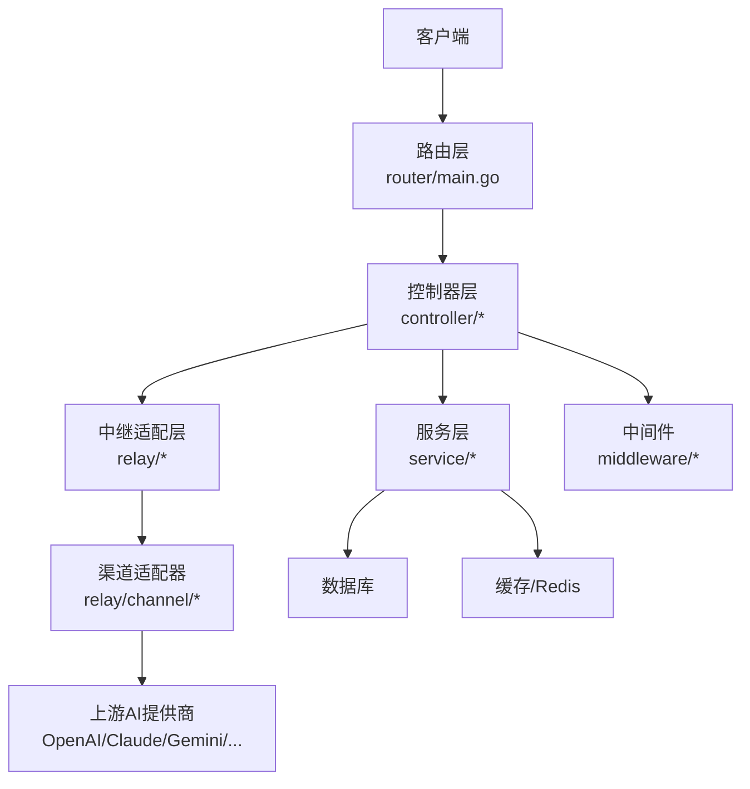
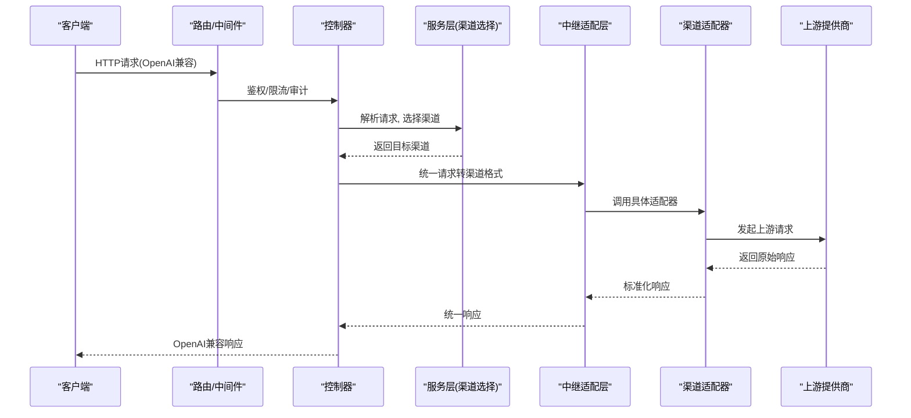
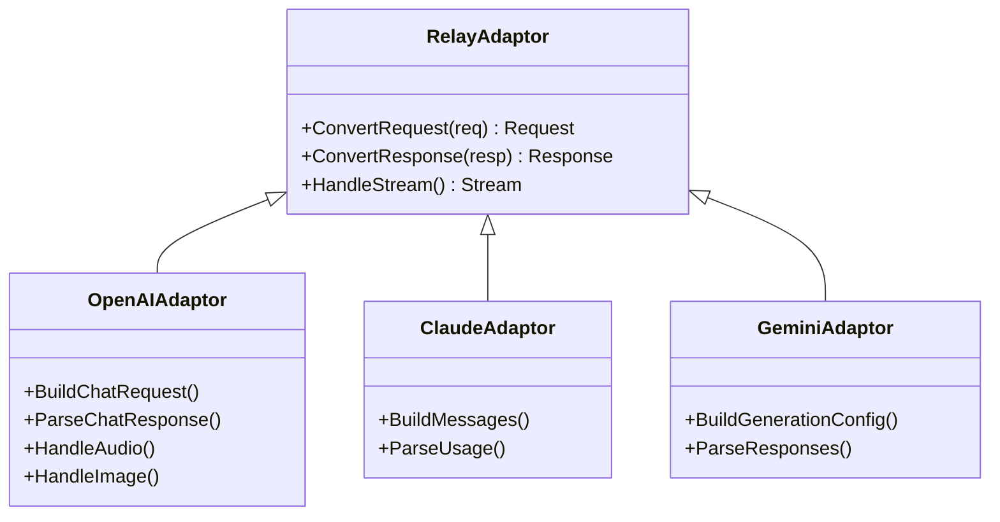
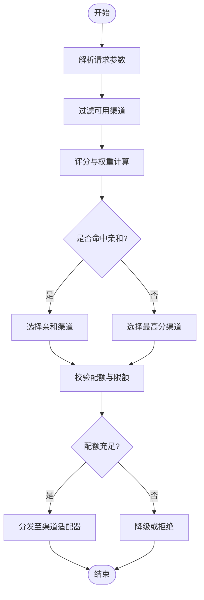
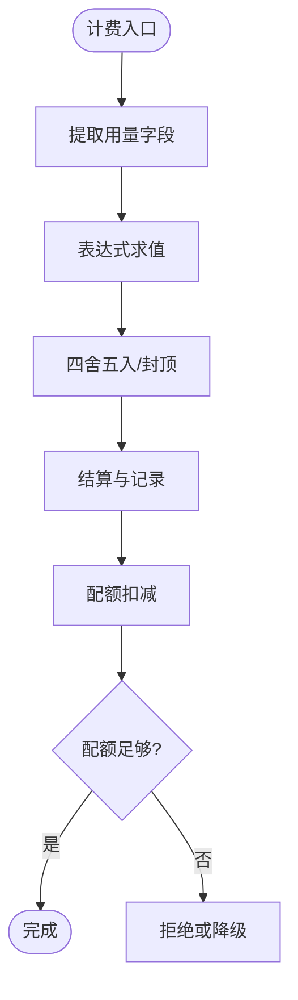
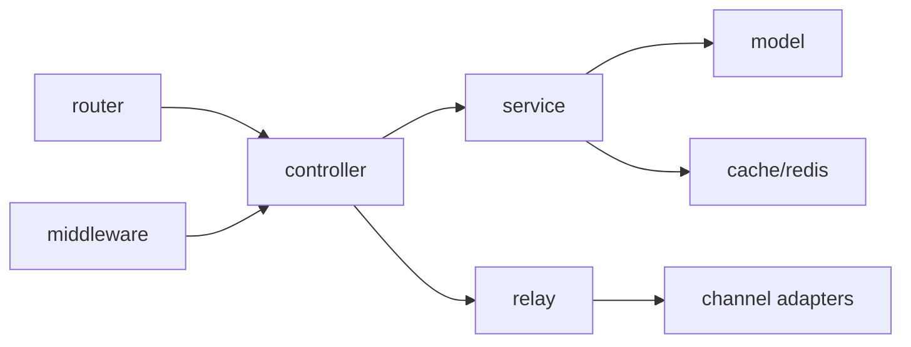

# 项目概览

<cite>
**本文引用的文件**   
- [main.go](file://main.go)
- [README.md](file://README.md)
- [go.mod](file://go.mod)
- [router/main.go](file://router/main.go)
- [relay/relay_adaptor.go](file://relay/relay_adaptor.go)
- [relay/channel/openai/adaptor.go](file://relay/channel/openai/adaptor.go)
- [relay/channel/claude/adaptor.go](file://relay/channel/claude/adaptor.go)
- [relay/channel/gemini/adaptor.go](file://relay/channel/gemini/adaptor.go)
- [middleware/distributor.go](file://middleware/distributor.go)
- [service/channel_select.go](file://service/channel_select.go)
- [dto/openai_request.go](file://dto/openai_request.go)
- [dto/openai_response.go](file://dto/openai_response.go)
- [setting/config/config.go](file://setting/config/config.go)
</cite>

## 目录
1. [简介](#简介)
2. [项目结构](#项目结构)
3. [核心组件](#核心组件)
4. [架构总览](#架构总览)
5. [详细组件分析](#详细组件分析)
6. [依赖关系分析](#依赖关系分析)
7. [性能与扩展性](#性能与扩展性)
8. [故障排查指南](#故障排查指南)
9. [结论](#结论)
10. [附录：公共接口与示例](#附录公共接口与示例)

## 简介
本项目是一个面向多AI服务提供商的统一API网关，旨在为上层应用提供一致的OpenAI兼容接口，同时无缝接入OpenAI、Claude、Gemini等主流模型。通过统一的鉴权、路由、计费、限流、缓存与可观测性能力，帮助开发者快速集成多种AI能力，降低对接成本并提升系统稳定性与可运维性。

主要特性包括：
- 统一API入口：对外暴露OpenAI兼容的聊天、图像、音频、嵌入等接口。
- 多提供商适配：内置对OpenAI、Claude、Gemini等渠道的适配器，屏蔽差异。
- 智能分发与负载均衡：按策略选择最优渠道，支持亲和性与权重。
- 计费与配额：细粒度计费表达式、用量统计与配额控制。
- 安全与治理：鉴权、SSRF防护、请求体限制、审计日志。
- 可观测性：指标、日志、链路追踪与性能监控。
- 前端控制台：模型管理、渠道配置、使用量与账单、Playground调试。

[本节不直接分析具体文件]

## 项目结构
后端采用Go语言模块化设计，核心分层清晰：
- router：HTTP路由与中间件装配
- controller：业务控制器（认证、渠道、模型、计费、支付等）
- relay：协议转换与渠道适配层（核心网关能力）
- service：领域服务（渠道选择、计费、任务、配额等）
- middleware：通用中间件（鉴权、限流、审计、压缩等）
- dto：数据传输对象（请求/响应结构）
- setting：配置与开关
- model：数据模型与ORM映射
- pkg：通用工具包（缓存、指标、网络客户端等）
- web：前端控制台（React/Rust构建）

**图示来源** 
- [router/main.go](file://router/main.go)
- [relay/relay_adaptor.go](file://relay/relay_adaptor.go)
- [middleware/distributor.go](file://middleware/distributor.go)

**章节来源**
- [main.go:1-200](file://main.go#L1-L200)
- [go.mod:1-100](file://go.mod#L1-L100)

## 核心组件
- 路由与中间件：统一入口、鉴权、限流、审计、压缩、CORS等。
- 控制器：处理用户、渠道、模型、计费、支付、订阅等业务。
- 中继适配层：将统一请求转换为各渠道特定格式，并回写统一响应。
- 渠道适配器：每个提供商一个adaptor，封装协议细节。
- 服务层：渠道选择、计费表达式计算、配额控制、任务调度等。
- 配置中心：集中化管理运行参数、渠道密钥、计费比率等。
- 数据模型：用户、令牌、渠道、模型、用量、账单等持久化实体。

**章节来源**
- [router/main.go:1-150](file://router/main.go#L1-L150)
- [relay/relay_adaptor.go:1-120](file://relay/relay_adaptor.go#L1-L120)
- [service/channel_select.go:1-120](file://service/channel_select.go#L1-L120)
- [setting/config/config.go:1-120](file://setting/config/config.go#L1-L120)

## 架构总览
整体采用“网关+适配器”的分层架构，强调解耦与可扩展性。请求进入后经过鉴权与限流，由控制器路由到中继层进行协议转换，再根据策略选择具体渠道适配器调用上游AI服务，最后统一返回OpenAI兼容结果。

**图示来源** 
- [router/main.go:1-150](file://router/main.go#L1-L150)
- [relay/relay_adaptor.go:1-120](file://relay/relay_adaptor.go#L1-L120)
- [service/channel_select.go:1-120](file://service/channel_select.go#L1-L120)

**章节来源**
- [main.go:1-200](file://main.go#L1-L200)
- [router/main.go:1-150](file://router/main.go#L1-L150)

## 详细组件分析

### 中继适配层与渠道适配器
中继适配层负责统一请求/响应的转换，以及流式处理的桥接；渠道适配器实现具体提供商的协议细节。以OpenAI、Claude、Gemini为例：

**图示来源** 
- [relay/relay_adaptor.go:1-120](file://relay/relay_adaptor.go#L1-L120)
- [relay/channel/openai/adaptor.go:1-120](file://relay/channel/openai/adaptor.go#L1-L120)
- [relay/channel/claude/adaptor.go:1-120](file://relay/channel/claude/adaptor.go#L1-L120)
- [relay/channel/gemini/adaptor.go:1-120](file://relay/channel/gemini/adaptor.go#L1-L120)

**章节来源**
- [relay/relay_adaptor.go:1-120](file://relay/relay_adaptor.go#L1-L120)
- [relay/channel/openai/adaptor.go:1-120](file://relay/channel/openai/adaptor.go#L1-L120)
- [relay/channel/claude/adaptor.go:1-120](file://relay/channel/claude/adaptor.go#L1-L120)
- [relay/channel/gemini/adaptor.go:1-120](file://relay/channel/gemini/adaptor.go#L1-L120)

### 渠道选择与分发
渠道选择服务基于权重、亲和性、健康状态与配额策略决定最终调用的渠道，结合中间件的分发器实现高可用与弹性伸缩。

**图示来源** 
- [service/channel_select.go:1-120](file://service/channel_select.go#L1-L120)
- [middleware/distributor.go:1-120](file://middleware/distributor.go#L1-L120)

**章节来源**
- [service/channel_select.go:1-120](file://service/channel_select.go#L1-L120)
- [middleware/distributor.go:1-120](file://middleware/distributor.go#L1-L120)

### 计费与配额
计费模块支持表达式引擎，按模型、渠道、工具调用、上下文长度等维度计算费用；配额模块限制用户/模型的用量上限，防止滥用。

**图示来源** 
- [pkg/billingexpr/run.go:1-120](file://pkg/billingexpr/run.go#L1-L120)
- [service/billing.go:1-120](file://service/billing.go#L1-L120)

**章节来源**
- [pkg/billingexpr/run.go:1-120](file://pkg/billingexpr/run.go#L1-L120)
- [service/billing.go:1-120](file://service/billing.go#L1-L120)

### 配置与运行时设置
配置模块统一管理环境变量、渠道密钥、计费比率、限流阈值等，支持热更新与校验。

**章节来源**
- [setting/config/config.go:1-120](file://setting/config/config.go#L1-L120)

## 依赖关系分析
- 外部依赖：HTTP框架、数据库驱动、Redis、对象存储、OAuth/OIDC、支付网关等。
- 内部依赖：router依赖controller与middleware；controller依赖service与relay；relay依赖channel adapters；service依赖model与cache。
- 潜在循环依赖：通过接口抽象与分层避免；确保adapter仅依赖common与dto。

**图示来源** 
- [go.mod:1-100](file://go.mod#L1-L100)
- [router/main.go:1-150](file://router/main.go#L1-L150)

**章节来源**
- [go.mod:1-100](file://go.mod#L1-L100)

## 性能与扩展性
- 并发与流式：支持长连接与流式响应，减少首字节延迟。
- 缓存策略：热点数据与响应缓存，降低上游压力。
- 限流与熔断：按用户/模型/渠道维度限流，异常自动熔断与重试。
- 水平扩展：无状态服务节点，配合负载均衡与亲和路由。
- 指标与监控：关键指标上报，便于容量规划与故障定位。

[本节提供通用指导，不直接分析具体文件]

## 故障排查指南
常见问题与定位步骤：
- 鉴权失败：检查令牌有效性、权限策略、IP白名单。
- 渠道不可用：查看渠道健康状态、密钥配置、上游错误码。
- 配额不足：核对用户/模型配额、计费表达式、扣减逻辑。
- 限流触发：检查限流规则、阈值与窗口大小。
- 流式中断：确认网络超时、代理设置、上游流式支持。

建议查看日志与指标，定位到具体中间件或适配器层。

**章节来源**
- [middleware/auth.go:1-120](file://middleware/auth.go#L1-L120)
- [service/error.go:1-120](file://service/error.go#L1-L120)

## 结论
本项目通过统一网关与适配器模式，将多AI提供商的能力聚合为一致接口，并提供完善的鉴权、计费、限流与可观测性能力。其分层架构与插件化设计使得扩展新渠道与功能变得简单高效，适合企业级场景快速集成与规模化部署。

[本节总结性内容，不直接分析具体文件]

## 附录：公共接口与示例
- 聊天补全（OpenAI兼容）
  - 路径：/v1/chat/completions
  - 方法：POST
  - 请求体：包含模型、消息列表、参数（如max_tokens、temperature等）
  - 响应：标准OpenAI聊天响应结构（含choices、usage等）
  - 示例：参考统一请求/响应数据结构定义

- 图像生成（OpenAI兼容）
  - 路径：/v1/images/generations
  - 方法：POST
  - 请求体：prompt、尺寸、数量等
  - 响应：图像URL或base64

- 音频处理（OpenAI兼容）
  - 路径：/v1/audio/speech / /v1/audio/transcriptions
  - 方法：POST
  - 请求体：文本或音频文件
  - 响应：音频文件或转录文本

- 嵌入向量（OpenAI兼容）
  - 路径：/v1/embeddings
  - 方法：POST
  - 请求体：输入文本、模型、参数
  - 响应：向量数组与usage

说明：
- 所有接口均通过统一鉴权与限流中间件保护。
- 请求/响应结构遵循OpenAI规范，便于替换上游。
- 实际字段与行为请参考DTO定义与适配器实现。

**章节来源**
- [dto/openai_request.go:1-200](file://dto/openai_request.go#L1-L200)
- [dto/openai_response.go:1-200](file://dto/openai_response.go#L1-L200)
- [relay/channel/openai/adaptor.go:1-200](file://relay/channel/openai/adaptor.go#L1-L200)